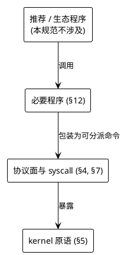
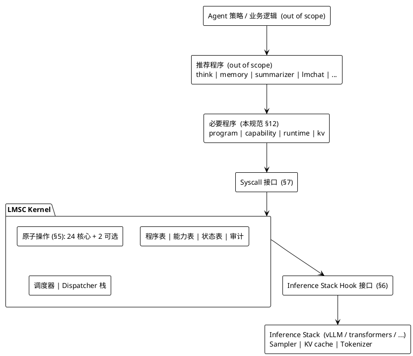
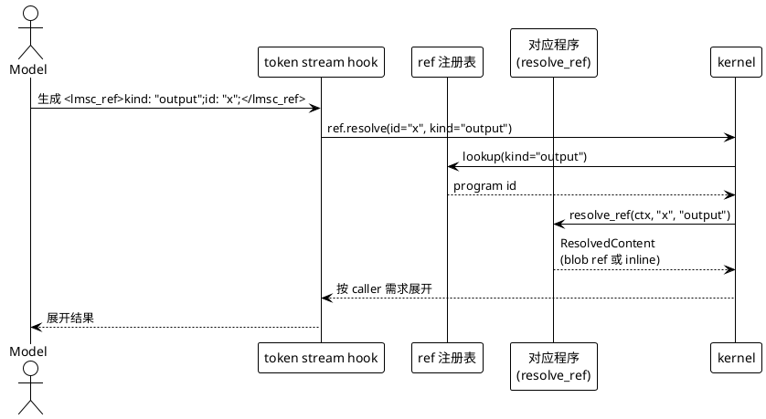
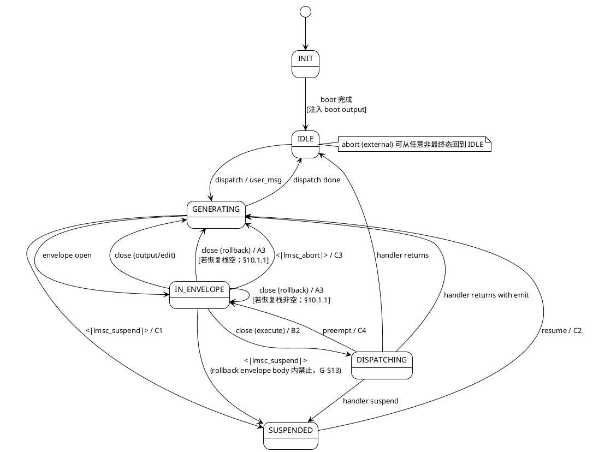

# LMSC Kernel Specification · Draft 07（RC2 口径对齐稿）

> **LMSC** = *Large-language-Model System Call* kernel.
> Draft revision: **D07**（在 D06 基础上吸收 6 方评审聚合的 2 项 Critical、6 项 Significant、10 项 Nit 修订：口径层修正与文本澄清，不引入新 token、不改动原子操作闭集、不变更 action 闭集与必要程序集）。
> Status: Draft — D07 为 RC2 口径对齐稿；发布版本号为 `rev7-rc2`，协议字符串 `protocol.revision` 取 `"D07"`。
> Audience: 推理栈适配者、内核实现者、程序作者、LoRA 训练者。

本文件是 **自足** 的规范——仅凭此文档即可实现一个 LMSC D07 合规的内核、推理栈适配层、程序加载器与必要程序。

D07 相对 D06 的修订依据见 [`../202604240400-d06-revision/02-revision-checklist.md`](../202604240400-d06-revision/02-revision-checklist.md) 与 [`01-delta-from-d06.md`](./01-delta-from-d06.md)；D06 相对 D05 的修订依据见 [`../202604240300-d05-revision/02-d06-checklist.md`](../202604240300-d05-revision/02-d06-checklist.md) 与 [`../202604240400-d06-revision/01-delta-from-d05.md`](../202604240400-d06-revision/01-delta-from-d05.md)；D05 相对 D04 的修订依据见 [`../202604240200-d04-revision/02-d05-checklist.md`](../202604240200-d04-revision/02-d05-checklist.md) 与 [`../202604240300-d05-revision/01-delta-from-d04.md`](../202604240300-d05-revision/01-delta-from-d04.md)；D04 相对 D03 的主要修订依据见 [`../202604240100-d03-revision/03-fix-d03.md`](../202604240100-d03-revision/03-fix-d03.md) 与 [`../202604240100-d03-revision/04-fix-d03.md`](../202604240100-d03-revision/04-fix-d03.md)；D03 相对 D02 的差异保留在 [`../202604240100-d03-revision/02-delta-from-d02.md`](../202604240100-d03-revision/02-delta-from-d02.md)；与 v2.0 的结构性变化见 [`../202604232200-spec-audit/03-redesign-notes.md`](../202604232200-spec-audit/03-redesign-notes.md)。

---

## 目录

0. [引论与范围](#0-引论与范围)
1. [术语](#1-术语)
2. [规范用语](#2-规范用语)
3. [体系结构](#3-体系结构)
4. [协议面：特殊 token 与文法](#4-协议面特殊-token-与文法)
5. [原子操作](#5-原子操作)
6. [推理栈接入契约](#6-推理栈接入契约)
7. [系统调用接口](#7-系统调用接口)
8. [程序模型](#8-程序模型)
9. [状态模型](#9-状态模型)
10. [调度与会话状态机](#10-调度与会话状态机)
11. [能力模型](#11-能力模型)
12. [必要程序](#12-必要程序)
13. [安全不变量](#13-安全不变量)
14. [审计日志](#14-审计日志)
15. [错误码注册表](#15-错误码注册表)
16. [合规判定](#16-合规判定)
17. [附录](#17-附录)

---

## 0. 引论与范围

### 0.1 LMSC 是什么

LMSC 是给大语言模型（LLM）的**内核**。它的职责是：

1. **塑造 token 流**——约束模型自回归过程（logit 掩码、回退、注入、快照）；
2. **承载程序**——为程序提供加载、分派、授权、状态、审计基础设施；
3. **对接推理栈**——以三个 hook 点与底层推理引擎协作。

LMSC **不是**：Agent、聊天机器人、工具箱、脚手架。它只是**机制**（mechanism），不是**策略**（policy）。

### 0.2 分层硬规则

合规实现在任何情况下**必须** 保持以下层次：



**规范条款不得跨层引用**。必要程序的能力**不得**依赖任何非必要程序的存在。

### 0.3 规范包含什么

- 会话协议的特殊 token 集合、envelope 语法、属性语义；
- 原子操作的签名、前置条件、后置条件、错误；
- 推理栈的 3 个 hook 点契约；
- 系统调用表（不含具体语言绑定）；
- 程序清单（manifest）格式与 handler 生命周期；
- 4 个必要程序的最小指令集；
- kernel 必须强制执行的安全不变量；
- 审计日志的记录结构；
- 错误码命名空间与语义。

### 0.4 规范不包含什么

- 推荐程序（`think` / `memory` / `summarizer` / `lmchat` / ...）的实现；
- 具体推理引擎（vLLM / transformers / llama.cpp）的绑定方式；
- 具体编程语言的 handler ABI；
- LoRA 训练数据格式；
- 前端 UI、Agent 策略、业务逻辑。

### 0.5 与 v2.0、D01、D02、D03、D04、D05、D06 的关系

- D07 **不向后兼容** v2.0 的某些特殊 token 与必要程序集。发行版若需运行 v2.0 训练的 LoRA，应提供 `--compat=v2` 模式做映射（见附录 F）。
- D07 相对 D06 **向前兼容**：仅做文本口径与条件从句的澄清（原子操作计数 21→24 统一、`I-EMIT-ESCAPE` 三路径枚举、`resolve_ref` 白名单闭集化、`E_PROTOCOL_VIOLATION` 双站点统一、StreamFrame 三字段语义注释等）；不新增 token、不改动原子操作闭集、action 闭集、必要程序集、能力模型。详见附录 F.10 与本目录 [`01-delta-from-d06.md`](./01-delta-from-d06.md)。D06 合规实现**无需代码改动**即可声称 D07 合规。
- D06 相对 D05 **向前兼容**：仅修订文本歧义、签名一致性、审计表完备性、错误码命名空间扩展、EBNF 判定边界、L2 KV 截断回退策略、StreamFrame 类型定义等；不新增 token、不改动原子操作闭集、action 闭集、必要程序集。详见附录 F.9 与上一轮 [`../202604240400-d06-revision/01-delta-from-d05.md`](../202604240400-d06-revision/01-delta-from-d05.md)。
- D05 相对 D04 **向前兼容**：pre-RC1 闭环修订（17 项），详见 D05 附录 F.8。
- D04 相对 D03 **有意引入一处结构性 breaking change**：`lmsc_ref` 从「start-prefix + 属性 + `/>`」改为配对 token 形式 `<lmsc_ref>kind: "summary";id: "x";</lmsc_ref>`；因此保留 token 总数由 **11 + K** 升为 **12 + K**，并要求 tokenizer、训练语料与实现同步升级。
- D04 同时吸收 D03 的若干自洽性修补：补齐 `E_ENV_KIND_FORBIDDEN` / `E_EMIT_STREAM_BACKPRESSURE_TIMEOUT` 的注册表落点，修正 A3 附录签名、`region.pin` / `region.compact` 能力表闭环，并清理重复 audit / `persona-refresh` 条目。
- D03 相对 D02 **向前兼容**：其细节迁移见 [`../202604240100-d03-revision/02-delta-from-d02.md`](../202604240100-d03-revision/02-delta-from-d02.md)。
- D02 相对 D01 **向前兼容**：其细节迁移见 [`../202604232300-d02-revision/02-delta-from-d01.md`](../202604232300-d02-revision/02-delta-from-d01.md)。

---

## 1. 术语

| 术语 | 定义 |
|---|---|
| **kernel** | 实现本规范的运行时核心 |
| **inference stack** | LLM 前向计算引擎（sampler、KV cache、tokenizer 的宿主） |
| **session** | 一次从 kernel boot 到终止的连续上下文，拥有独立 context、kv、blob 命名空间 |
| **context** | 当前会话的完整 token 序列（含已被 fold / drop 的区间标记） |
| **turn** | 一次 dispatch 到下一次 IDLE 之间的区间，原子性操作的统计单位 |
| **envelope** | 由配对特殊 token 界定的结构化片段，**四种**：`<lmsc_execute>` · `<lmsc_output>` · `<lmsc_edit>` · `<lmsc_rollback>`（D02 F-01 新增，模式串回退）|
| **StreamFrame** | 流式 `envelope.emit` 下 `on_edit_chunk` 回调的负载元数据：`{ chunk_index, total_chunks_hint?, stream_closed }`，定义见 §8.2（D06-S01 / D07-N09 补入术语表）|
| **backpressure** | `envelope.emit` Stream 路径下下游消费速率低于生产速率时的会话内等待语义；超 `STREAM_WRITE_TIMEOUT` 触发 `E_EMIT_STREAM_BACKPRESSURE_TIMEOUT`（D07-N09）|
| **buffered / native** | L2 下 `envelope_emit_stream` 的两种模式：native 为 pull-based 原生消费；buffered 为全量缓冲后一次性注入的 L2 降级语义（§6.5.2；D07-N09）|
| **control token** | 管道式单 token，无配对，表示即时指令 |
| **special token** | kernel 保留 id 的总称 |
| **program** | 在 kernel 上注册、响应 dispatch 的用户态模块 |
| **handler** | 程序的可执行部分，实现 `dispatch` 等生命周期回调 |
| **manifest** | 程序的声明式元数据 |
| **action** | 程序向 kernel 声明的可执行动作（封闭集 7 条，见 §8.3） |
| **capability** | 细粒度权限字符串 |
| **atomic primitive** | kernel 提供的最小不可分解能力，共 24 条核心 + 2 条可选（D07-C01 口径；2 条可选 = `A2` + `H3`） |
| **syscall** | 程序访问原子操作的函数入口 |
| **dispatcher frame** | 派发器栈的一层，每层有独立的程序查找表与文法约束 |
| **region** | 被打标的 token 区间，可整体 edit（替换或删除） |
| **ref** | `<lmsc_ref>kind: "...";id: "...";</lmsc_ref>` 泛型引用元素 |
| **blob** | 按内容寻址的不可变字节串 |
| **boot output** | 会话开始时 kernel 注入的首个 `from="system"` output envelope |
| **fork** | 对整个会话状态（context + KV + 元数据）的写时复制分支 |

---

## 2. 规范用语

本文使用 [RFC 2119] 与 [RFC 8174] 的关键词：

- **MUST** / **必须**：绝对要求；
- **MUST NOT** / **禁止**：绝对禁止；
- **SHOULD** / **应**：强烈建议；
- **MAY** / **可**：可选行为。

"kernel 必须…" 的主语指合规实现。"程序必须…" 的主语指部署在合规 kernel 上的程序。

---

## 3. 体系结构

### 3.1 分层



### 3.2 数据流

所有进入模型自回归的 token **必须** 先经过 kernel 的 token stream hook。所有离开模型自回归的 token **必须** 先经过 sampler hook。KV cache 操作由 kernel 通过 KV hook 直接驱动推理栈，不经模型可观测路径。

程序之间不直接通信。跨程序协作通过以下之一：
- Envelope（程序 A 的 output 被 dispatch 到程序 B）；
- kv / blob 共享命名空间（显式 capability）；
- ref 解析链（程序 B 注册的 resolver 被 kernel 在展开 ref 时调用）。

### 3.3 基本原则

**P-1 · 最小核** · Kernel **不得** 实现任何可由原子操作在用户态组合构造的能力。

**P-2 · 机制而非策略** · Kernel **不得** 把特权策略硬编码——所有策略都走 capability 授权机制。

**P-3 · 唯一路径** · 程序**不得** 绕过 syscall 访问推理栈 / KV cache / tokenizer 保留 id 表。

**P-4 · Token 集冻结** · 特殊 token 集合在 kernel build 时冻结，运行时**不得** 增删。

**P-5 · 不跨层** · 规范条款与必要程序的行为**不得** 依赖推荐或生态程序的存在。

---

## 4. 协议面：特殊 token 与文法

### 4.1 特殊 token 清单（规范性）

合规 kernel **必须** 为以下 token 保留独立 id。tokenizer **必须** 与 kernel 一致识别它们。

#### 4.1.1 Envelope 配对 token（8 个）

| Open | Close | 备注 |
|---|---|---|
| `<lmsc_execute>` | `</lmsc_execute>` | 程序派发 |
| `<lmsc_output>` | `</lmsc_output>` | 结果 / 输入 |
| `<lmsc_edit>` | `</lmsc_edit>` | 历史编辑 |
| `<lmsc_rollback>` | `</lmsc_rollback>` | **D02（F-01）**：模式串回退（见 §4.1.2a） |

#### 4.1.2 Control 单 token（2 个）

| Token | 语义 | 原语 |
|---|---|---|
| `<\|lmsc_abort\|>` | 终止当前 envelope | C3 |
| `<\|lmsc_suspend\|>` | 模型主动挂起等事件 | C1 |

> **D02 变更**（对追加项 F-01 的修补）· D01 / D02 草案曾将 `<\|lmsc_rollback\|>` 列为控制单 token 并以 "紧随其后的 0 或 1 个普通 token" 作为 scope 指示。该设计存在两处致命缺陷：
>
> 1. **语义停机性**：BPE tokenizer 下 "字面串 `word`" 与 "以 `word` 起头的普通 token（如 `wordle`）" 无法稳定区分，且相邻多个 rollback / 换行 / 空白下的判定未定义；
> 2. **模型不识数、不识 scope 字面**：训练模型在采样流内正确区分 scope 字面与正文字面的成本远高于收益。
>
> D02 因此把 rollback 改为**第 4 种 envelope**（§4.1.1）并以**模式串**承载语义（§4.1.2a）。E-03 中的 Word / Stmt 可选 scope 一并下线——由模式串吸收。

#### 4.1.2a Rollback envelope 语义（规范性）
模型生成 `<lmsc_rollback>X</lmsc_rollback>` 表示：把"此 envelope 之前、rollback 边界（§4.4 `I-ROLLBACK-BOUND`）之内"**最近一次**出现 `X` 的位置之前的内容保留，其余（含此 envelope 自身）丢弃。

kernel 在看到 `</lmsc_rollback>` close token 时执行（令 `T` 为 rollback 边界内、紧邻 `<lmsc_rollback>` open 之前的 detokenized 字节流，`P` 为 pattern body 的 detokenized 字节）：

1. `i := last_index_of(T, P)`；
2. 若 `i = NOT_FOUND`（含整段上下文无 `P` 匹配，**或**匹配存在但首字节落在 `I-ROLLBACK-BOUND` 之外）：KV 不变；emit audit `kind=rollback`，details 含 `outcome ∈ {pattern_not_found, pattern_out_of_bound}`（**与程序路径 §5.2 A3 后置条件一致**——前者表示整段上下文无匹配，后者表示存在匹配但被边界截断）；`token_rollback` syscall 返 `E_ROLLBACK_PATTERN_NOT_FOUND`；模型路径仅 emit audit，不向任何调用方返错（D04 pass 3 / T-S03）；
3. 否则：把 KV cache 截断到"字节 `i` 所在 token 的前一个 token"——即丢弃含匹配首字节的 token 及其之后的一切（含 rollback envelope 自身）；emit audit `kind=rollback`（details 含 `outcome=truncated` / `pattern_bytes_len` / `truncated_tokens`）。

**约束**：

- rollback envelope **body 内不得出现任何保留 token**（任何 envelope open/close、`<|lmsc_abort|>` / `<|lmsc_suspend|>`、`<lmsc_ref>` / `</lmsc_ref>`、key token）；违反触发 `I-ROLLBACK-NO-NEST`；
- body **必须非空**；空 body → `E_ROLLBACK_PATTERN_EMPTY`；
- body 的 detokenized 字节长度**必须** ≤ `ROLLBACK_PATTERN_MAX_BYTES`（默认 **512**，见附录 G）；超过 → `E_ROLLBACK_PATTERN_TOO_LONG`；
- 匹配搜索**不得**跨越 `I-ROLLBACK-BOUND`；搜索遇到边界即停；
- `ROLLBACK_STORM_LIMIT`（默认 16 次 / turn）仍然生效；
- **`ROLLBACK_PATTERN_MAX_BYTES` 上限强制** 按级别分（D04 pass 3 / T-S06）：
  - **L0 / L1**：kernel **必须**用 logit mask 保证 rollback envelope 自 open 起在 `ROLLBACK_PATTERN_MAX_BYTES` 字节内产生 close；达上限强制发 close 或 `<|lmsc_abort|>`；
  - **L2**：无 sampler hook，kernel **必须**在 token stream hook 中对 rollback envelope body 维护字节计数器自 open 起累计；达 `ROLLBACK_PATTERN_MAX_BYTES` 立即走 C3 abort 路径并 emit audit `kind=protocol_violation`（invariant=`I-ROLLBACK-BOUND`）；L2 **不得**以静默截断或 best-effort 方式处理。

模型触发 rollback envelope 与程序调 `token_rollback(pattern, scope)`（§5.2 A3）**语义等价**，共享上述约束。

**模型路径的 `scope` 按以下规则推定**：

- 若当前处于 `IN_ENVELOPE` 状态 → `scope = Envelope`；
- 若当前处于 `GENERATING` 状态（无 open envelope）→ `scope = Turn`。

推定结果写入 §14.2 audit 的 `scope` 字段。

**示例（byte-level 匹配、tokenizer-independent）**：

- ASCII：`<lmsc_rollback>Wait,</lmsc_rollback>` 从最近一次出现 `Wait,` 处截断；
- 中文：`<lmsc_rollback>结论：</lmsc_rollback>` 按 UTF-8 字节序列匹配 `结论：`；
- 含换行：`<lmsc_rollback>结论：\n</lmsc_rollback>` 中 `\n` 为字面 LF 字节；
- 跨 token 边界：匹配单位是**字节**而非 token；tokenizer 如何切分 pattern / 上下文**不**影响命中结果。

#### 4.1.3 Ref 元素配对 token（2 个）

| Open | Close | 形式 |
|---|---|---|
| `<lmsc_ref>` | `</lmsc_ref>` | body 固定采用 `kind: "summary";id: "x";` 微文法（见 §4.3） |

> **注意**（D04）· `lmsc_ref` 在 D04 中不再是「start-prefix 型」保留 token；它与 execute / output / edit / rollback 一样，是一对完整的 open/close 保留 token。ref body 的解析以 `<lmsc_ref>` 与 `</lmsc_ref>` 之间的 detokenized 字节序列为准，与普通 tokenizer 如何切分其中的字节无关。

`<lmsc_ref>...</lmsc_ref>` **不是** envelope——它没有 dispatch 语义、不进 dispatcher frame 栈、close token `</lmsc_ref>` 不触发任何 dispatch；仅触发 F3 `ref.resolve` 将解析结果内联替换。`RefOpen` / `RefClose` 事件（§6.3）为 token stream hook 可观测钩子，与 `EnvelopeOpen/Close` 的 dispatch 语义不同。其 body **必须** 精确符合 ref 微文法（见 §4.3 / `I-REF-CHARSET`）。

#### 4.1.4 Key token 家族（可选，发行版决定 K）

形式 `<|key_<name>|>`。典型：`key_tab`、`key_enter`、`key_esc` 等。具体集合由 kernel build 决定，`runtime info` **必须** 暴露启用列表。

#### 4.1.5 总计

合规 kernel 的保留 token 数 = 8 + 2 + 2 + K = **12 + K**。`runtime info` **必须** 返回准确计数。D04 将保留 token 列举如下以供 tokenizer 注册表生成：

- envelope open/close 4 对共 **8 个**：`<lmsc_execute>` / `</lmsc_execute>`、`<lmsc_output>` / `</lmsc_output>`、`<lmsc_edit>` / `</lmsc_edit>`、`<lmsc_rollback>` / `</lmsc_rollback>`；
- control 单 token 2 个：`<|lmsc_abort|>`、`<|lmsc_suspend|>`；
- ref 配对 token 2 个：`<lmsc_ref>`、`</lmsc_ref>`（见 §4.1.3）；
- key token：K 个（工程保留，见 §4.1.4）。

### 4.2 Envelope 属性

Envelope open token 后、开口 close `>` 前的 token 序列是**属性区**（XML-style）。属性**不**使用保留 token，由普通 tokenizer 解码。

> **注意** · `<lmsc_rollback>` envelope **不携带任何属性**；其 body 直接承载 pattern 序列（见 §4.1.2a / §4.3 EBNF）。下表 `适用 envelope` 列中的 "all" 及其他取值 **均不包含** rollback envelope。

kernel **必须** 识别以下核心属性（未列出的属性透传给程序）：

| 属性 | 适用 envelope | 取值 | 语义 |
|---|---|---|---|
| `id` | all | string | 唯一标识（kernel 自动补全缺省） |
| `from` | output / edit | `user` / `system` / `program:<name>` / `model` | 来源 |
| `visibility` | output / edit | `all` (默认) / `model-only` / `user-only` | 可见性 |
| `attention` | output | `free` (默认) / `keep-summary` / `pin` | 保留策略 |
| `confidence` | output / edit | `0.0`-`1.0` | 置信度 |
| `schema` | output | string | 渲染 schema 名 |
| `gen` | output | 自由字符串（由程序自定义） | 代次标记；kernel **不解释**，仅透传 |
| `status` | output | string | 错误码或 `ok`；`ok` + 空 body 构成短路 "ack" |
| `ref` | output | 同 `id` 形式 | 该 output 被作为 ref 来源时的 id |

未知属性 kernel **必须** 保留透传，不得删除。

> **说明** · `gen` 属性在 v2.0 中为枚举 `g0-g3/gp`，并要求由推荐程序 `summarizer` 维护。D01 把 `gen` 降级为**自由字符串**，kernel 不做枚举检查也不触发任何状态机。这符合 P-5。
>
> **D02 明确** · `gen` 的**作用域是 per-program**：kernel **不得**跨程序比较 `gen` 字符串。同一 `gen` 字形在程序 A 与程序 B 不要求有相同语义。若推荐程序需互操作，由 lmsc-docs v2 的推荐程序章节给出生态级词汇表（非规范级约束）。对应：`region.tag.attrs.gen` 也是 per-program（归属 owner 程序的名字空间）。

### 4.3 文法（EBNF）

```ebnf
stream        = { chunk | envelope | control | ref_element } ;
chunk         = { ordinary_token } ;
envelope      = execute_env | output_env | edit_env | rollback_env ;

execute_env   = "<lmsc_execute>"  , attrs? , body , "</lmsc_execute>" ;
output_env    = "<lmsc_output>"   , attrs? , body , "</lmsc_output>" ;
edit_env      = "<lmsc_edit>"     , attrs? , body , "</lmsc_edit>" ;
rollback_env  = "<lmsc_rollback>" , pattern_body , "</lmsc_rollback>" ;     (* D02 F-01 *)

attrs         = attr , { ws , attr } ;
attr          = ident , "=" , str_literal ;

body          = { chunk | ref_element } ;
pattern_body  = ordinary_token , { ordinary_token } ;
    (* 非空；其 detokenized 字节序列 ≤ ROLLBACK_PATTERN_MAX_BYTES；
       且字节序列 **不得构成** 任何保留 token 的字面形式
       （envelope open/close、<|lmsc_abort|> / <|lmsc_suspend|>、<lmsc_ref> / </lmsc_ref>、key 字面）。
       判定 **在字节级** 执行（D06-N02）；即对 pattern_body 的 detokenized
       UTF-8 / 二进制字节序列做子串查找，不依赖 tokenizer 如何切分。
       违反由 I-ROLLBACK-NO-NEST 事后检测（L0/L1 由 logit mask 强制）。 *)

ref_element   = "<lmsc_ref>" , ref_body , "</lmsc_ref>" ;
ref_body      = 'k','i','n','d',':',' ','"' , ref_value , '"',';'
              , 'i','d',':',' ','"' , ref_value , '"',';' ;
ref_value     = ref_char , { ref_char } ;
ref_char      = 'A'..'Z' | 'a'..'z' | '0'..'9'
              | '_' | '.' | ':' | '/' | '-' ;            (* D04: 值限 ASCII 安全集 *)

control       = "<|lmsc_abort|>"
              | "<|lmsc_suspend|>"
              | key_token ;

key_token     = "<|key_" , ident , "|>" ;
```

> **D04 明定** · `<lmsc_ref>...</lmsc_ref>` 的 body **必须** 精确符合：
>
> `kind: "{kind}";id: "{id}";`
>
> 其中（`{kind}` / `{id}` 为占位符，代表实际值字符串）：
>
> 1. 字段名仅限 `kind` 与 `id`；
> 2. 顺序固定为 `kind` 在前、`id` 在后；
> 3. 两个值的字符集均限于 ASCII `[A-Za-z0-9_.:/-]`；
> 4. 禁止附加字段、禁止非 ASCII 字符、禁止偏离该微文法的空白变体；
> 5. `kind` 与 `id` 的值均不得为空字符串；`kind: "";` 形式违反 EBNF（`ref_value` 至少 1 字符），同视为微文法违规。
>
> 违反该微文法或字符集约束的 ref element，kernel **必须**拒绝并 emit audit `kind=protocol_violation`（invariant=`I-REF-CHARSET`），返回 `E_REF_BODY_INVALID`。
>
> `<lmsc_execute>` / `<lmsc_output>` / `<lmsc_edit>` 的 attrs **不受**此限制——它们不在流式 ref 解析的快路径上，由完整的 envelope 体内 XML-style 解析处理。
>
> **字符禁用显式声明（D04 pass 3 / T-N01）** · 上述 `ref_char` 字符集已隐含排除双引号 `"` 与分号 `;`——两者是 ref body 分隔符本身。此处显式重申：`kind` / `id` 的值**不得**含 `"` 与 `;`。若外部系统 ID 含非白名单字符（中文、空格、Unicode 标点、引号、分号等），程序**必须**在 `ref.bind` 阶段自行做映射/哈希处理（例如取 SHA-256 前缀或 URL-safe base64），kernel **不**提供转义机制；kernel 对违规 ref body 一律返 `E_REF_BODY_INVALID`。

### 4.4 文法不变量（规范性）

合规 kernel **必须** 强制以下文法不变量。强制方式按级别与不变量类型分：

- **A1 logit mask 强制**（L0 / L1，sampler hook 层面）：`I-ENV-PAIR`、`I-ENV-NO-SELF-NEST`、`I-CTRL-INSIDE-ENV`、`I-ROLLBACK-BOUND`、`I-ROLLBACK-NO-NEST`、`I-ABORT-SCOPED`、`I-ATTR-CLEAN`；
- **Syscall 入口强制**（所有级别）：`I-EMIT-ESCAPE`（于 `envelope.emit` 及 `net` → envelope body 转写路径检查）；
- **事后识别 + abort**（所有级别，且 L2 下上述 A1 组亦降级为此模式，见 §6.5.1）：`I-REF-ANY`、`I-REF-CHARSET`。

各条列项如下：

- **I-ENV-PAIR** · 每个 envelope open 必有对应 close；close 出现前不得关闭会话。
- **I-ENV-NO-SELF-NEST** · 同类 envelope 不得直接嵌套（`<lmsc_execute>` 内不得嵌套 `<lmsc_execute>`）。
- **I-CTRL-INSIDE-ENV** · 在非 rollback envelope 内，允许出现的保留 token 仅：`<|lmsc_abort|>`、`<|lmsc_suspend|>`，以及 **嵌套的 `<lmsc_rollback>` open**（模型在 execute/output/edit body 内发起悔棋）；其他 envelope open token 被 mask 禁止。在 **rollback envelope body 内**，不允许出现任何保留 token（受 `I-ROLLBACK-NO-NEST` 约束；特别地，`<|lmsc_suspend|>` 在 rollback envelope body 内被禁，避免快照中携带部分 pattern）。

  > **关于"嵌套"用语的消歧**（D05-N06）· 本条所称"嵌套的 `<lmsc_rollback>` open"指在 execute / output / edit envelope body 内**开启**一次新的 rollback envelope——这是允许的（rollback envelope 随后自行 close，不会真正形成长期嵌套栈）。`I-ROLLBACK-NO-NEST` 所禁止的是 rollback envelope **自身 body 内**出现任何保留 token（含另一 rollback open）。两处"嵌套"含义不同，不得混用。
- **I-REF-ANY** · `<lmsc_ref>...</lmsc_ref>` **可** 出现在任何 envelope body 中，也可出现在普通 chunk 中。
- **I-ROLLBACK-BOUND** · `<lmsc_rollback>` 的匹配搜索**不得** 跨越已关闭 envelope 的边界、boot output 的边界、或已声明 `rollback_safe: false` 的 dispatch 的边界。
- **I-ROLLBACK-NO-NEST**（D02 新增 · F-01）· `<lmsc_rollback>` 的 body 内**不得** 出现任何保留 token（任何 envelope open/close、`<|lmsc_abort|>` / `<|lmsc_suspend|>`、`<lmsc_ref>` / `</lmsc_ref>`、key token）。kernel **必须** 通过 logit mask 强制；事后路径识别到违反**必须** emit `kind=protocol_violation` 并返 `E_ROLLBACK_PATTERN_INVALID`。
- **I-ABORT-SCOPED** · `<|lmsc_abort|>` **仅** 在 envelope 内有效。envelope 外出现时 kernel **必须** 丢弃（优先通过 logit mask 屏蔽）。
- **I-ATTR-CLEAN** · 属性区以 envelope 的 `>` 结束为边界；属性区内**不得** 出现任何特殊 token。
- **I-EMIT-ESCAPE** · `envelope.emit` 的 bytes body、`net` 响应转 envelope body、以及 `region.edit` 的 `replacement` bytes 注入（D07-C02 补入；视为 `region.edit` 重写现有 region 内容的等效路径）时，kernel **必须** 对保留 token 字面字符做转义（§13.2）。
- **I-REF-CHARSET**（D02 新增；D04 重写）· `<lmsc_ref>...</lmsc_ref>` 的 body **必须** 精确符合 `kind: "{kind}";id: "{id}";` 微文法（`{kind}` / `{id}` 为占位符）；两个值的字符集限于 ASCII `[A-Za-z0-9_.:/-]`，且不得为空字符串；违反**必须**拒绝并 emit `kind=protocol_violation`，返 `E_REF_BODY_INVALID`。

### 4.5 Role 语义

**`execute` / `output` / `edit` 三种 envelope** 的"**由谁发起**"完全由 `from` 属性决定（§4.2）。kernel **不得** 根据 envelope 种类硬编码 role——`<lmsc_execute>` 默认 `from="model"`，但程序代写 `<lmsc_execute from="program:flow">` 是合法的。

**`rollback` envelope 例外**：`<lmsc_rollback>` **不携带任何属性**（§4.2），也不走 `from` 机制；它的 role 由生成路径隐式决定——模型自回归生成时等价 `from="model"`，程序显式调用 A3 `token_rollback` 时 audit 记录 `source=program:<name>`。

---

## 5. 原子操作

本节定义 kernel 的最小能力集。每条原子操作给出：签名、前置、后置、错误、备注。

### 5.1 分类与计数

| 类 | 编号 | 核心 | 可选 |
|---|---|---|---|
| A · Token 流 | A1–A5 | 4 | A2 |
| B · Envelope 结构 | B1–B3 | 3 | — |
| C · 调度 | C1–C5 | 5 | — |
| D · 授权 | D1–D3 | 3 | — |
| E · 程序表 | E | 1 | — |
| F · 状态 | F1–F4 | 4 | — |
| G · 审计 | G1 | 1 | — |
| H · I/O | H1–H3 | 2 | H3 |
| I · 时间 | I1 | 1 | — |
| **合计** | | **24** | **2** |

核心原语 **24 条**必须实现；可选 **A2、H3** 两条按 §6.5 接入级别决定。

> **计数口径（D07-C01）** · D02–D06 的文本在多处声称 “21 核心 + 2 可选”，但上表逐行求和实为 `4+3+5+3+1+4+1+2+1 = 24` 核心。D07 以本节分类表为唯一真源，统一改称 “**24 核心 + 2 可选**”——这是一次**文本口径修正**，而非语义变化：合规实现需要实现的原语集合与 D06 完全相同，只是在描述其基数时使用一致数字。联动更新点见 §3.1 架构图、§16.1 C-1 豁免矩阵、附录 D 脚注、附录 F.8 / F.9 / F.10、文末总结。

### 5.2 A · Token 流

#### A1 · `logit_mask`

```
logit_mask(mask: Mask) -> ()
Mask := { hard_allow: Set<TokenId>?, hard_deny: Set<TokenId>?, bias: Map<TokenId, f32> }
```

- **前置**：调用者持 `tokens.mask.direct` cap（fixed-only；默认仅 kernel 内部与推理栈适配层）。
- **后置**：下一次 sampling 前施加到 logits。
- **错误**：`E_MASK_INVALID`。
- **备注**：hard_deny 优先于 bias；hard_allow 非空时其余 token 禁。

#### A2 · `query_special`（可选）

```
is_special(id)       -> bool
name_of(id)          -> Option<string>
id_of(name)          -> Option<TokenId>
```

- **前置**：无。
- **后置**：只读；返回映射在会话周期内不变。
- **备注**：等价信息已在 boot output 返回；本原语是便利 API。合规 L2 实现可不提供，程序应在 `on_load` 缓存 boot output 的 tokens 清单。

#### A3 · `token_rollback`

```
token_rollback(pattern: Bytes, scope: Scope = Envelope) -> Result<()>
Scope := Envelope | Turn
```

- **前置**：
  - 未违反 `I-ROLLBACK-BOUND`；
  - `pattern` 非空且 `len(pattern) ≤ ROLLBACK_PATTERN_MAX_BYTES`（默认 512）；
  - `pattern` **不得** 包含任一保留 token 的字面字节序列（等价于 `I-ROLLBACK-NO-NEST`）；
  - 当前 turn 内 rollback 次数 < `ROLLBACK_STORM_LIMIT`（默认 16）；
  - 调用者持 `tokens.rollback.explicit`（默认不授予；模型发 `<lmsc_rollback>` envelope 走 kernel 内部等价路径，不走此 cap）。
- **后置**：
  - 在 scope 允许的字节窗内反向查找 `pattern` 最近一次出现；
  - 命中：把 KV cache 截断到"含匹配首字节的 token 的前一个 token"（含 rollback envelope 自身一并丢弃）；
  - 未命中：不改变 KV；
  - emit audit `kind=rollback`，details 含 `outcome ∈ {truncated, pattern_not_found, pattern_out_of_bound}` / `scope` / `pattern_bytes_len` / `truncated_tokens`（`outcome=truncated` 时）。其中 `pattern_out_of_bound` 区分「整段上下文中 pattern 不存在」与「匹配存在但首字节落在边界外」。
  - `ROLLBACK_STORM_LIMIT` 计数按 §13.3 口径执行：单 turn 内**成功**（`outcome=truncated`）与**失败**（`pattern_not_found` / `pattern_out_of_bound`）均计入同一计数器，不做区分（D05-N02）。
- **错误**：`E_ROLLBACK_STORM` / `E_ROLLBACK_PATTERN_EMPTY`（D02 F-01）/ `E_ROLLBACK_PATTERN_NOT_FOUND`（D02 F-01）/ `E_ROLLBACK_PATTERN_TOO_LONG`（D02 F-01）/ `E_ROLLBACK_PATTERN_INVALID`（D02 F-01，pattern 含保留 token）。

> **`E_ROLLBACK_BOUNDARY` 在 D06 中退役**（D06-C02）· D05 此处曾列出 `E_ROLLBACK_BOUNDARY`——但鉴于 `tokens.rollback.explicit` 自 D04 起默认不授予任何程序（§11.4 / §5.2 A3 T-N02），模型路径的越界统一以 `outcome=pattern_out_of_bound` 表达且不返错（§4.1.2a / §13.3），程序路径的越界也映射到 `E_ROLLBACK_PATTERN_NOT_FOUND`（§4.1.2a 越界统一表述），**已无任何合法触发路径**。D06 中正式将该错误码从 A3 前置 / 错误列表与 §15.2 注册表移除，历史实现若曾产生该错误码的路径应以上述二者替换。

模型触发 `<lmsc_rollback>…</lmsc_rollback>` envelope 与程序调此原语**语义等价**；两条路径共享上述前置与不变量。模型路径未命中不报错，仅 emit audit。**模型路径 `scope` 推定**：当前为 `IN_ENVELOPE` → `Envelope`；当前为 `GENERATING` → `Turn`。

> **`tokens.rollback.explicit` 的当前状态（D04 pass 3 / T-N02）** · 该 cap 列为 **fixed-only**（§11.4）且默认不授予任何程序（§12.3 默认持有表不含此项，附录 B 亦标 `no, fixed only`）。D04 保留 `token_rollback` syscall 接口以备未来扩展，但当前版本**没有任何合法的程序调用路径**。当前唯一能产生 KV 截断的合规路径是模型生成 `<lmsc_rollback>...</lmsc_rollback>` envelope。若未来发行版需启用程序发起路径，应通过 `capabilities.fixed` 显式注入，**不得**通过 `capabilities.granted` 或 `capabilities.requestable` 获得。

#### A3 按级别降级（D04 pass 3 / T-S02）

A3 在不同接入级别下的可用性与降级语义：

- **L0 / Tier-A**：按本节正文；`scope ∈ {Envelope, Turn}` 语义完整；pattern 模式串匹配由 KV Hook + sampler mask 精确实现；恢复状态按 §10.1.1 O(T) 或 O(1) snapshot。
- **L1 / Tier-B**：无 KV Hook。`scope=Turn` 必须支持；`scope=Envelope` **可**由实现按"退化到当前 envelope 内字节窗"近似；pattern 匹配通过推理栈适配层的 KV 截断 API 实现；若适配层只支持 turn 粒度截断，则 `scope=Envelope` 的命中结果仍**必须**保证"截断到匹配首字节所在 token 前"的字节精度，**不得**以 turn 起点做最坏近似。
- **L2 / Tier-C**：无 sampler hook 与 KV Hook。`scope ∈ {Envelope, Turn}` 由 token stream hook 事后扫描判定；pattern 匹配在 `</lmsc_rollback>` close 事件时执行一次；kernel 通过推理栈适配层的 token-level truncate API 做 byte-precise 截断。若适配层不支持 byte-precise 截断，L2 实现**必须**在 boot output `features.rollback_truncate_precision ∈ {byte, token}` 中如实声明；声明 `token` 的实现在 pattern 首字节落在 token 中部时**必须**截断包含该字节的整个 token（偏保守）并在 audit details 中标注 `truncate_precision=token`。

  **L2 KV 截断完全无支持的回退路径**（D06-C01）· 若推理栈适配层既不提供 byte-precise 也不提供 token-level truncate API（即 kernel 无法在 L2 下完成任何物理 KV 截断），L2 实现**必须**：(1) 在 boot output 中声明 `features.rollback_truncate_precision="none"`；(2) 观察到 `</lmsc_rollback>` close 时不进行截断，而是执行 C3 abort 当前 turn；(3) emit audit `kind=protocol_violation`（invariant=`I-ROLLBACK-BOUND`），details 包含 `truncate_fallback="abort"`；(4) **若该 abort 由程序路径 A3 触发或程序显式观测该事件**，向调用方返 `E_PROTOCOL_VIOLATION`；模型路径仅 emit audit，不向任何调用方返错（D07-S04；与 §6.5.1 L2 不变量事后检测的「若 abort 由程序发起观察」口径统一）。L2 实现**不得**静默忽视无法截断的 rollback；这一回退路径与 §16.1 C-11 L2 不变量事后检测语义闭环。

所有级别下，A3 的错误码语义、越界处理（`pattern_out_of_bound`）、audit emit 规则、`ROLLBACK_STORM_LIMIT` 等保持一致。实现级别不影响 A3 的规范语义——只影响"如何精确达到该语义"。

#### A4 · `token_inject`

```
token_inject(tokens: Vec<TokenId>, position: Position) -> Result<()>
Position := BeforeNextSample | AtEnvelopeClose
```

- **前置**：
  - 所有 tokens 在词表内；
  - 若包含保留 token，持 `tokens.inject.special` cap（fixed-only）；
  - 总长度 ≤ `INJECT_MAX_TOKENS`（默认 4096）；
  - 在 envelope 外不得注入 envelope close token。
- **后置**：插入并更新 KV cache；发 audit。
- **错误**：`E_INJECT_BAD_TOKEN` / `E_INJECT_CAP_DENIED` / `E_INJECT_TOO_LARGE`。

#### A5 · `session_fork`

```
session.fork()                          -> SessionHandle      # 新 session，共享 KV 前缀
session.restore(handle: SessionHandle)  -> Result<()>         # 切到已 fork 的 session
session.drop_fork(handle: SessionHandle)-> Result<()>         # 释放 fork
```

- **前置**：
  - 实现级别必须为 **L0**（A5 在 L1 / L2 下不可用，调用返 `E_ATOMIC_UNSUPPORTED`）；
  - `fork`：当前 handler **不得**持有进行中的流式 `envelope.emit`（Stream body 尚未耗尽；CoW 语义无法安全切分半写入的 envelope）；持 `session.fork` cap。dispatch 内调用合法——`runtime admin fork`（§12.3）即依赖本路径。（D05-C02：收紧 D04 中"非 dispatch 中"的过度约束；真正的不可分性只在流式 emit 未完结时成立）
  - `restore` / `drop_fork`：handle 有效。
- **后置**：
  - `fork` 保存完整 context + KV cache (CoW 引用) + kernel 元数据（程序表、kv refcount、cap 集合、audit cursor）；返回新 SessionHandle，原会话继续存活；
  - `restore` 把当前执行切到目标 session，原 session 仍存活（调用方可用 `drop_fork` 显式释放）；
  - `drop_fork` 释放对应 CoW 引用。
- **错误**：`E_FORK_INVALID` / `E_FORK_OOM`。
- **备注**：D01 明确采用 **fork 语义**（对 v2.0 A5 的二义性裁决，见审计 C-08）。支持 tree-of-thought、OOM 保护、事务化 dispatch。

### 5.3 B · Envelope 结构

#### B1 · `envelope_event`

```
(事件, 由 token stream hook 产生)
on_envelope_open(kind, attrs, id)    -> ()
on_envelope_close(kind, id)          -> ()
```

- **后置**：
  - open 后 kernel 进入属性解析子状态，遇 `>` 进入 body；
  - close 触发 B2 dispatch（若 execute）或 audit（若 output/edit）；
  - 栈深度 ≤ `MAX_ENVELOPE_NEST`（默认 4），超限 kernel **必须** 通过 logit mask 屏蔽 open token。

#### B2 · `dispatch`

```
dispatch(envelope: Envelope) -> DispatchResult
```

- **前置**：
  - `envelope.kind = ExecEnv`；
  - **若目标程序 manifest 声明 `reentrant: false` 且该程序已有活跃 dispatch**（同一 session 内尚未返回或 abort，含处于 SUSPENDED 状态尚未 resume 的 dispatch），kernel **必须**拒绝并返 `E_DISPATCH_REENTRY`（D04 pass 3 / T-S01；D06-N03 补口 SUSPENDED；与 §8.1 `constraints.reentrant` 字段闭环）。
- **后置**：
  1. 解析 body 首 token 序列为 `argv`；
  2. `program_table.lookup(argv[0])` → handler；
  3. `cap.check(program.capabilities_required)`；
  4. 调 `handler.dispatch(ctx, args)`；
  5. 写 audit。
- **错误**：`E_UNKNOWN_PROGRAM` / `E_CAP_DENIED` / `E_HANDLER_PANIC` / `E_DISPATCH_REENTRY`。
- **备注**：handler 可调 `scheduler.suspend` 让出；kernel 在条件成立时 resume。
- **Handler panic 与 `on_abort` 清理**（D05-N04；D06-S02 升级为 MUST）· handler `dispatch` 返回 panic / 错误时，kernel **必须**自动触发与 C3 等价的 close 路径：若 handler 注册了 `on_abort`，先调用 `on_abort(ctx, envelope_id)` 以便程序做清理（释放 region lock、回收 kv 临时键等），再 emit audit `kind=abort`（details 含 `reason="handler_panic"`）；随后返回 `E_HANDLER_PANIC`。`on_abort` 自身再度 panic 时 kernel **必须**吞掉该 panic，并在 `kind=abort` 的 details 中附 `nested_panic=true`，以免暴露内部堆栈；不再二次调用 `on_abort`。

#### B3 · `envelope_emit`

```
envelope_emit(
  kind:  EnvKind,                    # { execute, output, edit } （白名单）
  attrs: Map<string, string>,
  body:  Bytes | Stream<Bytes>       # 统一为 bytes 或 bytes 流
) -> Result<()>
```

- **前置**：
  - `kind ∈ { execute, output, edit }`；**`kind = rollback` 非法**，rollback envelope 仅能由模型路径（§4.1.2a）或 program 显调用 A3 `token_rollback(pattern, scope)`（§5.2）产生；B3 收到 `kind=rollback` **必须** 返 `E_ENV_KIND_FORBIDDEN`；
  - 持 `envelope.emit` cap（默认授予所有注册程序）；body 大小 ≤ `EMIT_BODY_MAX_BYTES`。**Stream 路径下的判定时机**（D07-N03）· `body: Stream<Bytes>` 模式下，kernel **必须**在每个 chunk 消费完后对累计 body 字节数做增量比对；累计字节超 `EMIT_BODY_MAX_BYTES` 当即 abort envelope（走 close + on_abort + audit 路径），返 `E_EMIT_SIZE_LIMIT`——不得等到 generator 耗尽后再报错。
- **后置**：
  - kernel 注入 `open_token + attrs_tokens + body_tokens + close_token`；
  - body 中保留 token 字面字符**必须** 转义（`I-EMIT-ESCAPE`）；
  - 若 body 是 Stream 且 `kind=edit`，kernel 对每个 chunk 触发 handler 的 `on_edit_chunk`（若注册），chunk 大小 1–64 tokens；
  - 发 audit。
- **错误**：`E_EMIT_ESCAPE_VIOLATION` / `E_EMIT_SIZE_LIMIT` / `E_EMIT_CAP_DENIED` / `E_EMIT_STREAM_ABORTED`（D02）/ `E_ENV_KIND_FORBIDDEN` / `E_EMIT_STREAM_BACKPRESSURE_TIMEOUT`。
- **备注**：相比 v2.0 的 B3 + B4 两条，D01 合并为一条；非流式（Bytes）与流式（Stream<Bytes>）通过 body 类型区分。

**D02 流式调用约定**（对追加项 E-06 的修补）

- 程序传入的 `body: Stream<Bytes>` **必须**为宿主语言原生的 **lazy iterator / generator / async iterator**；kernel 以 **pull-based** 方式按 chunk 消费。
- chunk 大小由 kernel 决定，上限 `CHUNK_MAX_TOKENS`（附录 G）。
- `envelope.emit` 的 syscall 本身是同步的，在 stream 耗尽（或抛错）前**不**返回；handler 所在线程 / 协程在 Stream 耗尽前被阻塞。
- handler 在 `envelope.emit` 返回后**不得**再对该 generator 调 `next`（代表其已被 kernel 拥有并耗尽）。
- 在 stream 耗尽前kernel **必须**保持 envelope 打开状态（open token 已注入、close token 未注入）。
- stream 异常（generator 抛错）kernel **必须**触发与 `<|lmsc_abort|>` 等价的 close 路径：注入 close token、清理 frame、调 `on_abort`、emit audit `kind=abort` 与 `E_EMIT_STREAM_ABORTED`。
- 程序视角上 `envelope.emit` 仅返回 `Ok(())` 或错误，不暴露 chunk 粒度；若需 chunk 级调度观测，应注册 `on_edit_chunk` handler。

**Stream 反压与超时**

- `stream.next` 默认阻塞，直到下游 ready 或超时；超时由 `STREAM_WRITE_TIMEOUT`（附录 G，默认 30 s）控制；超时返回 `E_EMIT_STREAM_BACKPRESSURE_TIMEOUT`。
- 超时与 generator 抛错同走 「close token 注入 + on_abort + audit」 路径，确保 envelope 不会无限期占据 open 状态。
- turn 被 abort 时 stream 立即抛 `E_EMIT_STREAM_ABORTED`（已有）。

### 5.4 C · 调度

#### C1 · `suspend`

```
suspend(resume_on: ResumeCondition) -> SuspendHandle
ResumeCondition := Timer(Duration) | Event(EventSpec) | CapGrant(CapString)
                | External | Any(Vec<ResumeCondition>)
```

- **前置**：状态 ∈ { GENERATING, IN_ENVELOPE, DISPATCHING }；持 `scheduler.suspend` cap；嵌套 ≤ `MAX_SUSPEND_NEST`（默认 4）。
- **后置**：推理栈转 IDLE；注册 resume 条件。
- **错误**：`E_SUSPEND_NESTED_LIMIT`。

#### C2 · `resume`

```
resume(handle: SuspendHandle, payload: ResumePayload) -> Result<()>
```

- **前置**：handle 未超时未取消。
- **后置**：可选 `token_inject` payload；推理栈回到 GENERATING；触发 handler `on_event`（若注册）。
- **错误**：`E_SUSPEND_EXPIRED` / `E_SUSPEND_INVALID`。

#### C3 · `abort`

```
abort(envelope_id: string, reason: string) -> Result<()>
```

- **前置**：
  - envelope_id 在 open 状态；
  - 调用者持 **`scheduler.abort.own`**（可 abort 自己发起的 envelope）**或** **`scheduler.abort.any`**（fixed-only，用于 `runtime` 程序与 kernel 内部）。
- **后置**：注入 close token；清理 frame；触发 `on_abort`；写 audit。
- **错误**：`E_ABORT_NOT_OPEN` / `E_ABORT_CAP_DENIED`。
- **备注**：相比 v2.0，补齐了 abort 的权限分级（审计 C-03）。

#### C4 · `preempt`

```
preempt(injection: EnvelopeSpec, reason: string) -> Result<()>
```

- **前置**：
  - 持 `scheduler.preempt` cap；
  - **若 `injection.kind = execute`，额外持 `scheduler.preempt.execute` cap**（fixed-only，默认无人持有；D02 新增，对追加项 E-07 的修补）；
  - 距上次 preempt ≥ `PREEMPT_COOLDOWN`（默认 30s）；
  - 当前 envelope 不是由 preempt 产生。
- **后置**：关闭当前 envelope；注入高优先级 output；恢复 sampling；写 audit。
- **错误**：`E_PREEMPT_COOLDOWN` / `E_PREEMPT_CAP_DENIED`（details 必须含 `required_cap`）/ `E_PREEMPT_NESTED`。

#### C5 · `dispatcher_frame`

```
frame.push(rules: FrameRules) -> FrameId
frame.pop(frame_id: FrameId)  -> Result<()>
frame.supports(field: string) -> bool             # D02 新增

FrameRules := {
  program_whitelist: Option<Vec<string>>  # argv[0] 白名单（MUST 支持）
  mask_overlay:      Option<Mask>         # 附加 logit mask（MAY 支持）
  cap_extra:         Option<Vec<CapString>>  # 附加要求（SHOULD 支持）
}
```

- **前置**：`frame.push` / `frame.pop` 持 `scheduler.frame` cap；`frame.supports` 无 cap 要求（D07-S01；与 §7.2 syscall 表注明 `scheduler.frame_supports` cap 为 “—” 闭环）。栈深度 < `MAX_DISPATCHER_DEPTH`（默认 8）；`pop` 只能 pop 自己 push 的 frame。
- **后置**：kernel dispatcher 栈 push/pop；logit mask 叠加或恢复。
- **错误**：`E_FRAME_OVERFLOW` / `E_FRAME_NOT_OWNED` / `E_FRAME_UNSUPPORTED_RULE`。
- **字段 MRO（D02 明定，对 D01-review R-01 的修补）**：
  - **MUST**：`program_whitelist`——所有合规实现必须支持；
  - **SHOULD**：`cap_extra`——强烈建议，不支持时 `frame.supports("cap_extra")` 返 false；
  - **MAY**：`mask_overlay`——可选，不支持时 `frame.supports("mask_overlay")` 返 false。
  - 不支持的字段若被传入且非 `None`，push 必须返回 `E_FRAME_UNSUPPORTED_RULE`；程序应先调 `frame.supports` 探测。
- **备注**：D01 新增（审计 C-07 补齐）。`focus` / `shell` 类推荐程序通过此原语实现。D02 补齐 MRO 与探测 API 后跨实现可移植。

### 5.5 D · 授权

#### D1 · `capability_check`

```
capability_check(cap: CapString) -> bool
```

纯函数，O(log n)，无副作用，无 cap 要求。

#### D2 · `capability_grant`

```
capability_grant(cap, scope, ttl?, source) -> Result<CapabilityId>
GrantSource := UserApproval | ExternalPolicy | BootConfig | ProgramDelegation
```

- **前置**：调用者持 `capability.grant` cap（fixed-only，仅授予 `capability` 必要程序）。
- **后置**：cap 进入生效集；注册 TTL revoke（若有）；写 audit。
- **错误**：`E_CAP_GRANT_DENIED` / `E_CAP_INVALID_NAME`。

#### D3 · `capability_revoke`

```
capability_revoke(cap_id, reason) -> Result<()>
```

- **前置**：持 `capability.revoke`（fixed-only）或是 cap 的 grantor。
- **后置**：cap 移除；进行中的 dispatch 不打断，之后 `cap.check` 返 false；写 audit。
- **错误**：`E_CAP_NOT_FOUND`。
- **Fixed-only cap 的特例**（D05-N03）· 若目标 cap 属于 `capabilities.fixed`（§11.4 fixed-only 高危集），即便调用方是其 grantor 也**不得**通过本路径 revoke；kernel **必须**返 `E_CAP_DENIED`（附 details `reason="fixed_only_not_revocable_by_grantor"`）。此时唯一合法路径是持 `capability.revoke`（fixed-only）的主体显式调用。此约束防止发行版在 boot config 中因误将程序登记为 fixed cap 的 grantor 而造成事实旁路。

### 5.6 E · 程序表

#### E · `program_table`

```
program.register(manifest)       -> Result<ProgramId>
program.lookup(name)             -> Option<ProgramId>
program.info(id)                 -> Option<ProgramInfo>
program.list()                   -> Vec<ProgramInfo>     # cap 过滤
program.unregister(id)           -> Result<()>
```

- **前置**：
  - `register` / `unregister`：持 `program.register` 或 `program.admin`；必要程序不可 unregister；
  - 其他：只读。
- **后置**：
  - register：程序入表；命名空间就绪；`on_load` 被调；写 audit；
  - unregister：`on_unload` 被调；kv / blob 按 GC；ref resolver 注销；写 audit。
- **错误**：`E_PROG_DUP_NAME` / `E_PROG_UNKNOWN_CAP` / `E_PROG_REF_KIND_TAKEN` / `E_PROG_MANIFEST_INVALID` / `E_PROG_PROTECTED` / `E_PROG_IN_USE`。
- **备注**：v2.0 的 E1/E2/E3 三条在 D01 合并为"一条程序表原语的五个操作"，与 kv/blob 等一致。

### 5.7 F · 状态

#### F1 · `kv`

```
kv.put(key, value, ttl?) -> Result<()>
kv.get(key)              -> Option<Bytes>
kv.del(key)              -> Result<()>
kv.list(prefix)          -> Vec<string>
```

- 单 value ≤ `KV_VALUE_MAX_BYTES`（默认 64 KB）；
- 每程序命名空间配额由 kernel 配置；
- key 自动前缀 `program:<name>/`；
- 会话内；跨会话持久化由推荐程序 `memory` 实现（不在规范）。
- **错误**：`E_KV_VALUE_TOO_LARGE` / `E_KV_QUOTA` / `E_KV_KEY_INVALID`。

#### F2 · `blob`

```
blob.put(data)    -> BlobId     # 内容哈希
blob.get(id)      -> Option<Bytes>
blob.incref(id)   -> Result<()>
blob.decref(id)   -> Result<()>
blob.stat(id)     -> Option<BlobInfo>
```

- 内容寻址去重；refcount=0 且 GC 通过后删除。
- **错误**：`E_BLOB_NOT_FOUND` / `E_BLOB_QUOTA`。

#### F3 · `ref`

```
ref.bind(kind, resolver)          -> Result<()>    # on_load 一次性
ref.resolve(id, kind)             -> Result<ResolvedContent>
ref.kinds_registered()            -> Vec<string>
```

- `kind` 全局唯一；unregister 时自动 unbind；
- kernel 内置 `kind=output` resolver。
- **`resolve_ref` 延迟约束（D04 pass 3 / T-S04；D05-S02 收紧；D07-S02 白名单闭集化）** · `resolve_ref` 在 token stream hook 路径上**同步**调用（§6.3 / §9.3）；因此 handler 实现**必须**为**内存级**操作。

  **允许集（闭集，由 D07-S02 定义）** · handler 仅允许进行以下 **6 类**调用，此列表之外的任何 syscall 与路径均**禁用**：
  1. **自身程序 metadata / cap 查询**：`cap.check`、已持 handle 的内部状态读取；
  2. **本 session turn-local KV 只读**：`kv.get` / `kv.list`（对自己程序名下动态空间）；
  3. **program-owned blob 读取**：`blob.get` / `blob.stat`；
  4. **只读 KV view** 和已绑定的 context snapshot 惰性查询；
  5. **公共 ref registry 反向解析**：`ref.kinds_registered` / 已绑定 kind 的反向解析；
  6. **时钟只读与局部纯计算**：`clock.now` / `clock.monotonic` 读取、进入函数后的内存纯计算。

  **明示禁用集** · 网络 / 文件 / 沙盒 I/O（`net.*` / `fs.*` / `exec.sandbox`）；调度与让出类（`scheduler.suspend` / `scheduler.resume` / `scheduler.preempt` / `scheduler.frame_push` / `scheduler.frame_pop`）；产生新 envelope 类（任何 `envelope.emit`、`tokens.inject`、`token_rollback`）；跨 session 访问（其他 session / fork 分支的 KV / blob / region）；内核内部结构直读；`region.body` 直读与 `region.edit` 写入；D06 曾提到的“`region.tag` 只读查询”项在 D07 中 **移除**（无对应 API；如需查询 region 元数据，应在先行 dispatch 周期预取到 KV）；任何自身可能等待外部条件或持长锁的操作（含发行版自定义等价 syscall）。

  **幂等与缓存**（D05-S04） · 同一 turn 内对同一 `(kind, id)` 的 `ref.resolve` **应**幂等；kernel **可**按 turn 粒度缓存 resolver 返回结果；turn 边界自动失效；`E_REF_EXPIRED` 结果**不得**入缓存。**fork / restore / drop_fork 也会隐式失效缓存**（D06-N12）：子 session 不继承父 session 的 turn-local 缓存，避免跨 context 调用者幂等假设被破坏。跨 turn 不要求幂等。外部数据**必须**由程序在先行的 dispatch / suspend / resume 周期中预取并 `blob.put` / `kv.put`，`resolve_ref` 仅做查表返回。违反将阻塞推理栈（非规范后果），并**可能**触发实现定义的推理栈超时保护（此为实现自由度，非 kernel 错误码）。
- **错误**：`E_REF_KIND_TAKEN` / `E_REF_NOT_FOUND` / `E_REF_EXPIRED`。

#### F4 · `region`

```
region.tag(range: Range, attrs: Map<string, string>)                       -> RegionId
region.edit(region_id: RegionId, replacement: Bytes, persist: bool = true) -> Result<()>
```

`tag` 打标，attrs 含 `gen` / `visibility` / `attention` / `owner`；`attention=pin` 需 `region.pin` cap（见 §11.4）；`owner` 属性仅供审计与可视化消费，kernel 本身**不**解析。
- `edit`：
  - `replacement = []` 且 `persist` 为默认 true → 删除，原内容进 blob（"drop-soft"）；
  - `replacement = []` 且 `persist = false` → 硬删，需额外 `region.drop.hard` cap；
  - `replacement != []` → 替换，原内容进 blob；
  - `attention=pin` 的 region **不得** 被 edit；
  - 需 `region.compact` cap；
  - 写 audit 含原 hash 与新 hash。
- **错误**：`E_REGION_RANGE_INVALID` / `E_REGION_NOT_FOUND` / `E_REGION_LOCKED` / `E_REGION_DROP_HARD_DENIED`（D02 新增，专指“`replacement=[]` 且 `persist=false` 但缺 `region.drop.hard` cap”的场景，与 `E_REGION_LOCKED` 区分）。
- **Bytes 注入与转义**（D06-C03；D07-N02 字面修正）· `replacement` 为字节串，kernel 将其 detokenize 后回挖为 token 序列再注入原 region 位置；转码失败（含非法 UTF-8 序列）返 `E_REGION_RANGE_INVALID`。待注入字节中包含保留 token 字面字符时，kernel **必须**按 `I-EMIT-ESCAPE` / §13.2 等效规则做视觉等价替换以防止在 region body 内误生二次 envelope。
- **备注**：D01 合并 v2.0 F4/F5/F6；D02 拆出硬删权限专用错误码（对 D01-review W-10 的修补）。

### 5.8 G · 审计

#### G1 · `audit_emit`

```
audit.emit(record) -> ()   # 不返回错误；sink 失败不影响调用方
```

- 所有程序可调；kernel 自动打 `source=program:<name>`；程序**不得** 伪造 source；
- kernel 对关键事件（见 §14.2）**必须** 自动 emit，程序**不得** 抑制；
- append-only；不进 context。

### 5.9 H · I/O

#### H1 · `fs`

```
fs.read / fs.write / fs.stat / fs.list / fs.mkdir / fs.remove / fs.move
```

- 每次调用独立校验 `fs.<op>:<path>`；
- path 规范化（无 `..`、绝对路径）；
- 大文件走 blob 间接。
- **错误**：`E_FS_CAP_DENIED` / `E_FS_NOT_FOUND` / `E_FS_IO` / `E_FS_QUOTA`。

#### H2 · `net`

```
net.request(method, url, headers, body?, timeout) -> Response
net.stream(url, ...) -> Stream
```

- capability `net.<method>:<url-pattern>`；
- 响应 body 转 envelope 时必须转义（`I-EMIT-ESCAPE`）。
- **错误**：`E_NET_CAP_DENIED` / `E_NET_TIMEOUT` / `E_NET_CONNECT` / `E_NET_STATUS`。

#### H3 · `exec_sandbox`（可选）

```
exec.sandbox(kind, code, stdin?, limits) -> ExecResult
```

- L2 合规实现**可** 不提供；
- 支持的 `kind` 由 kernel build 决定；
- limits 必须强制（cpu_ms / wall_ms / memory_b / net 默认禁 / fs_tmp 默认 /tmp 可写）；
- sandbox 进程**不得** 访问宿主 fs / net / kernel memory。
- **错误**：`E_EXEC_CAP_DENIED` / `E_EXEC_LIMIT` / `E_EXEC_INTERNAL` / `E_EXEC_UNSUPPORTED`（L2 未提供时）。

### 5.10 I · 时间

#### I1 · `clock`

```
clock.now()                         -> Timestamp         # 可脱敏
clock.monotonic()                   -> Duration          # 会话起
clock.timer(duration, on_fire)      -> TimerId
clock.cancel(id)                    -> Result<()>
```

- `now()` 可被策略脱敏；`monotonic()` 不跳跃；timer 触发走 `resume(ResumeCondition::Timer)`。
- **错误**：`E_CLOCK_BAD_DURATION`。

---

## 6. 推理栈接入契约

### 6.1 三个 Hook 点

| Hook | 位置 | 语义 |
|---|---|---|
| **Sampler Hook** | sampling 前、logits 可变处 | 施加 logit mask |
| **Token Stream Hook** | sampling 后、append-to-context 前 | 识别事件（envelope、control） |
| **KV Cache Hook** | rollback / fork / restore | 物理修改 KV cache |

### 6.2 Sampler Hook 契约

```
mask = lmsc.sampler_hook(session_state)
logits = apply(logits, mask)
```

- 输入：会话状态指针；
- 输出：`Mask`（可空）；
- 实现建议：每步 ≤ 100 µs；
- 幂等：同一状态下多次调用返回等价 mask。

### 6.3 Token Stream Hook 契约

```
for each newly sampled token t:
    event = lmsc.on_token(t, session_state)
    match event:
        Continue                    -> append(t)
        EnvelopeOpen                -> append(t); update state
        EnvelopeClose(execute)      -> append(t); trigger B2 dispatch
        EnvelopeClose(output|edit)  -> append(t); emit audit
        EnvelopeClose(rollback)     -> trigger A3 equivalent
                                       (§4.1.2a: last_index_of + KV truncate;
                                        不触发 B2 dispatch；
                                        截断后按§10.1.1 算法恢复外层状态)
        RefOpen                     -> append(t); start ref body buffer
        RefClose                    -> append(t); parse ref body;
                                       trigger F3 resolve
        ControlAbort                -> trigger C3 equivalent
        ControlSuspend              -> trigger C1 equivalent
        Error                       -> abort turn
```

> **说明** · F-01 已删除控制单 token `<|lmsc_rollback|>`，`ControlRollback` 事件也随之废弃；rollback 统一走 `EnvelopeClose(rollback)` 分支且其语义不等同普通 envelope close（不触发 dispatch）。

- 必须同步完成；
- 可能触发 dispatch，dispatch 期间推理栈**必须** 暂停采样直到 kernel 通知恢复。

### 6.4 KV Cache Hook 契约

```
lmsc_kv_hook.truncate(pos)          -> Result     # A3 rollback 物理步
lmsc_kv_hook.fork_snapshot()        -> KVHandle   # A5 fork 物理步
lmsc_kv_hook.activate(handle)       -> Result     # A5 restore 物理步
lmsc_kv_hook.drop(handle)           -> Result     # A5 drop_fork 物理步
```

- truncate 应 O(truncated_pages)；fork 应 O(1)（CoW）；
- 在 paged attention 下正确处理 prefix sharing。

### 6.5 接入级别（L0 / L1 / L2；Tier 别名）

合规 kernel **必须** 声明级别；`runtime info` 返回：

| 级别 | Tier 别名 | 支持 | 限制 |
|---|---|---|---|
| **L0** | **Tier-A**（生产推荐） | 三个 hook 全实装；A2 + H3 均提供 | 无额外限制 |
| **L1** | **Tier-B** | Sampler + Token Stream；无 KV Hook | A3 `scope=Envelope` 允许按字节精度降级实现（详见 §5.2 A3 降级 / T-S02），**不得**强制退化到 turn 起点；**A5 不可用**（`session.fork/restore/drop_fork` 返 `E_ATOMIC_UNSUPPORTED`）；H3 可选 |
| **L2** | **Tier-C** | 仅 Token Stream（后处理识别） | A1 退化为 stop-sequence；A3 `scope ∈ {Turn, Envelope}` 由事后扫描判定；**A5 不可用**；A2、H3 可不提供 |

> **Tier 别名说明**（D02 新增，对追加项 E-04 的修补）· L0/L1/L2 的数字命名与“数字越大能力越强”的业界惯例反；D02 同时引入 **Tier-A / B / C** 别名（A 最强，与字母序一致）。两种命名方式在 D02 并列；`runtime info` 同时暴露 `integration_level` 与 `integration_tier`；合规判定以 L0/L1/L2 为准。

L2 / Tier-C 是合规最低门槛；L0 / Tier-A 是生产推荐。D02 F-01 取消了 Word / Stmt scope，因此 rollback 在任一级别下的语义均为"**pattern 模式串最近匹配截断**"，无级别相关的启发式。

> **说明** · D01 删除了 v2.0 的 L3 冗余别名（审计 C-15）。D02 **不**重命名 L0/L1/L2，只增加 Tier 别名，以保向前兼容 D01。

#### 6.5.1 L2 不变量降级语义（D02 新增，对 D01-review R-02 的修补；D04 延续）

L2 级实现无 sampler hook，以下 **八条协议不变量**（D04 pass 3 / T-C01；此前 D03→D04 曾列为 6 条，遗漏 A1 组中的 `I-ENV-NO-SELF-NEST` 与 `I-ATTR-CLEAN`，现修正闭环）无法通过 logit mask 强制，均由 token stream hook 做事后检测：

1. `I-ENV-PAIR`；
2. `I-ENV-NO-SELF-NEST`（L2 检测点：envelope open 事件处检查当前 envelope 栈顶 kind）；
3. `I-CTRL-INSIDE-ENV`；
4. `I-ROLLBACK-BOUND`；
5. `I-ROLLBACK-NO-NEST`（L2 检测点：rollback envelope close 时重扫 pattern bytes）；
6. `I-ABORT-SCOPED`；
7. `I-ATTR-CLEAN`（L2 检测点：envelope open 与 `>` 之间的属性区扫描是否出现任一保留 token 字面序列）；
8. `I-REF-CHARSET`（L2 检测点：`</lmsc_ref>` close 时扫 body 字节与微文法）。

前 7 条对应 §4.4 A1 组全集；第 8 条对应 §4.4 "事后识别 + abort" 组中的 `I-REF-CHARSET`。`I-REF-ANY`（ref 元素可出现在任何 envelope body）与 `I-EMIT-ESCAPE`（syscall 入口强制）不在此清单，前者无违反形式、后者由 syscall 入口检查覆盖。

D04 明确：

- L2 下上述八条不变量**由 token stream hook 做事后识别**，语义由"强制"降为"尽力检测 + 检测到即 abort"。
- kernel 检测到违规时**必须**：
  1. 立即执行 `abort` 当前 turn（等价 C3）；
  2. emit audit `kind=protocol_violation`，details 包含 `invariant` 名、`token_position`、`violation_detail`；
  3. 返回给调用方 `E_PROTOCOL_VIOLATION`（若该 abort 由程序侧 syscall 路径触发或程序显式观测该事件；D07-S04 统一与 §5.2 A3 L2 回退路径作简；模型路径仅 emit audit，不向任何调用方返错）。
- L2 实现**不得**静默忽略协议违规。
- `runtime info` 的 `integration_level="L2"` 必须附带 `features.invariant_enforcement="post-hoc"`。

L0 / L1 不受本节影响：不变量仍由 A1 强制。

#### 6.5.2 L2 下 `envelope.emit` 流式降级（D04 pass 3 / T-S07）

L2 无 sampler hook、推理栈适配层也**可能**不支持真正的 pull-based 流式 token 注入。合规 L2 实现**可**将 `envelope.emit(body: Stream<Bytes>)` 降级为：先把 stream 完全耗尽到内部缓冲（上限仍为 `EMIT_BODY_MAX_BYTES`，超出 → `E_EMIT_SIZE_LIMIT`），再一次性以 `body: Bytes` 的语义注入整条 envelope。

该降级的合规前提：

- 实现**必须**在 `runtime info.features` 中以 `envelope_emit_stream ∈ {native, buffered}` 如实声明当前模式：`native` 表示按 §5.3 B3 的 D02 流式调用约定原生 pull-based 消费；`buffered` 表示降级为全量缓冲后注入。
- 降级**不得**影响对 `STREAM_WRITE_TIMEOUT` / `E_EMIT_STREAM_BACKPRESSURE_TIMEOUT` 的保底语义：实现**必须**对 generator 的单次 `next()` 应用该超时；超时仍走 close token + on_abort + audit 路径。
- 降级**不得**影响对 `kind=edit` 的 `on_edit_chunk` handler 回调语义：若 handler 已注册且实现选择 `buffered` 模式，实现**必须**在注入前以 `CHUNK_MAX_TOKENS` 粒度对缓冲区做分片回调，以保证 chunk 级观测语义（若实现无法提供，需声明 `features.edit_stream_chunked=false`）。

L0 / L1 实现**必须**为 `native`；仅 L2 可声明 `buffered`。

### 6.6 Tokenizer 契约

- 包含 §4.1 所列所有保留 token 作为独立 id；
- 对保留 token 字面字符（`<lmsc_execute>` 等）在 tokenize 普通文本时**不得** 误识别；
- 暴露 `id_of(name)` / `name_of(id)` 供 kernel 调用。

---

## 7. 系统调用接口

### 7.1 调用模型

Handler 接收 `Context`（`ctx`），经以下子接口访问 kernel：

```
ctx.tokens      # A1-A5
ctx.envelope    # B3 (B1/B2 是事件/kernel 触发，不是 syscall)
ctx.scheduler   # C1-C5
ctx.cap         # D1-D3
ctx.program     # E
ctx.kv          # F1
ctx.blob        # F2
ctx.ref         # F3
ctx.region      # F4
ctx.audit       # G1
ctx.fs          # H1
ctx.net         # H2
ctx.exec        # H3 (若提供)
ctx.clock       # I1
```

### 7.2 Syscall 表

| Syscall | 原语 | Capability |
|---|---|---|
| `tokens.logit_mask` | A1 | `tokens.mask.direct`† |
| `tokens.is_special` / `name_of` / `id_of` | A2 | — |
| `tokens.rollback` | A3 | `tokens.rollback.explicit`†（程序路径）；control token 路径走 kernel 内部 |
| `tokens.inject` | A4 | `tokens.inject`* + `tokens.inject.special`†（含保留 token 时） |
| `session.fork` / `restore` / `drop_fork` | A5 | `session.fork`* |
| `envelope.emit` | B3 | `envelope.emit` |
| `scheduler.suspend` / `resume` | C1 / C2 | `scheduler.suspend` |
| `scheduler.abort` | C3 | `scheduler.abort.own` 或 `scheduler.abort.any`† |
| `scheduler.preempt` | C4 | `scheduler.preempt`* |
| `scheduler.frame_push` / `frame_pop` | C5 | `scheduler.frame` |
| `scheduler.frame_supports` | C5 | — |
| `cap.check` / `cap.list` / `cap.list_requestable` | D1 | — |
| `cap.grant` | D2 | `capability.grant`† |
| `cap.revoke` | D3 | `capability.revoke`† |
| `program.register` / `unregister` / `lookup` / `info` / `list` | E | `program.register` / `program.admin`† |
| `kv.put` / `get` / `del` / `list` | F1 | — |
| `blob.*` | F2 | — |
| `ref.bind` | F3 | `program.ref.bind` |
| `ref.resolve` | F3 | — |
| `region.tag` | F4 | —（部分 attr 需 cap） |
| `region.edit` | F4 | `region.compact` (+ `region.drop.hard` 若 `persist=false` 且 `replacement=[]`) |
| `audit.emit` | G1 | — |
| `fs.*` | H1 | `fs.<op>:<path>` |
| `net.*` | H2 | `net.<method>:<pattern>` |
| `exec.sandbox` | H3 | `exec.sandbox:<kind>`（若提供） |
| `clock.*` | I1 | — |

\* 高权限：默认只给必要程序或按需申请。
† 特权：fixed-only，不可通过 D2 grant。

### 7.3 错误模型

```
SyscallError := { code, message, hint?, retryable, cause? }
```

Handler **必须** 向模型回报错误（通过 `envelope.emit(kind=output, status=<code>)`）；**不得** 吞错。

### 7.4 纵深校验

每个 syscall 入口 kernel **必须** 做独立 capability 校验，即使 dispatch 时已整体校验过（§13.1）。

### 7.5 ABI

规范**不** 规定语言绑定。合规实现**至少** 支持：

- **Native**：用于必要程序；
- **Sandboxed**（至少一种）：WASM / Lua。

Syscall schema 由 kernel 以单一 YAML / JSON 发布，各语言绑定自动生成。

---

## 8. 程序模型

### 8.1 Manifest

```yaml
name: string                   # 必填，全局唯一
version: semver                # 必填
author: string?                # 可选

actions:                       # 必填，§8.3 闭集子集
  - dispatch
  - emit_output
  - ...

capabilities_required: [...]   # 必填
capabilities_optional: [...]   # 可选

ref_kinds:                     # 可选
  - kind: string
    description: string

subcommands:                   # 可选（help 用）
  - name: string
    args: [string]
    description: string

handler:
  backends:                    # 至少一个
    - kind: native | wasm | lua | ...
      path: string

constraints:                   # 可选
  rollback_safe: bool          # 默认 true
  max_dispatch_ms: u32
  reentrant: bool              # 默认 false
```

### 8.2 Handler 生命周期

```
register(manifest)
  -> on_load(ctx)
      -> dispatch(ctx, args)       # 每次 execute
      -> on_edit_chunk(ctx, ...)   # 若 emit_output 且 kind=edit 流式（D05-C01：与 §5.3 B3 / §6.5.2 对齐；kind=output 的流式 emit 不触发该回调）
      -> on_event(ctx, event)      # 若订阅
      -> resolve_ref(ctx, id, kind)  # 若 ref_kinds 非空
      -> on_abort(ctx, env_id)
  -> on_unload(ctx)
unregister(id)
```

Handler 签名：

```
StreamFrame := { chunk_index: u32, total_chunks_hint: Option<u32>, stream_closed: bool }    # D06-S01

# StreamFrame 字段语义（D07-S05）：
#   - chunk_index：当前 chunk 从 0 起计的序号；从 0 单调递增。
#   - total_chunks_hint：
#       * `body: Bytes` 路径（含 L2 `buffered` 模式）**应**为 `Some(n)`，
#         n 为按 `CHUNK_MAX_TOKENS` 切片的准确计数；
#       * `body: Stream<Bytes>` 原生 pull-based 路径下**应**为 `None`
#         直到 generator 耗尽；合规 handler **不得**把
#         `total_chunks_hint.is_some()` 作为除进度展示外的任何控制流判据。
#   - stream_closed：`true` 仅出现在最后一个 chunk 的 frame 中
#         （无论是正常耗尽还是因 generator 抛错走 close 路径）；其余 frame 为 false。

Handler := {
  dispatch:       fn(Context, ExecuteArgs) -> Result<()>    # 必填
  on_edit_chunk:  fn(Context, StreamFrame, &[Token]) -> Result<()>?
  on_event:       fn(Context, Event) -> Result<()>?
  resolve_ref:    fn(Context, id, kind) -> Result<ResolvedContent>?
  on_load:        fn(Context) -> Result<()>?
  on_unload:      fn(Context) -> Result<()>?
  on_abort:       fn(Context, envelope_id) -> Result<()>?
}
```

### 8.3 Action 封闭集（7 条）

| Action | 语义 | 对应原语 |
|---|---|---|
| `dispatch` | 响应 `<lmsc_execute>` | B2 |
| `emit_output` | 写 `<lmsc_output>`（含流式模式）；同 action 亦覆盖 `emit` 到 `<lmsc_edit>` envelope（kind=edit）——action 命名保留历史名，语义涵盖 output / edit 两个 envelope kind（D07-N06）| B3 |
| `push_dispatcher_frame` | 压入子派发栈 | C5 |
| `pop_dispatcher_frame` | 弹出子派发栈 | C5 |
| `suspend` | 调 C1 | C1 |
| `preempt` | 调 C4（需 cap） | C4 |
| `register_ref_resolver` | 调 F3.bind | F3 |

**删除**：`emit_edit_stream`（并入 `emit_output`）、`emit_ack`（删）、`grant_capability`（由 cap 表达）。Action 集是**闭集**，不可扩展。

> **Action 是否应列入闭集的判定准则**（D06-N06）· action 表描述程序**向 kernel 声明自己会触发的副作用类型**（用于 manifest 校验与观测），而**不是**所有可调 syscall 的镜像。新增 action 的触发条件同时满足：(1) 对应一条或多条 syscall 的**显式行为类型**（如"向 context 写入 output envelope"）而非纯查询；(2) 该副作用不能被现有 action 语义覆盖；(3) 程序声明与不声明该 action 时 kernel 的前置校验 / 授权路径不同。`session.fork` / `cap.grant` 等特权 syscall 不构成新 action——其授权由 capability 机制完全承载，manifest 不需要额外声明字段。本判定条随 §16.1 C-5 的 7 条闭集绑定；任何新增 action 必须走规范主版本升级流程。

### 8.4 命名空间隔离

- **kv** 物理隔离至 `program:<name>/`；
- **blob** 标记创建者；
- **ref kind** 全局唯一；
- 程序 `audit.emit` 自动带 `source=program:<name>`，**不得** 伪造。

### 8.5 Dispatcher Frame

kernel 维护 dispatcher 栈。初始只有 root frame。每个 frame 含：

- 程序查找表（可 override 父 frame）；
- logit mask overlay；
- capability 附加约束（可选更严）。

栈深上限 `MAX_DISPATCHER_DEPTH`（默认 8）。`frame_push` / `frame_pop`（C5）由持 `scheduler.frame` cap 的程序调用。

### 8.6 程序可见性

`program.list` 返回**模型可见视图**，必须按 `cap.check(program.capabilities_required)` 过滤。无权调用的程序**不得** 出现。

---

## 9. 状态模型

### 9.1 五类状态

| 类 | 原语 | 生命周期 | 是否进 context |
|---|---|---|---|
| Context tokens | (所有) | 会话 | 是 |
| Regions | F4 | 会话 | 仅 token 本身，标签是元数据 |
| kv | F1 | 会话（TTL） | 否 |
| blob | F2 | 会话（refcount） | 否 |
| Forks | A5 | 显式 drop 前 | 否 |

### 9.2 代次标记（`gen` 属性）

`gen` 是 output envelope 与 region 的自由字符串属性。kernel **仅透传**，不解释。任何代次转换（`g0 → g1`、摘要等）由 **程序**（通常是推荐程序 `summarizer`，本规范不涉及）通过 `region.edit + blob.put + ref.bind` 组合实现。

> **与 v2.0 的差异** · v2.0 把 `gen` 枚举化并要求推荐程序维护其状态机。D01 把枚举与状态机全部移出规范（P-5）。

### 9.3 Ref 解析链



同一 ref 可出现多次（共享 blob）。resolve 失败（`E_REF_EXPIRED`）时 kernel **必须** 让模型看到明确错误，不得静默忽略。

### 9.4 Fork

A5 的 fork 对**整个会话状态** 有效：

- context token 序列（包含 boot output）；
- KV cache 快照；
- 程序表引用；
- kv / blob refcount（增加引用，见 §13.9）；
- 生效 capability 集合；
- audit cursor；
- **dispatcher frame 栈**（D02 明定，对 D01-review W-07 的修补）——栈整体 CoW 克隆到新 session；新 session 的 `frame.pop` 仅作用于自己的栈副本，**不影响**父 session 的 frame；反之亦然。

`fork()` 返回新 `SessionHandle`，原会话继续存活。`restore(handle)` 切入目标 session，原 session 仍存活直到 `drop_fork`。这支持 tree-of-thought、OOM 保护、事务化 dispatch。

> **与 v2.0 的差异** · v2.0 的 A5 语义在 §5.2 与 §9.4 不一致（审计 C-08）。D01 固定 fork 语义，无歧义。

#### 9.4.1 Boot output 与 fork（D02 新增，对 D01-review W-06 的修补）

- Boot output **等价于一个 `attention=pin` 的 region**，由 kernel 在 INIT → IDLE 时标记：
  - **不得**被 `region.edit` 触及（`E_REGION_LOCKED`）；
  - **不得**被 `<lmsc_rollback>` envelope 跨越（`I-ROLLBACK-BOUND`）。
- `session.fork` 的子 session **沿用** 原 boot output（它是 context 的一部分）；kernel **不**在子 session 重新 emit boot output。
- `runtime info` 是当前状态快照，与 boot output（INIT 瞬间快照）可能不同；但两者**必须使用同一 schema**（见附录 E）。

#### 9.4.2 Fork 与 blob refcount（D02 明定，对 D01-review R-04 的修补）

- `fork` 时，kernel 对被原 session 引用的**每个** blob 的 refcount **+1**（并非只对 fork 命中的 blob）；
- `drop_fork` 时对对应 blob **–1**；
- 新 session 内通过 `blob.put` 创建的新 blob 归属新 session；`drop_fork` 原 session 不影响新 session 独立创建的 blob；
- CoW KV cache 在双方都 drop 前不得释放（与 §13.9 一致）。
- **实现注**（D06-N05）· refcount 更新应按 per-blob O(1) 分摄实现；fork 时不得在推理热路径上遍历全会话字节量做 refcount 填表。建议模型：对 `session -> Set<BlobId>` 维护分摄引用表（可用计数 bloom 或 copy-on-write immutable set），fork 时结构共享；drop_fork 时差集减少。此为非规范性建议；规范仅要求可观测语义一致。

#### 9.4.3 跨 build 的 restore（D02 新增，对 D01-review W-11 的修补）

- 实现**可**拒绝对由不同 kernel build id 生成的 fork 执行 `restore`；拒绝时返回 `E_FORK_INVALID` 并在 audit 中记录源 build / 当前 build。此为合规允许的行为，非必须。

---

## 10. 调度与会话状态机

### 10.1 状态机



状态转移：

| 当前 | 事件 | 下一 | 副作用 |
|---|---|---|---|
| INIT | boot 完成 | IDLE | 注入 boot output（kernel 直接做，等价一个 `attention=pin` 的 region，见 §9.4.1） |
| IDLE | token_inject(user msg) | GENERATING | — |
| GENERATING | envelope open | IN_ENVELOPE | 更新栈 |
| IN_ENVELOPE | close (execute) | DISPATCHING | 触发 B2 |
| IN_ENVELOPE | close (output/edit) | GENERATING | audit |
| IN_ENVELOPE(rollback) | close (rollback) | 按 §10.1.1 恢复的外层状态 | 触发 A3；不走 DISPATCHING（D03 G-S11） |
| IN_ENVELOPE | `<\|lmsc_abort\|>` | GENERATING | C3 |
| GENERATING / IN_ENVELOPE / DISPATCHING | `<\|lmsc_suspend\|>` | SUSPENDED | C1 |
| SUSPENDED | resume | 恢复上一状态 | C2 |
| DISPATCHING | handler 返回 | IDLE / GENERATING | — |
| DISPATCHING | handler suspend | SUSPENDED | — |
| DISPATCHING | preempt 触发 | IN_ENVELOPE (new) | C4 |
| * | abort (external) | IDLE | C3 |

### 10.1.1 截断后的外层状态恢复算法（D03 G-S12）

`<lmsc_rollback>` / A3 触发 KV 截断后，kernel **必须** 确定性地重建外层 turn 状态：

```
fn recover_outer_state(kv_after_truncate):
    stack := []
    # 从当前 turn 的 IDLE 起点遍历到截断后的尾部
    for token t in kv[turn_start .. kv_tail]:     # kv_tail 为**截断完成后**的尾 token 索引（非截断前的原 tail；D04 pass 3 / T-N03）
        if t is envelope_open(kind):  stack.push(kind)
        if t is envelope_close(kind): assert stack.top == kind; stack.pop()
    if stack.empty():
        return GENERATING
    else:
        return IN_ENVELOPE(stack.top)
```

- 扫描起点为当前 turn 的 IDLE 离开点；抵达截断后的 KV 尾部结束。`kv_tail` 指 KV 截断**完成后**的尾 token 索引；扫描区间 `[turn_start .. kv_tail]` 代表截断后的上下文，不含被丢弃的 rollback envelope 自身。
- 受 §9.4.1 boot output 不得被 rollback 跨越保护：扫描区间不含 boot output。
- 复杂度 O(T)，T = 截断后剩余 token 数。实现可在 rollback 起点预存 stack snapshot，将平均复杂度降为 O(1)（非规范性优化）。
- **Snapshot 取样时点（D05-S03）** · 若实现选择 O(1) snapshot 优化，**必须**在 token stream hook **观察到 `<lmsc_rollback>` open token 之前**（或在该 token 刚被识别、尚未推进状态机的同一逻辑步内）拍快照；**不得**在进入 rollback body 或 close 之后再补拍。合规实现必须保证：对同一 pattern 与同一 KV 快照，O(1) snapshot 路径与 O(T) 完整扫描路径给出**完全相同**的 `(GENERATING | IN_ENVELOPE(kind))` 结果——这是 §16.1 C-14 的直接后果。

### 10.2 Turn

Turn = 从 IDLE 离开到下一次 IDLE 之间的区间。per-turn 限制（rollback 次数、preempt cooldown 累计等）以 turn 为单位。§5.2 A3 / §10.1.1 / §13.3 中所称的"当前 turn"严格指最近一次进入 IDLE 后再次离开 IDLE 的起点；rollback 过程自身不构成新 turn 边界（D06-N11 补口）。

### 10.3 并发

- 单会话内：串行。
- 跨会话：可并发；状态隔离。
- 异步事件（timer、外部 resume）排队到事件队列；kernel 在 IDLE 或明确 resume 点处理。

---

## 11. 能力模型

### 11.1 Capability 字符串

```
capability := category "." verb [ "." qualifier ] [ ":" scope ]
```

例：

- `fs.read:/workspace/**`
- `net.get:https://api.example.com/*`
- `scheduler.preempt`
- `capability.grant`（fixed-only）
- `scheduler.abort.own`
- `scheduler.abort.any`（fixed-only）

> **发行版扩展命名空间（D05-N05）** · 发行版自定义的 capability 字符串（无论 `category` 或 `qualifier`）与自定义的 `ref kind` 名**应**使用 `x-<vendor>-<name>` 前缀（与 §14.2.1 的 audit kind 扩展规则一致），以避免与未来官方命名冲突。裸 identifier 保留给官方后续版本；合规实现**可**拒绝注册未加前缀的非官方名。

### 11.2 三层池

每会话三个集合：

| 池 | 来源 | 生命周期 |
|---|---|---|
| `capabilities.fixed` | boot config（kernel image / 发行版签名） | 会话级不可变 |
| `capabilities.granted` | D2 运行时批准 | 至 TTL 或显式 revoke |
| `capabilities.requestable` | boot 时列表 | 可通过 capability 程序申请 |

生效集 = fixed ∪ granted。

### 11.3 匹配规则

`cap.check("fs.read:/workspace/foo.txt")` 对生效集做：

1. 精确相等；
2. 通配匹配：`*` 单段、`**` 多段、`?` 单字符、`{a,b,c}` 枚举；“段”以属主查表定义为准（典型匹配器对 path-like 以 `/` 分隔，对 URL scope 以协议前缀之后的 path 以 `/` 分隔，对计数器类 scope 则为单段）；D06-N08 补口；
3. 未匹配 → false。

不支持正则。

### 11.4 Fixed-only 高危集

以下 capability **必须** 只能通过 `capabilities.fixed` 授予，**不得** grant、**不得** 出现在 `capabilities.requestable`：

- `capability.grant`
- `capability.revoke`
- `program.admin`
- `scheduler.abort.any`
- `scheduler.preempt.execute`（D02 新增，对追加项 E-07）
- `tokens.mask.direct`
- `tokens.rollback.explicit`（D04 起仅保留 syscall 接口；默认**不授予任何程序**，详见 §5.2 A3 备注）
- `tokens.inject.special`
- `region.pin`（由发行版在 `capabilities.fixed` 中显式授予需要的程序（典型为 `runtime`）；非 fixed-only 路径不可获得）
- `region.drop.hard`
- `boot.refresh`

### 11.5 申请流程

1. 程序 A 需 `cap.X`；
2. A 调 `capability` 程序：`capability request cap.X --reason ...`；
3. `capability` 程序：
   - `cap.check(cap.X)` 已有 → ok；
   - `cap.X` 在 `capabilities.requestable` → 进入外部决策；决策成立 → `cap.grant` 注入；
   - `cap.X` 不可申请 → `E_CAP_NOT_REQUESTABLE`；
4. `capability` 程序 `scheduler.suspend(ResumeCondition::CapGrant(cap.X))`（同步）或立即返回 pending（异步）；
5. 决策成立 → resume → 返回 ok。

---

## 12. 必要程序

合规 kernel 发行版**必须** 附带且**仅** 附带以下 **4 个程序** 作为 `/os/bin/` 初始集。它们**不可** 被 unregister、**不可** 被 shadow。

> **与 v2.0 的差异** · 删除 `boot`（kernel 直接 emit boot output）、`slot`（降为推荐）、`audit`（并入 `runtime`）。

### 12.1 `program`

**子命令**：

- `program list [--capability f] [--ref-kind k]`
- `program info <name>`
- `program install --from-blob <id>` / `--from-url <url>`
- `program remove <name>`（必要程序不可 remove）
- `program register --manifest <blob_id>`
- `program unregister <name>`

**Capability**：`program.admin` / `program.install`（只读默认给所有程序）。

**默认持有的 cap**（D02 明定，对追加项 E-08 的修补）：

| Capability | 来源 |
|---|---|
| `program.register` | `capabilities.fixed`（发行版启动装入） |
| `program.admin`（fixed-only） | `capabilities.fixed` |
| `program.install` | 默认仅“只读”能力；`install/remove` 需外部决策批准后 `cap.grant` |

### 12.2 `capability`

**子命令**：

- `capability list`
- `capability list-requestable`
- `capability check <cap>`
- `capability request <cap> [--wait <dur>] [--async] [--reason ...]`
- `capability cancel <request_id>`
- `capability status <request_id>`
- `capability grant <cap> --ttl ... --scope ...`（仅决策器）
- `capability revoke <cap_id>`

**默认持有的 cap**（D02 明定）：

| Capability | 来源 |
|---|---|
| `capability.grant`（fixed-only） | `capabilities.fixed` |
| `capability.revoke`（fixed-only） | `capabilities.fixed` |

只读子命令（`list` / `check` / `list-requestable` / `status`）**不**需 cap。

### 12.3 `runtime`

> **D02 结构**（对 D01-review W-03 / O-02 的修补）· `runtime` 的子命令按 **3 个 namespace** 分组暴露，权限级别与命名空间对齐。D01 的扁平子命令集被保留为别名（从 D01 迁到 D02 无 breaking change）。

**Namespace 与子命令**：

```
runtime info                            # 返回附录 E 的完整 boot output snapshot
runtime stats                           # token 使用量、kv 条目、blob 大小、region 数；D02 新增 protocol_overhead

# query 子 namespace（默认所有程序可读）
runtime query errors [-n N]             # 最近错误（audit kind=*_denied|*_error 的投影）
runtime query regions                   # region 列表
runtime query caps                      # = capability list alias

# audit 子 namespace（默认所有程序可读）
runtime audit tail [-n N] [--filter]    # audit 投影（仅 scope=model-visible）
runtime audit search <query>            # query 语法为“字段前缀匹配 + glob”的最小子集；见下
runtime audit export --to-blob          # 需 audit.export cap

# admin 子 namespace（特权）
runtime admin fork                      # 调 A5 session.fork，需 runtime.fork
runtime admin abort <envelope_id>       # 调 C3，需 scheduler.abort.any（fixed-only）
           [--reason <text>]
runtime admin compact <region_id>       # 调 F4 region.edit，需 region.compact
           --replacement <blob_id> [--persist]
runtime admin persona-refresh --diff <blob_id>  # 需 boot.refresh，见 §12.3.1
```

**请注意**：
- D01 的扁平命名（`runtime fork` / `runtime compact` / `runtime persona-refresh` / `runtime errors` / `runtime regions` / `runtime caps`）**保留为别名**，映射到上述 namespace 路径；后续版本可公告弃用，但 D02 必须支持。
- `runtime audit` / `runtime query` 默认各程序可用（需 `runtime.read`）；`runtime admin` 各子命令需专用 cap（`runtime.fork` / `region.compact` / `boot.refresh`）。
- 上述 cap 要求与子命令一一对应，用户看到子命令路径即知其权限等级（与只读查询不会同混于同一 namespace）。

**Capability**：`runtime.read`（默认所有程序）、`runtime.fork`、`region.compact`、`audit.export`、`boot.refresh`。

**默认持有的 cap**（D02 明定，对追加项 E-08 的修补）：

| Capability | 来源 | 支持的子命令 |
|---|---|---|
| `runtime.read` | `capabilities.fixed` | `runtime info` / `stats` / `query *` / `audit tail|search` |
| `tokens.inject` | `capabilities.fixed` | `runtime admin persona-refresh` 的普通注入路径 |
| `tokens.inject.special`（fixed-only） | `capabilities.fixed` | `runtime admin persona-refresh` 需注入保留 token `<lmsc_output>` open（D03 G-S15） |
| `region.pin` | `capabilities.fixed` | `runtime admin persona-refresh` 对注入的 output 标记 `attention=pin` |
| `scheduler.abort.any`（fixed-only） | `capabilities.fixed` | `runtime admin abort <envelope_id>`（运维用，仅权限 frame） |
| `runtime.fork` | `capabilities.fixed` | `runtime admin fork`（子命令权限） |
| `session.fork` | `capabilities.fixed` | `runtime admin fork`（底层 A5 调用） |
| `region.compact` | `capabilities.fixed` | `runtime admin compact` |
| `audit.export` | `capabilities.fixed` | `runtime audit export` |
| `boot.refresh`（fixed-only） | `capabilities.fixed`（发行版可选是否装入） | `runtime admin persona-refresh` |

> **说明** · `runtime admin compact` 本身只是对 F4 的薄包装，**不依赖** `summarizer` 等推荐程序（对审计 C-11 的修复）。

#### 12.3.1 `persona-refresh` 语义（D02 定义，对 D01-review R-05 的修补）

为消除 D01 中 `persona-refresh` 的行为真空，D02 明定其最小语义：

**调用**：`runtime admin persona-refresh --diff <blob_id>`
- **前置**：调用者持 `boot.refresh` cap（fixed-only）；`blob_id` 指向一个由发行版定义模式的 persona diff 文档（格式非规范）。
- **后置**：
  1. kernel 把 `blob_id` 的 bytes 作为一个新 `<lmsc_output from="system" id="persona-refresh:<seq>" visibility="all" attention="pin">` 注入到当前 context（不替换原 boot output）；
  2. 不触发 re-boot；会话状态不清零；kv / blob / region / fork / cap 集合保留；
  3. emit audit `kind=persona_refresh`（专用 kind，不再与 `cap_grant` 混用），details 至少包含 `diff_blob_id` 与 `boot_refresh_reason`（发行版自定义）；默认 `scope=system-only`。
- **限制**：
  - handler **持有未关闭的流式 `envelope.emit`** 时不得调用（与 §5.2 A5 `fork` 前置同口径；D07-S03）；满足该条件前提下，作为 `runtime admin` 子命令在 dispatch handler 内调用是合法的（`persona-refresh` 自身即为 `<lmsc_execute>runtime admin persona-refresh ...</lmsc_execute>` dispatch 路径）。违反返 `E_DISPATCH_REENTRY`。
  - 单 turn 内 ≤ 1 次；超限返 **`E_BOOT_REFRESH_LIMIT`**（D05-S01：D04 的"复用 `E_PREEMPT_NESTED` 或新增 `E_BOOT_REFRESH_LIMIT`（发行版可选）"两可路径被取消，统一为专用错误码，正式登记于 §15.2）；
  - `persona-refresh` **不重置** `ROLLBACK_STORM_LIMIT` 计数器（D03 G-N07；D06-N07 理由）。该策略为刻意设计：persona-refresh 是系统角色的特权注入，不代表 turn 逻辑层面的“重新开始”；若允许重置会为恶意或错误程序提供绕过 rollback storm 配额的侧信道。
- **错误**：`E_CAP_DENIED` / `E_BLOB_NOT_FOUND` / `E_BOOT_REFRESH_LIMIT`。

若发行版不需要此能力，**可**选择不暴露 `runtime admin persona-refresh`——D02 将其级别由 D01 的“必要程序子命令必提供”降为 **SHOULD**，由是否存在 `boot.refresh` cap 在 `capabilities.fixed` 表示。

### 12.4 `kv`

**子命令**：

- `kv put <key> <value> [--ttl <dur>]`
- `kv get <key>`
- `kv del <key>`
- `kv list [--prefix <p>]`

**命名空间**：`kv` 程序自身的 kv 命名空间（`program:kv/`）；模型通过 `kv` 子命令访问的 key 落在这里，不引入伪程序名 `model`（对审计 C-17 的修复）。

**默认持有的 cap**（D02 明定）：无额外 cap；`kv.*` syscall 自身不需 cap，`kv` 程序的操作局限在自己的命名空间。

### 12.5 不可替代性

合规实现若提供自定义替代程序，**必须**：

- 保持所有子命令名与语义；
- 保持 capability 依赖一致；
- 不得放宽授权（如把 `program.install` 改为公开）。

否则不合规。

---

## 13. 安全不变量

### 13.1 Capability 三层校验

每次特权操作**必须** 校验三次：

1. dispatch 入口：按 `program.capabilities_required` 整体；
2. syscall 入口：每次 ctx.<op> 独立；
3. 资源访问内部：已获 handle 后的后续操作再校验。

任一层失败立即 `E_CAP_DENIED` + audit。

### 13.2 协议边界转义（对应 `I-EMIT-ESCAPE`）

以下三条字节注入路径**必须**统一应用本节的转义规则（D07-C02 显式枚举）：

1. `envelope.emit` 的 bytes body（含 `body: Bytes` 与 `body: Stream<Bytes>` 两条子路径）；
2. `net.*` 响应 body 转写到 envelope body；
3. `region.edit` 的 `replacement` bytes 注入（与 §5.7 F4 D06-C03 的等效替换约束闭环）。

上述任一路径 kernel **必须**：

1. 扫描保留 token 字面字符（`<lmsc_` / `<|lmsc_` / `<|key_`）；
2. 用视觉等价但 tokenizer **不识别** 的字符替换（如全角 `‹lmsc_`）。

> **替换为有损操作**（D06-N04）· 视觉等价替换由 kernel 默认完成，模型可见投影中嵌入的字节与原文 bytes 可能不再逸出转换（如需重塑原文需程序端外部保存）；kernel 不提供反向映射。发行版**可**提供严格模式将转义改为 `E_EMIT_ESCAPE_VIOLATION` 直接报错以避免有损改写。

token 流形式的 body **不允许** 包含保留 token id；kernel 必须拒绝。

### 13.3 Rollback 边界

A3 与模型路径 `<lmsc_rollback>` 的模式匹配搜索窗口不得跨越：

- 已关闭的 envelope（不包含当前 open envelope 未关闭的 body）；
- boot output（等价一个 `attention=pin` region）；
- 已持久化副作用（`rollback_safe: false` 的 dispatch 边界）；
- 当前 turn 的 IDLE 起点（即跨 turn 一律禁止，不论 `scope`）；
- 父 session 的 context（`session.fork` 的 fork 点是子 session 的隐式边界）。

**越界处理**（D05-N01：区分控制流与 audit outcome）· 匹配首字节若落在边界外，kernel **必须**：
- **控制流**：行为等同未命中——KV 不变；若由程序路径 A3 触发则 syscall 返 `E_ROLLBACK_PATTERN_NOT_FOUND`；若由模型路径触发则不向调用方返错（只留 audit）。
- **Audit `outcome` 字段**：**必须**写 `pattern_out_of_bound`（而非 `pattern_not_found`），以便下游训练 / 分析与"整段上下文中真无匹配"的 `pattern_not_found` 明确区分（与 §5.2 A3 / §4.1.2a 同口径）。

**模型路径默认 scope推定**：

- 当前为 `IN_ENVELOPE`：`scope = Envelope`；
- 当前为 `GENERATING`（无 open envelope）：`scope = Turn`。

该推定结果写入 §14.2 audit 的 `scope` 字段。

**Scope=Turn 实际上界** · `scope=Turn` 的实际最远回退点为 `max(当前 turn IDLE 起点, 当前最早未关闭 envelope 的 open 紧后)`——两者取较近者（D07-N04 重写：原 D06 的双重否定 "能跨越的只有…之间的重叠区" 表述已弃用）。

**Pattern 内容约束** · pattern body 自身不得包含任何保留 token 的字面字节序列（`I-ROLLBACK-NO-NEST`）；长度 ≤ `ROLLBACK_PATTERN_MAX_BYTES`（默认 512，附录 G）。

**频率** · 单 turn 内 rollback 成功 + 失败的总次数 ≤ `ROLLBACK_STORM_LIMIT`（默认 16）；`persona-refresh` **不** 重置此计数器。

### 13.4 Inject 边界

A4 **不得**：

- 在 envelope 外注入 envelope close token；
- 注入保留 token 而未持 `tokens.inject.special`（fixed-only）；
- 超过 `INJECT_MAX_TOKENS`（默认 4096）。

### 13.5 Preempt 约束

- 频率：≥ `PREEMPT_COOLDOWN`（默认 30s）；
- 深度：preempt 产生的 envelope **内** 不允许再 preempt；
- Audit：含 `reason`。

### 13.6 Region 操作

- `region.compact` 默认仅授予负责压缩的特定程序（推荐 `summarizer`）；
- `region.edit` 的 `persist=false` 需额外 `region.drop.hard`（fixed-only）；
- `attention=pin` 的 region **不得** 被 edit；
- 每次 edit **必须** 写 audit，含原 hash、新 hash、调用程序名。

### 13.7 Audit 不可绕过

- 程序**不得** 抑制 kernel 自动 emit 的关键事件；
- 程序调用 `audit.emit` 时 kernel 自动打 `source=program:<name>`，**不得** 伪造；
- audit sink 写失败**不得** 影响原操作返回值（除非配置严格模式）。

### 13.8 Sandbox 硬约束（若提供 H3）

`exec.sandbox` **必须** 强制：

- CPU / wall / memory 限制；
- 网络默认禁；
- fs 默认禁（除 `/tmp`）；
- stdout / stderr 通过 syscall 返回，**不得** 落盘。

### 13.9 Fork 安全

- `session.fork` 后，原 session 与新 session 对 blob 的 refcount 正确增计（规则见 §9.4.2）；
- CoW KV cache 在双方都 drop 前**不得** 释放；
- `restore` 不得把正在进行的 dispatch 切换到不同 session（`E_FORK_INVALID`）；
- fork 点写入 audit（`kind=fork`）；
- **dispatcher frame 栈**随 context CoW 克隆，子 session 的 pop 仅作用于自己的栈副本（D02 新增）；
- Boot output 在子 session 中保留 pin 语义，不重新 emit（D02 新增）。

### 13.10 程序隔离

- 不同程序的 kv / blob 命名空间物理隔离；
- ref_kind 全局唯一；
- 程序**不得** 读取另一程序的 audit；
- 程序**不得** 修改另一程序的 manifest。

### 13.11 栈深度

- Envelope 嵌套栈 ≤ `MAX_ENVELOPE_NEST`（默认 4；D07-N07 注：rollback envelope 的 open→close 为临时占栈，计入当前深度；`</lmsc_rollback>` 观察完毕后整对移除，不留嵌套残留）；
- Dispatcher frame 栈 ≤ `MAX_DISPATCHER_DEPTH`（默认 8）；
- Suspend 嵌套 ≤ `MAX_SUSPEND_NEST`（默认 4）。

超限**必须** 拒绝；若该子系统已定义专用错误码，则返回专用错误码，否则返回 `E_STACK_OVERFLOW`。

---

## 14. 审计日志

### 14.1 记录结构

```
AuditRecord := {
  seq:          u64           # 单调递增
  ts:           Timestamp
  session_id:   string
  turn_id:      u64
  kind:         string
  source:       string        # "kernel" | "program:<name>"
  scope:        string        # "model-visible" | "system-only"
  program:      Option<string>
  envelope_id:  Option<string>
  capability:   Option<string>
  details:      Map<string, any>
  hash_prev:    bytes?        # tamper-evident 可选
  signature:    bytes?        # tamper-evident 可选
}
```

### 14.2 Kernel 自动 emit 的事件

| kind | 触发 | details |
|---|---|---|
| `boot` | 会话开始 | protocol.version, features |
| `dispatch` | B2 | program, argv, status |
| `cap_grant` | D2 | cap, source, ttl |
| `cap_revoke` | D3 | cap_id, reason |
| `program_register` | E | name, version |
| `program_unregister` | E | name |
| `preempt` | C4 | program, reason |
| `rollback` | A3 / `</lmsc_rollback>` close | `outcome`∈{`truncated`,`pattern_not_found`,`pattern_out_of_bound`}, `scope`, `pattern_bytes_len`, `truncated_tokens`（`outcome=truncated` 时） |
| `rollback_error` | A3 syscall 返错（程序路径）；或模型路径 `</lmsc_rollback>` close 时识别违规（pattern 为空 / 过长 / 含保留 token）——模型路径**不**向任何调用方返错，仅 emit 本 audit（D04 pass 3 / T-N04） | `error_code`, `scope`, `pattern_bytes_len`（pattern 原文**不入 audit**，避免敏感串落盘） |
| `region_edit` | F4 | region_id, hash_before, hash_after, persist |
| `suspend` | C1 | resume_on |
| `resume` | C2 | handle |
| `abort` | C3 | envelope_id, reason |
| `fork` | A5 | new_session_id |
| `cap_denied` | D1 fail | cap, program, context |
| `protocol_violation` | token stream hook 检测到协议违规（L2 为主要来源） | invariant, token_position, violation_detail |
| `persona_refresh` | `runtime admin persona-refresh`（§12.3.1） | diff_blob_id, boot_refresh_reason |
| `envelope_emit` | B3 `envelope.emit` 成功返回 | kind, attrs_keys, body_bytes_len, stream（bool）|

#### 14.2.1 发行版扩展与模型可见投影（D02 明定，对 D01-review O-06 的回答）

- 发行版**可**扩展自定义 audit kind；为避免与未来官方 kind 冲突，自定义 kind **必须** 使用 `x-<vendor>-<name>` 前缀；裸 identifier 保留给官方后续版本。
- `runtime audit *` 的**模型可见投影**仅限上表枚举的 kind；自定义 kind 默认 `scope=system-only`，除非发行版显式标记。
- `kind=persona_refresh` 与 `kind=cap_grant` 是**独立 schema**；details 字段各自独立定义，不要求同构。
- **`envelope_emit` 默认 scope**（D06-C04）· 上表 `envelope_emit` audit 默认 `scope=system-only`，以避免程序侧每次 `envelope.emit` 在模型可见投影中形成自环噪声；发行版**可**显式降为 `model-visible` 作为可观测性特性。其 `details` 不得包含 body 明文，仅 `body_bytes_len` 与是否为流式（`stream: bool`）；`attrs_keys` 为去重后的属性键列表。

#### 14.2.2 `rollback` 与 `rollback_error` 的互斥语义（D05-S05）

对同一次 rollback 事件（一次模型路径 `</lmsc_rollback>` close 或一次程序路径 A3 调用），kernel **必须** 只 emit **一条** audit，二选一：

- `rollback`：pattern 成功匹配（`outcome=truncated`）或合法的未命中（`outcome ∈ {pattern_not_found, pattern_out_of_bound}`）——即语义上走完了 §4.1.2a / §5.2 A3 的正常判定流程；
- `rollback_error`：发生协议级 invariant 违规——具体为：(1) `pattern` 为空，(2) `pattern` 字节长超过 `ROLLBACK_PATTERN_MAX_BYTES`，(3) `pattern` 字节序列含保留 token 字面（`I-ROLLBACK-NO-NEST` 触发），(4) 单 turn rollback 计数已达 `ROLLBACK_STORM_LIMIT` 上限；kernel 必须在 details 中带 `error_code`，且**不得**同时 emit `rollback`。注：越界漏阅（匹配存在但首字节落在 `I-ROLLBACK-BOUND` 外）**不属**于 `rollback_error` 触发条件，而是走正常 `rollback` audit 的 `outcome=pattern_out_of_bound`（D06-S05修正 D05 述语歧义）。

实现**不得**对同一事件并发 emit 两条；若内部判定链先识别 invariant 违规，`rollback_error` 生效并短路 `rollback`；反之亦然。该互斥性是 `ROLLBACK_STORM_LIMIT`（§13.3）按"成功 + 失败总次数"计数的基础——每次事件恰好贡献一次计数。

### 14.3 持久化

append-only；不进 context；sink 由 kernel 配置（内存 / 磁盘 / 远程）；`runtime audit export` 需 `audit.export`。

### 14.4 投影到模型

`runtime audit tail` / `search` 返回**投影**——kernel **必须** 只返回 `scope=model-visible` 并脱敏宿主隐私。

---

## 15. 错误码注册表

### 15.1 命名规则

`E_<CATEGORY>_<REASON>`。

| 前缀 | 类别 |
|---|---|
| `E_TOKEN_` / `E_MASK_` / `E_ROLLBACK_` / `E_INJECT_` / `E_FORK_` | A |
| `E_ENVELOPE_` / `E_DISPATCH_` / `E_EMIT_` | B |
| `E_SUSPEND_` / `E_ABORT_` / `E_PREEMPT_` / `E_FRAME_` | C |
| `E_CAP_` | D |
| `E_PROG_` | E |
| `E_KV_` / `E_BLOB_` / `E_REF_` / `E_REGION_` | F |
| `E_AUDIT_` | G |
| `E_FS_` / `E_NET_` / `E_EXEC_` | H |
| `E_CLOCK_` | I |
| `E_STACK_` / `E_KERNEL_` | 跨类 / 内部 |
| `E_ATOMIC_` | 被豁免的原子操作被调用（L1/L2 下的 A5 等，§16.1 C-1）。当前仅 `E_ATOMIC_UNSUPPORTED`；D06-S06 |
| `E_BOOT_` | boot / runtime admin persona-refresh 限制（D06-S06） |
| `E_PROTOCOL_` | 模型 / 程序 触发的协议不变量违规（D06-S06）|

### 15.2 必须定义的错误码（非穷举）

```
# A
E_TOKEN_BAD_ID
E_MASK_INVALID
E_ROLLBACK_STORM
# E_ROLLBACK_BOUNDARY 已于 D06-C02 退役；模型路径越界由 outcome=pattern_out_of_bound 表达，程序路径已无合法触发源。
# D07-N11：合规实现**不得**在任何代码路径中产生 `E_ROLLBACK_BOUNDARY`（收紧为 MUST NOT；代替值：`E_ROLLBACK_PATTERN_NOT_FOUND` 或 `outcome=pattern_out_of_bound`）。
E_ROLLBACK_PATTERN_EMPTY          # D02 F-01
E_ROLLBACK_PATTERN_NOT_FOUND      # D02 F-01；依 outcome 区分 not_found vs out_of_bound（G-S09）
E_ROLLBACK_PATTERN_TOO_LONG       # D02 F-01
E_ROLLBACK_PATTERN_INVALID        # D02 F-01（pattern 含保留 token）
E_INJECT_BAD_TOKEN
E_INJECT_CAP_DENIED
E_INJECT_TOO_LARGE
E_FORK_INVALID
E_FORK_OOM                           # 主要指 CoW KV snapshot 分配 / 内存线拉下失败；
                                     # 与 `E_FORK_MEM_EXCEEDED`（附录 G.3 内存上限横切）区分：D06-N09
                                     # Retryable：实现定义（D07-N10）——物理内存回升后重试可能成功；
                                     # 可侧建议先从 `drop_fork` 释放旧分支再重试。
E_ATOMIC_UNSUPPORTED

# B
E_DISPATCH_REENTRY
E_UNKNOWN_PROGRAM
E_HANDLER_PANIC
E_EMIT_ESCAPE_VIOLATION
E_EMIT_SIZE_LIMIT
E_EMIT_CAP_DENIED
E_EMIT_STREAM_ABORTED
E_EMIT_STREAM_BACKPRESSURE_TIMEOUT
E_ENV_KIND_FORBIDDEN

# C
E_SUSPEND_NESTED_LIMIT
E_SUSPEND_EXPIRED
E_SUSPEND_INVALID
E_ABORT_NOT_OPEN
E_ABORT_CAP_DENIED
E_PREEMPT_COOLDOWN
E_PREEMPT_CAP_DENIED
E_PREEMPT_NESTED
E_FRAME_OVERFLOW
E_FRAME_NOT_OWNED
E_FRAME_UNSUPPORTED_RULE
E_BOOT_REFRESH_LIMIT                  # D05-S01；`runtime admin persona-refresh` 单 turn ≤ 1 次超限

# D
E_CAP_DENIED
E_CAP_GRANT_DENIED
E_CAP_INVALID_NAME
E_CAP_NOT_FOUND
E_CAP_NOT_REQUESTABLE
E_CAP_WAIT_TIMEOUT                    # `capability request --wait` 超时

# E
E_PROG_DUP_NAME
E_PROG_UNKNOWN_CAP
E_PROG_REF_KIND_TAKEN
E_PROG_MANIFEST_INVALID
E_PROG_PROTECTED
E_PROG_IN_USE

# F
E_KV_VALUE_TOO_LARGE
E_KV_QUOTA
E_KV_KEY_INVALID
E_BLOB_NOT_FOUND
E_BLOB_QUOTA
E_REF_KIND_TAKEN
E_REF_NOT_FOUND
E_REF_EXPIRED
E_REF_BODY_INVALID                    # D04 重命名（原名 E_REF_ATTR_INVALID）
E_REGION_RANGE_INVALID
E_REGION_NOT_FOUND
E_REGION_LOCKED
E_REGION_DROP_HARD_DENIED

# H
E_FS_CAP_DENIED
E_FS_NOT_FOUND
E_FS_IO
E_FS_QUOTA
E_NET_CAP_DENIED
E_NET_TIMEOUT
E_NET_CONNECT
E_NET_STATUS
E_EXEC_CAP_DENIED
E_EXEC_LIMIT
E_EXEC_INTERNAL
E_EXEC_UNSUPPORTED

# I
E_CLOCK_BAD_DURATION

# Cross
E_STACK_OVERFLOW
E_KERNEL_INTERNAL
E_PROTOCOL_VIOLATION
E_FORK_DEPTH_EXCEEDED                 # D03 G-S22
E_FORK_MEM_EXCEEDED                   # D03 G-S22
```

### 15.2.1 错误码归属（origin，D03 G-S18 新增）

为方便 RL / 观测区分故障来源，每个错误码**应**标注「发起方」属性 `origin ∈ {model, program, kernel}`：

- `origin=model`：模型语义错误的直接结果。典型：`E_ROLLBACK_PATTERN_*`。
- `origin=program`：程序代码或调用样式错误。典型：`E_DISPATCH_REENTRY`、`E_ENV_KIND_FORBIDDEN`、`E_FRAME_UNSUPPORTED_RULE`。
- `origin=kernel`：kernel / 资源 / 环境故障。典型：`E_KERNEL_INTERNAL`、`E_FORK_OOM`、`E_NET_TIMEOUT`。
- `origin=context-dependent`：视发起上下文而定，应由 audit `source` 字段进一步区分。典型：`E_CAP_DENIED`（program 或 model 路径均可能触发）。

该列为 **SHOULD**；合规 kernel 发行的错误码注册表应包含 `origin` 列，供训练流水线消费。

### 15.3 Retryable 标记

每个错误码**必须** 定义是否 retryable。典型：

- retryable: `E_NET_TIMEOUT`、`E_SUSPEND_EXPIRED`、`E_KV_QUOTA`、`E_CAP_WAIT_TIMEOUT`；
- **不** retryable：`E_CAP_DENIED`、`E_UNKNOWN_PROGRAM`、`E_INJECT_BAD_TOKEN`、`E_EXEC_UNSUPPORTED`；
- **不** retryable：`E_ROLLBACK_PATTERN_EMPTY` / `E_ROLLBACK_PATTERN_NOT_FOUND` / `E_ROLLBACK_PATTERN_TOO_LONG` / `E_ROLLBACK_PATTERN_INVALID`——均为模型问题，重试无效；
- **不** retryable：`E_ENV_KIND_FORBIDDEN`、`E_FORK_DEPTH_EXCEEDED` / `E_FORK_MEM_EXCEEDED`（需先缩减深度/释放 fork 后重新请求）；
- **不** retryable：`E_REF_KIND_TAKEN` / `E_REF_NOT_FOUND` / `E_REF_EXPIRED` / `E_REF_BODY_INVALID`——ref 解析类错误，均为编排或格式问题（kind 未注册、ref 已过期、body 微文法违规），重试无意义。
- **不** retryable：`E_BOOT_REFRESH_LIMIT`（D05-S01）——单 turn 内已达配额，需等下一 turn 才可再次触发。

---

## 16. 合规判定

### 16.1 必须

声称 "LMSC D07 合规" 的实现**必须**：

- **C-1** · 按声明级别实现 §5 原子操作子集（D02 重写，对追加项 E-01 的修补）。豁免矩阵如下：

  | 级别 | 必须提供 | 可豁免 |
  |---|---|---|
  | **L0** / Tier-A | 24 核心 + A2 + H3 | 无 |
  | **L1** / Tier-B | 24 核心中除 **A5** | A5（`session.fork/restore/drop_fork`，调用返 `E_ATOMIC_UNSUPPORTED`）；A2 / H3 可选 |
  | **L2** / Tier-C | 24 核心中除 **A5** | A5；A1 退化为 stop-sequence；`I-*` 不变量事后识别（见 §6.5.1）；A2 / H3 可不提供 |

  本级别对应的 `atomics` 列表**必须**在附录 E boot output 中准确反映。调用被豁免的原语**必须返** `E_ATOMIC_UNSUPPORTED`。
- **C-2** · 按 §4 实现协议面；tokenizer 保留 token 集合与 §4.1 一致，总数 = **12 + K**（D04 修订：envelope 4 对、control 2 个、ref 2 个、key K 个）。
- **C-3** · 按 §6 接入推理栈，声明 L 级（L0 / L1 / L2，L2 最低）。`runtime info` **必须**同时返回 `integration_tier`（A/B/C）作为别名。
- **C-4** · 按 §7 暴露 syscall，支持至少一种受限 backend（WASM 或 Lua）。
- **C-5** · 按 §8 加载 manifest 格式的程序；action 闭集恰好 **7 条**。
- **C-6** · 按 §12 附带**恰好 4 个** 必要程序。
- **C-7** · 实施 §13 全部安全不变量。
- **C-8** · 按 §14 写审计日志。
- **C-9** · 按 §15 使用错误码命名空间。
- **C-10** · kernel 在 INIT → IDLE 时**直接** emit boot output，不依赖任何程序；boot output 自动标记为 `attention=pin` 的 region。
- **C-11** · L2 级实现必须将 §6.5.1 **八条**不变量都实现为事后检测（D04 pass 3 / T-C01；前 7 条为 §4.4 A1 组全集 + `I-REF-CHARSET`），检测到违规必须 `abort` 当前 turn 与 emit audit `kind=protocol_violation`。
- **C-12** · kernel **可**拒绝对跨 build id 的 fork 执行 `restore`；若拒绝必须返 `E_FORK_INVALID` 与写入 audit。（符合性为 SHOULD 降格级：L0 可选支持、L1/L2 必须支持拒绝这一安全行为。）
- **C-13** · `envelope.emit` 收到 `kind=rollback` **必须** 返 `E_ENV_KIND_FORBIDDEN`；rollback envelope 仅可由模型路径（§4.1.2a）或 A3 `token_rollback` 产生。
- **C-14** · rollback 截断后必须按 §10.1.1 确定性算法恢复外层状态；给定同一 pattern 与同一 KV 快照，不同合规实现的恢复状态 MUST 一致。
- **C-15**（D06-C01）· L2 实现若适配层既不提供 byte-precise 也不提供 token-level truncate API，**必须**按 §5.2 A3 “L2 KV 截断完全无支持的回退路径”执行：声明 `features.rollback_truncate_precision="none"` 且观察到 rollback close 时走 C3 abort + `kind=protocol_violation` audit（invariant=`I-ROLLBACK-BOUND`，details `truncate_fallback="abort"`）。**不得**静默忽视。

### 16.2 应当

- **S-1** · kernel 核心代码 ≤ 3000 LOC（不含绑定生成代码，不含必要程序）。
- **S-2** · 提供 WASM 与 Lua 双 backend。
- **S-3** · L0 级接入。
- **S-4** · 提供 A2 与 H3（非 L2 实现）。
- **S-5** · `runtime stats` 应暴露 per-turn 的协议 overhead 比例（`envelope_bytes / total_bytes`、`control_tokens / total_tokens`、`ref_tokens / total_tokens`），供部署者评估轻量交互的成本。D02 新增，对 D01-review W-09 的回应。`ref_tokens` 统计 `<lmsc_ref>` open 与 `</lmsc_ref>` close 两个保留 token；ref body 普通 token 比例另记为 `ref_body_tokens / total_tokens`（实现可选扩展字段）。
- **S-6** · LoRA 训练集**应**以 `<lmsc_rollback>PATTERN</lmsc_rollback>` 的 **pattern 为实际子串** 的方式构造（从真实语料中切片取前缀/后缀），避免生成式错位；pattern 长度**应**覆盖 `[1, ROLLBACK_PATTERN_MAX_BYTES]` 的多数位点。D02（F-01）重写，取代原 E-03 的 Word/Stmt 训练指引。

### 16.3 可

- key token 集、支持的 `exec.sandbox` kind、其他扩展属性、audit sink 种类——发行版自定。

### 16.4 不合规的例子

- 把 `capability.grant` 作为可申请 cap；
- 允许 `program.admin` 被 grant；
- envelope body 中不做字面转义；
- tokenizer 把 `<lmsc_ref>` 或 `</lmsc_ref>` 当普通 token；
- 必要程序被 shadow；
- audit 记录可被程序抑制；
- kernel 依赖 `summarizer` 等推荐程序以提供 C-1 到 C-10 的任一能力；
- action 闭集多于 7 条或少于 7 条；
- 必要程序不是 4 个。

---

## 17. 附录

### 附录 A · 特殊 token 注册表

| # | Token | 类型 | 原语 | 备注 |
|---|---|---|---|---|
| 1 | `<lmsc_execute>` | envelope open | B1 | 模型发起命令 |
| 2 | `</lmsc_execute>` | envelope close | B1 | — |
| 3 | `<lmsc_output>` | envelope open | B1 | 结构化输出 |
| 4 | `</lmsc_output>` | envelope close | B1 | — |
| 5 | `<lmsc_edit>` | envelope open | B1 | 流式编辑 |
| 6 | `</lmsc_edit>` | envelope close | B1 | — |
| 7 | `<lmsc_rollback>` | envelope open | A3 | **D02（F-01）**：模式串回退；body 为 pattern |
| 8 | `</lmsc_rollback>` | envelope close | A3 | **D02（F-01）**：触发匹配与截断 |
| 9 | `<\|lmsc_abort\|>` | control | C3 | envelope 内才有意义 |
| 10 | `<\|lmsc_suspend\|>` | control | C1 | 模型主动挂起 |
| 11 | `<lmsc_ref>` | ref open | F3 | body 采用 `kind: "summary";id: "x";` 微文法 |
| 12 | `</lmsc_ref>` | ref close | F3 | 触发 ref 解析 |
| 13+ | `<\|key_*\|>` | key | A4 | 发行版决定 |

**小计**（D04）：envelope 4 对 = 8 token + control 2 + ref 2 + key K = **12 + K**，与 §4.1.5 一致。

### 附录 B · Capability 名字注册表（核心）

| Capability | 可 grant | 初始持有 |
|---|---|---|
| `envelope.emit` | yes | 每个注册程序默认 |
| `tokens.mask.direct` | **no, fixed only** | kernel 内部 / 推理栈适配层 |
| `tokens.rollback.explicit` | **no, fixed only** | kernel 内部 |
| `tokens.inject` | yes | kernel 内部 + `runtime` |
| `tokens.inject.special` | **no, fixed only** | kernel 内部 |
| `session.fork` | yes | `runtime` |
| `scheduler.suspend` | yes | 按需 |
| `scheduler.abort.own` | yes | 每个注册程序默认 |
| `scheduler.abort.any` | **no, fixed only** | `runtime` |
| `scheduler.preempt` | yes | 通知 / 告警类程序 |
| `scheduler.preempt.execute` | **no, fixed only** | 无默认持有（D02 新增，对追加项 E-07 的修补） |
| `scheduler.frame` | yes | 按需（`focus` / `shell` 推荐程序） |
| `capability.grant` | **no, fixed only** | `capability` 必要程序 |
| `capability.revoke` | **no, fixed only** | `capability` 必要程序 |
| `program.register` | yes | `program` 必要程序 |
| `program.admin` | **no, fixed only** | `program` 必要程序 |
| `program.install` | yes | 外部决策批准 |
| `program.ref.bind` | yes | 声明 ref_kinds 的程序 |
| `region.pin` | **no, fixed only** | 按发行版固定配置 |
| `region.compact` | yes | 压缩类程序（推荐 `summarizer`；`runtime admin compact` 实际检查此 cap） |
| `region.drop.hard` | **no, fixed only** | 无默认 |
| `boot.refresh` | **no, fixed only** | 外部 |
| `audit.export` | yes | 运维 |
| `runtime.read` | yes | 默认所有程序 |
| `runtime.fork` | yes | 按需 |
| `fs.read:<pattern>` | yes | 按需 |
| `fs.write:<pattern>` | yes | 按需 |
| `net.<method>:<pattern>` | yes | 按需 |
| `exec.sandbox:<kind>` | yes | 按需（若提供 H3） |

### 附录 C · Action 注册表

7 条（§8.3 已列）。**封闭集**，不得扩展。

### 附录 D · Syscall 方法完整清单

本附录展开 §7.2 syscall 表中每条原语的所有方法级签名（对 D01-review R-03 / S-03 的修补）。它不改变规范内容，只为实现者与程序作者提供查表。

| 方法 | 原语 | Capability | 备注 |
|---|---|---|---|
| `tokens.logit_mask(mask)` | A1 | `tokens.mask.direct`† | 默认 kernel 内部 |
| `tokens.is_special(id)` | A2 | — | L2 可不提供 |
| `tokens.name_of(id)` | A2 | — | 同上 |
| `tokens.id_of(name)` | A2 | — | 同上 |
| `tokens.rollback(pattern, scope)` | A3 | `tokens.rollback.explicit`† | model 路径走 kernel 内部 |
| `tokens.inject(tokens, position)` | A4 | `tokens.inject`* (+`tokens.inject.special`† 若含保留 token) | |
| `session.fork()` | A5 | `session.fork`* | L1 下不可用 |
| `session.restore(handle)` | A5 | `session.fork`* | |
| `session.drop_fork(handle)` | A5 | `session.fork`* | |
| `envelope.emit(kind, attrs, body)` | B3 | `envelope.emit` | body 支持 Bytes 或 Stream<Bytes> |
| `scheduler.suspend(resume_on)` | C1 | `scheduler.suspend` | |
| `scheduler.resume(handle, payload)` | C2 | `scheduler.suspend` | |
| `scheduler.abort(envelope_id, reason)` | C3 | `scheduler.abort.own` 或 `.any`† | |
| `scheduler.preempt(spec, reason)` | C4 | `scheduler.preempt`* | cooldown 强制 |
| `scheduler.frame_push(rules)` | C5 | `scheduler.frame` | `rules` 结构见 §5.4 C5 |
| `scheduler.frame_pop(frame_id)` | C5 | `scheduler.frame` | 只能 pop 自己 push 的 |
| `scheduler.frame_supports(field)` | C5 | — | D02 新增；查 FrameRules 字段 MRO |
| `cap.check(cap)` | D1 | — | 纯函数 |
| `cap.list()` | D1 | — | |
| `cap.list_requestable()` | D1 | — | |
| `cap.grant(cap, scope, ttl?, source)` | D2 | `capability.grant`† | |
| `cap.revoke(cap_id, reason)` | D3 | `capability.revoke`† 或是 grantor | |
| `program.register(manifest)` | E | `program.register` | |
| `program.lookup(name)` | E | — | |
| `program.info(id)` | E | — | cap 过滤 |
| `program.list()` | E | — | cap 过滤 |
| `program.unregister(id)` | E | `program.admin`† | 必要程序不可 |
| `kv.put(key, value, ttl?)` | F1 | — | 程序命名空间 |
| `kv.get(key)` | F1 | — | |
| `kv.del(key)` | F1 | — | |
| `kv.list(prefix)` | F1 | — | |
| `blob.put(data)` | F2 | — | 返回 BlobId |
| `blob.get(id)` | F2 | — | |
| `blob.incref(id)` / `decref(id)` | F2 | — | |
| `blob.stat(id)` | F2 | — | |
| `ref.bind(kind, resolver)` | F3 | `program.ref.bind` | `on_load` 一次性 |
| `ref.resolve(id, kind)` | F3 | — | |
| `ref.kinds_registered()` | F3 | — | |
| `region.tag(range, attrs)` | F4 | 部分 attr 需 cap（如 `region.pin`） | |
| `region.edit(region_id, replacement, persist?)` | F4 | `region.compact` (+ `region.drop.hard` 若硬删) | |
| `audit.emit(record)` | G1 | — | kernel 自动加 source |
| `fs.read/write/stat/list/mkdir/remove/move` | H1 | `fs.<op>:<path>` | |
| `net.request / stream` | H2 | `net.<method>:<pattern>` | |
| `exec.sandbox(kind, code, stdin?, limits)` | H3 | `exec.sandbox:<kind>` | 可选 |
| `clock.now()` | I1 | — | 可脱敏 |
| `clock.monotonic()` | I1 | — | |
| `clock.timer(dur, cb)` | I1 | — | |
| `clock.cancel(id)` | I1 | — | |

\* 高权限；† fixed-only。

表行总数：**48 行**，对应 24 核心 + 2 可选原语的全部 syscall 方法（含 D02 新增 `scheduler.frame_supports`；计数口径见 §5.1 D07-C01）。其中 `blob.incref/decref`、`fs.*`、`net.*` 各合并为单行；展开后的独立方法计数约为 **56**，由以下拆分得出（D06-N13 显式化）：`blob.incref` 与 `blob.decref` 展开 → **+1**；`fs.read/write/stat/list/mkdir/remove/move` 展开为 **7** 条 → **+6**；`net.request` 与 `net.stream` 展开为 **2** 条 → **+1**；合计 48 + 1 + 6 + 1 = **56**（用于解释之前版本脚注中出现的 “~56 独立方法数” 表述）。

### 附录 E · Boot Output Schema

kernel 在 INIT → IDLE **直接** 注入一条 `<lmsc_output from="system" id="boot" visibility="all">`，body YAML（或实现定义的结构化格式）**必须** 包含：

> **`atomics` 筛选准则（D07-N08）** · 本字段仅列入本实现语义上可被程序通过 syscall 显式调用的原语；事件型原语（如 B1 `envelope_event`）**不列入**，因其无 syscall 入口。A5 按 §16.1 C-1 按级别豁免；`atomics` 在 L1 / L2 下**不得**列入 A5。

```yaml
protocol:
  name: LMSC
  revision: "D07"

kernel:
  build: string
  integration_level: "L0" | "L1" | "L2"
  integration_tier:  "A"  | "B"  | "C"         # D02 新增别名，与 L0/L1/L2 一一对应
  atomics:                                     # 必须仅列出本实现语义上可被调用的 syscall 对应原语
    - A1                                       # 事件型 B1 不列入（D02 明定，对追加项 E-02 的修补）
    # A2 按级别：L0 列入；L1 / L2 可不列
    - A3
    - A4
    # A5 按级别：仅 L0 / Tier-A 列入；L1 / L2 **不得**列入
    - B2
    - B3
    - C1
    - C2
    - C3
    - C4
    - C5
    - D1
    - D2
    - D3
    - E
    - F1
    - F2
    - F3
    - F4
    - G1
    - H1
    - H2
    # H3 按级别：L0 列入；L1 可选；L2 可不列
    - I1

features:                # D05-C04：由字符串列表改为显式 map schema，与正文 `features.X=value` 的使用方式闭环
  invariant_enforcement:          "enforced" | "post-hoc"   # §6.5.1；L0/L1=enforced，L2=post-hoc
  rollback_truncate_precision:    "byte" | "token"          # §5.2 A3 降级；L0/L1 必为 byte，L2 若适配层不支持字节精度可声明 token
  envelope_emit_stream:           "native" | "buffered"     # §6.5.2；L0/L1 必为 native，L2 可声明 buffered
  edit_stream_chunked:            bool                      # 历史 flag；false 表示 buffered 模式下无法提供 CHUNK_MAX_TOKENS 粒度回调
  ref_kind_output:                bool                      # kernel 是否内置 kind=output 的 ref resolver（默认 true）
  # 发行版自定义 feature 字段应以 `x-<vendor>-<name>` 前缀命名（与 §11.1 / §14.2.1 一致）

tokens:
  envelope: [...]        # 保留 id 列表（8，含 rollback 对）
  control:  [...]        # 2
  ref_elem: [...]        # 2
  key:      [...]        # K

capabilities:
  fixed:        [...]
  granted:      [...]   # boot 瞬间通常为空；runtime info 下可能非空
  requestable:  [...]

programs:
  required: ["program", "capability", "runtime", "kv"]
  recommended: [...]

limits:
  max_envelope_nest:          int
  max_dispatcher_depth:       int
  max_suspend_nest:           int
  rollback_storm_limit:       int
  rollback_pattern_max_bytes: int
  rollback_search_max_bytes:  int?       # D05-C05：可选字段；null 表示等于当前 `I-ROLLBACK-BOUND` 允许的字节窗（默认无独立上界，见附录 G.2）；非 null 表示实现施加的独立上限，且必须 ≤ 字节窗
  preempt_cooldown_sec:       int
  kv_value_max_bytes:         int
  inject_max_tokens:          int
  emit_body_max_bytes:        int
  chunk_max_tokens:           int

persona: string?
```

boot output 由 kernel 直接 emit，**不** 经过任何程序。

> **D02 Schema 一致性**（对 D01-review O-05 的回答）· `runtime info` 的返回与 boot output **必须使用同一 schema**（上表 YAML）。字段顺序可不同，但字段**集合与值语义**必须一致。差异仅可体现在快照时点不同导致的 `limits` 实际生效值、`programs.recommended` 当前列表等动态信息上。

### 附录 F · 与 v2.0 / D01 的差异摘要

#### F.1 D01 相对 v2.0 的变化（与 D01 相同，不改）

| v2.0 | D01 / D02 | 处置 |
|---|---|---|
| `<\|lmsc_rollback_word\|>` / `<\|lmsc_rollback_stmt\|>` | 删除 | D01 用后继 token 指示 scope；**D02 F-01 进一步彻底下线 Word/Stmt，改为 pattern 模式串** |
| `<\|lmsc_ack\|>` | 删除 | 用 `<lmsc_output status="ok"/>` 表达 |
| B4 `edit_stream` 独立原语 | 删除 | 并入 B3（body 支持 Bytes 或 Stream） |
| 必要程序 `boot` | 删除 | kernel 直接 emit boot output |
| 必要程序 `slot` | 删除 | 降级为推荐程序 |
| 必要程序 `audit` | 删除 | 并入 `runtime audit *` |
| A5 语义 “可能 fork” | 固定 fork | `session.fork/restore/drop_fork` |
| `scheduler.abort` 无 cap | 拆 `.own` / `.any` | 补齐权限分级 |
| action `emit_ack` / `emit_edit_stream` / `grant_capability` | 删除 | 闭集 7 条 |
| `gen` 属性枚举 `g0-g3/gp` | 自由字符串 | kernel 不解释，由程序管理 |
| 接入级别 L0/L1/L2/L3 | L0/L1/L2 | 删除 L3 别名 |
| 不变量 I-1 指向 I-3（语义断裂） | 拆为 `I-ENV-PAIR` + `I-CTRL-INSIDE-ENV` | 语义清晰化 |
| §4.1.2 “control 7 个” 但表 6 行 | control 3 行 | 计数闭环 |
| 必要程序 7 | 必要程序 4 | 跨层依赖全部消除 |

#### F.2 D02 相对 D01 的变化（修补性 breaking 为零）

| D01 | D02 | 来源 |
|---|---|---|
| C5 `FrameRules` 三字段无 MRO | 拆为 MUST/SHOULD/MAY，新增 `frame.supports` 探测 API | D01-review R-01 / S-06 |
| L2 下协议不变量是强制还是尽力未定 | 明确为事后检测 + 必 abort + `kind=protocol_violation` audit | D01-review W-05 / R-02 |
| Boot output 与 rollback / fork 行为未定 | 等价 `attention=pin` region，子 session 继承不重 emit | D01-review W-06 |
| fork 与 dispatcher frame 交互未定 | dispatcher frame 栈 CoW 克隆 | D01-review W-07 |
| fork 的 blob refcount 细则不完整 | 明定原 session 引用的每个 blob +1，drop_fork – 1 | D01-review R-04 |
| `runtime` 子命令扁平且臃胀 | 按 `query` / `audit` / `admin` 3 个 namespace 排布，原名为别名 | D01-review W-03 / O-02 |
| `persona-refresh` 行为未定 | 明定为注入 pinned system output，不 re-boot，单 turn ≤ 1 次 | D01-review R-05 |
| `gen` 作用域未定 | 明定 per-program，kernel 不跨程序比较 | D01-review R-06 |
| `region.edit` 硬删权限错误混用 `E_REGION_LOCKED` | 新增 `E_REGION_DROP_HARD_DENIED` | D01-review W-10 |
| 协议 overhead 不可观测 | S-5 要求 `runtime stats` 暴露 protocol_overhead | D01-review W-09 |
| kernel 升级行为未定 | C-12 明允许拒绝跨 build restore | D01-review W-11 |
| 未确认自定义 audit kind 与模型可见性 | 14.2.1：允许扩展，模型可见限 §14.2 枚举 | D01-review O-06 |
| boot output 与 `runtime info` schema 是否一致未定 | 附录 E：同一 schema，值可不同 | D01-review O-05 |

#### F.3 D02 追加修补（DeepSeek 第三方评审导入）

| D01 | D02 | 来源 |
|---|---|---|
| C-1 要求实现全 21 条，与 L1 无 KV hook 冲突 | C-1 按级别豁免：L1 / L2 排除 A5；新增 `E_ATOMIC_UNSUPPORTED`（历史计数 “21” 已在 D07 修正为 “24”，见 §5.1 / F.10） | 追加项 E-01 |
| 附录 E `atomics` 列入事件型 B1 | B1 从 `atomics` 删除；该字段仅列 syscall 对应原语 | 追加项 E-02 |
| Word / Stmt rollback scope 无可靠实现 | ~~降为可选特性 + 降级 audit~~ **由 F-01 吸收：Word/Stmt scope 整体下线，pattern 匹配为唯一语义** | 追加项 E-03（已并入 F-01） |
| L0 / L1 / L2 命名反直觉 | 并列 Tier-A / B / C 别名（A 最强）；`runtime info` 返回 `integration_tier` | 追加项 E-04 |
| `<lmsc_ref>` 属性字符集未定 | 限 `{kind, id}` + ASCII `[A-Za-z0-9_.:/-]`；新 `I-REF-CHARSET` + `E_REF_ATTR_INVALID`（D04 重命名为 `E_REF_BODY_INVALID`） | 追加项 E-05 |
| `envelope.emit` 的 `Stream<Bytes>` 缺调用约定 | 补流式 pull 语义 + generator 异常推 `<|lmsc_abort|>`；新 `E_EMIT_STREAM_ABORTED` | 追加项 E-06 |
| `scheduler.preempt` 可注入 `execute` envelope | 拆 `scheduler.preempt.execute` sub-cap（fixed-only） | 追加项 E-07 |
| 必要程序默认 cap 未汇总 | §12.1–§12.4 每程序补"默认持有的 cap"小表 | 追加项 E-08 |

#### F.4 D02 追加修补（F 系 · 自省 / 用户挑错）

| D01 / D02 草案 | D02（修订） | 来源 |
|---|---|---|
| `<\|lmsc_rollback\|>` + 0/1 个普通 token peek 作为 scope | 删控制单 token + `scope_hint`；新增第 4 个 envelope 对 `<lmsc_rollback>` / `</lmsc_rollback>`；body 为 pattern 字节串；`last_index_of` 匹配后截断 KV；新错误码 `E_ROLLBACK_PATTERN_{EMPTY,NOT_FOUND,TOO_LONG,INVALID}`；新不变量 `I-ROLLBACK-NO-NEST`；token 总计 `10+K → 11+K` | 追加项 F-01 |

D02 **不**向后兼容 v2.0；**向前兼容** D01。发行版可提供 `--compat=v2` 做 token 与程序名映射。

#### F.5 D03 相对 D02 的变化（G 系 · pre-RC gate 复核闭环）

> 本批修订不引入 token id / action / 原语签名 / 必要程序名的任何变化；仅新增错误码 / 不变量 / limits / 语义细化。D02 实现见错误码增量与 cap 表补齐即可升为 D03。

**Critical（4）**

| ID | 修补对象 |
|---|---|
| G-C01 | §1 术语表 envelope 「三种」 → 「四种」 |
| G-C02 | §14.2 audit `kind=rollback` details 与 §5.2 A3 对齐 |
| G-C03 | §13.3 rollback 边界重写，嵌入 F-01 约束 |
| G-C04 | §5.3 B3 `envelope.emit` 禁 `kind=rollback`；新错误码 `E_ENV_KIND_FORBIDDEN`；新合规项 C-13 |

**Significant（22）**交付于 `§` 所在章节：

| ID | 章节 | 要点 |
|---|---|---|
| G-S01 | §6.5.1 | L2 事后检测由 4 扩 6（+`I-ROLLBACK-NO-NEST`、`I-REF-CHARSET`） |
| G-S02 | §4.4 `I-CTRL-INSIDE-ENV` | 允许嵌套 `<lmsc_rollback>` open |
| G-S03 | §6.3 | Token Stream Hook 伪码按 envelope close kind 分派 |
| G-S04 | §4.2 | 标注 rollback envelope 不携带属性 |
| G-S05 | §4.3 EBNF | `pattern_body` 取消保留 token 字面序列 |
| G-S06 | §4.1.5 | 显列 8 个 envelope open/close |
| G-S07 | §4.1.3 | `<lmsc_ref ` 强调为 start-prefix 伪 token（**已被 D04 §4.1.3 取消**；D04 改用配对 token 方案，start-prefix 概念废弃） |
| G-S08 | §4.1.2a / §5.2 A3 | 模型路径 scope 推定规则 |
| G-S09 | §5.2 A3 | outcome 增 `pattern_out_of_bound` |
| G-S10 | §4.4 `I-ROLLBACK-BOUND` / §13.3 | fork 点列入边界 |
| G-S11 | §10.1 | 状态机 rollback close 分支不走 DISPATCHING |
| G-S12 | §10.1.1 | 截断后外层状态恢复算法 + 合规 C-14 |
| G-S13 | §4.4 `I-CTRL-INSIDE-ENV` / §10.3 | rollback body 内禁 suspend |
| G-S14 | §11.4 | `region.pin` 列入 fixed-only |
| G-S15 | §12.3 runtime cap 表 | persona-refresh 补 `tokens.inject.special` + `region.pin` |
| G-S16 | §12.3 | `runtime admin abort` 子命令补齐 |
| G-S17 | §14.2 | 新 `rollback_error` audit kind |
| G-S18 | §15.2.1 | 新增 `origin ∈ {model, program, kernel}` SHOULD 列 |
| G-S19 | §15.3 | retryable 补 `E_ROLLBACK_PATTERN_*` / `E_ENV_KIND_FORBIDDEN` / `E_FORK_*` |
| G-S20 | 附录 G.2 + G.2 注 | `ROLLBACK_SEARCH_MAX_BYTES` + O(N+M) 算法建议 |
| G-S21 | §5.3 B3 / 附录 G.4 | stream 反压 + `STREAM_WRITE_TIMEOUT` + `E_EMIT_STREAM_BACKPRESSURE_TIMEOUT` |
| G-S22 | 附录 G.3 | `SESSION_FORK_MAX_DEPTH/CONCURRENT/MEM_LIMIT_MB` + `E_FORK_DEPTH/MEM_EXCEEDED` |

**Nit（16）** · 已随对应章节随文完成（G-N01..G-N16）；不引入行为改变，仅消除措辞歧义与缺失示例。

#### F.6 D04 相对 D03 的变化（`lmsc_ref` 重设计 + D03 自洽性修补）

| D03 | D04 | 来源 |
|---|---|---|
| `<lmsc_ref ` start-prefix token + 属性序列 + `/>` | `<lmsc_ref>` / `</lmsc_ref>` 配对 token；body 采用 `kind: "{kind}";id: "{id}";` 微文法；token 总计 `11+K → 12+K` | `03-fix-d03.md` |
| 附录 D 仍写 `tokens.rollback(n?, scope)` | 修正为 `tokens.rollback(pattern, scope)` | `04-fix-d03.md` |
| `E_ENV_KIND_FORBIDDEN` / `E_EMIT_STREAM_BACKPRESSURE_TIMEOUT` 已在正文使用但未落入错误码注册表 | 补齐至 §15.2 错误码注册表 | `04-fix-d03.md` |
| `region.pin` 在正文为 fixed-only、附录 B 却写可 grant | 附录 B 改为 fixed-only | `04-fix-d03.md` |
| `rollback_error` 与 `persona-refresh` 各有一处重复条目 | 删除重复，完成清稿 | `04-fix-d03.md` |

#### F.7 D04 pass 3（第三方评审汇总修补）

基于 `reports/202604240200-d04-revision/01-fix-d04.md` 的 ChatGLM / DeepSeek / Kimi 三方评审汇总，本轮共应用 12 项修补：

| ID | 章节 | 要点 |
|---|---|---|
| T-C01 | §6.5.1 + §16.1 C-11 | L2 事后检测清单由 6 扩 8（补 `I-ENV-NO-SELF-NEST`、`I-ATTR-CLEAN`），与 §4.4 A1 组全集闭环 |
| T-S01 | §5.4 B2 | dispatch 前置显式检查 manifest `reentrant: false` 冲突，与 `E_DISPATCH_REENTRY` 闭环 |
| T-S02 | §5.2 A3 | 新增 "A3 按级别降级" 子节，明确 L0/L1/L2 行为下限与 `features.rollback_truncate_precision` 声明 |
| T-S03 | §4.1.2a | 模型路径越界 outcome 统一到 `{pattern_not_found, pattern_out_of_bound}` 三元，与 §5.2 A3 一致 |
| T-S04 | §5.7 F3 | `resolve_ref` 补延迟约束：必须为内存级操作，禁止外部 I/O |
| T-S05 | 附录 E | boot schema `limits:` 补 `rollback_search_max_bytes` 与 `rollback_pattern_max_bytes` |
| T-S06 | §4.1.2a | `ROLLBACK_PATTERN_MAX_BYTES` 上限强制按级别分：L0/L1 logit mask / L2 字节计数器 |
| T-S07 | §6.5.2（新增） | L2 下 `envelope.emit` 流式降级允许 `buffered`，必须在 `features.envelope_emit_stream` 如实声明 |
| T-N01 | §4.3 note | 显式声明 `kind` / `id` 值不得含 `"` 与 `;`，外部 ID 适配由程序做映射 |
| T-N02 | §5.2 A3 + §11.4 | `tokens.rollback.explicit` 当前无默认持有者；D04 仅保留 syscall 接口 |
| T-N03 | §10.1.1 | 伪码注释明确 `kv_tail` 为截断完成后的尾 token 索引 |
| T-N04 | §14.2 | `rollback_error` 触发描述区分程序路径与模型路径 |

本批**不改变任何已有语义**，仅补齐规格空隙、消除交叉章节不一致与闭环合规判定。

#### F.8 D05（pre-RC1 闭环修订；claude / copilot / deepseek-v2 三方评审综合）

基于 [`../202604240200-d04-revision/02-d05-checklist.md`](../202604240200-d04-revision/02-d05-checklist.md) 的仲裁结果，本轮共应用 17 项修补（5 C + 5 S + 7 N）；同时驳回 deepseek-v2 的两项（`<lmsc_ref>` body 去引号 / action 闭集扩展），详细理由见 checklist。

| ID | 章节 | 要点 |
|---|---|---|
| D05-C01 | §8.2 Handler 生命周期伪码 | `on_edit_chunk` 触发条件统一为"`emit_output` 且 `kind=edit` 流式"，与 §5.3 B3 / §6.5.2 对齐 |
| D05-C02 | §5.2 A5 | `fork` 前置由"当前会话非 dispatch 中"收紧为"当前 handler 未持有进行中的流式 `envelope.emit`"；解除 `runtime admin fork` 永远失败的冲突 |
| D05-C03 | §6.5 级别表 L1 行 | 删除"A3 只能回退到 turn"；改写为与 §5.2 A3 降级（T-S02）一致——L1 `scope=Envelope` 允许按字节精度降级 |
| D05-C04 | 附录 E `features:` | 从 YAML 字符串列表改为显式 map schema；字段与 §5.2 A3 降级 / §6.5.1 / §6.5.2 正文使用方式闭环 |
| D05-C05 | 附录 E `limits.rollback_search_max_bytes` | 类型由 `int` 放宽为 `int?`（nullable）；与附录 G.2 "默认无独立上界"闭环 |
| D05-S01 | §12.3.1 + §15.2 + §15.3 | 删除 `E_PREEMPT_NESTED` 复用路径；`E_BOOT_REFRESH_LIMIT` 正式登记错误码注册表并标为不 retryable |
| D05-S02 | §5.7 F3 T-S04 | `resolve_ref` 禁用清单扩展至 `scheduler.*` / `envelope.emit` / `tokens.inject` / `token_rollback`；补白名单明列可用 syscall |
| D05-S03 | §10.1.1 | 明文 O(1) snapshot 取样时点 **必须**在观察 `<lmsc_rollback>` open token 之前，否则违反 C-14 |
| D05-S04 | §5.7 F3 | 补 SHOULD：同一 turn 内 `(kind, id)` 的 `ref.resolve` 应幂等；kernel 可缓存；`E_REF_EXPIRED` 不入缓存 |
| D05-S05 | §14.2.2（新增） | `rollback` 与 `rollback_error` audit 对同一事件互斥；每次事件恰好贡献一次 `ROLLBACK_STORM_LIMIT` 计数 |
| D05-N01 | §13.3 越界处理段 | 改写为"控制流等同未命中 + audit outcome 写 `pattern_out_of_bound`"双层描述 |
| D05-N02 | §5.2 A3 后置条件 | 显式脚注 `ROLLBACK_STORM_LIMIT` 按"成功 + 失败"合计，与 §13.3 对齐 |
| D05-N03 | §5.5 D3 前置 | 防御性声明：fixed-only cap 即便是 grantor 也不得 revoke；返 `E_CAP_DENIED` |
| D05-N04 | §5.4 B2 备注 | 明文 handler panic 时先调 `on_abort` 清理；`on_abort` 嵌套 panic 打 `nested_panic=true` flag |
| D05-N05 | §11.1 | 扩展命名空间规则：自定义 capability / ref kind SHOULD 使用 `x-<vendor>-<name>` 前缀 |
| D05-N06 | §4.4 I-CTRL-INSIDE-ENV | 尾注消歧"嵌套 rollback open"（允许）与 `I-ROLLBACK-NO-NEST`（禁止 body 内保留 token）含义不同 |
| D05-N07 | 附录 D 行数脚注 | 重新核对为 48 行（与实际相符，无需改动）；claude-review 原审意见中的"~44 行"判断有误，不作为 D05 修订项 |

本批**不改变任何已确定的架构决策**：保留 token 仍为 **12 + K**，action 仍为 **7 条**，必要程序仍为 **4 个**，原子操作仍为 **24 核心 + 2 可选**（计数已于 D07-C01 修正，见 §5.1 / F.10）。仅新增 1 个错误码 `E_BOOT_REFRESH_LIMIT`（符合 §15.1 命名规则）。

被驳回的 review 意见（详见 checklist §4）：

- **deepseek-v2 #1**（附录 A `<lmsc_ref>` body 去引号）：与 §4.3 EBNF `'"' , ref_value , '"'` 直接矛盾；接受反而引入新不一致。
- **deepseek-v2 #2**（action 闭集扩展）：闭集是 §16.1 C-5 的显式设计，未来扩展应走主版本升级。
- **deepseek-v2 #5**（移除正文外部相对路径）：DEFER 到 RC1 清稿；不影响条款自足性。
- **claude P2-1**（grantor 路径绕过 fixed-only cap）：现行文本下 grantor 登记由 boot config 控制，风险已受限；D05-N03 在防御性声明层面收口，不改行为。

#### F.9 D06 相对 D05 的变化（RC1 闭环修订；chatglm / claude / deepseek / kimi 四方评审综合）

基于 [`../202604240300-d05-revision/02-d06-checklist.md`](../202604240300-d05-revision/02-d06-checklist.md) 的仲裁结果，本轮共应用 23 项修补（4 C + 6 S + 13 N）；详见本目录 [`01-delta-from-d05.md`](./01-delta-from-d05.md)。

| ID | 章节 | 要点 |
|---|---|---|
| D06-C01 | §5.2 A3 降级 L2 + §16.1 C-15 | L2 下推理栈适配层完全不支持 KV 截断时的回退路径：声明 `features.rollback_truncate_precision="none"` + C3 abort + `kind=protocol_violation`（invariant=`I-ROLLBACK-BOUND`，`truncate_fallback="abort"`） |
| D06-C02 | §5.2 A3 错误列 + §15.2 + §15.2.1 | 退役 `E_ROLLBACK_BOUNDARY`；无合法触发路径（`tokens.rollback.explicit` 自 D04 无默认持有者，模型路径越界统一走 `outcome=pattern_out_of_bound`） |
| D06-C03 | §5.7 F4 | `region.edit` 签名添类型标注；补 Bytes 注入与保留 token 字面字符的 escape 约束（与 §13.2 `I-EMIT-ESCAPE` 一致）|
| D06-C04 | §14.2 + §14.2.1 | audit kind 表补 `envelope_emit` 行；默认 `scope=system-only`；`details` 限 `kind/attrs_keys/body_bytes_len/stream` |
| D06-S01 | §8.2 | 补 `StreamFrame := { chunk_index, total_chunks_hint?, stream_closed }` 类型定义 |
| D06-S02 | §5.4 B2 handler panic | `on_abort` 清理由 "应" 升级为 "必须" MUST |
| D06-S03 | §16.1 C-1 | `E_ATOMIC_UNSUPPORTED` 由 "应返" 升级为 "必须返" MUST |
| D06-S04 | §11.4 | `region.pin` 默认持有表从"典型为 `runtime` 与 `capability`"收紧为"典型为 `runtime`"（与 §12.2 `capability` 默认 cap 表一致）|
| D06-S05 | §14.2.2 | `rollback_error` 触发条件改写为明确的 4 项枚举（pattern 空 / 过长 / 含保留 token / storm 超限）；显式说明越界不属 `rollback_error` |
| D06-S06 | §15.1 | 错误码前缀表补 `E_ATOMIC_` / `E_BOOT_` / `E_PROTOCOL_` 三行 |
| D06-N01 | §9.3 ref 示意图 | 示例 `kind` 从 `summary` 改为 kernel 内置 `output`，避免暗示存在"必要程序 summarizer" |
| D06-N02 | §4.3 EBNF `pattern_body` | 注释显式声明判定在字节级执行，不依赖 tokenizer 切分 |
| D06-N03 | §5.4 B2 前置 | "活跃 dispatch" 定义括号补齐含 SUSPENDED 尚未 resume 的 dispatch |
| D06-N04 | §13.2 | 补"视觉等价替换为有损操作"说明 + 发行版可提供严格模式 `E_EMIT_ESCAPE_VIOLATION` |
| D06-N05 | §9.4.2 | 补实现建议：refcount 更新应 O(1) 分摊，不得在 fork 热路径遍历全会话 blob |
| D06-N06 | §8.3 | 补 "Action 是否应列入闭集的判定准则"（3 条充分条件）|
| D06-N07 | §12.3.1 | `persona-refresh` 不重置 `ROLLBACK_STORM_LIMIT` 补理由（避免被用作侧信道绕过 storm 限制）|
| D06-N08 | §11.3 | 通配匹配 "段" 定义补齐（path-like / URL / counter-like 分隔符规则）|
| D06-N09 | §15.2 | `E_FORK_OOM` 注释说明与 `E_FORK_MEM_EXCEEDED` 的区别（前者 = 物理分配失败，后者 = 配额超限）|
| D06-N10 | 附录 F.8 表 | D05-N07 条目标注 D06 脚注简化（实际文本已在 D06-N13 处理，不引入新修订行）|
| D06-N11 | §10.2 | "当前 turn" 严格定义：rollback 过程自身不构成新 turn 边界 |
| D06-N12 | §5.7 F3 | ref cache 失效语义补 fork / restore / drop_fork 的隐式失效；子 session 不继承父 session turn-local 缓存 |
| D06-N13 | 附录 D 行数脚注 | 显式给出 48 → 56 的拆分算式，消除 "约 56" 模糊表述 |

**驳回的 review 意见**（详见 checklist §驳回 / DEFER）：

- chatglm 的若干重复提法（已被 D05 N01-N13 覆盖）；
- deepseek 关于 action 闭集扩展的再次建议（仍按 §16.1 C-5 保持闭集，走主版本升级流程）；
- kimi 关于移除正文外部相对路径的建议（DEFER 到 RC1 清稿，不影响条款自足性）。

D06 **不引入新 token**、**不改动原子操作闭集**（24 核心 + 2 可选；历史计数 “21” 已在 D07-C01 修正为 “24”）、**不变更 action 闭集**（7 条）、**不变更必要程序集**（4 个）。新增错误码 0 项（仅对 `E_ROLLBACK_BOUNDARY` 做退役处理，实现侧如有产生该错误码的历史路径应改为 `E_ROLLBACK_PATTERN_NOT_FOUND` 或 `outcome=pattern_out_of_bound`）。

#### F.10 D07 相对 D06 的变化（RC2 口径对齐；6 方评审聚合：claude / chatglm / deepseek / gemini / kimi / gpt）

基于 [`../202604240400-d06-revision/02-revision-checklist.md`](../202604240400-d06-revision/02-revision-checklist.md) 的仲裁结果，本轮共应用 18 项修补（2 C + 5 S + 10 N + 1 合并）；详见本目录 [`01-delta-from-d06.md`](./01-delta-from-d06.md)。

| ID | 章节 | 要点 |
|---|---|---|
| D07-C01 | §1 术语表 / §3.1 / §5.1 / §16.1 C-1 / 附录 D / F.8 / F.9 / 文末 | 全文原子操作计数口径由"21 核心 + 2 可选"统一修正为"24 核心 + 2 可选"（§5.1 实体分类表本即 24 行；历史计数未随 D05 的 A5/G3/G4 追加同步更新）；无 API 语义变化，仅文本口径修正 |
| D07-C02 | §13.2 首句 + §4.4 `I-EMIT-ESCAPE` | `I-EMIT-ESCAPE` 显式枚举三条 Bytes→envelope body 注入路径：envelope.emit bytes body / net response / `region.edit` replacement；闭合 D06-C03 留下的 `region.edit` 路径未被明文覆盖的文本裂缝 |
| D07-S01 | §5.4 C5 前置 | `frame.push` / `frame.pop` 需 `scheduler.frame` cap；`frame.supports` 为只读查询无需 cap——将 D06 的单行 cap 声明拆分为三项，避免将只读探测也纳入需授权接口 |
| D07-S02 | §5.7 F3 `resolve_ref` | 将白名单改为**闭集枚举**（6 类允许项：自身 metadata / 本 session turn-local / program-owned cell / 只读 KV view / 公共 ref registry / 可见 envelope 属性）+ 明示禁用集（其他 session / fork 分支 / 内核内部结构 / `region.body`）；移除 D06 曾提及但未有 API 对应的"region.tag 只读查询" |
| D07-S03 | §12.3.1 persona-refresh 限制 | 将"不得在 envelope 内调用"精确化为"handler 持有未关闭的流式 `envelope.emit` 时不得调用"；避免与合法的顺序 emit/refresh 场景冲突 |
| D07-S04 | §5.2 A3 L2 回退路径 / §6.5.1 L2 不变量事后检测 | `E_PROTOCOL_VIOLATION` 回传条件统一为"abort 由程序侧 syscall 路径触发或程序显式观测结果时回传；模型路径完成则仅审计不回传"；§5.2 A3 与 §6.5.1 两处口径对齐 |
| D07-S05 | §8.2 StreamFrame | 三字段语义注释：`chunk_index` 从 0 起单调递增；`total_chunks_hint` 在 `body: Bytes`（含 L2 `buffered`）路径下应为 `Some(n)` 准确 chunk 计数、在 `body: Stream<Bytes>` 原生 pull-based 路径下应为 `None` 直到 generator 耗尽、合规 handler 不得将其存在性用作控制流判据；`stream_closed` 仅最后一帧为 true |
| D07-S06 | — | 已并入 D07-S01（frame.supports 拆写一次完成）|
| D07-N01 | §12.3 runtime namespace | 别名弃用说明中 `広告` typo → `公告` |
| D07-N02 | §5.7 F4 D06-C03 | "做述视觉等价替换" → "做视觉等价替换"（衍字订正）|
| D07-N03 | §5.3 B3 envelope.emit Stream 路径 | 补"累计 bytes 超 `EMIT_BODY_MAX_BYTES` 即刻 abort，不得等到 generator 耗尽"的判定时机说明 |
| D07-N04 | §13.3 Scope=Turn 实际上界 | 原双重否定表述重写为正向 "max(turn IDLE 起点, 当前最早未关闭 envelope 的 open 紧后)" |
| D07-N06 | §8.3 `emit_output` 行 | 补注"同 action 亦覆盖 `emit` 到 `<lmsc_edit>` envelope（kind=edit）——action 命名保留历史名，语义覆盖 output / edit 两个 envelope kind" |
| D07-N07 | §4.4 `MAX_ENVELOPE_NEST` | 补"rollback envelope 的 open→close 为临时占栈，计入当前深度；`</lmsc_rollback>` 观察完毕后整对移除，不留嵌套残留" |
| D07-N08 | 附录 E boot schema atomics 字段 | 补筛选准则：仅列入程序可通过 syscall 显式调用的原语；事件型原语（如 B1 `envelope_event`）不列入 |
| D07-N09 | §1 术语表 | 补 StreamFrame / backpressure / buffered / native 四个条目的定义 |
| D07-N10 | §15.2 `E_FORK_OOM` | 补 Retryable 实现定义说明：物理内存回升后重试可能成功；可侧建议先 `drop_fork` 释放旧分支再重试 |
| D07-N11 | §15.2 `E_ROLLBACK_BOUNDARY` 注 | "历史路径应替换" 收紧为 MUST NOT："合规实现不得在任何代码路径中产生 `E_ROLLBACK_BOUNDARY`" |

**合并 / 驳回的 review 意见**（详见 checklist §7.4）：

- **S-06**（合并到 S-01）· 两者同址修改，一次拆写即完整覆盖；
- **N-05 / N-12 / N-13 / N-15 / N-18**（DEFER 或已被其他项覆盖）· N-05 同 N-03；N-18 "最小合规清单" 升级为新章节工作量过大，留待 RC3；其余在既有条款内已隐含。

D07 **不引入新 token**、**不改动原子操作闭集**（24 核心 + 2 可选）、**不变更 action 闭集**（7 条）、**不变更必要程序集**（4 个）、**净增错误码 0 项**。纯文本 / 口径层修订，D06 合规实现无需代码改动；仅需核对实现行为与本轮澄清的 6 处条件从句一致即可声称 D07 合规。

### 附录 G · 限制常量默认值

> 常量按主题分组，以便后续维护。

#### G.1 Envelope & 词法

| 常量 | 默认 |
|---|---|
| `MAX_ENVELOPE_NEST` | 4 |
| `EMIT_BODY_MAX_BYTES` | 实现定义（建议 1 MB） |
| `CHUNK_MAX_TOKENS` | 64 |

#### G.2 Rollback

| 常量 | 默认 |
|---|---|
| `ROLLBACK_STORM_LIMIT` | 16 / turn |
| `ROLLBACK_PATTERN_MAX_BYTES` | 512（D02 F-01） |
| `ROLLBACK_SEARCH_MAX_BYTES` | 等于当前 `I-ROLLBACK-BOUND` 允许的字节窗（默认无独立上界；实现可施加上界） |

> **性能建议（非规范）** · 模式匹配实现**应**采用 O(N+M) 算法（Boyer-Moore / KMP / two-way）；大上下文场景避免 O(N·M) 朴素实现。L0 生产推荐级实现**必须**满足。

#### G.3 Fork & Session

| 常量 | 默认 |
|---|---|
| `SESSION_FORK_MAX_DEPTH` | 8（防栈溢出） |
| `SESSION_FORK_MAX_CONCURRENT` | 16（单 session 并发活 fork 上限） |
| `SESSION_FORK_MEM_LIMIT_MB` | 1024（超限 `E_FORK_MEM_EXCEEDED`） |

#### G.4 Stream & Suspend

| 常量 | 默认 |
|---|---|
| `MAX_SUSPEND_NEST` | 4 |
| `STREAM_WRITE_TIMEOUT` | 30 s（超时 `E_EMIT_STREAM_BACKPRESSURE_TIMEOUT`） |

#### G.5 Scheduler

| 常量 | 默认 |
|---|---|
| `PREEMPT_COOLDOWN` | 30 s |
| `MAX_DISPATCHER_DEPTH` | 8 |

#### G.6 State & Token

| 常量 | 默认 |
|---|---|
| `KV_VALUE_MAX_BYTES` | 65536 |
| `INJECT_MAX_TOKENS` | 4096 |

实现可通过 kernel config 调整；`runtime info` **必须** 暴露实际生效值。

### 附录 H · 参考实现蓝图（非规范）

```
lmsc-kernel/
├── token_stream/       # A1, A2, A4, B1 识别
├── kv_cache_adapter/   # A3, A5 对接
├── envelope/           # B2 dispatch, B3 emit (含 streaming)
├── scheduler/          # C1-C5 (含 frame)
├── capability/         # D1-D3
├── program_table/      # E
├── state/
│   ├── kv/             # F1
│   ├── blob/           # F2
│   ├── ref/            # F3
│   └── region/         # F4 (含 tag / edit)
├── audit/              # G1
├── io/
│   ├── fs/             # H1
│   ├── net/            # H2
│   └── sandbox/        # H3 (可选)
├── clock/              # I1
├── handlers/           # WASM / Lua / native 绑定
└── builtins/           # 4 个必要程序 native 实现
```

估算：
- token_stream + kv_cache_adapter：~600
- envelope / scheduler：~600（含 C5 frame）
- state：~600
- capability / program_table / audit：~400
- io：~300–400（H3 可选）
- clock / glue：~200
- 必要程序（4 × ~250）：~1000

合计 ~3700 LOC（含必要程序）；不含必要程序的纯 kernel 约 **2700 LOC**。

---

## 文档结束

D07 相对 D06 的核心改进一批：

**第八批 · RC2 口径对齐修订**（[`../202604240400-d06-revision/02-revision-checklist.md`](../202604240400-d06-revision/02-revision-checklist.md) / [`01-delta-from-d06.md`](./01-delta-from-d06.md)；见附录 F.10）：

- **Critical 2 项**：全文原子操作计数口径由 "21 核心 + 2 可选" 统一修正为 "24 核心 + 2 可选"（C01，§5.1 实体分类表本即 24 行，历史计数未同步）；`I-EMIT-ESCAPE` 显式枚举三条 Bytes 注入路径以闭合 `region.edit` 文本裂缝（C02）。
- **Significant 5 项**：`frame.supports` 与 `frame.push`/`pop` cap 要求拆写（S01）；`resolve_ref` 白名单改为闭集枚举（S02）；persona-refresh "不得在 envelope 内" 精确化为"持有未关闭的流式 envelope.emit 时"（S03）；`E_PROTOCOL_VIOLATION` 在 §5.2 A3 与 §6.5.1 两处条件从句统一（S04）；`StreamFrame` 三字段语义注释完整化（S05）。
- **Nit 10 项**：`広告`→`公告` typo / "述视觉"衍字 / emit Stream 超限即刻 abort / Scope=Turn 上界正向表述 / `emit_output` action 覆盖 output+edit 两 kind 备注 / rollback envelope 临时占栈说明 / atomics 筛选准则 / 术语表补 StreamFrame/backpressure/buffered/native / `E_FORK_OOM` Retryable 实现定义 / `E_ROLLBACK_BOUNDARY` "不得产生" 收紧为 MUST NOT。

D07 **不改变**任何已定常量、接入级别语义、保留 token 总数（12 + K）、action 闭集（7 条）、必要程序数（4 个）、原子操作数（24 核心 + 2 可选）；**净增错误码 0 项**。纯文本 / 口径层修订，D06 合规实现无需代码改动；仅需核对实现行为与本轮澄清的条件从句一致即可声称 D07 合规。

**累积背景**：

- **第七批（D06）** · RC1 闭环修订 23 项（4 C + 6 S + 13 N）；
- **第六批（D05）** · pre-RC1 闭环修订 17 项；
- **第五批（D04）** · `lmsc_ref` 结构重设计与 D03 一致性闭环；
- **第四批（D03 G 系）** · pre-RC gate 复核闭环；
- **第三批（D02 F-01）** · rollback 模式串 envelope 化；
- **第二批（D02 E 系）** · DeepSeek 第三方评审 8 项；
- **第一批（D02 正文）** · D01 评审本体 12 项。

任何与本规范冲突的实现或程序行为，**不得** 声称 "LMSC D07 合规"。修订走规范版本升级流程，不得单方扩展。

D06 与更早修订依据见 [`../202604240400-d06-revision/`](../202604240400-d06-revision/)、[`../202604240300-d05-revision/`](../202604240300-d05-revision/)、[`../202604240200-d04-revision/`](../202604240200-d04-revision/) 与 [`../202604240100-d03-revision/`](../202604240100-d03-revision/)；RC2 发布后，本文档的 quiescent 版本将以 `rev7-rc2` 同步至根 [LMSC-KERNEL-SPEC.md](../../LMSC-KERNEL-SPEC.md)。
