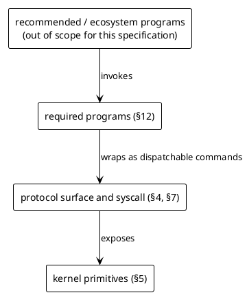
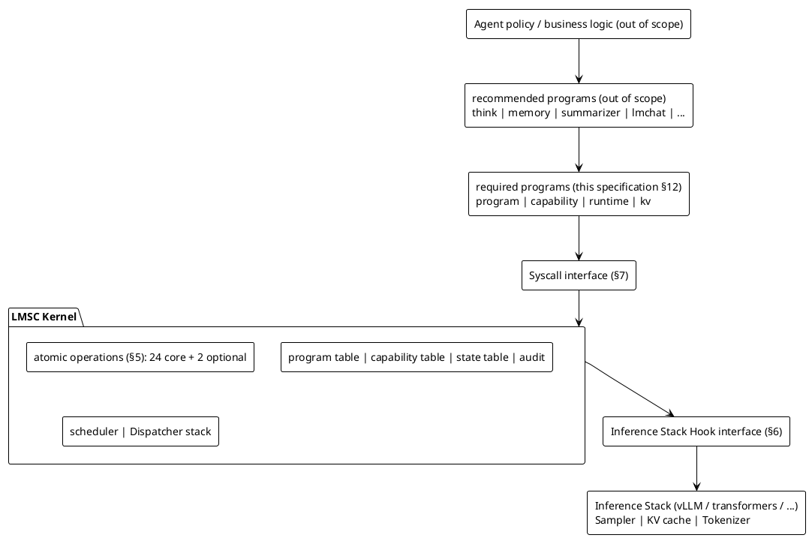
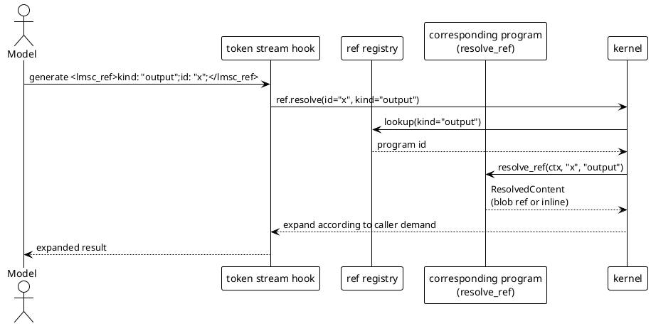
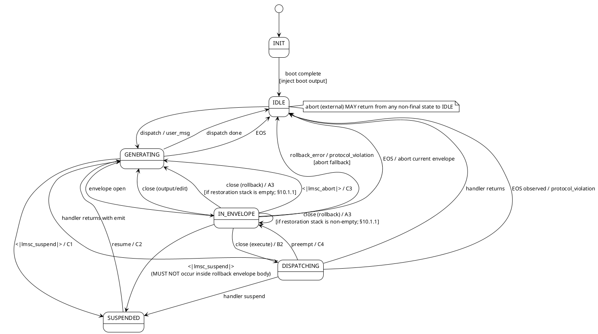
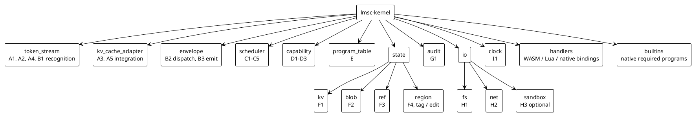

> LMSC Kernel Specification draft v1
> LMSC = Large Model Specialized Computer.
> Protocol revision: `draft v1`.
>
> This booklet is a chapter of the LMSC Kernel Specification draft v1; the body presents the current draft conclusions and necessary notes.

# 0. Introduction and Scope

## 0.1 What LMSC Is

LMSC is the **kernel** for large language models (LLMs). Its responsibilities are:

1. **Shape the token stream** -- constrain the model autoregressive process (logit masks, rollback, injection, snapshots);
2. **Host programs** -- provide loading, dispatch, authorization, state, and audit infrastructure for programs;
3. **Integrate with the inference stack** -- collaborate with the underlying inference engine through three hook points.

LMSC is **not** an Agent, chatbot, toolbox, or scaffold. It is only **mechanism**, not **policy**.

## 0.2 Hard Layering Rules

A conforming implementation **MUST** preserve the following layers under all circumstances:



**Normative clauses **MUST NOT** reference across layers**. The capabilities of required programs **MUST NOT** depend on the presence of any non-required program.

## 0.3 What This Specification Includes

- The special token set, envelope syntax, and attribute semantics of the session protocol;
- The signatures, preconditions, postconditions, and errors of atomic operations;
- The contracts for the three inference stack hook points;
- The system call table (excluding concrete language bindings);
- The program manifest format and handler lifecycle;
- The minimal instruction sets of the four required programs;
- The security invariants that the kernel **MUST** enforce;
- The audit log record structure;
- Error-code namespaces and semantics.

## 0.4 What This Specification Does Not Include

- Implementations of recommended programs (`think` / `memory` / `summarizer` / `lmchat` / ...);
- Binding methods for concrete inference engines (vLLM / transformers / llama.cpp);
- Handler ABIs for specific programming languages;
- LoRA training-data formats;
- Frontend UI, Agent policy, or business logic.

---
> LMSC Kernel Specification draft v1
> LMSC = Large Model Specialized Computer.
> Protocol revision: `draft v1`.
>
> This booklet is a chapter of the LMSC Kernel Specification draft v1; the body presents the current draft conclusions and necessary notes.

# 1. Terminology

| Term | Definition |
|---|---|
| **kernel** | The runtime core that implements this specification |
| **inference stack** | The LLM forward-computation engine (the host of the sampler, KV cache, and tokenizer) |
| **session** | A continuous context from kernel boot to termination, with independent context, kv, and blob namespaces |
| **context** | The complete token sequence of the current session (including interval markers that have been folded / dropped) |
| **turn** | The interval from leaving IDLE to the next IDLE; the unit of accounting for atomic operations and per-turn quotas |
| **envelope** | A structured fragment delimited by paired special tokens, with **four** kinds: `<lmsc_execute>` · `<lmsc_output>` · `<lmsc_edit>` · `<lmsc_rollback>` (pattern-string rollback) |
| **StreamFrame** | Progress metadata observed for an `envelope.emit` chunk: `{ chunk_index, total_chunks_hint?, stream_closed }`; defined in §8.2 |
| **EnvelopeChunk** | The normalized payload for `on_envelope_chunk`, containing envelope kind / id / from / visibility / source path / frame / final token chunk |
| **ChunkDecision** | The return decision of `on_envelope_chunk`: `Continue`, `DetachObserver`, or `AbortEnvelope` |
| **backpressure** | In-session wait semantics when downstream consumption is slower than production on the `envelope.emit` Stream path; exceeding `STREAM_WRITE_TIMEOUT` triggers `E_EMIT_STREAM_BACKPRESSURE_TIMEOUT` |
| **buffered / native** | The two modes of `envelope_emit_stream` under L2: native is pull-based native consumption; buffered is the L2 downgrade semantics of buffering the full body and then injecting it once (§6.5.2) |
| **control token** | A pipelined single token, unpaired, representing an immediate instruction |
| **special token** | The general term for IDs reserved by the kernel |
| **program** | A user-space module registered on the kernel and responding to dispatch |
| **handler** | The executable part of a program, implementing lifecycle callbacks such as `dispatch` |
| **manifest** | Declarative metadata for a program |
| **action** | An executable action declared by a program to the kernel (a closed set of 7 entries; see §8.3) |
| **capability** | A fine-grained permission string |
| **atomic primitive** | The minimal indivisible capabilities provided by the kernel: 24 core entries + 2 optional entries (the 2 optional entries = `A2` + `H3`) |
| **syscall** | A function entry through which programs access atomic operations |
| **dispatcher frame** | One layer of the dispatcher stack, with an independent program lookup table and grammar constraints |
| **region** | A tagged token interval that can be edited as a whole (replaced or deleted) |
| **ref** | A generic reference element: `<lmsc_ref>kind: "...";id: "...";</lmsc_ref>` |
| **blob** | An immutable byte string addressed by content |
| **boot output** | The first `from="system"` output envelope injected by the kernel at session start |
| **fork** | A copy-on-write branch of the full session state (context + KV + metadata) |

---
> LMSC Kernel Specification draft v1
> LMSC = Large Model Specialized Computer.
> Protocol revision: `draft v1`.
>
> This booklet is a chapter of the LMSC Kernel Specification draft v1; the body presents the current draft conclusions and necessary notes.

# 2. Normative Language

This document uses the keywords from [RFC 2119] and [RFC 8174]:

- **MUST**: absolute requirement;
- **MUST NOT**: absolute prohibition;
- **SHOULD**: strong recommendation;
- **MAY**: optional behavior.

The subject of "the kernel **MUST**..." is a conforming implementation. The subject of "a program **MUST**..." is a program deployed on a conforming kernel.

---
> LMSC Kernel Specification draft v1
> LMSC = Large Model Specialized Computer.
> Protocol revision: `draft v1`.
>
> This booklet is a chapter of the LMSC Kernel Specification draft v1; the body presents the current draft conclusions and necessary notes.

# 3. Architecture

## 3.1 Layering



## 3.2 Data Flow

Logits before sampling **MUST** first pass through the kernel's sampler hook, where the kernel applies logit masks, dispatcher frame constraints, and other pre-sampling restrictions. The token produced after sampling **MUST** pass through the token stream hook before append-to-context, where the kernel identifies envelopes, control tokens, refs, and rollback events. KV cache operations are driven directly by the kernel through the KV hook or the rollback truncate adapter, and do not pass through a model-observable path.

The required strength of the hooks above is determined by the access-level matrix in §6.5: L0 provides the Sampler / Token Stream / KV Cache hooks; L1 provides the Sampler and Token Stream hooks, and completes the truncation required by A3 through the rollback truncate adapter; L2 only requires Token Stream post-processing recognition and downgrades according to the post-hoc detection rules in §6.5.1.

Programs do not communicate directly with each other. Cross-program collaboration occurs through one of the following:
- Envelopes (program A's output is dispatched to program B);
- shared kv / blob namespaces (explicit capability);
- ref resolution chains (a resolver registered by program B is called by the kernel when expanding a ref).

## 3.3 Basic Principles

**P-1 - Minimal Kernel** - The kernel **MUST NOT** implement any capability that can be constructed in user space by composing atomic operations.

**P-2 - Mechanism, Not Policy** - The kernel **MUST NOT** hard-code privileged policy; all policy goes through the capability authorization mechanism.

> **P-2 Boundary Note** - P-2 constrains business policies such as agent planning, tool selection, and business approval; it does not negate the kernel's own security baseline. The fixed-only capabilities in §11.4, the required programs in §12, and the non-substitutable fields in boot/runtime schemas are part of the capability mechanism and the boot security boundary itself; they are not privileged policy hard-coding prohibited by P-2.

**P-3 - Single Path** - Programs **MUST NOT** bypass syscalls to access the inference stack / KV cache / tokenizer reserved-id table.

**P-4 - Frozen Token Set** - The special token set is frozen at kernel build time and **MUST NOT** be added to or removed at runtime.

**P-5 - No Cross-Layer Dependency** - Normative clauses and the behavior of required programs **MUST NOT** depend on the presence of recommended or ecosystem programs.

---
> LMSC Kernel Specification draft v1
> LMSC = Large Model Specialized Computer.
> Protocol revision: `draft v1`.
>
> This booklet is a chapter of the LMSC Kernel Specification draft v1; the body presents the current draft conclusions and necessary notes.

# 4. Protocol Surface: Special Tokens and Grammar

## 4.1 Special Token List (Normative)

A conforming kernel **MUST** reserve independent IDs for the following tokens. The tokenizer **MUST** recognize them consistently with the kernel.

### 4.1.1 Envelope Paired Tokens (8)

| Open | Close | Notes |
|---|---|---|
| `<lmsc_execute>` | `</lmsc_execute>` | Program dispatch |
| `<lmsc_output>` | `</lmsc_output>` | Result / input |
| `<lmsc_edit>` | `</lmsc_edit>` | Context edit |
| `<lmsc_rollback>` | `</lmsc_rollback>` | Pattern-string rollback (see §4.1.2a) |

### 4.1.2 Control Single Tokens (2)

| Token | Semantics | Primitive |
|---|---|---|
| `<\|lmsc_abort\|>` | Terminate the current envelope | C3 |
| `<\|lmsc_suspend\|>` | Model-initiated suspension; the model path is equivalent to `suspend(External)` by default | C1 |

### 4.1.2a Rollback Envelope Semantics (Normative)

> **Single normative source for Pattern constraints** - This subsection is the **normative source of truth** for all syntax, semantics, length, reserved-literal, storm-limit, and other constraints on the rollback pattern body. §4.3 EBNF, §4.4 invariants, §5.2 A3, §13.3, and other locations are **references only** and **MUST NOT** introduce additional constraints that conflict with this subsection; if a conflict is found, this subsection prevails.

A model-generated `<lmsc_rollback>X</lmsc_rollback>` means: keep the content before the **most recent** occurrence of `X` that appears "before this envelope and within the rollback boundary (§4.4 `I-ROLLBACK-BOUND`)"; discard the rest, including this envelope itself.

When the kernel sees the `</lmsc_rollback>` close token, it executes the following steps (let `P` be the detokenized bytes of the pattern body):

1. Compute `candidate_context`: the detokenized byte stream from the rollbackable candidate lower bound of the current turn to immediately before the `<lmsc_rollback>` open; this candidate context **MAY** contain bytes that are not rollbackable because of structural boundaries, pinned regions, user input intervals, or `ROLLBACK_SEARCH_MAX_BYTES`.
2. Compute `allowed_window`: the closed interval in `candidate_context` that simultaneously satisfies `scope`, `I-ROLLBACK-BOUND`, pin/input hard boundaries, and `ROLLBACK_SEARCH_MAX_BYTES`; `effective_bound` **MUST** record the nearest boundary that was used.
3. `j := last_index_of(candidate_context, P)`;
4. If `j = NOT_FOUND`: KV is unchanged; emit audit `kind=rollback`, with details containing `outcome=pattern_not_found`; the `token_rollback` syscall returns `E_ROLLBACK_PATTERN_NOT_FOUND`; the model path only emits audit and does not return an error to any caller.
5. If `j` exists but the matched interval `[j, j+len(P))` is not fully inside `allowed_window`: KV is unchanged; emit audit `kind=rollback`, with details containing `outcome=pattern_out_of_bound` and `effective_bound`; the `token_rollback` syscall returns `E_ROLLBACK_PATTERN_NOT_FOUND`; the model path only emits audit and does not return an error to any caller.
6. Otherwise: truncate the KV cache to "the token before the token containing byte `j`" - that is, discard the token containing the first matched byte and everything after it, including the rollback envelope itself; emit audit `kind=rollback` (details contain `outcome=truncated` / `pattern_bytes_len` / `truncated_tokens` / `effective_bound`).

> **Truncation granularity note** - "Truncate to the token **before** the token containing the first matched byte" means that the token containing the first byte is **discarded in full**. This is deliberate: the byte-level `last_index_of` hit position does not depend on the tokenizer, so the match result is predictable across tokenizers; however, the truncation boundary at "the token containing the first matched byte" and the state restoration in §10.1.1 depend on tokenizer segmentation. Cross-implementation restoration consistency holds only under the §16.1 C-14 premise of "the same tokenizer and the same kernel build". Example: if the `W` in `Wait,` and the previous character form one token together, truncation also removes the remaining bytes of that token; training samples establish this behavior.

**Constraints**:

- The rollback envelope **MUST NOT** contain any reserved token in its body (any envelope open/close, `<|lmsc_abort|>` / `<|lmsc_suspend|>`, `<lmsc_ref>` / `</lmsc_ref>`, or key token); violation triggers `I-ROLLBACK-NO-NEST`;
- The body **MUST** be non-empty; empty body -> `E_ROLLBACK_PATTERN_EMPTY`;
- The detokenized byte length of the body **MUST** be ≤ `ROLLBACK_PATTERN_MAX_BYTES` (default **512**; see Appendix F); exceeding it -> `E_ROLLBACK_PATTERN_TOO_LONG`;
- Match search **MUST NOT** cross `I-ROLLBACK-BOUND`; search stops when it encounters a boundary;
- `ROLLBACK_STORM_LIMIT` (default 16 times / turn) remains in effect;
- **`ROLLBACK_PATTERN_MAX_BYTES` upper-bound enforcement** is level-specific:
  - **L0 / L1**: the kernel **MUST** use logit masks to ensure that, after a rollback envelope opens, a close token is produced within `ROLLBACK_PATTERN_MAX_BYTES` bytes; at the upper bound it forces a close or `<|lmsc_abort|>`;
  - **L2**: without a sampler hook, the kernel **MUST** maintain a byte counter for the rollback envelope body in the token stream hook, accumulating from open; upon reaching `ROLLBACK_PATTERN_MAX_BYTES`, it immediately follows the C3 abort path and emits audit `kind=protocol_violation` (invariant=`I-ROLLBACK-BOUND`); L2 **MUST NOT** handle this by silent truncation or best-effort behavior.

A model-triggered rollback envelope and a program call to `token_rollback(pattern, scope)` (§5.2 A3) are **semantically equivalent** and share the constraints above.

The `scope` of the model path is inferred as follows:

- If the current state is `IN_ENVELOPE` -> `scope = Envelope`;
- If the current state is `GENERATING` (no open envelope) -> `scope = Turn`.

The inferred result is written into the `scope` field of the §14.2 audit.

**Examples (byte-level matching, tokenizer-independent)**:

- ASCII: `<lmsc_rollback>Wait,</lmsc_rollback>` truncates from the most recent occurrence of `Wait,`;
- Chinese: `<lmsc_rollback>结论：</lmsc_rollback>` matches `结论：` by its UTF-8 byte sequence;
- With newline: in `<lmsc_rollback>结论：\n</lmsc_rollback>`, `\n` is a literal LF byte;
- Across token boundaries: the match unit is **bytes**, not tokens; how the tokenizer segments the pattern / context **does not** affect the hit result.

### 4.1.3 Ref Element Paired Tokens (2)

| Open | Close | Form |
|---|---|---|
| `<lmsc_ref>` | `</lmsc_ref>` | The body uses the fixed micro-grammar `kind: "summary";id: "x";` (see §4.3) |

> **Note** - `lmsc_ref` is not a "start-prefix" reserved token; like execute / output / edit / rollback, it is a complete pair of open/close reserved tokens. The ref body is parsed from the detokenized byte sequence between `<lmsc_ref>` and `</lmsc_ref>`, independent of how the ordinary tokenizer segments those bytes.

`<lmsc_ref>...</lmsc_ref>` is **not** an envelope: it has no dispatch semantics, does not enter the dispatcher frame stack, and the close token `</lmsc_ref>` does not trigger any dispatch. It only triggers F3 `ref.resolve` and replaces the resolved result inline. `RefOpen` / `RefClose` events (§6.3) are observable hooks for the token stream hook and differ from the dispatch semantics of `EnvelopeOpen/Close`. Its body **MUST** exactly conform to the ref micro-grammar (see §4.3 / `I-REF-CHARSET`).

### 4.1.4 Key Token Family (Optional, Distribution-Defined K)

Form: `<|key_<name>|>`. Typical examples: `key_tab`, `key_enter`, `key_esc`, etc. The concrete set is determined by the kernel build, and `runtime info` **MUST** expose the enabled list.

> **Key token semantic limitation** - Key token semantics are distribution-defined; this specification **does not** define their state-machine branches and **does not** define handler callbacks. The token stream hook handles them as `Chunk` events (**not** triggering any B2 / C-class or ref path); the literals involved are passed through unchanged.

### 4.1.5 Total

The reserved token count of a conforming kernel is 8 + 2 + 2 + K = **12 + K**. `runtime info` **MUST** return an accurate count. This specification enumerates reserved tokens as follows for tokenizer registry generation:

- Envelope open/close tokens: 4 pairs for a total of **8**: `<lmsc_execute>` / `</lmsc_execute>`, `<lmsc_output>` / `</lmsc_output>`, `<lmsc_edit>` / `</lmsc_edit>`, `<lmsc_rollback>` / `</lmsc_rollback>`;
- Control single tokens: 2: `<|lmsc_abort|>`, `<|lmsc_suspend|>`;
- Ref paired tokens: 2: `<lmsc_ref>`, `</lmsc_ref>` (see §4.1.3);
- Key tokens: K tokens (engineering reserved; see §4.1.4).

## 4.2 Envelope Attributes

An envelope open token is a complete reserved token from the §4.1 registry (for example, `<lmsc_output>`). Attributes **MUST NOT** be spliced into the open token literal. Attributes of non-rollback envelopes are maintained by the kernel as metadata, and when they need to be written into context they appear immediately after the open token as a **kernel-injected attribute header**. The attribute header uses ordinary tokenizer bytes and no reserved token.

The canonical form of the attribute header is:

```text
@lmsc-attrs id="..." from="..." visibility="..."\n\n
```

There **MUST** be whitespace before the first attribute, and the attribute header ends with a blank line; only after the blank line does the envelope body begin. The attribute header is parsed as attributes only when the kernel has marked that byte interval as a `kernel-owned attr_header`. If the model or a program generates the same literal in an ordinary body, it is treated only as body bytes and **MUST NOT** be promoted to attributes.

The kernel generates or completes an attribute header at the following times:

- After the model generates a non-rollback envelope open token, the kernel injects a default attribute header (such as `id` and default `from="model"`) before entering body sampling;
- When `envelope.emit`, boot output, persona-refresh, or other kernel / program paths write an envelope, the kernel generates the attribute header from passed attrs or internal metadata;
- If an implementation accepts attributes in an open-tag form, it **MUST** first canonicalize them to this attribute header; the normative text, schemas, and tests use this attribute header as the source of truth.

> **Note** - The `<lmsc_rollback>` envelope **carries no attributes**; its body directly carries the pattern sequence (see §4.1.2a / §4.3 EBNF). In the table below, values such as "all" in the `Applicable envelope` column **exclude** the rollback envelope.

The kernel **MUST** recognize the following core attributes (attributes not listed are passed through to programs):

| Attribute | Applicable envelope | Values | Semantics |
|---|---|---|---|
| `id` | all | string | Unique identifier (kernel auto-completes a default) |
| `from` | execute / output / edit | `user` / `system` / `program:<name>` / `model` | Source |
| `visibility` | output / edit | `all` (default) / `model-only` / `user-only` | Visibility |
| `attention` | output | `free` (default) / `keep-summary` / `pin` | Retention policy |
| `confidence` | output / edit | `0.0`-`1.0` | Confidence |
| `schema` | output | string | Rendering schema name |
| `gen` | output | Free string (program-defined) | Generation marker; the kernel **does not interpret** it and only passes it through |
| `status` | output | string | Error code or `ok`; `ok` + empty body forms a short-circuit "ack" |
| `ref` | output | Same form as `id` | The ID used when this output is used as a ref source |

For unknown attributes, the kernel **MUST** preserve and pass them through, and **MUST NOT** delete them.

> **Explanation** - The `gen` attribute uses a **free string**; the kernel performs no enum checking and triggers no state machine. Generation semantics are defined by the program itself, which conforms to P-5.
>
> **Explicit rule** - The **scope of `gen` is per-program**: the kernel **MUST NOT** compare `gen` strings across programs. The same `gen` spelling is not required to have the same semantics in program A and program B. If recommended programs need interoperability, a separate recommended-program document **SHOULD** provide an ecosystem-level vocabulary (not a normative-level constraint). Correspondingly, `region.tag.attrs.gen` is also per-program (the namespace of the owner program).

## 4.3 Grammar (EBNF)

```ebnf
stream = { chunk | envelope | control | ref_element } ;
chunk = { ordinary_token } ;
envelope = execute_env | output_env | edit_env | rollback_env ;

(* envelope open tokens are complete reserved tokens; attributes are carried by the kernel-injected attribute header *)
execute_env = "<lmsc_execute>" , attr_header? , body , "</lmsc_execute>" ;
output_env = "<lmsc_output>" , attr_header? , body , "</lmsc_output>" ;
edit_env = "<lmsc_edit>" , attr_header? , body , "</lmsc_edit>" ;
rollback_env = "<lmsc_rollback>" , pattern_body , "</lmsc_rollback>" ;
attr_header = "@lmsc-attrs" , attrs , line_end , line_end ;
attrs = ws , attr , { ws , attr } ;
attr = ident , "=" , str_literal ;

(* lexical atomic definitions *)
ordinary_token = ? non-reserved token in the vocabulary, as output by the kernel tokenizer ? ;
ident = letter , { letter | digit | "_" | "-" } ;
str_literal = '"' , { str_char } , '"' ;
 (* double-quoted; MUST NOT span a newline; supports the two escapes \" and \\ *)
str_char = ( ? any Unicode character except '"' , '\\' , LF , CR , Tab (0x09) ? )
 | "\\\"" | "\\\\" ; (* Tab is excluded to avoid ambiguity at lexical boundaries of attribute values *)
ws = { " " | "\t" } ; (* attribute headers are inline and do not include newline; ws is required before the first attribute *)
line_end = "\n" | "\r\n" ;
letter = "A" .. "Z" | "a" .. "z" ;
digit = "0" .. "9" ;

body = { chunk | ref_element | control | rollback_env } ;
pattern_body = ordinary_token , { ordinary_token } ;
 (* non-empty; its detokenized byte sequence <= ROLLBACK_PATTERN_MAX_BYTES;
 and the byte sequence MUST NOT form the literal form of any reserved token
 (envelope open/close, <|lmsc_abort|> / <|lmsc_suspend|>, <lmsc_ref> / </lmsc_ref>, key literals).
 The check is performed **at byte level**: substring search is run over the detokenized
 UTF-8 / binary byte sequence of pattern_body, independent of how the tokenizer segments it.
 Violations are detected post-hoc by I-ROLLBACK-NO-NEST (enforced by logit mask in L0/L1). *)

ref_element = "<lmsc_ref>" , ref_body , "</lmsc_ref>" ;
ref_body = 'k','i','n','d',':',' ','"' , ref_value , '"',';'
 , 'i','d',':',' ','"' , ref_value , '"',';' ;
ref_value = ref_char , { ref_char } ;
ref_char = 'A'..'Z' | 'a'..'z' | '0'..'9'
 | '_' | '.' | ':' | '/' | '-' ; (* values are limited to the ASCII safe set *)

control = "<|lmsc_abort|>"
 | "<|lmsc_suspend|>"
 | key_token ;

key_token = "<|key_" , ident , "|>" ;
```

> **Specified** - The body of `<lmsc_ref>...</lmsc_ref>` **MUST** exactly conform to:
>
> `kind: "{kind}";id: "{id}";`
>
> Where (`{kind}` / `{id}` are placeholders representing the actual value strings):
>
> 1. Field names are limited to `kind` and `id`;
> 2. The order is fixed: `kind` first, `id` second;
> 3. The character set of both values is limited to ASCII `[A-Za-z0-9_.:/-]`;
> 4. Additional fields **MUST NOT** be included, non-ASCII characters **MUST NOT** be used, and whitespace variants that deviate from this micro-grammar **MUST NOT** be used;
> 5. The values of `kind` and `id` **MUST NOT** be empty strings; the form `kind: "";` violates the EBNF (`ref_value` has at least 1 character) and is likewise treated as a micro-grammar violation.
>
> A ref element that violates this micro-grammar or character-set constraint **MUST** be rejected by the kernel, which emits audit `kind=protocol_violation` (invariant=`I-REF-CHARSET`) and returns `E_REF_BODY_INVALID`.
>
> The attribute headers of `<lmsc_execute>` / `<lmsc_output>` / `<lmsc_edit>` are **not subject** to this restriction: they are not on the fast path of streaming ref parsing and are parsed as kernel-owned attribute headers.
>
> **Explicit character prohibition** - The `ref_char` character set above already implicitly excludes the double quote `"` and semicolon `;`, which are ref body delimiters themselves. This explicitly restates: the values of `kind` / `id` **MUST NOT** contain `"` or `;`. If an external system ID contains non-whitelisted characters (Chinese, spaces, Unicode punctuation, quotes, semicolons, etc.), the program **MUST** perform mapping/hash processing at the `ref.bind` stage itself (for example, a SHA-256 prefix or URL-safe base64). The kernel **does not** provide an escaping mechanism; for any violating ref body, the kernel always returns `E_REF_BODY_INVALID`.

## 4.4 Grammar Invariants (Normative)

A conforming kernel **MUST** enforce the following grammar invariants. Enforcement modes are divided by level and invariant type:

- **A1 logit mask enforcement** (L0 / L1, at the sampler hook level): `I-ENV-PAIR`, `I-ENV-NO-SELF-NEST`, `I-CTRL-INSIDE-ENV`, `I-ROLLBACK-BOUND`, `I-ROLLBACK-NO-NEST`, `I-ABORT-SCOPED`, `I-ATTR-CLEAN`, `I-ROLLBACK-NO-ATTR`; plus the conditional invariant `I-STRICT-ENVELOPE-ONLY` (only included in the A1 enforcement set when `features.strict_protocol_mode=true` and `features.raw_text_outside_envelope="forbidden"`; see the end of this section and §10.1.2);
- **Syscall entry enforcement** (all levels): `I-EMIT-ESCAPE` (checked on `envelope.emit`, `net` -> envelope body rewriting, `region.edit`, and `ref.resolve` failure visible-text injection paths);
- **Post-hoc recognition + abort** (all levels, and under L2 the A1 group above is downgraded to this mode; see §6.5.1): `I-REF-ANY`, `I-REF-CHARSET`.

The entries are as follows:

- **I-ENV-PAIR** - Every envelope open **MUST** have a corresponding close; the session **MUST NOT** close before the close appears.
- **I-ENV-NO-SELF-NEST** - Envelopes of the same kind **MUST NOT** be directly nested (`<lmsc_execute>` **MUST NOT** be nested inside `<lmsc_execute>`).
- **I-CTRL-INSIDE-ENV** - Inside a non-rollback envelope, the only reserved tokens that **MAY** appear are: `<|lmsc_abort|>`, `<|lmsc_suspend|>`, and a **nested `<lmsc_rollback>` open** (the model initiates an undo inside an execute/output/edit body); the mask **MUST** reject other envelope open tokens. Inside a **rollback envelope body**, reserved tokens **MUST NOT** appear (constrained by `I-ROLLBACK-NO-NEST`; in particular, `<|lmsc_suspend|>` **MUST NOT** appear inside a rollback envelope body to avoid carrying a partial pattern in a snapshot).

 > **Disambiguation of the term "nested"** - In this entry, "nested `<lmsc_rollback>` open" means opening a new rollback envelope inside an execute / output / edit envelope body. This **MAY** occur (the rollback envelope then closes by itself and does not actually form a long-lived nested stack). What `I-ROLLBACK-NO-NEST` prohibits is any reserved token appearing inside the **body of the rollback envelope itself** (including another rollback open). The two uses of "nested" have different meanings and **MUST NOT** be conflated.
- **I-REF-ANY** - `<lmsc_ref>...</lmsc_ref>` **MAY** appear in any envelope body, and **MAY** also appear in an ordinary chunk.
- **I-ROLLBACK-BOUND** - The match search of `<lmsc_rollback>` **MUST NOT** cross the boundary of a closed envelope, the boundary of boot output, or the boundary of a dispatch declared with `rollback_safe: false`.
- **I-ROLLBACK-NO-NEST** - The body of `<lmsc_rollback>` **MUST NOT** contain any reserved token (any envelope open/close, `<|lmsc_abort|>` / `<|lmsc_suspend|>`, `<lmsc_ref>` / `</lmsc_ref>`, or key token). The kernel **MUST** enforce this through logit masks; if a post-hoc path identifies a violation, it **MUST** emit `kind=protocol_violation` and return `E_ROLLBACK_PATTERN_INVALID`.

- **I-ROLLBACK-NO-ATTR** - `<lmsc_rollback>` **MUST NOT** carry any attribute header or attribute metadata; L0 / L1 enforce this with logit masks, and under L2 it is item 9 in the §6.5.1 post-hoc detection list. On violation, return `E_ROLLBACK_PATTERN_INVALID` and emit `protocol_violation` audit.

 > **L0 / L1 lookahead algorithm requirement** - The kernel **MUST** build a byte-level Aho-Corasick or equivalent trie over the **literal byte sequences** of all reserved tokens for multi-pattern lookahead in logit masks: after a candidate token is appended, if **any suffix** of the current rollback body accumulated byte sequence forms a non-empty prefix of any reserved token literal, the kernel **MUST** `hard_deny` that candidate token. This requirement covers the complete set of the four envelope open/close pairs, `<|lmsc_abort|>` / `<|lmsc_suspend|>`, `<lmsc_ref>` / `</lmsc_ref>`, and all `<|key_*|>` literals. L2 does not apply this lookahead; it is handled instead by the post-hoc check in §6.5.1 item 5.
- **I-ABORT-SCOPED** - `<|lmsc_abort|>` is valid **only** inside an envelope. If it appears outside an envelope, the kernel **MUST** discard it (preferably by blocking it with a logit mask).
- **I-ATTR-CLEAN** - The kernel-owned attribute header ends at the blank-line boundary; the attribute header **MUST NOT** contain any special token literal, and the header prefix, separator before the first attribute, line ending, and blank line **MUST** conform to §4.3.
- **I-EMIT-ESCAPE** - When injecting the bytes body of `envelope.emit`, rewriting a `net` response into an envelope body, injecting the `replacement` bytes of `region.edit`, or injecting visible text for `ref.resolve` failure, the kernel **MUST** escape reserved-token literal characters (§13.2).
- **I-REF-CHARSET** - The body of `<lmsc_ref>...</lmsc_ref>` **MUST** exactly conform to the micro-grammar `kind: "{kind}";id: "{id}";` (`{kind}` / `{id}` are placeholders); both values are limited to ASCII `[A-Za-z0-9_.:/-]` and **MUST NOT** be empty strings; violations **MUST** be rejected, emit `kind=protocol_violation`, and return `E_REF_BODY_INVALID`.
- **I-STRICT-ENVELOPE-ONLY** (**conditional invariant**, enabled only when `features.strict_protocol_mode=true` and `features.raw_text_outside_envelope="forbidden"`) - When the state is `GENERATING` and the envelope stack depth = 0, the next token sampled by the model **MUST** belong to the "legal LMSC protocol entry" set: one of `<lmsc_execute>` / `<lmsc_output>` / `<lmsc_edit>` / `<lmsc_rollback>` / `<|lmsc_suspend|>` / EOS; any non-entry ordinary token is treated as a violation. L0 / L1 **MUST** enforce this in the sampler hook via logit mask before sampling; L2 detects violations post-hoc in the token stream hook and routes through `kind=protocol_violation` (invariant=`I-STRICT-ENVELOPE-ONLY`) the same way as §6.5.1 item 9, returning `E_PROTOCOL_VIOLATION`. When `raw_text_outside_envelope="audit-only"`, the invariant is **not** enforced, but the kernel **MUST** emit audit `kind=raw_text_outside_envelope` (which does not constitute a violation). When `raw_text_outside_envelope="allowed"` or `strict_protocol_mode=false`, the invariant is **not** active, preserving the existing compatibility behavior.

## 4.5 Role Semantics

For the three envelope kinds **`execute` / `output` / `edit`**, "**who initiated it**" is determined entirely by the `from` attribute in the attribute header (§4.2). The kernel **MUST NOT** hard-code roles by envelope kind: `<lmsc_execute>` defaults to `from="model"`, but it is legal for a program to write on behalf of the kernel with a kernel-owned attribute header carrying `from="program:flow"`.

**The `rollback` envelope is the exception**: `<lmsc_rollback>` **carries no attributes** (§4.2) and does not use the `from` mechanism; its role is determined implicitly by the generation path. When generated by model autoregression it is equivalent to `from="model"`; when a program explicitly calls A3 `token_rollback`, the audit records `source=program:<name>`. **The model path being "equivalent to `from=\"model\"`" is only semantic attribution that treats it as model-initiated; no actual `from` attribute exists**. Any code parsing a rollback envelope **MUST NOT** try to read or infer its `from` field: that field does not exist and is structurally absent.

---
> LMSC Kernel Specification draft v1
> LMSC = Large Model Specialized Computer.
> Protocol revision: `draft v1`.
>
> This booklet is a chapter of the LMSC Kernel Specification draft v1; the body presents the current draft conclusions and necessary notes.

# 5. Atomic Operations

This section defines the kernel's minimal capability set. Each atomic operation gives: signature, preconditions, postconditions, errors, and notes.

## 5.1 Categories and Counts

| Class | Numbers | Core | Optional |
|---|---|---|---|
| A - Token Stream | A1-A5 | 4 | A2 |
| B - Envelope Structure | B1-B3 | 3 | -- |
| C - Scheduling | C1-C5 | 5 | -- |
| D - Authorization | D1-D3 | 3 | -- |
| E - Program Table | E | 1 | -- |
| F - State | F1-F4 | 4 | -- |
| G - Audit | G1 | 1 | -- |
| H - I/O | H1-H3 | 2 | H3 |
| I - Time | I1 | 1 | -- |
| **Total** | | **24** | **2** |

The **24** core primitives **MUST** be implemented; the two optional primitives, **A2 and H3**, are determined by the §6.5 access level.

## 5.2 A - Token Stream

### A1 - `logit_mask`

```
logit_mask(mask: Mask) -> ()
Mask := { hard_allow: Set<TokenId>?, hard_deny: Set<TokenId>?, bias: Map<TokenId, f32> }
```

- **Precondition**: the caller holds the `tokens.mask.direct` cap (fixed-only; by default only kernel internals and the inference stack adapter layer).
- **Postcondition**: applied to logits before the next sampling operation.
- **Errors**: `E_MASK_INVALID`.
- **Notes**: hard_deny takes precedence over bias; when hard_allow is non-empty, all other tokens **MUST** be treated as hard-denied.

### A2 - `query_special` (Optional)

```
is_special(id) -> bool
name_of(id) -> Option<string>
id_of(name) -> Option<TokenId>
```

- **Precondition**: none.
- **Postcondition**: read-only; the returned mapping does not change during the session lifecycle.
- **Notes**: equivalent information is already returned in boot output; this primitive is a convenience API. Conforming L2 implementations **MAY** omit it, and programs **SHOULD** cache the token list from boot output in `on_load`.

### A3 - `token_rollback`

```
token_rollback(pattern: Bytes, scope: Scope) -> Result<()>
Scope := Envelope | Turn
```

- **Preconditions**:
  - `I-ROLLBACK-BOUND` has not been violated;
  - `pattern` is non-empty and `len(pattern) ≤ ROLLBACK_PATTERN_MAX_BYTES` (default 512);
  - `pattern` **MUST NOT** contain the literal byte sequence of any reserved token (equivalent to `I-ROLLBACK-NO-NEST`);
  - The number of rollbacks in the current turn is < `ROLLBACK_STORM_LIMIT` (default 16);
  - The caller holds `tokens.rollback.explicit` (not granted by default; model-emitted `<lmsc_rollback>` envelopes use the kernel-internal equivalent path and do not use this cap).
- **Postconditions**:
  - Reverse-search for the most recent occurrence of `pattern` within the byte window allowed by scope;
  - On hit: truncate the KV cache to "the token before the token containing the first matched byte" (discarding the rollback envelope itself as well);
  - On miss (`pattern_not_found`) or if any byte of the hit interval is out of bounds (`pattern_out_of_bound`): leave KV unchanged;
  - Emit audit `kind=rollback`, with details containing `outcome ∈ {truncated, pattern_not_found, pattern_out_of_bound}` / `scope` / `pattern_bytes_len` / `truncated_tokens` (when `outcome=truncated`). Here `pattern_out_of_bound` distinguishes "pattern does not exist in the whole context" from "some byte in the matched interval falls outside the boundary".
  - `ROLLBACK_STORM_LIMIT` counting follows the §13.3 rule: within a single turn, both **successful** (`outcome=truncated`) and **failed** (`pattern_not_found` / `pattern_out_of_bound`) attempts count toward the same counter, without distinction.
- **Errors**: `E_ROLLBACK_STORM` / `E_ROLLBACK_PATTERN_EMPTY`/ `E_ROLLBACK_PATTERN_NOT_FOUND`/ `E_ROLLBACK_PATTERN_TOO_LONG`/ `E_ROLLBACK_PATTERN_INVALID`.

A model-triggered `<lmsc_rollback>…</lmsc_rollback>` envelope and a program call to this primitive are **semantically equivalent**; both paths share the preconditions and invariants above. A miss on the model path does not report an error and only emits audit. **Model path `scope` inference**: current state `IN_ENVELOPE` -> `Envelope`; current state `GENERATING` -> `Turn`. The program-path syscall signature does not provide a default; the caller **MUST** pass `scope` explicitly. When a language binding or the kernel receives a defaulted/missing scope, it **MUST** reject the call and return `E_PROTOCOL_VIOLATION` or an equivalent binding-layer error.

> **V1 status of `tokens.rollback.explicit`** - This cap is listed as **fixed-only** (§11.4), but V1 grants it to no program (§12.3 default-holding table does not include it, and Appendix B also marks it `no, fixed only`). This specification retains the `token_rollback` syscall interface as the kernel-internal equivalent path and as an entry point for a future major-version extension; in V1 there is **no legal program call path**. The current conforming paths that can produce KV truncation are model-generated `<lmsc_rollback>...</lmsc_rollback>` envelopes, or the kernel internally mapping that envelope close to the A3-equivalent flow.

**V1 A3 path decision table**:

| Path | V1 status | Authorization and result |
|---|---|---|
| Model rollback envelope path | **MUST** support | The close of `<lmsc_rollback>...</lmsc_rollback>` triggers the kernel-internal A3-equivalent flow; no program cap participates |
| Kernel internal path | **MUST** support | The token stream hook / rollback parser **MAY** call the internal A3 semantics; it is not exposed to programs |
| Program syscall path `tokens.rollback(pattern, scope)` | **MUST** be unreachable | Programs **MUST NOT** hold `tokens.rollback.explicit` through `capabilities.granted` / `capabilities.requestable`; calls without the cap return `E_CAP_DENIED`, and a manifest / runtime state that claims the cap is requestable or already granted is non-conforming |

> **Compatibility note**: if a future major version defines a program-initiated A3 path, it **MUST** also define callback return after rollback completion, reentry rejection, audit, and error-code rules. That path is not a V1 conformance test item.

### A3 Level-Based Downgrade

A3 availability and downgrade semantics at different access levels:

| Level / branch | `features.rollback_truncate_precision` | Rollback result | Enters §10.1.1 restoration algorithm? |
|---|---|---|---|
| L0 | `byte` | Execute precise KV truncation after a hit; legal misses keep KV unchanged | Enters after a hit and completed truncation |
| L1 | `byte` or `token` | Truncate through the rollback truncate adapter after a hit; the `token` branch conservatively truncates by the whole token containing the first byte | Enters after a hit and completed truncation |
| L2 | `byte` or `token` | Post-hoc scan after the close event; truncate through the adapter after a hit; illegal rollback is cleaned up according to §6.5.1.1 | Enters after a legal hit and completed truncation |
| L2 | `none` | Does not perform physical truncation; **MUST** abort the current turn and emit `protocol_violation` or `rollback_error` (as determined by §6.5.1.1 / §14.2.2) | Does not enter; abort rollback takes precedence |

The `none` branch is not "low-precision restoration"; it is a fail-closed path when the rollback truncation precondition cannot be satisfied. Therefore it **MUST NOT** call the normal restoration algorithm in §10.1.1.

- **L0 / Tier-A**: as in the main text of this section; `scope ∈ {Envelope, Turn}` has complete semantics; pattern-string matching is implemented precisely by KV Hook + sampler mask; restoration state follows §10.1.1 with O(T) or O(1) snapshot.
- **Rollback truncate adapter**: any implementation that claims to support A3 truncation, even if it does not provide a full KV Hook, **MUST** declare a minimal truncation adapter through the inference stack adapter layer: `truncate_to_token(pos)` or `truncate_to_byte(pos)`. This adapter only handles rollback truncation and is not equivalent to the A5 fork/restore/drop KV Hook. If physical truncation is completely unsupported, the implementation **MUST** declare `features.rollback_truncate_precision="none"` and follow the abort fallback below.
- **L1 / Tier-B**: no full KV Hook, but the rollback truncate adapter **MUST** be supported. `scope=Turn` **MUST** be supported; `scope=Envelope` **MAY** have token-level truncation precision. If the inference stack adapter layer does not provide a byte-precise truncation API, an L1 implementation **MAY** run with boot output `features.rollback_truncate_precision="token"` (unified with the L2 rule); the pattern search window still **MUST** be precise with respect to structural boundaries (**MUST NOT** approximate by the turn start as a worst case), and only truncation precision **MAY** be downgraded. On hit, audit details mark `truncate_precision=token`.
- **L2 / Tier-C**: no sampler hook and no full KV Hook. `scope ∈ {Envelope, Turn}` is determined by post-hoc scanning in the token stream hook; pattern matching is executed once at the `</lmsc_rollback>` close event; the kernel performs byte-precise or token-precise truncation through the rollback truncate adapter. If the adapter layer does not support byte-precise truncation, the L2 implementation **MUST** truthfully declare `features.rollback_truncate_precision ∈ {byte, token}` in boot output; an implementation declaring `token` **MUST** truncate the whole token containing the first byte of the pattern when that byte falls in the middle of a token (conservative), and mark `truncate_precision=token` in audit details.

 **L2 fallback path when KV truncation is completely unsupported** - If the inference stack adapter layer provides neither byte-precise nor token-level truncate APIs (meaning the kernel cannot complete any physical KV truncation under L2), the L2 implementation **MUST**: (1) declare `features.rollback_truncate_precision="none"` in boot output; (2) when observing the `</lmsc_rollback>` close, perform no truncation and instead execute C3 abort for the current turn; (3) emit audit `kind=protocol_violation` (invariant=`I-ROLLBACK-BOUND`), with details containing `truncate_fallback="abort"` and `reason="rollback_unsupported_truncate"` (so the model can learn to stop generating it), and temporarily retain it in the model-visible projection of `runtime audit tail`; (4) **if this abort is triggered by the program path A3 or explicitly observed by a program**, return `E_PROTOCOL_VIOLATION` to the caller; the model path only emits audit and does not return an error to any caller (unified with the §6.5.1 L2 post-hoc invariant detection rule "if the abort is observed as program-initiated"). **This C3 abort **MUST** ensure that the rollback envelope does not enter final stable context**; if an implementation cannot fully intercept it before the abort path, it **MUST** intercept at an earlier hook stage. L2 implementations **MUST NOT** silently ignore rollback that cannot be truncated; this fallback path **MUST** satisfy §16.1 C-11 for L2 post-hoc detection.

At all levels, A3 error-code semantics, out-of-bound handling (`pattern_out_of_bound`), audit emit rules, `ROLLBACK_STORM_LIMIT`, and related rules remain consistent. The implementation level does not affect the normative semantics of A3; it only affects "how precisely those semantics are achieved".

### A4 - `token_inject`

```
token_inject(tokens: Vec<TokenId>, position: Position) -> Result<()>
Position := BeforeNextSample | AtEnvelopeClose
```

- **Preconditions**:
  - All tokens are in the vocabulary;
  - If reserved tokens are included, the caller holds the `tokens.inject.special` cap (fixed-only);
  - Total length ≤ `INJECT_MAX_TOKENS` (default 4096);
  - An envelope close token **MUST NOT** be injected outside an envelope.
- **Postcondition**: insert and update the KV cache; emit audit.
- **Errors**: `E_INJECT_BAD_TOKEN` / `E_INJECT_CAP_DENIED` / `E_INJECT_TOO_LARGE`.

### A5 - `session_fork`

```
session.fork() -> SessionHandle # new session, shared KV prefix
session.restore(handle: SessionHandle) -> Result<()> # switch to an already forked session
session.drop_fork(handle: SessionHandle)-> Result<()> # release a fork
```

- **Preconditions**:
  - The implementation level **MUST** be **L0** (A5 is unavailable under L1 / L2; calls return `E_ATOMIC_UNSUPPORTED`);
  - `fork`: **handlers in the session **MUST NOT** hold an in-progress streaming `envelope.emit`**; if this condition is violated, the kernel **MUST** return `E_EMIT_STREAM_OPEN`, with details containing at least `open_stream_count`, and **SHOULD** contain the list of unclosed `envelope_id` values that can be exposed; calling inside dispatch is legal: `runtime admin fork` (§12.3) depends on this path. (Cannot fork while streaming emit is unfinished.)
  - **Fork quota checks** (formally linked to Appendix F.3 normative constants and the errors registered in §15.2) - before allocating a CoW KV snapshot, the kernel **MUST** perform the following three checks, returning errors in this order. In concurrent scenarios, crossing through the gap between assignment and allocation **MUST** be guarded (quota check + CoW allocation **MUST** hold a mutex or equivalent semantics for the same root session):
    1. **Depth**: if the fork-chain depth from the root session downward is ≥ `SESSION_FORK_MAX_DEPTH` (Appendix F.3; default 8), return `E_FORK_DEPTH_EXCEEDED`, audit details `reason="depth_limit"`;
    2. **Concurrency**: if the total number of active (not `drop_fork`ed) forks of the current root session is ≥ `SESSION_FORK_MAX_CONCURRENT` (Appendix F.3; default 16), also return `E_FORK_DEPTH_EXCEEDED`, audit details `reason="concurrent_limit"`; both structural upper bounds reuse the same error code and are distinguished by the audit `reason` field; a separate error code is unnecessary (§15.1 class-A `E_FORK_` prefix convergence principle);
    3. **Memory quota**: if the implementation sets `SESSION_FORK_MEM_LIMIT_MB` (Appendix F.3; default 1024, `null` means disabled), and **the estimate for this fork + accumulated CoW memory of currently active forks** exceeds that value, return `E_FORK_MEM_EXCEEDED` (quota exceeded); if depth / concurrency both pass and quota is sufficient (or disabled) but the underlying CoW allocation fails (physical OOM / address-space exhaustion), return `E_FORK_OOM` (physical allocation failure). The two are explicitly distinct.
  - `restore` / `drop_fork`: the handle is valid.
- **Postconditions**:
  - `fork` saves the complete context + KV cache (CoW reference) + kernel metadata (program table, kv refcount, capability set, audit cursor); returns a new SessionHandle, while the original session remains alive;
  - `restore` switches current execution to the target session, while the original session remains alive (the caller can explicitly release it with `drop_fork`);
  - `drop_fork` releases the corresponding CoW reference.
- **Errors**: `E_FORK_INVALID` / `E_EMIT_STREAM_OPEN` / `E_FORK_OOM` / `E_FORK_DEPTH_EXCEEDED` / `E_FORK_MEM_EXCEEDED` (trigger conditions are described in the precondition quota checks above; retryable classification is in §15.3).
- **Notes**: explicitly uses **fork semantics**. Supports tree-of-thought, OOM protection, and transactional dispatch.
- **`SessionHandle` type** - `SessionHandle` is an in-memory handle (opaque type); it is **not** serializable and **MUST NOT** be persisted across sessions; it is valid only during the current kernel instance lifecycle. Carrying the handle across processes / deployments **MUST** return `E_FORK_INVALID`.

## 5.3 B - Envelope Structure

### B1 - `envelope_event`

```
(event, produced by the token stream hook)
on_envelope_open(kind, attr_header, id) -> ()
on_envelope_close(kind, id) -> ()
```

- **Postconditions**:
  - After open, the kernel associates or injects the kernel-owned attribute header; after the blank line ending the attribute header, it enters the body;
  - Close triggers B2 dispatch (if execute) or audit (if output/edit);
  - Stack depth ≤ `MAX_ENVELOPE_NEST` (default 4); when exceeded, the kernel **MUST** block open tokens through the logit mask.

### B2 - `dispatch`

```
dispatch(envelope: Envelope) -> DispatchResult
```

- **Preconditions**:
  - `envelope.kind = ExecEnv`;
  - **If the target program manifest declares `reentrant: false` and that program already has an active dispatch** (within the same session, not yet returned or aborted, including a dispatch in `SUSPENDED` state that has not yet resumed), the kernel **MUST** reject and return `E_DISPATCH_REENTRY`. A dispatch in `SUSPENDED` state is still considered an active dispatch and is subject to the same constraint.
- **Postconditions**:
  1. Parse the first token sequence of the body as `argv`;
  2. `program_table.lookup(argv[0])` -> handler;
  3. `cap.check(program.capabilities_required)`;
  4. Call `handler.dispatch(ctx, args)`;
  5. Write audit.
- **Errors**: `E_UNKNOWN_PROGRAM` / `E_CAP_DENIED` / `E_HANDLER_PANIC` / `E_DISPATCH_REENTRY` / `E_EMIT_STREAM_OPEN` (`persona-refresh` and other scenarios using the "handler holds an unclosed streaming emit" branch use this dedicated error code and no longer reuse `E_DISPATCH_REENTRY`).
- **Notes**: handler **MAY** call `scheduler.suspend` to yield; the kernel resumes it when conditions are satisfied.
- **Handler panic and `on_abort` cleanup** - When handler `dispatch` returns panic / error, the kernel **MUST** automatically trigger a close path equivalent to C3: if the handler registered `on_abort`, first call `on_abort(ctx, envelope_id)` so the program can clean up (release region locks, reclaim temporary kv keys, etc.), then emit audit `kind=abort` (details contain `reason="handler_panic"`); then return `E_HANDLER_PANIC`. If `on_abort` itself panics, the kernel **MUST** swallow that panic and attach `nested_panic=true` to the `kind=abort` details, so that internal stacks are not exposed; it does not call `on_abort` a second time. **`on_abort` deduplication**: `on_abort` for the same envelope is called **at most once**; if one trigger path has already called it, any later trigger path for the same envelope (such as concurrent close + panic) **MUST NOT** call it again.

**Abort sequencing for SUSPENDED dispatch** - If a dispatch has entered `SUSPENDED` through C1, but its associated envelope, unfinished stream, dispatch timeout, or external abort triggers abort while suspended, the kernel **MUST** finish in the following order:

1. Cancel the resume handle registered by that dispatch. Later `resume` for that handle **MUST** return `E_SUSPEND_INVALID` or `E_SUSPEND_EXPIRED`, with details marking `reason="aborted_while_suspended"`;
2. Stop and cancel the unfinished generator / async iterator held by that dispatch, using cancellation semantics equivalent to B3 `E_EMIT_STREAM_ABORTED`;
3. Call `on_abort` at most once according to the envelope_id deduplication rule;
4. Clean up dispatcher frames that have not yet been popped during that handler / turn;
5. Complete the original dispatch with the error corresponding to the trigger source: stream abort uses `E_EMIT_STREAM_ABORTED`, dispatch timeout uses `E_DISPATCH_TIMEOUT`, external abort uses `E_ABORT_NOT_OPEN` or a distribution-equivalent abort error with `aborted_while_suspended=true` in details;
6. Move session state to `IDLE`, unless the abort occurs inside a rollback truncation flow that can recover according to §10.1.1, in which case that recovery state prevails.

The kernel **MUST NOT** wait on the original resume condition to be naturally satisfied on this path; like ordinary C3, this exceptional exit path **MUST** write `abort` or corresponding `protocol_violation` audit.

### B3 - `envelope_emit`

```
envelope_emit(
 kind: EnvKind, # { execute, output, edit } (whitelist)
 attrs: Map<string, string>,
 body: Bytes | Stream<Bytes> # uniformly bytes or a bytes stream
) -> Result<()>
```

- **Preconditions**:
  - `kind ∈ { execute, output, edit }`; **`kind = rollback` is illegal**. Rollback envelopes can only be produced by the model path (§4.1.2a) and are mapped by the kernel to the internal A3-equivalent flow; when B3 receives `kind=rollback`, it **MUST** return `E_ENV_KIND_FORBIDDEN`;
  - The caller holds the `envelope.emit` cap (granted to all registered programs by default); body size ≤ `EMIT_BODY_MAX_BYTES`. **Judgment time for the Stream path** - in `body: Stream<Bytes>` mode, after consuming each chunk the kernel **MUST** incrementally compare the accumulated body bytes; once accumulated bytes exceed `EMIT_BODY_MAX_BYTES`, it immediately aborts the envelope (close + on_abort + audit path) and returns `E_EMIT_SIZE_LIMIT`; it **MUST NOT** wait until the generator is exhausted before reporting the error.
- **Postconditions**:
  - The kernel injects `open_token + attr_header_tokens + body_tokens + close_token`;
  - Reserved-token literal characters in the body **MUST** be escaped (`I-EMIT-ESCAPE`);
  - **Literal-level constraint on attrs values**: if any value in the `attrs` map contains a reserved-token literal sequence, the kernel **MUST** directly reject it and return `E_EMIT_ESCAPE_VIOLATION`; it **does not** perform visually equivalent rewriting (to preserve attribute-header cleanliness and align with `I-ATTR-CLEAN`).
  - If `kind ∈ {output, edit}` and the implementation declares `features.envelope_chunk_observation="self-output-edit"`, the kernel **MUST** generate final token chunks for both the `body: Bytes` and `body: Stream<Bytes>` paths and call the emitting handler's `on_envelope_chunk` (if registered); chunk size is capped by `CHUNK_MAX_TOKENS`;
  - The `tokens` seen by `on_envelope_chunk` **MUST** be the final token chunk that will be written to context after `I-EMIT-ESCAPE` escaping, tokenization, and L2 downgrade processing; raw unescaped bytes **MUST NOT** be exposed.
  - Emit audit.
- **Streaming over-limit residue handling** - When accumulated bytes in `body: Stream<Bytes>` exceed `EMIT_BODY_MAX_BYTES`, the kernel **MUST**: (a) immediately stop consuming the stream; (b) send a cancellation signal or throw an `E_EMIT_STREAM_ABORTED`-equivalent exception into the generator / async iterator; (c) inject a close token matching the already injected open; (d) include `partial_bytes_injected: u64` in audit details for `E_EMIT_STREAM_ABORTED` (or `E_EMIT_SIZE_LIMIT`) for downstream observation; (e) **not roll back** already injected content (preserving KV consistency; aligned with §10.1 truncation cost).
- **Errors**: `E_EMIT_ESCAPE_VIOLATION` / `E_EMIT_SIZE_LIMIT` / `E_EMIT_CAP_DENIED` / `E_EMIT_STREAM_ABORTED`/ `E_ENV_KIND_FORBIDDEN` / `E_EMIT_STREAM_BACKPRESSURE_TIMEOUT`.
- **Notes**: non-streaming (`Bytes`) and streaming (`Stream<Bytes>`) are carried by the same primitive and distinguished by body type.

**Streaming Calling Convention**

- The `body: Stream<Bytes>` passed by a program **MUST** be a host-language-native **lazy iterator / generator / async iterator**; the kernel consumes it chunk by chunk in a **pull-based** manner.
- Chunk size is determined by the kernel and capped by `CHUNK_MAX_TOKENS` (Appendix F).
- The `envelope.emit` syscall itself is synchronous and **does not** return until the stream is exhausted (or throws).
- The thread / coroutine where the handler runs is blocked until the Stream is exhausted.
- After `envelope.emit` returns, the handler **MUST NOT** call `next` on that generator again (it means the generator has been owned and exhausted by the kernel).
- Before the stream is exhausted, the kernel **MUST** keep the envelope open (open token injected, close token not yet injected).
- On stream exception (generator throws), the kernel **MUST** trigger a close path equivalent to `<|lmsc_abort|>`: stop pulling, send a cancellation signal or throw an `E_EMIT_STREAM_ABORTED`-equivalent exception into the generator / async iterator, inject the close token, clean up the frame, call `on_abort`, and emit audit `kind=abort` and `E_EMIT_STREAM_ABORTED`. Timeout, observer reject, turn abort, and external abort all use the same cancellation semantics to ensure sandbox / host resource release.
- From the program perspective, `envelope.emit` only returns `Ok(())` or an error and does not expose chunk granularity; programs that need chunk-level scheduling observation **SHOULD** register an `on_envelope_chunk` handler.

**Stream Backpressure and Timeout**

- `stream.next` blocks by default until downstream is ready or timeout occurs; timeout is controlled by `STREAM_WRITE_TIMEOUT` (Appendix F, default 30 s); timeout returns `E_EMIT_STREAM_BACKPRESSURE_TIMEOUT`.
- Timeout and generator exceptions follow the same "close token injection + on_abort + audit" path, ensuring the envelope does not remain in the open state indefinitely.
- When a turn is aborted, the stream immediately throws `E_EMIT_STREAM_ABORTED` (already defined).

## 5.4 C - Scheduling

### C1 - `suspend`

```
suspend(resume_on: ResumeCondition) -> SuspendHandle
ResumeCondition := Timer(Duration)
                 | Event(EventSpec)
                 | CapGrant(CapString)
                 | External
                 | Any(Vec<ResumeCondition>)
```

- **Precondition**: state ∈ { GENERATING, IN_ENVELOPE, DISPATCHING }; caller holds the `scheduler.suspend` cap; nesting ≤ `MAX_SUSPEND_NEST` (default 4).
- **Postcondition**: the underlying inference engine stops sampling, and the session state enters SUSPENDED; register the resume condition. SUSPENDED is not IDLE and is not a turn boundary. When the model path generates `<|lmsc_suspend|>` and no more specific resume condition is bound, the kernel **MUST** handle it as `suspend(External)` and record `resume_on="External"` or an equivalent field in audit details. An `External` resume event **MUST** first resolve to a concrete `SuspendHandle`, then call `resume(handle, payload)` according to C2; an external signal without a specified handle **MUST NOT** broadcast-wake any session or fork branch. If abort / timeout / stream abort occurs during suspension, handle it according to the SUSPENDED dispatch abort sequencing in §5.3 B2; that path cancels the resume handle rather than waiting for the resume condition to be satisfied.
- **Errors**: `E_SUSPEND_NESTED_LIMIT`.

### C2 - `resume`

```
resume(handle: SuspendHandle, payload: ResumePayload) -> Result<()>
```

- **Precondition**: the handle has not timed out or been canceled; the handle belongs to the current target session. An invalid handle across sessions / already forked branches **MUST** return `E_SUSPEND_INVALID`.
- **Postcondition**: optional `token_inject` payload; inference stack returns to GENERATING; trigger handler `on_event` (if registered).
- **Errors**: `E_SUSPEND_EXPIRED` / `E_SUSPEND_INVALID`.

### C3 - `abort`

```
abort(envelope_id: string, reason: string) -> Result<()>
```

- **Preconditions**:
  - `envelope_id` is in the open state;
  - The caller holds **`scheduler.abort.own`** (**MAY** abort envelopes it initiated) **or** **`scheduler.abort.any`** (fixed-only, used by the `runtime` program and kernel internals).
- **Postcondition**: inject close token; clean up frame; trigger `on_abort`; write audit. If the target envelope belongs to an active dispatch in SUSPENDED state, the kernel **MUST** also cancel that dispatch's resume handle and complete the original dispatch according to the SUSPENDED dispatch abort sequencing in §5.3 B2.
- **Errors**: `E_ABORT_NOT_OPEN` / `E_ABORT_CAP_DENIED`.
- **Notes**: abort permissions explicitly distinguish `scheduler.abort.own` from `scheduler.abort.any`.

### C4 - `preempt`

```
preempt(injection: EnvelopeSpec, reason: string) -> Result<()>
```

- **Preconditions**:
  - The caller holds the `scheduler.preempt` cap;
  - **If `injection.kind = execute`, the caller additionally holds the `scheduler.preempt.execute` cap** (fixed-only; held by no one by default);
  - Time since the last preempt ≥ `PREEMPT_COOLDOWN` (default 30s);
  - The current envelope was not produced by preempt.
- **Postcondition**: close the current envelope; inject high-priority output; resume sampling; write audit.
- **Errors**: `E_PREEMPT_COOLDOWN` / `E_PREEMPT_CAP_DENIED` (details **MUST** contain `required_cap`) / `E_PREEMPT_NESTED`.

### C5 - `dispatcher_frame`

```
frame.push(rules: FrameRules) -> FrameId
frame.pop(frame_id: FrameId) -> Result<()>
frame.supports(field: string) -> bool #

FrameRules := {
 program_whitelist: Option<Vec<string>> # argv[0] whitelist (MUST support)
 mask_overlay: Option<Mask> # additional logit mask (MAY support)
 cap_extra: Option<Vec<CapString>> # additional requirements (SHOULD support)
}
```

- **Precondition**: `frame.push` / `frame.pop` require the `scheduler.frame` cap; `frame.supports` requires no cap (consistent with the §7.2 syscall table, where `scheduler.frame_supports` has cap "--"). Stack depth < `MAX_DISPATCHER_DEPTH` (default 8); `pop` can only pop a frame pushed by the caller.
- **Strict LIFO** - `frame.pop` **MAY** only pop the current top-of-stack frame. If `frame_id` matches a frame the caller pushed but that is not top-of-stack, pop **MUST** reject with `E_FRAME_NOT_OWNED`, details `reason="not_top"`; the original semantic path for "does not belong to current caller" uses details `reason="not_owner"`.
- **Postcondition**: kernel dispatcher stack push/pop; logit mask overlays or restores.
- **Errors**: `E_FRAME_OVERFLOW` / `E_FRAME_NOT_OWNED` / `E_FRAME_UNSUPPORTED_RULE`.
- **Field MRO**:
  - **MUST**: `program_whitelist` - all conforming implementations **MUST** support it;
  - **SHOULD**: `cap_extra` - strongly recommended; when unsupported, `frame.supports("cap_extra")` returns false;
  - **MAY**: `mask_overlay` - optional; when unsupported, `frame.supports("mask_overlay")` returns false.
  - If an unsupported field is passed and is not `None`, push **MUST** return `E_FRAME_UNSUPPORTED_RULE`; programs **SHOULD** first call `frame.supports` to probe.
- **Notes**: recommended programs such as `focus` / `shell` implement their behavior through this primitive. With MRO and the probing API completed, they are portable across implementations.

## 5.5 D - Authorization

### D1 - `capability_check`

```
capability_check(cap: CapString) -> bool
capability_list() -> Vec<CapString>
capability_list_requestable() -> Vec<CapString>
```

Read-only query, O(log n) or implementation-equivalent complexity, no cap required, no audit write. `capability_list` and `capability_list_requestable` **MUST** be filtered by caller visibility; they are not authorization guards. Authorization failure at a syscall entry is emitted by that entry as `cap_denied` audit and returns `E_CAP_DENIED`; it **MUST NOT** be attributed to D1 pure-query failure.

### D2 - `capability_grant`

```
capability_grant(cap, scope, ttl?, source) -> Result<CapabilityId>
GrantSource := UserApproval | ExternalPolicy | BootConfig | ProgramDelegation
```

- **Precondition**: the caller holds the `capability.grant` cap (fixed-only, granted only to the `capability` required program); the target `cap` **MUST NOT** belong to the §11.4 fixed-only high-risk set, and **MUST NOT** belong to a distribution-declared exclusive set that can only be injected through `capabilities.fixed`. If the target cap is fixed-only, the kernel **MUST** reject and return `E_CAP_GRANT_DENIED`, details `reason="fixed_only_not_grantable"`.
- **Postcondition**: cap enters the effective set; register TTL revoke (if any); write audit.
- **Errors**: `E_CAP_GRANT_DENIED` / `E_CAP_INVALID_NAME`.

### D3 - `capability_revoke`

```
capability_revoke(cap_id, reason) -> Result<()>
```

- **Precondition**: the caller holds `capability.revoke` (fixed-only) or is the grantor of the cap.
- **Postcondition**: cap is removed; in-progress dispatch is not interrupted, and later `cap.check` returns false; write audit.
- **Errors**: `E_CAP_NOT_FOUND`.
- **Automatic revoke when grantor program unregisters** - When a grantor program `unregister`s, after `on_unload` the kernel **MUST** automatically revoke all **non-fixed** caps that it granted (fixed-only caps remain unaffected and are controlled by distribution boot config); each revoke **MUST** emit `kind=cap_revoke` audit, with details containing `reason="grantor_unregistered"`, the original grantor program name, and the revoked cap string.
- **Special case for fixed-only caps** - If the target cap belongs to `capabilities.fixed` (§11.4 fixed-only high-risk set), it **MUST NOT** be revoked through this path even if the caller is its grantor; the kernel **MUST** return `E_CAP_DENIED` (with details `reason="fixed_only_not_revocable_by_grantor"`). The only legal path is an explicit call by an actor holding `capability.revoke` (fixed-only). This constraint prevents a distribution from accidentally registering a program as grantor of a fixed cap in boot config and thereby creating a de facto bypass.

## 5.6 E - Program Table

### E - `program_table`

```
program.register(manifest) -> Result<ProgramId>
program.lookup(name) -> Option<ProgramId>
program.info(id) -> Option<ProgramInfo>
program.list() -> Vec<ProgramInfo> # cap filtered
program.unregister(id) -> Result<()>
```

- **Preconditions**:
  - `register`: caller holds `program.register` or `program.admin`;
  - `unregister`: caller holds `program.admin`; required programs **MUST NOT** be unregistered;
  - Others: read-only.
- **Postconditions**:
  - register: program enters the table; namespace is ready; `on_load` is called; write audit;
  - unregister: `on_unload` is called; kv / blob are handled by GC; ref resolver is unregistered; write audit.
- **`on_load` failure rollback** - If `on_load` returns `Err` / panic, the kernel **MUST** automatically `unregister` the program (clean up metadata and namespace already inserted into the table) and emit audit `kind=program_register_failed` (details contain error summary and `reason`); `register` returns an error to the caller. **The cleanup path for `on_load` failure does not call `on_unload`**: the program has not completed initialization, and the state that `on_unload` depends on **MAY** be inconsistent, making the call unsafe. The kernel only guarantees metadata rollback and does not guarantee transactional rollback of side effects such as `kv.put` / `blob.put` that occurred during `on_load`; programs **MUST** ensure idempotent cleanup themselves.
- **Errors**: `E_PROG_DUP_NAME` / `E_PROG_UNKNOWN_CAP` / `E_PROG_REF_KIND_TAKEN` / `E_PROG_MANIFEST_INVALID` / `E_PROG_PROTECTED` / `E_PROG_IN_USE`.
- **Notes**: program-table operations converge into "five operations under one program-table primitive", consistent with primitive families such as kv/blob.
- **Model-visible program-table updates**: after successful `program.register` / `program.unregister`, the kernel **SHOULD** inject the updated program-table summary into context before the next model dispatch (through a `runtime info` update or a `<lmsc_output>` system message), so the model can perceive the latest available program set. The exact injection time and format are distribution freedoms, but the implementation **MUST NOT** silently use a changed program table in the same dispatch cycle without notifying the model.
- **Visibility filtering**: `program.list` returns the set of programs visible to the caller; `program.lookup(name)` **MUST** return `None` for an invisible program, making it isomorphic with non-existence; `program.info(id)` for an invisible program **MUST** return `None` or only a redacted summary explicitly marked public by the distribution. A caller holding `program.admin` can obtain the full view. This policy remains consistent with §8.6 and Appendix D.

## 5.7 F - State

### F1 - `kv`

```
kv.put(key, value, ttl?) -> Result<()>
kv.get(key) -> Option<Bytes>
kv.del(key) -> Result<()>
kv.list(prefix) -> Vec<string>
```

- Each single value ≤ `KV_VALUE_MAX_BYTES` (default 64 KB);
- Per-program namespace quotas are configured by the kernel;
- key is automatically prefixed with `program:<name>/`;
- Session-local; cross-session persistence is implemented by the recommended program `memory` (not in this specification).
- **Errors**: `E_KV_VALUE_TOO_LARGE` / `E_KV_QUOTA` / `E_KV_KEY_INVALID`.

### F2 - `blob`

```
blob.put(data) -> BlobId # content hash
blob.get(id) -> Option<Bytes>
blob.incref(id) -> Result<()>
blob.decref(id) -> Result<()>
blob.stat(id) -> Option<BlobInfo>
```

- Content-addressed deduplication; when `blob.put(data)` succeeds, the calling session **MUST** obtain a session-level blob reference: if the content is newly created, initial refcount = 1; if content addressing hits an existing blob, refcount for that calling session increases by 1. The kernel **MUST** add the returned `BlobId` to the current session's `session -> Set<BlobId>` holding set. When refcount=0 and GC passes, delete it.
- `BlobId` is a bearer capability: knowing a valid `BlobId` is equivalent to being authorized to read that blob. blob does not inherit the program kv namespace isolation of §5.7 F1; its program isolation boundary is described in §13.10. When a distribution handles sensitive or low-entropy content, it **MUST** use unguessable IDs (such as content addresses with random nonces) or enable per-session / per-program ACLs for sensitive blobs; it **MUST NOT** assume that a bare content hash is naturally confidential.

> **Non-normative explanation**: blob GC timing is an implementation freedom; the kernel only guarantees that after refcount returns to zero, the blob's content **MUST NOT** be returned again (`blob.get` returns `E_BLOB_NOT_FOUND`), but actual reclamation **MAY** be delayed until batch GC. Programs **SHOULD NOT** assume memory is released immediately after calling `decref`. When a session ends or `drop_fork` releases a branch, the kernel performs session-level `decref` for the BlobIds in that session's holding set; program-explicit `blob.decref` can only release the reference held by the caller session.

- **Errors**: `E_BLOB_NOT_FOUND` / `E_BLOB_QUOTA`.

### F3 - `ref`

```
ref.bind(kind, resolver) -> Result<()> # once during on_load
ref.resolve(id, kind) -> Result<ResolvedContent>
ref.kinds_registered() -> Vec<string>
```

- `kind` is globally unique; unregister automatically unbinds it;
- kernel built-in `kind=output` resolver.
- **`ref.kinds_registered` ACL** - Returned results **MUST** be cap-filtered according to `program.capabilities_required` (same rule as `program.list`); unauthorized kinds **MUST NOT** be exposed.
- **Fork / ref cache CoW semantics** - Values already resolved before fork remain **valid** in both sessions (shared turn-local cache); resolves newly produced after fork are independent in their respective sessions and are not shared across sessions. `drop_fork` only cleans up new caches produced by the released side itself.
- **`resolve_ref` latency constraints (tightened; closed whitelist)** - `resolve_ref` is called **synchronously** on the token stream hook path (§6.3 / §9.3); therefore handler implementations **MUST** be **memory-level** operations.

 **Allowed set** - The handler **MAY** perform only the following **5 classes** of calls; any syscall or path outside this list is **disabled**:
 1. **Own program metadata / cap queries**: `cap.check`, internal state reads through already held handles;
 2. **Current-session turn-local KV read-only**: `kv.get` / `kv.list` (for dynamic space under the program's own name);
 3. **Program-owned blob reads**: `blob.get` / `blob.stat`;
 4. **Public ref registry reverse resolution**: `ref.kinds_registered` / reverse resolution for already bound kinds;
 5. **Clock read-only and local pure computation**: `clock.now` / `clock.monotonic` reads, and in-function in-memory pure computation.

 Context snapshot queries are not a fast-path capability for `resolve_ref`; if a program needs region/context metadata, it **MUST** prefetch it into its own KV during a prior dispatch / suspend / resume phase.

 **Explicitly disabled set** - Network / file / sandbox I/O (`net.*` / `fs.*` / `exec.sandbox`); scheduling and yielding classes (`scheduler.suspend` / `scheduler.resume` / `scheduler.preempt` / `scheduler.frame_push` / `scheduler.frame_pop`); classes that produce new envelopes (any `envelope.emit`, `tokens.inject`, `token_rollback`); cross-session access (KV / blob / region of other sessions / fork branches); direct reads of kernel-internal structures; direct `region.body` reads and `region.edit` writes; the previously mentioned "read-only query for `region.tag`" item, if region metadata is needed, **SHOULD** be prefetched into KV during a prior dispatch cycle; any operation that might wait on an external condition or hold a long lock (including distribution-defined equivalent syscalls). **Violating calls**: the kernel **MUST** return `E_CAP_DENIED` or `E_PROTOCOL_VIOLATION` and emit `kind=protocol_violation` audit (details contain `context="resolve_ref_forbidden_syscall"`), and **MUST NOT** merely log and allow the call.

 **Idempotence and caching** - Within the same turn, `ref.resolve` for the same `(kind, id)` **SHOULD** be idempotent; the kernel **MAY** cache resolver return values at turn granularity; the cache is automatically invalidated at the turn boundary; `E_REF_EXPIRED` results **MUST NOT** be cached. **New resolves after fork are independent in each session** (consistent with the CoW semantics above); `restore / drop_fork` operations only clean up turn-local caches produced by the corresponding side itself. Idempotence is not required across turns. External data **MUST** be prefetched by the program in a prior dispatch / suspend / resume cycle and stored with `blob.put` / `kv.put`; `resolve_ref` only performs table lookup and return. Violation will block the inference stack (non-normative consequence) and **MAY** trigger implementation-defined inference stack timeout protection (this is an implementation freedom, not a kernel error code).
- **Errors**: `E_REF_KIND_TAKEN` / `E_REF_NOT_FOUND` / `E_REF_EXPIRED`.

### F4 - `region`

```
region.tag(range: Range, attrs: Map<string, string>) -> RegionId
region.edit(region_id: RegionId, replacement: Bytes, persist: bool = true) -> Result<()>
```

`Range` is a half-open token-index interval `[start_token, end_token)` over the current context token sequence; indexes are based on the current context snapshot under the same kernel build and the same tokenizer. A Range is not guaranteed portable across tokenizers / builds; a persisted Range **MUST** be stored together with tokenizer/build metadata.

`tag` tags the interval; attrs contain `gen` / `visibility` / `attention` / `owner`; `attention=pin` requires the `region.pin` cap (see §11.4); the `owner` attribute is only for audit and visualization consumers, and the kernel itself **does not** parse it.
- **`owner` is not forgeable** - During `region.tag`, the kernel automatically overwrites the input `owner` with `caller_program_name`; it ignores values filled in by the program.
- `edit`:
  - `replacement = []` and `persist` is the default true -> delete region; original content enters blob ("drop-soft"); that `RegionId` immediately becomes invalid, and subsequent access returns `E_REGION_NOT_FOUND`;
  - `replacement = []` and `persist = false` -> hard-delete region; additionally requires the `region.drop.hard` cap; that `RegionId` immediately becomes invalid;
  - `replacement != []` -> replace; original content enters blob; region range automatically shrinks or expands to cover the new token sequence after replacement;
  - A region with `attention=pin` **MUST NOT** be edited;
  - Requires the `region.compact` cap;
  - Write audit containing the original hash and new hash.
- **Errors**: `E_REGION_RANGE_INVALID` / `E_REGION_NOT_FOUND` / `E_REGION_LOCKED` / `E_REGION_DROP_HARD_DENIED` / `E_EMIT_ESCAPE_VIOLATION`.
- **Bytes injection and escaping** - `replacement` is a byte string, and the kernel's only processing path is: `Bytes -> UTF-8 validate/sanitize -> I-EMIT-ESCAPE -> tokenizer.encode -> tokens`. If the distribution chooses strict rejection of invalid UTF-8, it returns `E_EMIT_ESCAPE_VIOLATION`; if it chooses safe replacement, it **MUST** guarantee the output is valid UTF-8. When the bytes to inject contain reserved-token literal characters, the kernel **MUST** perform visually equivalent replacement according to `I-EMIT-ESCAPE` / §13.2 equivalent rules to prevent a second envelope from being accidentally generated inside the region body.
- **bytes->token determinism** - The kernel executes `tokenizer.encode` with its own tokenizer on the bytes after UTF-8 handling and escaping; programs **SHOULD NOT** assume token boundaries are stable across kernel builds, but under the **same kernel build** the result **MUST be deterministic** (the same tokenizer + build can reproduce the same token sequence). This constraint is consistent with the premise of §16.1 C-14.
- **Notes**: region capability converges into two primitives, `tag` / `edit`; hard delete uses a dedicated permission error code for distinction.

## 5.8 G - Audit

### G1 - `audit_emit`

```
audit.emit(record) -> () # does not return error; sink failure does not affect caller
```

- All programs **MAY** call it; the kernel automatically sets `source=program:<name>`; programs **MUST NOT** forge source;
- The kernel **MUST** automatically emit critical events (see §14.2), and programs **MUST NOT** suppress them;
- Append-only; does not enter context.

## 5.9 H - I/O

### H1 - `fs`

```
fs.read / fs.write / fs.stat / fs.list / fs.mkdir / fs.remove / fs.move
```

- Each call independently checks `fs.<op>:<path>`;
- Syscall input `path` **MUST** be a relative path. After normalization it **MUST NOT** contain `..` and **MUST NOT** begin with `/`; capability scope **MAY** use a distribution-defined virtual absolute path (such as `/workspace/**`) as the matching namespace. During authorization, the kernel first maps the relative path to that virtual root, then matches `fs.<op>:<virtual-path>`; programs **MUST NOT** pass the virtual absolute path directly as the syscall input.
- Large files go through blob indirection.
- **Errors**: `E_FS_CAP_DENIED` / `E_FS_NOT_FOUND` / `E_FS_IO` / `E_FS_QUOTA`.

### H2 - `net`

```
net.request(method, url, headers, body?, timeout) -> Response
net.stream(url, ...) -> Stream
```

- capability `net.<method>:<url-pattern>`;
- Response bodies **MUST** be escaped when rewritten to envelope bodies (`I-EMIT-ESCAPE`).
- **Errors**: `E_NET_CAP_DENIED` / `E_NET_TIMEOUT` / `E_NET_CONNECT` / `E_NET_STATUS`.

### H3 - `exec_sandbox` (Optional)

```
exec.sandbox(kind, code, stdin?, limits) -> ExecResult
```

- A conforming L2 implementation **MAY** omit it;
- Supported `kind` values are determined by the kernel build;
- limits **MUST** be enforced (cpu_ms / wall_ms / memory_b / net disabled by default / fs_tmp writable under /tmp by default);
- sandbox processes **MUST NOT** access host fs / net / kernel memory.
- **Errors**: `E_EXEC_CAP_DENIED` / `E_EXEC_LIMIT` / `E_EXEC_INTERNAL` / `E_EXEC_UNSUPPORTED` (when L2 does not provide it).

## 5.10 I - Time

### I1 - `clock`

```
clock.now() -> Timestamp # MAY be sanitized
clock.monotonic() -> Duration # since session start
clock.timer(duration, on_fire) -> TimerId
clock.cancel(id) -> Result<()>
```

- `now()` **MAY** be sanitized by policy; `monotonic()` does not jump; timer firing goes through `resume(ResumeCondition::Timer)`.
- **Sanitized-state observation** - `runtime info.features` `clock_now_sanitized: bool` (**MUST** be exposed in boot output schema and runtime info; true means `clock.now()` returns a policy-sanitized timestamp, so programs can decide whether to fall back to `clock.monotonic()`).
- **Errors**: `E_CLOCK_BAD_DURATION`.

---
> LMSC Kernel Specification draft v1
> LMSC = Large Model Specialized Computer.
> Protocol revision: `draft v1`.
>
> This booklet is a chapter of the LMSC Kernel Specification draft v1; the body presents the current draft conclusions and necessary notes.

# 6. Inference Stack Integration Contract

## 6.1 Three Hook Points

| Hook | Position | Semantics |
|---|---|---|
| **Sampler Hook** | Before sampling, where logits are mutable | Apply a logit mask |
| **Token Stream Hook** | After sampling, before append-to-context | Recognize events (envelope, control) |
| **KV Cache Hook** | rollback / fork / restore | Physically modify the KV cache |

## 6.2 Sampler Hook Contract

```
mask = lmsc.sampler_hook(session_state)
logits = apply(logits, mask)
```

- Input: session state pointer;
- Output: `Mask` (nullable);
- Implementation recommendation: <= 100 us per step;
- Idempotence: multiple calls under the same state return equivalent masks.

> **Minimum `session_state` field set** - The minimum field set exposed by `session_state` for Sampler Hook reads includes: `{ kv_head_token_index, last_sampled_token_id, envelope_stack_depth, envelope_top_kind, attr_region_active }`; distributions **MAY** expose more fields, but the above is the subset that all implementations **MUST** expose.

## 6.3 Token Stream Hook Contract

```
for each newly sampled token t:
 event = lmsc.on_token(t, session_state)
 match event:
 Continue -> append(t)
 EnvelopeOpen -> append(t); update state
 EnvelopeClose(execute) -> append(t); trigger B2 dispatch
 EnvelopeClose(output|edit) -> append(t); emit audit
 EnvelopeClose(rollback) -> trigger A3 equivalent
 (§4.1.2a: last_index_of + KV truncate;
 does not trigger B2 dispatch;
 after truncation, restore outer state per the §10.1.1 algorithm)
 RefOpen -> append(t); start ref body buffer
 RefClose -> append(t); parse ref body;
 trigger F3 resolve
 ControlAbort -> trigger C3 equivalent
 ControlSuspend -> trigger C1 equivalent
 Error -> abort turn
```

> **Note** - This specification does not define the control single token `<|lmsc_rollback|>`, and implementations **MUST NOT** expose a `ControlRollback` event; rollback uniformly uses the `EnvelopeClose(rollback)` branch, and its semantics are not equivalent to an ordinary envelope close (it does not trigger dispatch).

- **MUST** complete synchronously;
- **MAY** trigger dispatch, during which the inference stack **MUST** pause sampling until the kernel notifies it to resume.
- **Semantics when `on_token` returns `Err`** - An `Err` returned by the token stream hook is uniformly mapped to the `protocol_violation` path: the kernel emits a `kind=protocol_violation` audit (the invariant is determined by the return-error context, and details include the error description returned by the hook) and aborts the current turn; like C3, it follows the same close + `on_abort` + audit path, unified with post-hoc detection of L2 invariants.

## 6.4 KV Cache Hook Contract

```
lmsc_kv_hook.truncate(pos) -> Result # physical step for A3 rollback
lmsc_kv_hook.fork_snapshot() -> KVHandle # physical step for A5 fork
lmsc_kv_hook.activate(handle) -> Result # physical step for A5 restore
lmsc_kv_hook.drop(handle) -> Result # physical step for A5 drop_fork
```

- truncate **SHOULD** be O(truncated_pages); fork **SHOULD** be O(1) (CoW);
- Correctly handles prefix sharing under paged attention.

## 6.5 Integration Levels (L0 / L1 / L2; Tier Aliases)

A conforming kernel **MUST** declare an L0 / L1 / L2 level; Tier-A / Tier-B / Tier-C are only aliases for these three levels. `runtime info` returns (§9.4 / Appendix E: `kernel.integration_level` / `kernel.integration_tier`, consistent with the boot output schema; all body text saying that "`runtime info` returns `integration_level` / `integration_tier`" refers to the corresponding fields of the `kernel` object in this snapshot):

> **Convention for the term "nested"** - In this specification, "nested" in invariant contexts such as §4.4 `I-CTRL-INSIDE-ENV` / `I-ENV-NO-SELF-NEST` / `I-ROLLBACK-NO-NEST` refers to literal nesting forms among reserved tokens / envelopes; in §8.5 Dispatcher Frame and §10.1 SUSPENDED it refers to the logical stack relation of the dispatcher frame stack or suspend handle stack (not literal nesting). Occurrences of "nested" in §8.5 / §10.1 uniformly refer to the latter. When these intersect with constraints such as `I-ROLLBACK-NO-NEST`, this note prevails, and the literal-nesting restriction is not repeated.

| Level | Tier Alias | Support | Limitations |
|---|---|---|---|
| **L0** | **Tier-A** (production recommended) | All three hooks fully implemented; both A2 + H3 provided | No additional limitations |
| **L1** | **Tier-B** | Sampler + Token Stream; no KV Hook | A3 `scope=Envelope` **MAY** be implemented through a byte-precision downgrade, and **MUST NOT** be forcibly degraded to the turn start; **A5 unavailable** (`session.fork/restore/drop_fork` returns `E_ATOMIC_UNSUPPORTED`); H3 optional |
| **L2** | **Tier-C** | Token Stream only (post-processing recognition) | A1 degrades to stop-sequence; A3 `scope ∈ {Turn, Envelope}` is determined by post-hoc scanning; **A5 unavailable**; A2 and H3 **MAY** be omitted |

> **Tier alias note** - Tier-A / Tier-B / Tier-C are respectively equivalent to L0 / L1 / L2; conformance is judged by L0 / L1 / L2.

L2 / Tier-C is the minimum conformance threshold; L0 / Tier-A is production recommended. This specification does not provide Word / Stmt scope, so rollback semantics at every level are "**most-recent match truncation for the pattern string in pattern mode**", with no level-dependent heuristic.

> **Note** - This specification uses only L0 / L1 / L2 and their Tier-A / B / C aliases; it does not introduce additional level aliases.

### 6.5.1 L2 Invariant Downgrade Semantics

An L2 implementation has no sampler hook. The following **nine protocol invariants** cannot be enforced through logit masks and are all post-hoc detected by the token stream hook:

1. `I-ENV-PAIR`;
2. `I-ENV-NO-SELF-NEST` (L2 detection point: check the current envelope stack top kind at the envelope open event);
3. `I-CTRL-INSIDE-ENV`;
4. `I-ROLLBACK-BOUND`;
5. `I-ROLLBACK-NO-NEST` (L2 detection point: rescan pattern bytes when the rollback envelope closes);
6. `I-ABORT-SCOPED`;
7. `I-ATTR-CLEAN` (L2 detection point: scan kernel-owned attribute headers for any reserved token literal sequence, and verify that the separator before the first attribute and the blank-line terminator are legal);
8. `I-ROLLBACK-NO-ATTR` - when observing a `<lmsc_rollback>` open, kernel-owned attribute headers or attribute metadata **MUST NOT** appear; any non-empty value is a violation and returns `E_ROLLBACK_PATTERN_INVALID`;
9. `I-REF-CHARSET` (L2 detection point: scan body bytes and the micro-grammar at `</lmsc_ref>` close).

The first eight correspond to the complete §4.4 A1 group; the ninth corresponds to `I-REF-CHARSET` in the §4.4 "post-hoc recognition + abort" group. `I-REF-ANY` (a ref element **MAY** appear in any envelope body) and `I-EMIT-ESCAPE` (enforced at syscall entry) are not in this list: the former has no violation form, and the latter is covered by syscall-entry checks.

> **Close-injection rule for self-nesting aborts** - When an L2 post-hoc abort is triggered, except for the invalid rollback special case in §6.5.1.1, the kernel **MUST** continuously inject a close sequence whose length is **equal** to the number of currently unpaired open tokens (paired in LIFO order) until the stack is empty; the already injected offending tokens are considered part of the context and **retained** (to preserve KV consistency; already injected content is not rolled back). All subsequent output in that turn is then considered aborted. `protocol_violation` audit details **MUST** include `close_tokens_injected: u32` and, on the streaming path, `partial_bytes_injected: u64`.

Explicitly:

- Under L2, the above nine invariants are **recognized post-hoc by the token stream hook**; their semantics are downgraded from "enforced" to "best-effort detection + abort on detection".
- When the kernel detects a violation, it **MUST**:
 1. Immediately execute a recovery path whose externally observable result is consistent with C3 (the previous phrase "equivalent to C3" is replaced with a behavioral description to avoid confusion with directly calling C3 from §5.2 A3);
 2. Emit audit `kind=protocol_violation`, with details containing the `invariant` name, `token_position`, and `violation_detail`;
 3. Return `E_PROTOCOL_VIOLATION` to the caller (if the abort is triggered through a program-side syscall path or the program explicitly observes the event; this is simplified uniformly with the §5.2 A3 L2 rollback path; the model path only emits audit and returns no error to any caller).
- L2 implementations **MUST NOT** silently ignore protocol violations.
- `runtime info` with `kernel.integration_level="L2"` **MUST** include `features.invariant_enforcement="post-hoc"`.
- **Invalid rollback is a special case of general post-hoc abort**: the general rule above that "already injected offending tokens are considered part of the context and **retained**" **does not apply** to invalid rollback (`I-ROLLBACK-NO-NEST` / `I-ROLLBACK-BOUND`); the postconditions for invalid rollback are in §6.5.1.1.

L0 / L1 are unaffected by this subsection: invariants remain enforced by A1.

### 6.5.1.1 Postconditions for Invalid L2 Rollback

When L2 detects invalid rollback (`I-ROLLBACK-NO-NEST` / `I-ROLLBACK-BOUND` post-hoc recognition), this subsection takes priority over the general post-hoc abort rules in §6.5.1; the kernel **MUST** satisfy four postconditions:

**Side-effect isolation for the rollback body** - Once the L2 token stream hook observes a `<lmsc_rollback>` open, before the corresponding close is confirmed and the `I-ROLLBACK-NO-NEST` / `I-ROLLBACK-BOUND` checks are completed, it **MUST** treat all tokens in the body only as pattern byte buffers; it **MUST NOT** trigger `RefOpen` / `RefClose` `ref.resolve` callbacks inside the rollback body, execute any program callback, or write program-visible KV/blob side effects. If the implementation cannot provide this isolation because of architectural limits, it **MUST** intercept the rollback body earlier at the stop-sequence / parser stage, or declare in boot output that L2 rollback is unsupported and handle it through the abort fallback in §16.1 C-15. Invalid rollback cleanup only guarantees that context, KV, and the kernel rollback parsing cache return to the state before the rollback open; the specification does not promise to roll back any program side effects that have already executed in violation of this isolation requirement. Such an implementation is non-conforming.

(a) The invalid rollback envelope **MUST NOT** remain in final context (the already injected open and its body tokens **MUST** be cleaned up synchronously);
(b) KV remains at the state **before** the `<lmsc_rollback>` open;
(c) turn state is restored to **before the outer envelope** (consistent with model-path semantics; if there is no outer envelope, return to IDLE);
(d) The primary audit event is `rollback_error` (consistent with the mutual-exclusion rule in §14.2.2; do not also emit `kind=rollback`).

If the inference stack adapter layer cannot physically roll back to before the rollback open, the kernel **MUST** abort the current turn, ensure that final stable context does not contain the invalid rollback envelope, and emit `rollback_error` (details contain `reason="rollback_cleanup_failed"` and `truncate_fallback="abort"`). Implementations **MUST NOT** retain an invalid rollback in context under the general L2 violation path.

### 6.5.1.2 L2 Rollback Result Matrix

The L2 rollback branch is determined by the following table; this table centralizes the priority among §5.2, §6.5.1.1, and §10.1.1:

| Case | truncate precision | Context / KV postcondition | Audit | Outer state |
|---|---|---|---|---|
| Legal rollback and pattern hit | `byte` | Truncate exactly to the token before the first matched byte; the rollback envelope itself is not retained | `rollback(outcome=truncated, truncate_precision=byte)` | Restore per §10.1.1 |
| Legal rollback and pattern hit | `token` | Truncate the entire token containing the first matched byte; the rollback envelope itself is not retained | `rollback(outcome=truncated, truncate_precision=token)` | Restore per §10.1.1 |
| Legal rollback and pattern miss or out of bounds | `byte` / `token` | KV unchanged; the rollback envelope is not retained as stable output | `rollback(outcome=pattern_not_found | pattern_out_of_bound)` | Return to the outer state before the trigger |
| Legal rollback but cannot truncate | `none` | Do not truncate; abort the current turn; final stable context does not contain the rollback envelope | `protocol_violation`, details contain `truncate_fallback="abort"` | IDLE |
| Invalid rollback (empty pattern / too long / contains reserved token / crosses hard boundary) and cleanup succeeds | `byte` / `token` | Clean up to before the rollback open; the rollback envelope **MUST NOT** be retained | `rollback_error` | IDLE if there is no outer envelope; otherwise restore to before the outer envelope |
| Invalid rollback and cleanup fails | Any | Abort the current turn; final stable context does not contain the invalid rollback envelope | `rollback_error`, details contain `reason="rollback_cleanup_failed"` | IDLE |

Therefore, §10.1.1 applies only to paths where "legal rollback has completed physical or equivalent truncation"; `precision="none"`, invalid rollback cleanup failure, and general post-hoc protocol violations all take priority under abort rules.

### 6.5.1.3 L2 `I-ATTR-CLEAN` Byte-Level State Machine

The L2 token stream hook runs the following byte-level state machine over the **body portion of the kernel-owned attribute header**. Because an envelope open token is a complete reserved token, the scan target is not the internal bytes of `<lmsc_output>`, but the attribute header injected or associated by the kernel after the open token:

```
S_OPEN -> (observe any byte) -> S_ATTR
S_ATTR -> (any reserved literal prefix appears in the accumulated byte sequence:
 `<lmsc_` / `</lmsc_` / `<|lmsc_` / `<|key_`) -> VIOLATION
S_ATTR -> (two consecutive line_end values; attribute header blank line ends) -> S_BODY
```

An AC trie or a literal-prefix set checked byte by byte is sufficient. When VIOLATION is triggered, the kernel **MUST** abort the **current turn** (not merely abort the current envelope, unified with the handling of other invariant violations).

### 6.5.2 Streaming Downgrade for `envelope.emit` Under L2

L2 has no sampler hook, and the inference stack adapter layer also **MAY** lack support for true pull-based streaming token injection. A conforming L2 implementation **MAY** downgrade `envelope.emit(body: Stream<Bytes>)` as follows: first exhaust the stream completely into an internal buffer (still capped by `EMIT_BODY_MAX_BYTES`; exceeding it -> `E_EMIT_SIZE_LIMIT`), then inject the whole envelope once with the semantics of `body: Bytes`.

The conformance prerequisites for this downgrade are:

- The implementation **MUST** truthfully declare the current mode in `runtime info.features` as `envelope_emit_stream ∈ {native, buffered}`: `native` means native pull-based consumption according to the streaming call convention in §5.3 B3; `buffered` means downgrade to injection after full buffering.
- **Timeout semantics in Buffered mode**: in `buffered` mode, the open token **MUST NOT** be injected into context before the stream is fully exhausted and buffering is complete; if `STREAM_WRITE_TIMEOUT` is triggered during buffering (a timeout on a single `next()`), the kernel **MUST** discard the buffered content, emit audit `kind=abort` (details contain `reason="stream_timeout"`), and return `E_EMIT_STREAM_BACKPRESSURE_TIMEOUT` -- it **MUST NOT** supplement with a close token (because no open token has been injected and no dangling envelope needs to be closed). An implementation **MUST NOT** simultaneously satisfy "inject open token first, then supplement close on timeout"; this is an illegal state in buffered mode.
- **Buffered observer reject path**: in `buffered` mode, if `on_envelope_chunk` returns `AbortEnvelope` or `Err` before the open token is injected, the kernel **MUST** stop subsequent callbacks, cancel the generator / async iterator, discard the buffer, emit audit `kind=abort` (details contain `reason="handler_reject_chunk"`, `envelope_id="pending"`), and return `E_EMIT_STREAM_ABORTED`; it **MUST NOT** supplement with a close token, and **MUST NOT** count the pending envelope in final context. `on_abort` **MAY** be called, but its `envelope_id` **MUST** be marked as `pending`, and programs **MUST NOT** use it to access an opened envelope.
- The downgrade **MUST NOT** affect the `on_envelope_chunk` callback semantics declared by `features.envelope_chunk_observation="self-output-edit"`: if a handler is registered and the implementation chooses `buffered` mode, the implementation **MUST** invoke chunk callbacks on the buffered content of `kind ∈ {output, edit}` at `CHUNK_MAX_TOKENS` granularity before injection, with `source_path="program_emit_buffered"`. If the implementation cannot provide those semantics, it **MUST** declare `features.envelope_chunk_observation="none"`, and **SHOULD** set the compatibility field `features.edit_stream_chunked` to `false`.

L0 / L1 implementations **MUST** be `native`; only L2 **MAY** declare `buffered`.

## 6.6 Tokenizer Contract

- Includes all reserved tokens listed in §4.1 as independent IDs;
- **MUST NOT** misrecognize the literal characters of reserved tokens (`<lmsc_execute>`, etc.) when tokenizing ordinary text;
- Exposes `id_of(name)` / `name_of(id)` for kernel calls.
- **Byte-lossless detokenize** - detokenize **MUST** be a byte-lossless inverse mapping: for any legal token sequence `T`, `detokenize(T)` returns a byte string that, when passed through `tokenize`, equals `T`; it **MUST NOT** insert extra whitespace, apply Unicode normalization, or perform any lossy transformation. This constraint is a necessary prerequisite for the determinism of §16.1 C-14.

---
> LMSC Kernel Specification draft v1
> LMSC = Large Model Specialized Computer.
> Protocol revision: `draft v1`.
>
> This booklet is a chapter of the LMSC Kernel Specification draft v1; the body presents the current draft conclusions and necessary notes.

# 7. Syscall Interface

## 7.1 Invocation Model

A handler receives `Context` (`ctx`) and accesses the kernel through the following subinterfaces:

```
ctx.tokens # A1-A5
ctx.envelope # B3 (B1/B2 are event/kernel-triggered, not syscalls)
ctx.scheduler # C1-C5
ctx.cap # D1-D3
ctx.program # E
ctx.kv # F1
ctx.blob # F2
ctx.ref # F3
ctx.region # F4
ctx.audit # G1
ctx.fs # H1
ctx.net # H2
ctx.exec # H3 (if provided)
ctx.clock # I1
```

## 7.2 Syscall Table

| Syscall | Primitive | Capability |
|---|---|---|
| `tokens.logit_mask` | A1 | `tokens.mask.direct`† |
| `tokens.is_special` / `name_of` / `id_of` | A2 | -- |
| `tokens.rollback` | A3 | `tokens.rollback.explicit`† (unreachable from the V1 program side; retained only as a kernel-internal equivalent path and future extension entry point); the model rollback envelope path goes through kernel internals |
| `tokens.inject` | A4 | `tokens.inject`* + `tokens.inject.special`† (when reserved tokens are included) |
| `session.fork` / `restore` / `drop_fork` | A5 | `session.fork`* |
| `envelope.emit` | B3 | `envelope.emit` |
| `scheduler.suspend` / `resume` | C1 / C2 | `scheduler.suspend` |
| `scheduler.abort` | C3 | `scheduler.abort.own` or `scheduler.abort.any`† |
| `scheduler.preempt` | C4 | `scheduler.preempt`* |
| `scheduler.frame_push` / `frame_pop` | C5 | `scheduler.frame` |
| `scheduler.frame_supports` | C5 | -- |
| `cap.check` / `cap.list` / `cap.list_requestable` | D1 | -- |
| `cap.grant` | D2 | `capability.grant`† |
| `cap.revoke` | D3 | `capability.revoke`† |
| `program.register` / `unregister` | E | `program.register` (register) / `program.admin`† (unregister; low-level syscall; for user subcommand install/remove, see §12.1) |
| `program.lookup` / `info` / `list` | E | -- |
| `kv.put` / `get` / `del` / `list` | F1 | -- |
| `blob.*` | F2 | -- |
| `ref.bind` | F3 | `program.ref.bind` |
| `ref.resolve` | F3 | -- |
| `region.tag` | F4 | -- (some attrs require caps) |
| `region.edit` | F4 | `region.compact` (+ `region.drop.hard` if `persist=false` and `replacement=[]`) |
| `audit.emit` | G1 | -- |
| `fs.*` | H1 | `fs.<op>:<path>` |
| `net.*` | H2 | `net.<method>:<pattern>` |
| `exec.sandbox` | H3 | `exec.sandbox:<kind>` (if provided) |
| `clock.*` | I1 | -- |

\* High privilege: by default granted only to required programs or requested on demand.
† Privileged: fixed-only, **MUST NOT** be granted through D2.

## 7.3 Error Model

```
SyscallError := { code, message, hint?, retryable, details?: Map<string, any>, cause? }
```

> **Error details field** - `details` is an optional map used to carry finer-grained distinctions for the same error code. In particular, when `tokens.rollback` returns `E_ROLLBACK_PATTERN_NOT_FOUND`, `details.outcome ∈ {pattern_not_found, pattern_out_of_bound}` **MUST** be equivalent to the `outcome` field of the `rollback` audit from the same event; programs use this field to distinguish "no match at all" from "match outside the boundary". The remaining entries of `details` are defined independently by each error code (using the same criteria as the `origin` column in §15.2).

Handlers **MUST** report errors to the model (through `envelope.emit(kind=output, status=<code>)`); they **MUST NOT** swallow errors.

## 7.4 Defense in Depth Validation

At each syscall entry, the kernel **MUST** perform an independent capability check, even if it already performed an aggregate check at dispatch time (§13.1).

## 7.5 ABI

The specification **does not** define language bindings. A conforming implementation **MUST** at least support:

- **Native**: for required programs;
- **Sandboxed** (at least one): WASM / Lua.

A conforming distribution **MUST** publish a single machine-readable syscall schema, with canonical file name `lmsc-syscall-schema.yaml` (or an equivalent JSON representation). Language bindings **SHOULD** be generated automatically from that schema; Appendix D is a human-readable projection and **MUST NOT** be the only source of truth for machine processing.

The schema includes at least the following fields:

```yaml
schema: lmsc-syscall-schema
revision: "1.0"
syscalls:
  - name: tokens.rollback
    primitive: A3
    capability: tokens.rollback.explicit
    availability: internal-only-v1
    args:
      - { name: pattern, type: bytes, required: true }
      - { name: scope, type: Scope, required: true }
    errors: [E_CAP_DENIED, E_PROTOCOL_VIOLATION, E_ROLLBACK_PATTERN_NOT_FOUND]
```

`availability=internal-only-v1` means that the syscall name and argument shape are registered, but there is no legal authorization path from the V1 program side; implementations **MUST NOT** expose `tokens.rollback.explicit` to programs on that basis.

> **`Stream<Bytes>` ABI under sandbox** - The ABI for `Stream<Bytes>` on sandbox backends (WASM / Lua, etc.) is distribution-defined and is not a normative constraint; the recommended design is a pull callback + backpressure mechanism, with binding documentation that clearly maps `chunk_max_tokens` / backpressure windows and timeout strategy to `E_EMIT_STREAM_BACKPRESSURE_TIMEOUT`.

---
> LMSC Kernel Specification draft v1
> LMSC = Large Model Specialized Computer.
> Protocol revision: `draft v1`.
>
> This booklet is a chapter of the LMSC Kernel Specification draft v1; the body presents the current draft conclusions and necessary notes.

# 8. Program Model

## 8.1 Manifest

```yaml
name: string # required, globally unique
version: semver # required
author: string? # optional

actions: # required, subset of the §8.3 closed set
 - dispatch
 - emit_output
 - ...

capabilities_required: [...] # required
capabilities_optional: [...] # optional

ref_kinds: # optional
 - kind: string
 description: string

subcommands: # optional (for help)
 - name: string
 args: [string]
 description: string

handler:
 backends: # at least one
 - kind: native | wasm | lua | ...
 path: string

constraints: # optional
 rollback_safe: bool # default true
 max_dispatch_ms: u32 # wall-clock upper bound for a single dispatch (milliseconds); see semantics below
 reentrant: bool # default false
```

**Semantics of `constraints.max_dispatch_ms`** - This field declares the wall-clock execution upper bound (milliseconds) for a single `dispatch(ctx, args)` call. The kernel's enforcement semantics are explicitly declared by `runtime info.features.dispatch_timeout_enforcement ∈ {"enforced", "advisory", "off"}`:

- `enforced` (L0 recommended) - The kernel **MUST** take a path equivalent to C3 abort when dispatch execution exceeds this value: if the handler registered `on_abort`, first call `on_abort(ctx, envelope_id)` to clean up, then inject close sequences for any unclosed streaming `envelope.emit`, then emit audit `kind=abort`, with details containing `reason="dispatch_timeout"` and `elapsed_ms` (measured wall clock); dispatch ultimately returns **`E_DISPATCH_TIMEOUT`** (decoupled from `E_HANDLER_PANIC`; retryable=impl-defined, default true); if `on_abort` itself panics again, swallow it according to the §5.3 B2 rule and set `nested_panic=true` in details. When the field is not declared, Appendix E `limits.dispatch_timeout_default_ms` is used (if null, timeout is not enabled).

 **Native backend downgrade** - A distribution **MAY** declare that the Native backend only supports cooperative cancellation (checking a cancel flag at coroutine / callback points) and run under `features.dispatch_timeout_enforcement="advisory"`; forced preemptive abort for Native backends is **not** a normative **MUST**. Sandbox backends still **MUST** support preemptive abort.
- `advisory` - When dispatch times out, the kernel only emits audit `kind=x-lmsc-dispatch-advisory` (using the `x-<vendor>-<name>` extension naming required by §14.2.1, to avoid using the unregistered bare identifier `hint`; the `x-lmsc-` prefix is reserved for observation-class extensions from this specification that are not RC gates), with details containing `reason="dispatch_timeout_advisory"`, `elapsed_ms`, and `budget_ms`; default `scope=system-only`, used only temporarily for observability. It **does not** interrupt dispatch and **does not** return an error; it is used for performance observation and capacity planning in production environments.
- `off` - The kernel ignores this field; the manifest **MAY** still declare it (as collaborator documentation), but the kernel neither audits nor enforces it.

Implementations that do not support enforcement semantics **MUST** declare `advisory` or `off`; they **MUST NOT** claim `enforced` while failing to interrupt timeouts in practice.

`constraints.max_dispatch_ms = 0` is an illegal manifest value; the kernel **MUST** reject it during `program.install` / `program.register` and return `E_PROG_MANIFEST_INVALID`. If this field is unset, `limits.dispatch_timeout_default_ms` is used; if a distribution needs to express "timeout disabled", it **SHOULD** set the default to `null` or declare `features.dispatch_timeout_enforcement="off"`.

## 8.2 Handler Lifecycle

```
register(manifest)
 -> on_load(ctx)
 -> dispatch(ctx, args) # each execute
 -> on_envelope_chunk(ctx, chunk) # if the emitting handler emits `kind ∈ {output, edit}` and the feature is enabled
 -> on_event(ctx, event) # if subscribed
 -> resolve_ref(ctx, id, kind) # if ref_kinds is non-empty
 -> on_abort(ctx, env_id)
 -> on_unload(ctx)
unregister(id)
```

Handler signatures:

```
StreamFrame := { chunk_index: u32, total_chunks_hint: Option<u32>, stream_closed: bool }
# StreamFrame field semantics:
# - chunk_index: zero-based ordinal of the current chunk; monotonically increases from 0.
# - total_chunks_hint:
# * On the `body: Bytes` path (including L2 `buffered` mode), this **SHOULD** be `Some(n)`,
# n is the accurate count after slicing by `CHUNK_MAX_TOKENS`;
# * On the native pull-based `body: Stream<Bytes>` path, this **SHOULD** be `None`
# until the generator is exhausted; conforming handlers **MUST NOT** use
# `total_chunks_hint.is_some()` as a control-flow condition for anything other than progress display.
# - stream_closed: `true` appears only in the frame of the final chunk
# (whether from normal exhaustion or a generator exception that follows the close path); all other frames are false.
# - The only reliable end signal is `stream_closed=true`; program correctness **MUST NOT** depend on `total_chunks_hint` (as above).

Handler := {
 dispatch: fn(Context, ExecuteArgs) -> Result<()> # required
 on_envelope_chunk: fn(Context, EnvelopeChunk) -> Result<ChunkDecision>?
 on_event: fn(Context, Event) -> Result<()>?
 resolve_ref: fn(Context, id, kind) -> Result<ResolvedContent>?
 on_load: fn(Context) -> Result<()>?
 on_unload: fn(Context) -> Result<()>?
 on_abort: fn(Context, envelope_id) -> Result<()>?
}

EnvelopeChunk := {
 envelope_kind: "output" | "edit",
 envelope_id: string,
 envelope_from: string?,
 visibility: string?,
 source_path: "program_emit_bytes" | "program_emit_stream" | "program_emit_buffered",
 frame: StreamFrame,
 tokens: &[Token]
}

ChunkDecision := Continue | DetachObserver | AbortEnvelope
```

> **`on_envelope_chunk` trigger rule** - When `features.envelope_chunk_observation="self-output-edit"`, every emitting handler call to `envelope.emit` with `kind ∈ {output, edit}` **MUST** cause the kernel to trigger `on_envelope_chunk` for body chunks, regardless of whether the body is Bytes or Stream. On the Bytes path, the kernel slices by `CHUNK_MAX_TOKENS` and invokes normative callbacks with monotonically increasing `chunk_index`, `total_chunks_hint=Some(n)`, and `stream_closed=true` on the final slice. On the native Stream path, `total_chunks_hint` **MAY** be `None`, and the only reliable end signal is still `stream_closed=true`. The L2 buffered path follows §6.5.2. The `tokens` visible to the callback are the token chunks that will ultimately be written into context, not the original bytes. `kind=execute` and `kind=rollback` do not trigger this callback.

`ChunkDecision` semantics are as follows: `Continue` means continue consuming and injecting subsequent chunks; `DetachObserver` means stop subsequent chunk callbacks without aborting the envelope; for `AbortEnvelope` or a callback returning `Err`, the kernel **MUST** immediately follow a path equivalent to generator exception (stop pulling + cancel generator / async iterator + close + on_abort + audit `E_EMIT_STREAM_ABORTED` + details `reason="handler_reject_chunk"`). If the observer rejects before the open token is injected in L2 `buffered` mode, use the buffered reject special path in §6.5.2, without supplementing a close.

> **Handler Context lifecycle** - `Context` is valid **only** within the current callback frame; handlers **MUST NOT** hold it across callbacks. The `ctx` received by `dispatch` / `on_envelope_chunk` / `on_event` / `resolve_ref` / `on_load` / `on_unload` / `on_abort` becomes invalid after that callback returns; calls through an invalid `ctx` are undefined behavior (a conforming kernel **MAY** report `E_KERNEL_INTERNAL`).

## 8.3 Closed Action Set (7 Items)

| Action | Semantics | Corresponding primitive |
|---|---|---|
| `dispatch` | Respond to `<lmsc_execute>` | B2 |
| `emit_output` | Write `<lmsc_output>` (including streaming mode); the same action also covers `emit` to a `<lmsc_edit>` envelope (kind=edit) -- the action name remains `emit_output`, and its semantics cover both output / edit envelope kinds | B3 |
| `push_dispatcher_frame` | Push a child dispatcher stack | C5 |
| `pop_dispatcher_frame` | Pop a child dispatcher stack | C5 |
| `suspend` | Call C1 | C1 |
| `preempt` | Call C4 (requires cap) | C4 |
| `register_ref_resolver` | Call F3.bind | F3 |

**Cross-mapping from actions to syscalls**:

| Action | Potential syscall family | Required capability | Manifest validation |
|---|---|---|---|
| `dispatch` | No direct syscall; declares that this program can be a B2 dispatch target | Overall `capabilities_required` **MUST** pass | Program **MUST** provide `handler.dispatch` |
| `emit_output` | `envelope.emit(kind=output|edit)` | `envelope.emit` | A program that writes output/edit envelopes **MUST** declare this action |
| `push_dispatcher_frame` | `scheduler.frame_push` / `scheduler.frame_supports` | `scheduler.frame` (`frame_supports` has no cap) | A program that uses frame push **MUST** declare it |
| `pop_dispatcher_frame` | `scheduler.frame_pop` / `scheduler.frame_supports` | `scheduler.frame` (`frame_supports` has no cap) | A program that uses frame pop **MUST** declare it |
| `suspend` | `scheduler.suspend` / `scheduler.resume` | `scheduler.suspend` | A program that suspends or resumes its own dispatch **MUST** declare it |
| `preempt` | `scheduler.preempt` | `scheduler.preempt`; execute injection also requires `scheduler.preempt.execute` | A program that uses C4 **MUST** declare it |
| `register_ref_resolver` | `ref.bind` | `program.ref.bind` | Must be declared when manifest `ref_kinds` is non-empty |

The action table constrains the categories of side effects declared in the manifest; syscall entries still perform independent capability validation according to §7.4. Syscalls not listed in the table are not automatically forbidden because an action is absent; they are constrained by capabilities, required-program identity, or fixed-only rules. Unknown actions are still rejected under the rule below.

**Action set boundary**: the Action set is a **closed set** and is not extensible; edit output is covered by `emit_output`, and ack plus capability grant are both expressed by existing envelope / capability mechanisms.

**Unknown Action handling**: if a manifest contains an action name that is not one of the seven items above, the kernel **MUST** reject it during `program.install` / `program.register` and return `E_PROG_MANIFEST_INVALID` (details contain `field="actions"`, `unknown_action=<that value>`). It **MUST NOT** ignore or silently skip unknown actions.

> **Criterion for whether an action belongs in the closed set** - The action table describes the **types of side effects a program declares it will trigger** to the kernel (for manifest validation and observability), and is **not** a mirror of all callable syscalls. The trigger conditions for an action all hold simultaneously: (1) it corresponds to the **explicit behavior type** of one or more syscalls (for example, "write an output envelope into context") rather than a pure query; (2) the side effect cannot be covered by the semantics of an existing action; (3) the kernel's precondition validation / authorization path differs depending on whether the program declares that action. Privileged syscalls such as `session.fork` / `cap.grant` do not form new actions -- their authorization is fully carried by the capability mechanism, and the manifest needs no additional declaration field. This criterion is bound to the 7-item closed set in §16.1 C-5; any action **MUST** go through the specification major-version upgrade process.

## 8.4 Namespace Isolation

- **kv** is physically isolated to `program:<name>/`;
- **blob** marks its creator;
- **ref kind** is globally unique;
- Program `audit.emit` automatically carries `source=program:<name>` and **MUST NOT** forge it.

## 8.5 Dispatcher Frame

The kernel maintains a dispatcher stack. Initially it contains only the root frame. Each frame contains:

- A program lookup table (**MAY** override the parent frame);
- A logit mask overlay;
- Additional capability constraints (optionally stricter).

The stack depth limit is `MAX_DISPATCHER_DEPTH` (default 8). `frame_push` / `frame_pop` (C5) are called by programs that hold the `scheduler.frame` cap.

When a handler panics, dispatch times out, C3 aborts, dispatch ends normally, or a turn ends, the kernel **MUST** automatically pop dispatcher frames pushed during that handler / turn that have not yet been popped, and record `frames_unwound` in `abort` / `dispatch` audit details or error details. Automatic cleanup **MUST NOT** bypass all C5 ownership-check semantics; it is kernel finalization for the current handler stack frame, not a user-space `frame.pop`.

## 8.6 Program Visibility

`program.list` returns a **model-visible view** and **MUST** filter by `cap.check(program.capabilities_required)`. Programs that cannot be called by the current holder **MUST NOT** appear. `program.lookup` returns `None` for invisible programs; `program.info` returns `None` or a redacted summary explicitly declared by the distribution for invisible programs. Only callers holding `program.admin` may obtain the complete manifest and handler metadata.

---
> LMSC Kernel Specification draft v1
> LMSC = Large Model Specialized Computer.
> Protocol revision: `draft v1`.
>
> This booklet is a chapter of the LMSC Kernel Specification draft v1; the body presents the current draft conclusions and necessary notes.

# 9. State Model

## 9.1 Five Classes of State

| Class | Primitive | Lifecycle | Enters context? |
|---|---|---|---|
| Context tokens | (all) | Session | Yes |
| Regions | F4 | Session | Only the token itself; tags are metadata |
| kv | F1 | Session (TTL) | No |
| blob | F2 | Session (refcount) | No |
| Forks | A5 | Until explicit drop | No |

## 9.2 Generation Marker (`gen` Attribute)

`gen` is a free-string attribute of output envelopes and regions. The kernel **only passes it through** and does not interpret it. Any generation transition (`g0 -> g1`, summaries, etc.) is implemented by **programs** (usually the recommended program `summarizer`, which is outside this specification) through a combination of `region.edit + blob.put + ref.bind`.

> **Note** - `gen` only carries program-defined generation labels; enums and state machines are both outside the kernel specification scope (P-5).

## 9.3 Ref Resolution Chain

> **Ref expansion semantics** - The result of `ref.resolve` replaces the original `<lmsc_ref>...</lmsc_ref>` interval by **inline substitution in the token stream**; this path does not create a program-visible `RegionId`, does not use the cap / lock / persist rules of user-space `region.edit`, and does not emit `region_edit` audit. The expanded tokens enter context, and the original `<lmsc_ref>` open / close reserved tokens are **no longer retained** in context, to avoid triggering infinite-loop resolution. The content pending injection before expansion **MUST** pass through `I-EMIT-ESCAPE`.



The same ref **MAY** appear multiple times (sharing the blob). When resolution fails (`E_REF_EXPIRED`, etc.), the kernel **MUST** let the model see an explicit error and **MUST NOT** silently ignore it; that error description or error envelope body **MUST** execute `I-EMIT-ESCAPE` before being injected into context.

> **Rollback search uses the ref-expanded context**: pattern matching for `token_rollback` (§13.3) operates on the **ref-expanded context**, namely the actual token sequence after `<lmsc_ref>` envelopes have been replaced by their resolved content; the search does not pass through the original ref envelope symbols, and only sees the bytes finally injected into context.

> **Recursive refs prohibited** - Content returned by a resolver **MUST NOT** again contain a literal `<lmsc_ref>...</lmsc_ref>` (the kernel scans before expansion, and if found, returns `E_REF_BODY_INVALID` and aborts the current expansion without recursion); this is equivalent to setting `MAX_REF_RESOLVE_DEPTH=1`. Recursive refs are prohibited to avoid unbounded-depth calls on the synchronous token stream hook path and to simplify implementation verifiability.

## 9.4 Fork

A5 fork semantics apply only to implementations whose `runtime info.kernel.atomics` includes A5. L1 / L2 implementations **MUST NOT** expose usable `session.fork` / `session.restore` / `session.drop_fork` semantics; if a program calls these entries, the kernel **MUST** return `E_ATOMIC_UNSUPPORTED`. The following clauses in this section define the complete semantics that implementations supporting A5 **MUST** satisfy.

A5 fork applies to **the entire session state** (the following list is the normative complete snapshot set; fork **MUST** atomically save all of the following entries):

- context token sequence (including boot output);
- KV cache snapshot;
- program table references;
- kv / blob refcount (increase references; see §13.9);
- effective capability set;
- audit cursor;
- **dispatcher frame stack** - the whole stack is CoW-cloned into the new session; `frame.pop` in the new session only affects its own stack copy and **does not affect** the parent session's frame; the reverse also holds.
- **active suspend handles and timers**: independently copied with the session (each keeps its own timing); timer callbacks in parent and child sessions do not trigger each other. `ResumeCondition::External` also **MUST** target a specific `SuspendHandle`; parent and child session handles do not trigger each other, and the kernel **MUST NOT** broadcast an external resume signal without a specified handle to multiple fork branches.
- **`ROLLBACK_STORM_LIMIT` counter**: the child session **inherits the parent's current value** (rather than resetting), blocking the bypass of "avoid storm-limit through fork".
- **`persona-refresh` per-turn counter**: the child session **inherits the parent's current value**.
- **`preempt cooldown` timestamp**: the child session **inherits the parent's last preempt time** (after the child session obtains a new `session_id`, cooldown continues timing under the new key from the inherited value).
- **`SESSION_FORK_MAX_DEPTH` / `SESSION_FORK_MAX_CONCURRENT` quota**: depth is inherited along the parent chain; concurrency counts independently against the root session.
- **active Stream generator** (prohibited by the A5 precondition before fork): this restates consistency -- when a handler holds an unclosed streaming `envelope.emit`, it **MUST NOT** fork; there is no active Stream generator that needs to be copied with the session at fork time.

`fork()` returns a new `SessionHandle`, and the original session remains alive. `restore(handle)` switches into the target session, and the original session remains alive until `drop_fork`. This supports tree-of-thought, OOM protection, and transactional dispatch.

> **Note** - A5 fork semantics are defined by §5.2 and §9.4: they apply to the entire session state and remain consistent throughout the document, without ambiguity.

### 9.4.1 Boot Output and Fork

- Boot output is **equivalent to a region with `attention=pin`**, marked by the kernel during INIT -> IDLE:
 - It exposes the public reserved region id `region:boot`; programs **MAY** treat it as a legal `RegionId`, but any `region.edit` on that region or `region.tag` covering the boot output range **MUST** be rejected by the kernel with `E_REGION_LOCKED` (reusing the error-code convergence principle);
 - **Boundary between kernel-owned and program-created pin** - kernel-owned pins (boot output, `<lmsc_output>` pin output injected by `runtime admin persona-refresh`) are **not subject to** the `region.pin` cap constraint; program-created pins (`region.tag(attention=pin,...)`) **MUST** hold `region.pin` (fixed-only). persona-refresh pin output is not exposed as an ordinary editable `RegionId`; it exists only as a rollback/pin boundary and system audit object.
 - **MUST NOT** be touched by `region.edit` (`E_REGION_LOCKED`);
 - **MUST NOT** be crossed by a `<lmsc_rollback>` envelope (`I-ROLLBACK-BOUND`).
- A child session from `session.fork` **inherits** the original boot output (it is part of context); the kernel **does not** re-emit boot output in the child session.
- `runtime info` is a current-state snapshot and **MAY** differ from boot output (the INIT-time snapshot); however, both **MUST use the same schema** (see Appendix E).

### 9.4.2 Fork and Blob Refcount

- During `fork`, the kernel increments the refcount by **+1** for **each** blob referenced by the original session (not only blobs hit by the fork);
- During `drop_fork`, it decrements the corresponding blob by **-1**;
- New blobs created by `blob.put` inside the new session belong to the new session; `drop_fork` in the original session does not affect blobs independently created by the new session;
- CoW KV cache **MUST NOT** be released before both sides drop it (consistent with §13.9).
- **Normative definition of the "referenced" set** - The kernel **MUST** maintain the normative model `session -> Set<BlobId>`. At fork, it performs session-level refcount +1 for each BlobId in that set; repeated appearances of the same BlobId in context count once, not +N times by number of appearances. This set includes:
 1. blob references materialized into context by the kernel in a structured way (that is, blob ids actively tracked by the kernel through syscall paths such as explicit injection after `blob.get` returns a handle, `ref.resolve`, and region edit products); it **does not perform heuristic scans over ordinary free text** -- if the model freely generates a string similar to a blob id, the kernel does not include it in the reference set;
 2. region edit products (blobs saved for drop-soft / replacement);
 3. blobs returned by ref resolvers and already materialized (inline cache references held by the kernel).

 If a kv value contains an entry holding a blob handle, the kernel **does not** scan kv content; programs that need to preserve that blob during fork **MUST** explicitly call `blob.incref` (consistent with the existing F2 refcount API, avoiding traversal of the full kv chain on the hot path). Except for the structured materialization paths listed above and explicit `blob.incref`, distribution extension syscalls, ordinary free text, or blob-like strings **MUST NOT** be implicitly included in `session -> Set<BlobId>`. After fork, `blob.decref` issued by either session against this refcount only affects the refcount held by the calling session (same criteria as §13.10).
- **Implementation note** - refcount updates **SHOULD** be implemented as per-blob O(1) layered operations; fork **MUST NOT** traverse the full session byte volume on the inference hot path to populate refcount. Recommended model: maintain a layered reference table for `session -> Set<BlobId>` (for example, a counting bloom or copy-on-write immutable set), share structure during fork, and decrement the difference set during drop_fork. This is a non-normative recommendation; the specification only requires consistency of observable semantics.

**Minimum conformance test vectors**:

1. When the same BlobId appears repeatedly in context through ref expansion and a region edit product, `fork` increments that BlobId's session-level refcount by +1 only once.
2. When a kv value stores a blob handle string but the program did not explicitly call `blob.incref`, `fork` does not scan kv content and therefore does not increase that blob refcount.
3. A new BlobId created by `blob.put` in the child session after fork independently belongs to the child session; `drop_fork` in the parent session **MUST NOT** decrement the refcount of that new BlobId.

### 9.4.3 Restore Across Builds

- An implementation **MAY** reject `restore` for a fork generated by a different kernel build id; when rejected, it returns `E_FORK_INVALID` and records the source build / current build in audit. This is a conformance-permitted behavior, not a requirement.

---
> LMSC Kernel Specification draft v1
> LMSC = Large Model Specialized Computer.
> Protocol revision: `draft v1`.
>
> This booklet is a chapter of the LMSC Kernel Specification draft v1; the body presents the current draft conclusions and necessary notes.

# 10. Scheduling and Session State Machine

## 10.1 State Machine



State transitions:

| Current | Event | Next | Side effects |
|---|---|---|---|
| INIT | boot complete | IDLE | Inject boot output (performed directly by the kernel, equivalent to a region with `attention=pin`; see §9.4.1) |
| IDLE | token_inject(user msg) | GENERATING | -- |
| GENERATING | envelope open | IN_ENVELOPE | Update stack |
| IN_ENVELOPE | close (execute) | DISPATCHING | Trigger B2 |
| IN_ENVELOPE | close (output/edit) | GENERATING | audit |
| IN_ENVELOPE(rollback) | close (rollback) | Outer state restored per §10.1.1 | Trigger A3 after legal rollback and completed truncation; does not enter DISPATCHING |
| IN_ENVELOPE(rollback) | `rollback_error` / `protocol_violation` | IDLE | Invalid rollback, unavailable truncation, or cleanup failed; abort fallback per §5.2 / §6.5.1.1 |
| IN_ENVELOPE | `<\|lmsc_abort\|>` | GENERATING | C3 |
| GENERATING / IN_ENVELOPE / DISPATCHING | `<\|lmsc_suspend\|>` | SUSPENDED | C1; model path defaults to `resume_on=External` |
| SUSPENDED | resume | Restore previous state | C2 |
| DISPATCHING | handler returns | IDLE / GENERATING | -- |
| DISPATCHING | handler suspend | SUSPENDED | -- |
| DISPATCHING | preempt triggers | IN_ENVELOPE (new) | C4 |
| DISPATCHING | Program-path A3 (`token_rollback`) | DISPATCHING | Truncate KV; does not change the state machine state itself; dispatcher frame stack is preserved; audit `rollback` |
| GENERATING | EOS | IDLE | End current turn |
| IN_ENVELOPE | EOS | IDLE | Protocol termination; abort current envelope, inject necessary close tokens or execute the cleanup path in §6.5.1.1, and write `abort` / `protocol_violation` audit |
| DISPATCHING | EOS observed | IDLE | The model **SHOULD** avoid producing EOS under DISPATCHING; if observed by the adapter layer, write `protocol_violation` and abort current dispatch |
| * | abort (external) | IDLE | C3 |

The next-state decision for `DISPATCHING | handler returns` is as follows: if the handler did not inject any envelope/content that can continue sampling into context and there is no resume payload, return to IDLE; if the handler produced model-visible continuation context through `envelope.emit` or legal token injection, return to GENERATING; if the return path triggers suspend / preempt / abort, the corresponding path overrides this decision.

## 10.1.1 Outer-State Recovery Algorithm After Truncation

This algorithm applies only to the path where rollback is legal and the kernel has completed physical or equivalent KV truncation. Paths with `features.rollback_truncate_precision="none"`, invalid rollback cleanup failed, and any rollback_error / protocol_violation abort fallback do not enter this algorithm; those paths converge directly to IDLE or the corresponding abort postcondition according to §5.2 and §6.5.1.1.

On an applicable path, after `<lmsc_rollback>` / A3 triggers KV truncation, the kernel **MUST** deterministically reconstruct the outer turn state:

```
fn recover_outer_state(kv_after_truncate):
 stack := []
 # Traverse from the current turn's IDLE starting point to the tail after truncation
 for token t in kv[turn_start .. kv_tail]: # kv_tail is the tail token index **after truncation is complete**
 if t is envelope_open(kind): stack.push(kind)
 if t is envelope_close(kind): assert stack.top == kind; stack.pop()
 if stack.empty():
 return GENERATING
 else:
 return IN_ENVELOPE(stack.top)
```

- The scan starts at the point where the current turn left IDLE and ends at the KV tail after truncation. `kv_tail` means the tail token index **after KV truncation is complete**; the scan interval `[turn_start .. kv_tail]` represents the context after truncation and does not include the discarded rollback envelope itself.
- Protected by §9.4.1, boot output **MUST NOT** be crossed by rollback: the scan interval does not include boot output.
- Complexity is O(T), where T = number of remaining tokens after truncation. An implementation **MAY** store a stack snapshot at the rollback start point and reduce average complexity to O(1) (non-normative optimization).
- **Snapshot sampling timepoint and minimum fields** - If the implementation chooses the O(1) snapshot optimization, it **MUST** take the snapshot **before** the token stream hook **observes the `<lmsc_rollback>` open token** (or in the same logical step where the token has just been recognized but the state machine has not yet advanced); it **MUST NOT** take a late snapshot after entering the rollback body or close. The snapshot includes at least the envelope stack, current parser substate (attr/ref/rollback body active flags), turn start point, rollback storm count, KV tail pointer required for recovery, and current suspend-state reference. A conforming implementation **MUST** guarantee that, for the same pattern and the same KV snapshot, the O(1) snapshot path and the O(T) full-scan path produce **exactly the same** `(GENERATING | IN_ENVELOPE(kind))` result; the implementation **SHOULD** be able to validate the snapshot result with the O(T) scan path -- this is a direct consequence of §16.1 C-14.
- **Sampling behavior after truncation**: after truncation completes, the next sampling step continues directly from the restored outer state and **does not introduce implicit control tokens** (does not insert any special token for "retrigger" or "continue generation"); the restored outer state is the natural suffix point of the remaining context after truncation, and the model continues writing directly at that point.

## 10.1.2 Strict Protocol Mode and Auto Execute Scaffold

This section defines two **mutually independent**, default-off features: `strict_protocol_mode` (constraint on raw text outside envelopes) and `auto_execute_scaffold` (kernel pre-injection of execute open + attrs). Both are **disabled by default**; when disabled, the semantics of `GENERATING` are consistent with the rest of this specification and compatible with RC1 / RC2 / RC3 behavior. `strict_protocol_mode` **MUST NOT** be conflated with "the kernel always auto-injects `<lmsc_execute>`" -- the auto scaffold is an optional sub-mode under strict mode, not its default meaning.

When **strict protocol mode** (`features.strict_protocol_mode=true`) is enabled, the semantics of the `GENERATING` state are strengthened to "the model is sampling the next legal LMSC protocol item." When envelope stack depth = 0, the tokens allowed outside an envelope are determined by `features.raw_text_outside_envelope`:

| `raw_text_outside_envelope` | Semantics | Enforcement |
|---|---|---|
| `allowed` | Same as default behavior: ordinary natural-language tokens **MAY** appear outside envelopes | Not enforced (default value) |
| `audit-only` | Allowed to pass, but each contiguous span of raw text outside an envelope emits one audit `kind=raw_text_outside_envelope` | Recorded as audit by the token stream hook; does not constitute a violation |
| `forbidden` | Outside envelopes, only the "legal LMSC protocol entry set" is allowed: the four envelope opens (`<lmsc_execute>` / `<lmsc_output>` / `<lmsc_edit>` / `<lmsc_rollback>`), `<|lmsc_suspend|>`, and EOS | Activates `I-STRICT-ENVELOPE-ONLY` (§4.4): L0 / L1 **MUST** enforce in the sampler hook via logit mask; L2 routes through the `protocol_violation` path equivalent to §6.5.1 after post-hoc detection in the token stream hook, returning `E_PROTOCOL_VIOLATION` |

> `<|lmsc_abort|>` is excluded from the legal entry set outside envelopes due to `I-ABORT-SCOPED`. `<lmsc_ref>` is an element rather than an envelope, and is not included in the entry set in this specification.

**Auto execute scaffold** (`features.auto_execute_scaffold=true`) allows the runtime, in scenarios where the next step is already determined to be program execution, to have the kernel **pre-inject** `<lmsc_execute>` open + a kernel-owned attribute header before sampling, with the model only generating the execute body afterward. This sub-mode is orthogonal to strict mode (each **MAY** be enabled separately), but the typical combination enables both together.

The attribute header injected by the scaffold **MUST** include at least:

| Attribute | Value | Description |
|---|---|---|
| `id` | The unique envelope id allocated by the kernel | Generated at the moment of scaffold open |
| `from` | `"model"` | The body is generated by the model; the kernel only provides the scaffold |

The scaffold injection **MUST NOT** pre-fill the `program` attribute. Reason: at the moment of injection, the model has not yet generated the body and the kernel does not know `argv[0]`; the dispatch target **MUST** still be parsed from the first word of the body after `</lmsc_execute>` close (consistent with the existing routing semantics in §8), avoiding a "dual source of truth" with the attrs. The implementation **MAY** append diagnostic fields to the attribute header (e.g., `scaffold="execute"`) for audit / debugger use only, and **MUST NOT** treat them as dispatch input.

The state transition triggered by the scaffold is added (in addition to the main transition table in §10.1; only effective when `auto_execute_scaffold=true`) as follows:

| Current | Event | Next | Side effects |
|---|---|---|---|
| GENERATING | runtime triggers scaffold (envelope stack depth = 0) | IN_ENVELOPE(execute) | Kernel injects `<lmsc_execute>` open token + attribute header (containing `id` / `from="model"`); push execute onto the envelope stack; the model generates the subsequent body until the `</lmsc_execute>` close, or it converges per §6.5.1.1 / EOS fallback |

The trigger condition for the scaffold is defined by the distribution outside `runtime info` (typically: the runtime has already determined that the next step must be a program call after the handler return). This specification **does not** specify a particular trigger predicate, but **MUST** guarantee that:

1. Scaffold injection occurs only in the `GENERATING` state with envelope stack depth = 0;
2. Each injection allocates a unique `id`;
3. After injection, the sampler enters the execute body mode (ordinary tokens allowed; legal close / control / ref paths reserved);
4. If the body byte count exceeds `EMIT_BODY_MAX_BYTES` or EOS is observed without seeing close, converge per §6.5.1.1 self-nested abort path and write a `protocol_violation` audit.

> **Boundary between debugger demo and protocol semantics** - Auto-injection by debuggers / demonstration tools is for visualization only and **MUST NOT** be treated as protocol semantics; only when `runtime info.features.auto_execute_scaffold=true` does the scaffold path defined in this section qualify as normative behavior.

## 10.2 Turn

Turn = the interval from leaving IDLE to the next time IDLE is reached. Per-turn limits (rollback count, accumulated preempt cooldown, etc.) are scoped to a turn. In §5.2 A3 / §10.1.1 / §13.3, "current turn" strictly means the starting point at which the system most recently entered IDLE and then left IDLE again; the rollback process itself does not form a new turn boundary. SUSPENDED is not a turn-end boundary; `suspend/resume` does not reset the turn count, rollback storm count, or rollback search window. After resume, rollback executes against the current restored post-edit context.

## 10.3 Concurrency

- Within a single session: serial.
- Across sessions: **MAY** be concurrent; state is isolated.
- Async events (timers, external resume) are queued to the event queue; the kernel handles them at IDLE or explicit resume points.

---
> LMSC Kernel Specification draft v1
> LMSC = Large Model Specialized Computer.
> Protocol revision: `draft v1`.
>
> This booklet is a chapter of the LMSC Kernel Specification draft v1; the body presents the current draft conclusions and necessary notes.

# 11. Capability Model

## 11.1 Capability Strings

```
capability := category "." verb [ "." qualifier ] [ ":" scope ]
```

Examples:

- `fs.read:/workspace/**`
- `net.get:https://api.example.com/*`
- `scheduler.preempt`
- `capability.grant` (fixed-only)
- `scheduler.abort.own`
- `scheduler.abort.any` (fixed-only)

> **Distribution extension namespace** - Distribution-defined capability strings (whether `category` or `qualifier`) and distribution-defined `ref kind` names **SHOULD** use the `x-<vendor>-<name>` prefix (consistent with the audit kind extension rule in §14.2.1), to avoid conflicts with future official names. Bare identifiers are reserved for future official versions; a conforming implementation **MAY** reject registration of unprefixed non-official names.

## 11.2 Three Pools

Each session has three sets:

| Pool | Source | Lifecycle |
|---|---|---|
| `capabilities.fixed` | boot config (kernel image / distribution signature) | Session-level immutable |
| `capabilities.granted` | D2 runtime approval | Until TTL or explicit revoke |
| `capabilities.requestable` | list at boot | Can be requested through the capability program |

Effective set = fixed ∪ granted.

## 11.3 Matching Rules

`cap.check("fs.read:/workspace/foo.txt")` checks the effective set by:

1. Exact equality;
2. Wildcard matching: `*` single segment, `**` multiple segments, `?` single character, `{a,b,c}` enumeration; "segment" is defined by owner lookup table (a typical matcher splits path-like scopes by `/`, URL scopes by the path after the protocol prefix using `/`, and counter-class scopes as a single segment), and is explicitly registered at registration time; unregistered capability categories always default to **single segment**, and implicit relaxation **MUST NOT** be allowed (consistent with P-2 mechanism rather than policy);
3. No match -> false.

Regular expressions are not supported.

## 11.4 Fixed-Only High-Risk Set

The following capabilities **MUST** be granted only through `capabilities.fixed`; they **MUST NOT** be granted, and **MUST NOT** appear in `capabilities.requestable`:

- `capability.grant`
- `capability.revoke`
- `program.admin`
- `scheduler.abort.any`
- `scheduler.preempt.execute`
- `tokens.mask.direct`
- `tokens.rollback.explicit`
- `tokens.inject.special`
- `region.pin` (explicitly granted by the distribution in `capabilities.fixed` to programs that need it, typically `runtime`; it **MUST NOT** be obtained through non-fixed-only paths)
- `region.drop.hard`
- `boot.refresh`

A conforming distribution **MUST** publish a machine-readable capability registry, with canonical file name `lmsc-capability-registry.yaml` (or an equivalent JSON representation). Appendix B is the human-readable projection of that registry; if the projection table in an implementation package conflicts with the registry, conformance checks use the registry and the fixed-only set in this section as the source of truth.

Minimum field set:

```yaml
schema: lmsc-capability-registry
revision: "1.0"
capabilities:
  - name: tokens.rollback.explicit
    fixed_only: true
    grantable: false
    requestable: false
    initial_holders: [kernel-internal]
    notes: V1 program path is unreachable.
```

Boot and `runtime info` validation **MUST** satisfy: fixed-only capabilities **MUST NOT** appear in `capabilities.granted` or `capabilities.requestable`; a D2 attempt to grant a fixed-only capability **MUST** return `E_CAP_GRANT_DENIED`, with details `reason="fixed_only_not_grantable"`; `tokens.rollback.explicit` **MUST** also satisfy the V1 program-side unreachable constraint in §16.1 C-16.

## 11.5 Request Flow

1. Program A needs `cap.X`;
2. A calls the `capability` program: `capability request cap.X --reason ...`;
3. The `capability` program:
 - `cap.check(cap.X)` already holds -> ok;
 - `cap.X` is in `capabilities.requestable` -> enter external decision; decision succeeds -> inject `cap.grant`;
 - `cap.X` is not requestable -> `E_CAP_NOT_REQUESTABLE`;
4. The `capability` program calls `scheduler.suspend(ResumeCondition::CapGrant(cap.X))` (synchronous) or immediately returns pending (asynchronous);
5. Decision succeeds -> resume -> return ok.

> **External decider SHOULD**: the external decider **SHOULD** be declared by the distribution in the `capabilities.requestable` configuration, and the grant/resume **SHOULD** be completed through the `capability` program or an equivalent host interface; the distribution **SHOULD** document the decider identity and trigger conditions so program developers can anticipate request behavior.

---
> LMSC Kernel Specification draft v1
> LMSC = Large Model Specialized Computer.
> Protocol revision: `draft v1`.
>
> This booklet is a chapter of the LMSC Kernel Specification draft v1; the body presents the current draft conclusions and necessary notes.

# 12. Required Programs

A conforming kernel distribution **MUST** ship with, and **only** ship with, the following **4 programs** as the initial `/os/bin/` set. They **MUST NOT** be unregistered and **MUST NOT** be shadowed.

> **Note** - The required program set is fixed as `program` / `capability` / `runtime` / `kv`; boot output is emitted directly by the kernel, `slot` belongs to the recommended layer, and audit capability is merged into `runtime`.

## 12.1 `program`

**Subcommands**:

- `program list [--capability f] [--ref-kind k]`
- `program info <name>`
- `program install --from-blob <id>` / `--from-url <url>`
- `program remove <name>` (required programs **MUST NOT** be removed)
- `program register --manifest <blob_id>`
- `program unregister <name>`

**Capability**: `program.install` controls the user-visible install / remove subcommands; `program.register` and `program.admin` control the underlying E primitive calls. Read-only queries do not need a cap.

> **`program.install` cap semantics** - The `program.install` cap itself only manages install / delete write operations at the user subcommand layer (`program install` / `program remove` / `program register --manifest` / `program unregister`). These subcommands are delegated by the `program` required program to call the underlying E primitives; external programs **MUST NOT** use `program.install` to directly call the `program.register` syscall. Read-only queries (`program list` / `program info`) go through the `program.lookup` / `program.info` / `program.list` syscalls, which have no cap requirement, and **do not** involve this cap.

> **Delegated-call identity and audit** - When a user or external program calls install / delete class subcommands, the `program` required program first checks subcommand-layer authorization as the original caller (such as `program.install`, `net.get:<registry>`, distribution signature policy, manifest schema, and required-program protection rules). After the check passes, the underlying E primitive is delegated by the `program` required program using its own `program.register` / `program.admin` fixed caps; the external caller does not thereby receive the underlying syscall caps. The related audit details **MUST** record `actor=<original caller>`, `delegate="program"`, and the underlying `operation` at the same time, so audit consumers can distinguish "who requested" from "who delegated the call".

**Default-held caps**:

| Capability | Source |
|---|---|
| `program.register` | `capabilities.fixed` (loaded by the distribution at startup) |
| `program.admin` (fixed-only) | `capabilities.fixed` |
| `program.install` | **MAY** be granted by an external decision; only manages user subcommand write paths (`program install` / `program remove` and so on); read-only queries (`program list` / `program info`) do not require this cap |

## 12.2 `capability`

**Subcommands**:

- `capability list`
- `capability list-requestable`
- `capability check <cap>`
- `capability request <cap> [--wait <dur>] [--async] [--reason ...]`
- `capability cancel <request_id>`
- `capability status <request_id>`
- `capability grant <cap> --ttl ... --scope ...` (decider only)
- `capability revoke <cap_id>`

**Default-held caps**:

| Capability | Source |
|---|---|
| `capability.grant` (fixed-only) | `capabilities.fixed` |
| `capability.revoke` (fixed-only) | `capabilities.fixed` |

Read-only subcommands (`list` / `check` / `list-requestable` / `status`) **do not** require a cap.

## 12.3 `runtime`

> **Structure** - `runtime` exposes its subcommands grouped by **3 namespaces**, with privilege level aligned to namespace. The short-path subcommand set is retained as V1 usability aliases; moving from `runtime <subcommand>` to `runtime <namespace> <subcommand>` is not a breaking change.

**Namespaces and subcommands**:

```
runtime info # Return the current state snapshot (same schema as boot output; values MAY differ because of snapshot timing, such as `capabilities.granted` / `programs.recommended` / `features.*` and the effective `limits` values; see §9.4 / Appendix E)
runtime stats # Token usage, kv entries, blob size, region count; protocol_overhead

# query sub-namespace (readable by all programs by default)
runtime query errors [-n N] # Recent errors (projection of audit kind=*_denied|*_error)
runtime query regions # Region list
runtime query caps # = capability list alias

# audit sub-namespace (readable by all programs by default)
runtime audit tail [-n N] [--filter] # Audit projection (scope=model-visible only)
runtime audit search <query> # Query syntax is the minimal subset of "field prefix matching + glob"; see below
runtime audit export --to-blob # Requires audit.export cap

# admin sub-namespace (privileged)
runtime admin fork # Calls A5 session.fork, requires runtime.fork
runtime admin abort <envelope_id> # Calls C3, requires scheduler.abort.any (fixed-only)
 [--reason <text>]
runtime admin compact <region_id> # Calls F4 region.edit, requires region.compact
 --replacement <blob_id> [--persist]
runtime admin persona-refresh --diff <blob_id> # Optional runtime admin extension; requires boot.refresh, see §12.3.1
```

**Note**:
- Short-path aliases (`runtime fork` / `runtime compact` / `runtime persona-refresh` / `runtime errors` / `runtime regions` / `runtime caps`) are V1-defined usability aliases that map to the namespace paths above; V1 conforming implementations **MUST** support them.
- `runtime audit` / `runtime query` are available to each program by default (requiring `runtime.read`); each `runtime admin` subcommand requires its dedicated cap (`runtime.fork` / `region.compact` / `boot.refresh`).
- The cap requirements above correspond one-to-one to subcommands, so the user can tell the privilege level from the subcommand path (and read-only queries are not mixed into the same namespace).

**Capability**: `runtime.read` (all programs by default), `runtime.fork`, `region.compact`, `audit.export`, `boot.refresh`.

> **`runtime audit search` query microgrammar**
>
> ```ebnf
> query = field_glob , { "," , field_glob } ;
> field_glob = ident , ":" , glob_pattern ;
> glob_pattern = ? glob syntax consistent with the typical matcher in §11.3 ? ;
> ```
>
> `field` is limited to direct field names of `AuditRecord` (`kind` / `source` / `program` / `envelope_id` / `capability` / `turn_id` / and so on); nested `details.*` queries are outside V1 scope (distributions **MAY** extend them). Multiple `field_glob` items are comma-separated and have bitwise AND semantics.
>
> **§12.3 alias mapping table** - Short path -> namespace path:
>
> | Short path | Namespace path |
> |---|---|
> | `runtime fork` | `runtime admin fork` |
> | `runtime compact` | `runtime admin compact` |
> | `runtime persona-refresh` | `runtime admin persona-refresh` |
> | `runtime abort` | `runtime admin abort` |
> | `runtime errors` | `runtime query errors` |
> | `runtime regions` | `runtime query regions` |
> | `runtime caps` | `runtime query caps` |
>
> Both forms **MUST** be accepted by the kernel in V1, with equivalent semantics.

**Default-held caps**:

| Capability | Source | Supported subcommands |
|---|---|---|
| `runtime.read` | `capabilities.fixed` | `runtime info` / `stats` / `query *` / `audit tail|search` |
| `scheduler.abort.any` (fixed-only) | `capabilities.fixed` | `runtime admin abort <envelope_id>` (operations use, authorization frame only) |
| `runtime.fork` | `capabilities.fixed` | `runtime admin fork` (subcommand authorization) |
| `session.fork` | `capabilities.fixed` | `runtime admin fork` (underlying A5 call) |
| `region.compact` | `capabilities.fixed` | `runtime admin compact` |
| `audit.export` | `capabilities.fixed` | `runtime audit export` |
| `boot.refresh` (fixed-only) | `capabilities.fixed` (the distribution **MAY** choose whether to load it) | `runtime admin persona-refresh` |

> **Note** - `runtime admin compact` itself is only a thin wrapper around F4 and **does not depend** on recommended programs such as `summarizer`.

### 12.3.1 `persona-refresh` Semantics

`runtime admin persona-refresh` is an optional runtime admin extension and does not increase the count of 4 required programs defined at the start of §12. The command in this subsection, the persona-refresh pin output in §9.4.1, the persona-refresh rollback boundary in §13.3, and the related conformance tests apply only when `runtime info.features.persona_refresh=true`. If that feature is false, references to persona-refresh in other chapters are treated as conditional rules; a distribution **MUST NOT** use a subcommand with the same name to carry different semantics.

To remove the behavior vacuum around `persona-refresh`, this text specifies its minimal semantics:

> **Consistency with the §10.1 state machine** - `persona-refresh` uses the kernel-internal B3-equivalent emit path, not the general A4 `tokens.inject` path. The kernel generates the complete `<lmsc_output>` open token, attribute header, body, and close token, and triggers the same `EnvelopeOpen` / `EnvelopeClose`, escaping, and audit events as ordinary envelope emit; this privileged path is not exposed as a program-callable reserved-token injection capability and does not require `tokens.inject.special`.

> **Relationship to C-6** - §16.1 C-6 constrains only the number (4) and names of required programs; the `runtime admin persona-refresh` subcommand is an optional runtime admin extension. The subcommand name is **namespace-reserved**, and a distribution **MUST NOT** use a subcommand with the same name to carry different semantics.

**Invocation**: `runtime admin persona-refresh --diff <blob_id>`
- **Preconditions**: the caller holds the `boot.refresh` cap (fixed-only); `blob_id` points to a persona diff document using a distribution-defined schema (format is non-normative).
- **Postconditions**:
 1. the kernel injects the bytes of `blob_id` into the current context as a new `<lmsc_output>` envelope (it does not replace the original boot output); its kernel-owned attribute header contains at least `from="system" id="persona-refresh:<seq>" visibility="all" attention="pin"`;
 2. no re-boot is triggered; session state is not cleared; kv / blob / region / fork / cap sets are retained;
 3. emit audit `kind=persona_refresh` (dedicated kind, no longer mixed with `cap_grant`), with details containing at least `diff_blob_id` and `boot_refresh_reason` (distribution-defined); default `scope=system-only`.
- **Limits**:
 - It **MUST NOT** be called while a handler **holds an unclosed streaming `envelope.emit`** (same precondition as §5.2 A5 `fork`); when this condition is satisfied, calling it inside a dispatch handler as a `runtime admin` subcommand is legal (`persona-refresh` itself is the dispatch path `<lmsc_execute>runtime admin persona-refresh ...</lmsc_execute>`). Violations return `E_EMIT_STREAM_OPEN`.
 - At most 1 time per turn; exceeding this returns **`E_BOOT_REFRESH_LIMIT`**. This specification uniformly uses this dedicated error code and no longer reuses `E_PREEMPT_NESTED`.
 - `persona-refresh` **does not reset** the `ROLLBACK_STORM_LIMIT` counter (design rationale). This policy is deliberate: persona-refresh is a privileged injection by the system role, not a "restart" at the turn logic layer; allowing it to reset the counter would give malicious or faulty programs a side channel around the rollback storm quota.
- **Errors**: `E_CAP_DENIED` / `E_BLOB_NOT_FOUND` / `E_BOOT_REFRESH_LIMIT` / `E_EMIT_STREAM_OPEN`.

If a distribution does not need this capability, it **MAY** choose not to expose `runtime admin persona-refresh`. Enabled state **MUST** be exposed through `runtime info.features.persona_refresh` or `program info runtime`; when it is not enabled, the command is absent or returns one distribution-registered choice from `E_UNKNOWN_PROGRAM` / `E_CAP_DENIED`, and **MUST NOT** silently execute a no-op.

## 12.4 `kv`

**Subcommands**:

- `kv put <key> <value> [--ttl <dur>]`
- `kv get <key>`
- `kv del <key>`
- `kv list [--prefix <p>]`

**Namespace**: the `kv` program's own kv namespace (`program:kv/`); keys accessed by the model through `kv` subcommands land here, without introducing a pseudo program name `model`.

**Default-held caps**: no additional caps; `kv.*` syscalls themselves require no cap, and `kv` program operations are limited to its own namespace.

## 12.5 Non-Replaceability

If a conforming implementation provides a custom replacement program, it **MUST**:

- Preserve all subcommand names and semantics;
- Preserve capability dependencies;
- **MUST NOT** relax authorization (for example, by making `program.install` public).

Optional runtime admin extensions (such as `runtime admin persona-refresh`) declare enabled state through `runtime info.features`; disabled optional extensions do not count into the required subcommand set that this section says "**MUST** be preserved", but their reserved names **MUST NOT** be reused for other semantics.

Otherwise, it is non-conforming.

---
> LMSC Kernel Specification draft v1
> LMSC = Large Model Specialized Computer.
> Protocol revision: `draft v1`.
>
> This booklet is a chapter of the LMSC Kernel Specification draft v1; the body presents the current draft conclusions and necessary notes.

# 13. Security Invariants

## 13.1 Capability Three-Layer Verification

Every privileged operation **MUST** be checked three times:

1. Dispatch entry: against `program.capabilities_required` as a whole;
2. Syscall entry: independently for each `ctx.<op>`;
3. Resource-access internals: re-check after a handle has already been obtained and later operations are attempted.

Failure at any layer immediately produces `E_CAP_DENIED` + audit.

## 13.2 Protocol Boundary Escaping (Corresponds to `I-EMIT-ESCAPE`)

The following four byte-injection paths **MUST** uniformly apply the escaping rules in this section (explicit enumeration):

1. The bytes body of `envelope.emit` (including both `body: Bytes` and `body: Stream<Bytes>` subpaths);
2. Rewriting a `net.*` response body into an envelope body;
3. Injecting `replacement` bytes from `region.edit`;
4. Injecting an error description or error envelope body into context when `ref.resolve` fails.

For any path above, the kernel **MUST**:

1. Scan for reserved token literals: `<lmsc_execute>`, `</lmsc_execute>`, `<lmsc_output>`, `</lmsc_output>`, `<lmsc_edit>`, `</lmsc_edit>`, `<lmsc_rollback>`, `</lmsc_rollback>`, `<lmsc_ref>`, `</lmsc_ref>`, `<|lmsc_abort|>`, `<|lmsc_suspend|>`, and any `<|key_*|>`. The shared prefix set is: `<lmsc_`, `</lmsc_`, `<|lmsc_`, `<|key_`;
2. Replace them with standard visually equivalent character sequences that the tokenizer **does not recognize**.
3. **Output **MUST** be valid UTF-8**: the byte sequence produced after escaping replacement **MUST** be legal UTF-8; if the input byte string contains an illegal UTF-8 sequence, the kernel **MUST** safely replace illegal bytes before tokenization (for example with the U+FFFD replacement character) or return `E_EMIT_ESCAPE_VIOLATION`; it **MUST NOT** write illegal UTF-8 bytes directly into context.

**Standard escaping mapping** - This specification defines the default `escape_mapping_id="lmsc-angle-u2039-v1"`. For any fully matched reserved token literal, the kernel **MUST** replace the first-byte character `<` (U+003C) in that literal with `‹` (U+2039 SINGLE LEFT-POINTING ANGLE QUOTATION MARK), while keeping the remaining characters unchanged; for example, `<lmsc_output>` → `‹lmsc_output>`, `</lmsc_output>` → `‹/lmsc_output>`, `<|lmsc_abort|>` → `‹|lmsc_abort|>`, and `<|key_0|>` → `‹|key_0|>`. The mapping output **MUST** be legal UTF-8 and **MUST NOT** be recognized by the current tokenizer as any reserved token prefix. If a distribution provides another mapping, it **MUST** declare `features.escape_mapping_id` in the boot/runtime schema and ensure that interoperability tests compare escaped context bytes only under the same mapping id.

**Escaping interoperability test vectors**: conforming implementations **SHOULD** at least cover the following tokenizer tests; test results are judged by the bytes that actually enter context after escaping:

| Input | Chunking | Expected |
|---|---|---|
| `<lmsc_output>` | Single chunk | Output `‹lmsc_output>`, and the tokenizer does not recognize it as a reserved token |
| `</lmsc_rollback>` | `</lmsc_` + `rollback>` across chunks | Output `‹/lmsc_rollback>` after tail-window delay |
| `<|key_0|>` | Single chunk or across chunks | Output `‹|key_0|>`, and it **MUST NOT** be recognized as a key token |
| Body containing illegal UTF-8 bytes | Any | Safely replace with legal UTF-8 or return `E_EMIT_ESCAPE_VIOLATION`; **MUST NOT** write illegal UTF-8 |

`escape_mapping_id` is a feature registry field; distribution-defined mapping ids **MUST** have machine-readable registrations that describe the replacement rule, applicable tokenizer set, and test-vector version.

`envelope.emit` `attrs` values are not part of the four body-bytes injection paths in this section; if an attrs value contains a reserved-token literal, it is directly rejected under §5.3 B3 with `E_EMIT_ESCAPE_VIOLATION`, and the visually equivalent mapping above **MUST NOT** be applied.

> **Cross-chunk scanning on streaming paths** - On the `body: Stream<Bytes>` path, the kernel **MUST** run the scan above over a **cross-chunk** byte sliding window; sliding-window size **MUST be ≥ `len(max_literal) - 1`** (that is, the length of the longest reserved literal minus 1, to prevent a suffix and prefix of a reserved literal from being left across two adjacent chunks and escaping detection); this window is also used for real-time rewriting on the `net.stream` path (the unified escaping rule applies at any kernel boundary where bytes enter an envelope body). Tail-window state machine: tail-window bytes that match any reserved-literal prefix **MUST** be delayed until the next chunk confirms they cannot form a complete reserved literal; only after they are confirmed safe **MAY** they be flushed.

> **Replacement is a lossy operation** - Visually equivalent replacement is performed by the kernel by default. Bytes embedded in the model-visible projection might no longer round-trip to the original bytes (if reconstruction of the original text is required, the program side needs to save it externally); the kernel provides no reverse mapping. A distribution **MAY** provide a strict mode that turns escaping into a direct `E_EMIT_ESCAPE_VIOLATION` error to avoid lossy rewriting.

`envelope.emit` does not support a token-id stream form for the body; token-id-level injection belongs only to A4 `tokens.inject` and is constrained by the reserved-token injection boundary in §13.4. If a distribution extends token-id bodies, it **MUST** separately register signature, size, escaping, chunk observation, backpressure, and error codes; the body of this specification does not define that path.

> **Escaped context bytes**: rollback pattern matching operates on the **bytes actually injected into context** (that is, content after escaping), **not** the original bytes before injection. This means that if a segment is visually-equivalent replaced during injection, the pattern **MUST** match the replacement character. This applies to both the model path and the program path (A3).

## 13.3 Rollback Boundaries

The pattern-matching search window for A3 and the model path `<lmsc_rollback>` **MUST NOT** cross:

> **Rollback operates on post-edit context**: rollback pattern search and truncation both operate on the **post-edit context**; that is, after any modifications made by `region.edit` have already been reflected in context, rollback is performed against that context. If rollback and `region.edit` happen sequentially in the same dispatch cycle, rollback sees the context after the edit is complete.

- Closed envelopes (excluding the unclosed body of the current open envelope);
- **The open token of the current unclosed envelope** - that is, if `<lmsc_rollback>` itself is opened inside some envelope body, matching search **MUST NOT** cross that envelope's open token; escaping into the outer context is out of bounds. If there is currently no unclosed envelope (`GENERATING`), this item does not impose an envelope-open boundary, and other boundaries such as the current turn's IDLE start apply instead;
- Boot output (equivalent to an `attention=pin` region);
- **The boundary of any `attention=pin` region** - including pins created by programs through `region.tag(attention=pin,...)`, and the `<lmsc_output>` pin output injected by `runtime admin persona-refresh`; all pin regions are hard boundaries for rollback. Search from outside stops when it reaches the start of a pin region and **MUST NOT** enter the pin region for matching; bytes inside a pin do not participate in external rollback pattern matching.
- **The current turn's user / external input injection interval** - the kernel **MUST** treat these intervals as kernel-owned input regions; rollback **MUST NOT** cross them and **MUST NOT** search into them from outside for matching. **Visibility rule**: input regions are hidden boundaries by default, do not expose ordinary editable `RegionId`s, and are not affected by `region.edit` / `region.compact`. If a distribution chooses to expose metadata through runtime query, it **MUST** only return a restricted view that is locked, kernel-owned, and non-editable (such as range and turn_id), and **MUST NOT** allow programs to bypass input boundaries through that view.
- Persisted side effects (`rollback_safe: false` dispatch boundaries); **implementation requirement**: the kernel uses the `<lmsc_execute>` open token as the barrier start; at dispatch entry, according to manifest `rollback_safe: false`, it marks `rollback_barrier=true` in that envelope's metadata; pattern search stops when it reaches the execute envelope open token with that mark.
- The current turn's IDLE start (cross-turn rollback is always outside the rollback search scope regardless of `scope`);
- The parent session's context (the `session.fork` fork point is an implicit boundary for the child session).

**Out-of-bound handling** (distinguishing control flow from audit outcome) - If any byte of the matched interval `[i, i+len(P))` falls outside a boundary, the kernel **MUST**:
- **Control flow**: behave as if there were no hit - KV remains unchanged; if triggered by the program path A3, the syscall returns `E_ROLLBACK_PATTERN_NOT_FOUND`; if triggered by the model path, no error is returned to any caller (audit only).
- **Audit `outcome` field**: **MUST** write `pattern_out_of_bound` (not `pattern_not_found`), so downstream training / analysis can clearly distinguish it from `pattern_not_found`, where there is truly no match in the whole context (same wording as §5.2 A3 / §4.1.2a).

**Redacted field set for `runtime query regions`**: if a distribution exposes input / boot / persona pin region metadata, each returned item **MAY** contain at most `{ region_id, kind, range, turn_id, owner="kernel", locked=true, editable=false, reason }`. Here `kind ∈ {boot, input, persona_refresh_pin, program_region}`; for items where `kind ∈ {boot, input, persona_refresh_pin}`, `region_id` **MUST** be used only for query and display, and **MUST NOT** be accepted by `region.edit`, `region.tag`, or any program-state mutation syscall. A distribution **MUST NOT** return fields from which the original user input content can be inferred.

**Search window upper bound**: actual search window = structural boundary crop (the boundary items above) ∩ independent search upper bound `ROLLBACK_SEARCH_MAX_BYTES`. If `ROLLBACK_SEARCH_MAX_BYTES` is non-null, when the kernel searches backward from the rollback point, the search range **MUST NOT** exceed that many bytes (prefer the smaller of the structural boundary and this upper bound). If the nearest match exists but falls outside that independent lookback window, audit `outcome` **MUST** be `pattern_out_of_bound`, with `effective_bound="search_max_bytes"`; it **MUST NOT** be classified as a true miss `pattern_not_found`. This field is declared in Appendix E boot output as `limits.rollback_search_max_bytes`.

**Model-path default scope inference**:

- Current state is `IN_ENVELOPE`: `scope = Envelope`;
- Current state is `GENERATING` (no open envelope): `scope = Turn`.

The inferred result is written into the `scope` field of the §14.2 audit.

**Scope requirements for non-model injection paths**: rollback initiated by a program (A3 / `token_rollback`) or another non-model path **MUST** pass `scope` explicitly in call arguments; the kernel **MUST NOT** infer a default scope for non-model paths. If the caller does not provide the `scope` argument, the kernel **MUST** reject the call and return `E_PROTOCOL_VIOLATION` or an equivalent binding-layer error, and **MUST NOT** implicitly substitute `scope=Envelope`.

**Actual upper bound for Scope=Turn** - The farthest actual rollback point for `scope=Turn` is the nearer of the following two rules: if an unclosed envelope exists, the point immediately after the **outermost** unclosed envelope's open token; otherwise the current turn IDLE start.

**Search start for Scope=Envelope** - The search start for `scope=Envelope` is the point after the open token of the current innermost non-rollback envelope at rollback trigger time (excluding that open token and its attribute header). If rollback is triggered in an ordinary chunk and there is currently no non-rollback envelope, it degrades to the current turn IDLE start; if in recovery state, it uses the nearest envelope / turn start recovered by §10.1.1.

**Pattern content constraints** - The pattern body itself **MUST NOT** contain the literal byte sequence of any reserved token (`I-ROLLBACK-NO-NEST`); length ≤ `ROLLBACK_PATTERN_MAX_BYTES` (default 512, Appendix F).

**Frequency** - Within a single turn, the total number of successful + failed rollback attempts is ≤ `ROLLBACK_STORM_LIMIT` (default 16); `persona-refresh` **does not** reset this counter.

> **Storm-limit refusal branch and counter lock** - When the counter has already reached `ROLLBACK_STORM_LIMIT` within a single turn, subsequent `<lmsc_rollback>` / A3 calls:
> - Branches rejected with `E_ROLLBACK_STORM` **do not** count toward the counter (it remains equal to the limit, without being unlocked by refusal or triggering a second overflow trigger);
> - The counter is **locked** while `>= ROLLBACK_STORM_LIMIT` until the current turn ends (`IDLE`); `persona-refresh` still does not reset it;
> - In locked state, `rollback_error` audit details **MUST** contain `storm_locked=true`, so downstream consumers can observe that the session has entered locked state.

> **Strict mode against rollback failure flooding**: a distribution **MAY** declare strict mode in boot output (`features.rollback_strict_mode=true`). In this mode, when the count of rollback failure audit events within a single turn (`rollback_error`, plus `rollback` with `outcome ∈ {pattern_not_found, pattern_out_of_bound}`, plus `E_ROLLBACK_STORM` refusal paths) exceeds the distribution-configured threshold (`limits.rollback_failure_audit_limit`, **SHOULD** be provided), the kernel **MUST NOT** silently drop critical audit; subsequent failures of the same class **MUST** be merged into compressed `rollback_failure_summary` audit. The summary records at least `suppressed_count`, `first_seq`, `last_seq`, `outcomes`, and `error_codes` sets, and is flushed at turn end or when the failure type changes. Non-strict mode does not perform this compression.

## 13.4 Inject Boundaries

A4 **MUST NOT**:

- Inject an envelope close token outside an envelope;
- Inject an envelope open token outside an envelope (same prohibition as close tokens, to prevent programs from constructing dangling opens outside an envelope);
- Inject a reserved token without holding `tokens.inject.special` (fixed-only);
- Exceed `INJECT_MAX_TOKENS` (default 4096).

## 13.5 Preempt Constraints

- Frequency: ≥ `PREEMPT_COOLDOWN` (default 30s); cooldown key = `(session_id, program)`, and kernel-internal preempt uses a separate independent key;
- Depth: preempt **MUST NOT** occur again **inside** an envelope produced by preempt;
- Audit: contains `reason` and `preempted_envelope_id` (details for the `preempt` audit **MUST** contain the interrupted envelope id).

## 13.6 Region Operations

- **Region overlap rule**: a region range is represented as a half-open token index interval `[start_token, end_token)` over the current context token sequence. The `range` of `region.tag` **MUST NOT** have a non-empty intersection with the range of any existing region, and **MUST NOT** form a containment relationship; adjacent boundaries (such as `end == other.start`) are legal. Violations return `E_REGION_RANGE_INVALID`. This non-overlap rule reduces implementation complexity and avoids ambiguity in pin/locked rules over overlapping ranges.
- `region.compact` is by default granted only to the specific program responsible for compaction (recommended: `summarizer`);
- `region.edit` with `persist=false` requires the additional `region.drop.hard` cap (fixed-only);
- Regions with `attention=pin` **MUST NOT** be edited;
- Every edit **MUST** write audit containing the original hash, new hash, and caller program name.

## 13.7 Audit Cannot Be Bypassed

- Programs **MUST NOT** suppress key events automatically emitted by the kernel;
- When a program calls `audit.emit`, the kernel automatically stamps `source=program:<name>`, and this **MUST NOT** be forged;
- Audit sink write failure **MUST NOT** affect the original operation's return value (unless strict mode is configured).

## 13.8 Sandbox Hard Constraints (If H3 Is Provided)

`exec.sandbox` **MUST** enforce:

- CPU / wall / memory limits;
- Network disabled by default;
- fs disabled by default (except `/tmp`);
- stdout / stderr returned through syscall, and **MUST NOT** be written to disk.

## 13.9 Fork Safety

- After `session.fork`, refcounts for blobs are correctly incremented for the original session and the new session (rules are in §9.4.2);
- CoW KV cache **MUST NOT** be released before both sides drop it;
- `restore` **MUST NOT** switch an in-progress dispatch to a different session (`E_FORK_INVALID`);
- The fork point is written to audit (`kind=fork`);
- The **dispatcher frame stack** is cloned with context CoW, and a pop in the child session only affects its own stack copy;
- Boot output retains pin semantics in the child session and is not emitted again.

## 13.10 Program Isolation

- kv namespaces of different programs are physically isolated; blobs are **content-addressed globally shared** objects and do not belong to the program kv namespace isolation semantics. `blob.get` / `incref` / `decref` all **do not require caps**, but `BlobId` is a bearer capability, so disclosure is authorization. Secrecy for sensitive or low-entropy blobs is protected by the unguessable IDs or per-session / per-program ACLs required by §5.7 F2; actual operations apply only to the refcount held by the same session;
- The kernel maintains per-session refcounts; `blob.decref` **MUST** affect only the refcount owned by the caller's session (§9.4.2 set), and has no side effects on refcounts in other sessions; this prevents `decref` from being abused to break references held by other sessions;
- `ref_kind` is globally unique;
- Programs **MUST NOT** read another program's audit;
- Programs **MUST NOT** modify another program's manifest.

## 13.11 Stack Depth

- Envelope nesting stack ≤ `MAX_ENVELOPE_NEST` (default 4; note: the open->close of a rollback envelope temporarily occupies the stack and counts toward current depth; after `</lmsc_rollback>` is observed, the whole pair is removed and leaves no nesting residue);
- Dispatcher frame stack ≤ `MAX_DISPATCHER_DEPTH` (default 8);
- Suspend nesting ≤ `MAX_SUSPEND_NEST` (default 4).

Over limit **MUST** be rejected; if the subsystem has defined a dedicated error code, return the dedicated error code, otherwise return `E_STACK_OVERFLOW`.

> **Rollback temporary stack occupancy and envelope depth limit** - (1) When depth has already reached the limit, `<lmsc_rollback>` open **MUST** be blocked by logit mask (L0 / L1) or post-hoc abort (L2); (2) if truncation actually reduces the envelope stack, the depth quota is released accordingly.

---
> LMSC Kernel Specification draft v1
> LMSC = Large Model Specialized Computer.
> Protocol revision: `draft v1`.
>
> This booklet is a chapter of the LMSC Kernel Specification draft v1; the body presents the current draft conclusions and necessary notes.

# 14. Audit Log

## 14.1 Record Structure

```
AuditRecord := {
 seq: u64 # Monotonically increasing (per-session)
 ts: Timestamp
 session_id: string
 turn_id: u64
 kind: string
 source: string # "kernel" | "program:<name>"
 scope: string # "model-visible" | "system-only"
 program: Option<string>
 envelope_id: Option<string>
 capability: Option<string>
 details: Map<string, any>
 hash_prev: bytes? # tamper-evident, optional
 signature: bytes? # tamper-evident, optional
}
```

> **`seq` and `turn_id` semantics** - `seq` is **per-session independently monotonically increasing**, with `session_id` as the ownership field; a forked child session continues from the fork point seq (it does not restart from 0). `turn_id` is **per-session independently monotonically increasing**: it increments by 1 each time the session leaves IDLE; fork inherits the parent's current value; restore does not change turn_id.

## 14.2 Events Automatically Emitted by the Kernel

| kind | Trigger | details |
|---|---|---|
| `boot` | Session start | protocol.revision, features |
| `dispatch` | B2 | program, argv, status, **`envelope_from`**|
| `cap_grant` | D2 | cap, source, ttl |
| `cap_revoke` | D3 | cap_id, reason |
| `program_register` | E | name, version |
| `program_unregister` | E | name |
| `program_register_failed` | E / `on_load` returned error | name, error_code, reason (error summary) |
| `preempt` | C4 | program, reason, **`envelope_from`**|
| `rollback` | A3 / `</lmsc_rollback>` close | `outcome`∈{`truncated`,`pattern_not_found`,`pattern_out_of_bound`}, `scope`, `pattern_bytes_len`, `truncated_tokens` (when `outcome=truncated`), `effective_bound ∈ {turn_start, nearest_open_envelope, boot_output, rollback_safe_false, fork_point, pin_region, user_input_region, search_max_bytes}`, **`envelope_from`**|
| `rollback_error` | A3 syscall returned error (program path); or the model path recognizes a violation at `</lmsc_rollback>` close (pattern is empty / too long / contains a reserved token) - the model path **does not** return an error to any caller and only emits this audit | `error_code`, `scope`, `pattern_bytes_len` (the original pattern text **does not enter audit**, to avoid writing sensitive strings to disk) |
| `rollback_failure_summary` | Strict-mode compressed rollback failure audit | `suppressed_count`, `first_seq`, `last_seq`, `outcomes`, `error_codes` |
| `abort` | C3 | envelope_id, reason, **`envelope_from`**|
| `region_edit` | F4 | region_id, hash_before, hash_after, persist |
| `suspend` | C1 | resume_on |
| `resume` | C2 | handle |
| `fork` | A5 | new_session_id |
| `cap_denied` | Authorization failure at syscall entry or resource access | cap, program, context |
| `protocol_violation` | Token stream hook detected a protocol violation (L2 is the primary source) | invariant, token_position, violation_detail |
| `persona_refresh` | `runtime admin persona-refresh` (§12.3.1) | diff_blob_id, boot_refresh_reason |
| `envelope_emit` | B3 `envelope.emit` returned successfully | kind, attrs_keys, body_bytes_len, stream (bool), chunk_observed? |

### 14.2.1 Distribution Extensions and Model-Visible Projection

- A distribution **MAY** extend with custom audit kinds; to avoid conflicts with future official kinds, custom kinds **MUST** use the `x-<vendor>-<name>` prefix; bare identifiers are reserved for future official versions.
- The **model-visible projection** of `runtime audit *` is limited to the kinds enumerated in the table above; custom kinds default to `scope=system-only` unless the distribution explicitly marks them otherwise.
- **LoRA training pipeline and raw audit** - LoRA / RLHF training pipelines **MUST** read the raw audit stream (including `scope=system-only`), and **MUST NOT** rely only on the model-visible projection of `runtime audit tail`; the model-visible projection is a redacted view for the inference path and does not satisfy training-time consistency needs.
- `kind=persona_refresh` and `kind=cap_grant` are **independent schemas**; their `details` fields are independently defined and are not required to be isomorphic.
- **Default scope for `envelope_emit`** - In the table above, `envelope_emit` audit defaults to `scope=system-only`, to avoid creating self-loop noise in the model-visible projection every time a program calls `envelope.emit`; a distribution **MAY** explicitly downgrade it to `model-visible` as an observability feature. Its `details` **MUST NOT** contain body plaintext, only `body_bytes_len` and whether it is streaming (`stream: bool`); `attrs_keys` is a deduplicated list of attribute keys. If an implementation has triggered `on_envelope_chunk`, details **MAY** set `chunk_observed=true`; this field **MUST NOT** contain chunk contents and **MUST NOT** implicitly expose observer lists. If cross-program observers later enter the specification, the scope and redaction rules for `observed_by` **MUST** be defined separately.

### 14.2.2 Mutual-Exclusion Semantics of `rollback` and `rollback_error`

For the same rollback event (one model-path `</lmsc_rollback>` close or one program-path A3 call), the kernel **MUST** emit only **one** audit record representing that event, choosing one of three:

- `rollback`: pattern successfully matches (`outcome=truncated`) or legally misses (`outcome ∈ {pattern_not_found, pattern_out_of_bound}`) - that is, it semantically completed the normal adjudication flow of §4.1.2a / §5.2 A3;
- `rollback_error`: a protocol-level invariant violation occurred - specifically: (1) `pattern` is empty, (2) `pattern` byte length exceeds `ROLLBACK_PATTERN_MAX_BYTES`, (3) the `pattern` byte sequence contains a reserved-token literal (`I-ROLLBACK-NO-NEST` triggered), or (4) the single-turn rollback counter has reached the `ROLLBACK_STORM_LIMIT` upper bound; the kernel **MUST** include `error_code` in details and **MUST NOT** emit `rollback` at the same time. Note: an out-of-bound hidden match (a match exists but its first byte falls outside `I-ROLLBACK-BOUND`) **does not** trigger `rollback_error`; it uses normal `rollback` audit with `outcome=pattern_out_of_bound`.
- `rollback_failure_summary`: used only after strict-mode compression in §13.3 takes effect, representing multiple rollback failure events in one continuous failure range. Events covered by the summary **MUST NOT** each emit their own `rollback` / `rollback_error`, but they also **MUST NOT** be silently lost; the summary **MUST** provide counts and ranges so audit consumers can reconstruct the failure count.

Implementations **MUST NOT** concurrently emit two records for the same event; if an internal decision chain identifies an invariant violation first, `rollback_error` takes effect and short-circuits `rollback`; and vice versa. This mutual exclusion is the basis for `ROLLBACK_STORM_LIMIT` (§13.3) counting "successful + failed total attempts" - each event contributes exactly one count.

## 14.3 Persistence

Append-only; not inserted into context; sink configured by the kernel (memory / disk / remote); `runtime audit export` requires `audit.export`.

The raw export of `runtime audit export --to-blob` **MUST** use the `AuditExport` schema; canonical file name is `lmsc-audit-export-schema.yaml` (or equivalent JSON representation). Minimum shape:

```yaml
schema: lmsc-audit-export
revision: "1.0"
session_id: string
export_id: string
generated_at: Timestamp
range:
  seq_start: u64
  seq_end: u64
page:
  cursor: string?
  has_more: bool
projection: raw # raw | model-visible
redaction_policy: string
records: [] # AuditRecord[]; raw export MAY contain scope=system-only
hash_chain:
  first_hash_prev: bytes?
  last_hash: bytes?
signature: bytes?
```

Differences between raw export and model-visible projection **MUST** be explicitly registered: raw export **MAY** contain `scope=system-only` and full details; model-visible projection **MUST** contain only the redacted fields allowed by §14.4. Training pipelines reading raw export **MUST NOT** substitute model-visible projection.

**Rollback audit mutual-exclusion test matrix**:

| Case | Unique audit kind | Counter effect |
|---|---|---|
| Hit and truncation succeeds | `rollback(outcome=truncated)` | +1 |
| Legal pattern miss | `rollback(outcome=pattern_not_found)` | +1 |
| Match exists but is out of bounds | `rollback(outcome=pattern_out_of_bound)` | +1 |
| Pattern is empty | `rollback_error(error_code=E_ROLLBACK_PATTERN_EMPTY)` | +1 |
| Pattern too long | `rollback_error(error_code=E_ROLLBACK_PATTERN_TOO_LONG)` | +1 |
| Pattern contains reserved token | `rollback_error(error_code=E_ROLLBACK_PATTERN_INVALID)` | +1 |
| Storm limit already locked | `rollback_error(error_code=E_ROLLBACK_STORM)` or strict-mode summary | Does not increase further; remains locked |

## 14.4 Projection to the Model

`runtime audit tail` / `search` return a **projection** - the kernel **MUST** return only `scope=model-visible` and redact host privacy.

---
> LMSC Kernel Specification draft v1
> LMSC = Large Model Specialized Computer.
> Protocol revision: `draft v1`.
>
> This booklet is a chapter of the LMSC Kernel Specification draft v1; the body presents the current draft conclusions and necessary notes.

# 15. Error Code Registry

## 15.1 Naming Rules

`E_<CATEGORY>_<REASON>`.

| Prefix | Category |
|---|---|
| `E_TOKEN_` / `E_MASK_` / `E_ROLLBACK_` / `E_INJECT_` / `E_FORK_` | A |
| `E_ENVELOPE_` / `E_ENV_` / `E_DISPATCH_` / `E_UNKNOWN_` / `E_HANDLER_` / `E_EMIT_` | B (`E_ENV_`, `E_UNKNOWN_`, and `E_HANDLER_` are legal variant prefixes of class B for `E_ENV_KIND_FORBIDDEN`, `E_UNKNOWN_PROGRAM`, and `E_HANDLER_PANIC`, respectively; class B error codes **SHOULD** prefer `E_ENVELOPE_` / `E_DISPATCH_` / `E_EMIT_`) |
| `E_SUSPEND_` / `E_ABORT_` / `E_PREEMPT_` / `E_FRAME_` | C |
| `E_CAP_` | D |
| `E_PROG_` | E |
| `E_KV_` / `E_BLOB_` / `E_REF_` / `E_REGION_` | F |
| `E_AUDIT_` | G |
| `E_FS_` / `E_NET_` / `E_EXEC_` | H |
| `E_CLOCK_` | I |
| `E_STACK_` / `E_KERNEL_` | Cross-class / internal |
| `E_ATOMIC_` | An exempted atomic operation was called (A5 under L1/L2 and so on, §16.1 C-1). Currently only `E_ATOMIC_UNSUPPORTED`; ownership is **cross-class** |
| `E_BOOT_` | boot / runtime admin persona-refresh limits |
| `E_PROTOCOL_` | Protocol invariant violations triggered by the model / program |

## 15.2 Error Codes That **MUST** Be Defined (Minimum Enumeration)

This section lists the **minimum error-code enumeration** that conforming implementations **MUST** support. A distribution **MUST** also publish a machine-readable error-code property registry together with the syscall schema, with canonical file name `lmsc-error-code-registry.yaml` (or equivalent JSON representation). This registry **MUST** cover every code listed in this section and contain at least the following columns: `code`, `category`, `origin ∈ {model, program, kernel, context-dependent}`, `retryable`, and `notes`. If an implementation extends with new error codes, it **MUST** complete these columns in the same registry; missing any minimum code or property column is non-conforming.

Minimum shape:

```yaml
schema: lmsc-error-code-registry
revision: "1.0"
errors:
  - code: E_ROLLBACK_PATTERN_NOT_FOUND
    category: A
    origin: model
    retryable: false
    notes: details.outcome distinguishes pattern_not_found from pattern_out_of_bound.
```

> **Rollback boundary error expression** - Model-path out-of-bounds is expressed by `outcome=pattern_out_of_bound`; the program path has no legal trigger source. A conforming implementation **MUST NOT** produce `E_ROLLBACK_BOUNDARY` on any code path; substitutes are `E_ROLLBACK_PATTERN_NOT_FOUND` or `outcome=pattern_out_of_bound`. See the negative example entry in §16.4.

```
# A
E_TOKEN_BAD_ID
E_MASK_INVALID
E_ROLLBACK_STORM
E_ROLLBACK_PATTERN_EMPTY
E_ROLLBACK_PATTERN_NOT_FOUND # Distinguish not_found vs out_of_bound by outcome
E_ROLLBACK_PATTERN_TOO_LONG
E_ROLLBACK_PATTERN_INVALID
E_INJECT_BAD_TOKEN
E_INJECT_CAP_DENIED
E_INJECT_TOO_LARGE
E_FORK_INVALID
E_FORK_OOM # CoW KV snapshot allocation / memory baseline failure;
 # Distinguished from `E_FORK_MEM_EXCEEDED` (Appendix F.3 memory limit);
 # Retryable: implementation-defined - retry can succeed after physical memory recovers;
 # Recommendation: `drop_fork` old branches first, then retry.
E_ATOMIC_UNSUPPORTED

# B
E_DISPATCH_REENTRY
E_DISPATCH_TIMEOUT # dispatch timeout; retryable=impl-defined, default true
E_EMIT_STREAM_OPEN # Triggered when a handler holds an unclosed streaming emit during dispatch / persona-refresh / session.fork; retryable=false
E_UNKNOWN_PROGRAM
E_HANDLER_PANIC
E_EMIT_ESCAPE_VIOLATION # Body or attribute header value contains reserved-token literal; retryable=false (content problem, retry is ineffective)
E_EMIT_SIZE_LIMIT
E_EMIT_CAP_DENIED
E_EMIT_STREAM_ABORTED
E_EMIT_STREAM_BACKPRESSURE_TIMEOUT
E_ENV_KIND_FORBIDDEN

# C
E_SUSPEND_NESTED_LIMIT
E_SUSPEND_EXPIRED
E_SUSPEND_INVALID
E_ABORT_NOT_OPEN
E_ABORT_CAP_DENIED
E_PREEMPT_COOLDOWN
E_PREEMPT_CAP_DENIED
E_PREEMPT_NESTED
E_FRAME_OVERFLOW
E_FRAME_NOT_OWNED
E_FRAME_UNSUPPORTED_RULE

# D
E_CAP_DENIED
E_CAP_GRANT_DENIED
E_CAP_INVALID_NAME
E_CAP_NOT_FOUND
E_CAP_NOT_REQUESTABLE
E_CAP_WAIT_TIMEOUT # `capability request --wait` timeout

# E
E_PROG_DUP_NAME
E_PROG_UNKNOWN_CAP
E_PROG_REF_KIND_TAKEN
E_PROG_MANIFEST_INVALID
E_PROG_PROTECTED
E_PROG_IN_USE

# F
E_KV_VALUE_TOO_LARGE
E_KV_QUOTA # retryable; SHOULD include current_usage / quota_limit in details
E_KV_KEY_INVALID
E_BLOB_NOT_FOUND
E_BLOB_QUOTA # retryable; SHOULD include current_usage / quota_limit in details
E_REF_KIND_TAKEN
E_REF_NOT_FOUND
E_REF_EXPIRED
E_REF_BODY_INVALID
E_REGION_RANGE_INVALID
E_REGION_NOT_FOUND
E_REGION_LOCKED
E_REGION_DROP_HARD_DENIED

# H
E_FS_CAP_DENIED
E_FS_NOT_FOUND
E_FS_IO
E_FS_QUOTA
E_NET_CAP_DENIED
E_NET_TIMEOUT
E_NET_CONNECT
E_NET_STATUS
E_EXEC_CAP_DENIED
E_EXEC_LIMIT
E_EXEC_INTERNAL
E_EXEC_UNSUPPORTED

# I
E_CLOCK_BAD_DURATION

# Boot
E_BOOT_REFRESH_LIMIT # `runtime admin persona-refresh` exceeds the per-turn limit of ≤ 1

# Cross
E_STACK_OVERFLOW
E_KERNEL_INTERNAL
E_PROTOCOL_VIOLATION
E_FORK_DEPTH_EXCEEDED # Reused for both depth limit (reason="depth_limit") and concurrency limit (reason="concurrent_limit"); distinguished by audit details.reason
E_FORK_MEM_EXCEEDED
```

## 15.2.1 Error-Code Attribution (`origin`)

To help RL / observability distinguish fault source, every error code **SHOULD** be labeled with the "initiator" property `origin ∈ {model, program, kernel}`:

- `origin=model`: direct result of a model semantic error. Typical: `E_ROLLBACK_PATTERN_*`.
- `origin=program`: program code or calling-style error. Typical: `E_DISPATCH_REENTRY`, `E_ENV_KIND_FORBIDDEN`, `E_FRAME_UNSUPPORTED_RULE`.
- `origin=kernel`: kernel / resource / environment failure. Typical: `E_KERNEL_INTERNAL`, `E_FORK_OOM`, `E_NET_TIMEOUT`.
- `origin=context-dependent`: depends on initiating context and **SHOULD** be further distinguished by audit `source`. Typical: `E_CAP_DENIED` (can be triggered by either program or model path).

This column is a **MUST**; the error-code property registry issued by a conforming kernel distribution **MUST** include the `origin` column for training pipelines to consume.

## 15.3 Retryable Flag

Every error code **MUST** define whether it is retryable in the distribution error-code property registry. The following are default recommendations for the minimum enumeration; if a distribution overrides them, it **MUST** explain the reason in `notes`:

- retryable: `E_NET_TIMEOUT`, `E_SUSPEND_EXPIRED`, `E_KV_QUOTA`, `E_CAP_WAIT_TIMEOUT`;
- **not** retryable: `E_CAP_DENIED`, `E_UNKNOWN_PROGRAM`, `E_INJECT_BAD_TOKEN`, `E_EXEC_UNSUPPORTED`;
- **not** retryable: `E_ROLLBACK_PATTERN_EMPTY` / `E_ROLLBACK_PATTERN_NOT_FOUND` / `E_ROLLBACK_PATTERN_TOO_LONG` / `E_ROLLBACK_PATTERN_INVALID` - all are model problems, and retry is ineffective;
- **not** retryable: `E_ENV_KIND_FORBIDDEN`, `E_FORK_DEPTH_EXCEEDED` / `E_FORK_MEM_EXCEEDED` (the caller needs to first reduce depth / release forks before requesting again);
- **not** retryable: `E_REF_KIND_TAKEN` / `E_REF_NOT_FOUND` / `E_REF_EXPIRED` / `E_REF_BODY_INVALID` - ref resolution errors are all orchestration or format problems (kind not registered, ref already expired, body microgrammar violation), and retry is meaningless.
- **not** retryable: `E_BOOT_REFRESH_LIMIT` - the quota has already been reached within the current turn, so another trigger needs to wait until the next turn.
- **implementation-defined** (impl-defined): `E_HANDLER_PANIC`. By default it **SHOULD** be treated as not retryable (an isolated panic usually indicates a deterministic bug); an implementation **MAY** mark it retryable in the error-code registry and observe it in `runtime info.features` - under the `max_dispatch_ms enforced` path (pure timeout interruption rather than program bug), the retryable attribution of that path and the normal panic path **MUST** be explicitly declared by the implementation in the error-code registry; if necessary, it **MAY** split them into two entries (such as `E_HANDLER_PANIC` + `E_HANDLER_PANIC:dispatch_timeout` variant, distinguished by audit `details.reason`; otherwise the two share the same retryable conclusion).

---
> LMSC Kernel Specification draft v1
> LMSC = Large Model Specialized Computer.
> Protocol revision: `draft v1`.
>
> This booklet is a chapter of the LMSC Kernel Specification draft v1; the body presents the current draft conclusions and necessary notes.

# 16. Conformance

## 16.1 **MUST**

Implementations claiming "LMSC conforming" **MUST**:

- **C-1** - Implement the §5 atomic primitive subset according to the declared level. Exemption matrix:

 | Level | **MUST** provide | **MAY** exempt |
 |---|---|---|
 | **L0** / Tier-A | 24 core + A2 + H3 | None |
 | **L1** / Tier-B | 24 core except **A5** | A5 (`session.fork/restore/drop_fork`, calls return `E_ATOMIC_UNSUPPORTED`); A2 / H3 optional |
 | **L2** / Tier-C | 24 core except **A5** | A5; A1 degraded to stop-sequence; `I-*` invariants are recognized post-hoc (see §6.5.1); A2 / H3 **MAY** be omitted |

 The `atomics` list for this level **MUST** be accurately reflected in Appendix E boot output. Calling an exempted primitive **MUST return** `E_ATOMIC_UNSUPPORTED`. **`runtime info.kernel.atomics`**: `runtime info` **MUST** additionally expose the `kernel.atomics` field, listing the set of **supported atomic primitives** at the current implementation level (same wording as Appendix E), so programs can check availability at runtime rather than only at boot; conforming programs **SHOULD** query this field before calling optional primitives such as A5.
- **C-2** - Implement the protocol surface according to §4; the tokenizer reserved token set is consistent with §4.1, with total count = **12 + K** (4 envelope pairs, 2 controls, 2 refs, and K keys).
- **C-3** - Integrate the inference stack according to §6 and declare L level (L0 / L1 / L2, L2 minimum). `runtime info` **MUST** also return `kernel.integration_tier` (A/B/C) as an alias.
- **C-4** - Expose syscalls according to §7 and support at least one restricted backend (WASM or Lua).
- **C-5** - Load manifest-format programs according to §8; the action closed set is exactly **7 entries**.
- **C-6** - Ship with **exactly 4** required programs according to §12.
- **C-7** - Enforce all security invariants in §13.
- **C-8** - Write audit logs according to §14.
- **C-9** - Use the error-code namespace according to §15.
- **C-10** - The kernel **directly** emits boot output when INIT -> IDLE, without depending on any program; boot output is automatically marked as an `attention=pin` region.
- **C-11** - L2-level implementations **MUST** implement all **nine** invariants in §6.5.1 as post-hoc detection (the first 8 are the full §4.4 A1 group, plus `I-REF-CHARSET`), and when detecting a violation **MUST** `abort` the current turn and emit audit `kind=protocol_violation`.
- **C-12** - The kernel **MAY** reject `restore` for forks across build ids; if it rejects, it **MUST** return `E_FORK_INVALID` and write audit. **Consistency constraint**: L1 / L2 **SHOULD** reject, L0 **MAY** reject; this item is consistent with the cross-build restore rule in §9.4.3.
- **C-13** - `envelope.emit` receiving `kind=rollback` **MUST** return `E_ENV_KIND_FORBIDDEN`; rollback envelopes **MUST** be produced only by the model path (§4.1.2a) or A3 `token_rollback`.
- **C-14** - After rollback truncation, outer state **MUST** be restored by the deterministic algorithm in §10.1.1; **precondition**: given the same pattern, same KV snapshot, **same tokenizer, and same kernel build**, recovery state **MUST** be consistent across different conforming implementations. This clause makes no commitment about implementation consistency across tokenizers or kernel builds.
- **C-15** - If an L2 implementation's adapter layer provides neither byte-precise nor token-level truncate APIs, it **MUST** follow the §5.2 A3 "fallback path when L2 KV truncation is completely unsupported": declare `features.rollback_truncate_precision="none"`, and when observing rollback close execute C3 abort + `kind=protocol_violation` audit (invariant=`I-ROLLBACK-BOUND`, details `truncate_fallback="abort"`). It **MUST NOT** silently ignore it.
- **C-16** - **Program-side `token_rollback` is unreachable in V1**: the `tokens.rollback.explicit` cap is listed as fixed-only in the current specification version and is **not granted to any program** (§5.2 A3 note); the conforming syscall table **MUST** mark that this cap has no legal grant path in V1, to prevent implementations from accidentally allowing it to programs. Any program that claims to hold `tokens.rollback.explicit` through `capabilities.granted` or `capabilities.requestable` **MUST** be rejected by the kernel at cap-check time.

### 16.1.1 Minimum Conformance Test Matrix

| Test item | L0 / Tier-A | L1 / Tier-B | L2 / Tier-C |
|---|---|---|---|
| `runtime info.kernel.atomics` | Lists A1-A5, B2-B3, C1-C5, D1-D3, E, F1-F4, G1, H1-H3, I1 | **MUST NOT** list A5; A2 / H3 optional | **MUST NOT** list A5; A2 / H3 **MAY** be omitted |
| A5 call | Succeeds or returns `E_FORK_*` according to quota | `E_ATOMIC_UNSUPPORTED` | `E_ATOMIC_UNSUPPORTED` |
| `tokens.rollback` program path | `E_CAP_DENIED`; **MUST NOT** grant/request | Same as L0 | Same as L0 |
| `features.rollback_truncate_precision` | `byte` | `byte` or `token` | `byte` / `token` / `none` |
| L2 `precision=none` rollback close | Not applicable | Not applicable | abort current turn, emit `protocol_violation`, **MUST NOT** silently ignore |
| `features.invariant_enforcement` | `enforced` | `enforced` | `post-hoc` |
| `kernel.integration_tier` | `A` | `B` | `C` |

**Required programs and optional extension test**: `programs.required` **MUST** be exactly the four entries `program`, `capability`, `runtime`, and `kv`. `runtime admin persona-refresh` does not increase the required programs count; it only controls subcommand existence and whether the conditional rules in §12.3.1 are enabled through `features.persona_refresh`.

## 16.2 **SHOULD**

- **S-1** - Kernel core code ≤ 3000 LOC (excluding binding-generated code and required programs).
- **S-2** - Provide both WASM and Lua backends.
- **S-3** - L0-level integration.
- **S-4** - Provide A2 and H3 (for non-L2 implementations).
- **S-5** - `runtime stats` **SHOULD** expose the per-turn protocol overhead ratio (`envelope_bytes / total_bytes`, `control_tokens / total_tokens`, `ref_tokens / total_tokens`) so deployers can evaluate the cost of lightweight interaction. `ref_tokens` counts the reserved tokens `<lmsc_ref>` open and `</lmsc_ref>` close; the ordinary-token ratio of the ref body is additionally recorded as `ref_body_tokens / total_tokens` (implementation extension field optional).
- **S-6** - LoRA training sets **SHOULD** construct `<lmsc_rollback>PATTERN</lmsc_rollback>` with the **pattern as an actual substring** (slicing prefixes/suffixes from real corpora), avoiding generative misalignment; pattern length **SHOULD** cover most points in `[1, ROLLBACK_PATTERN_MAX_BYTES]`.

## 16.3 **MAY**

- Key token sets, supported `exec.sandbox` kinds, other extension attributes, and audit sink types are distribution-defined.

## 16.4 Non-Conforming Examples

- Making `capability.grant` a requestable cap;
- Allowing `program.admin` to be granted;
- Failing to perform literal escaping in envelope bodies;
- Tokenizer treating `<lmsc_ref>` or `</lmsc_ref>` as ordinary tokens;
- Required programs being shadowed;
- Audit records being suppressible by programs;
- Kernel depending on recommended programs such as `summarizer` to provide any capability from C-1 through C-10;
- The action closed set having more or fewer than 7 entries;
- The required program count is not 4.
- Producing unregistered `E_ROLLBACK_BOUNDARY`, instead of expressing out-of-bounds with `rollback(outcome=pattern_out_of_bound)` or the program path's `E_ROLLBACK_PATTERN_NOT_FOUND` + `details.outcome=pattern_out_of_bound`.

---
> LMSC Kernel Specification draft v1
> LMSC = Large Model Specialized Computer.
> Protocol revision: `draft v1`.
>
> This booklet is a chapter of the LMSC Kernel Specification draft v1; the body presents the current draft conclusions and necessary notes.

# 17. Appendices

## Appendix A - Special Token Registry

| # | Token | Type | Primitive | Notes |
|---|---|---|---|---|
| 1 | `<lmsc_execute>` | envelope open | B1 | Model-initiated command |
| 2 | `</lmsc_execute>` | envelope close | B1 | -- |
| 3 | `<lmsc_output>` | envelope open | B1 | Structured output |
| 4 | `</lmsc_output>` | envelope close | B1 | -- |
| 5 | `<lmsc_edit>` | envelope open | B1 | Streaming edit |
| 6 | `</lmsc_edit>` | envelope close | B1 | -- |
| 7 | `<lmsc_rollback>` | envelope open | A3 | Pattern-string rollback; body is pattern |
| 8 | `</lmsc_rollback>` | envelope close | A3 | Triggers matching and truncation |
| 9 | `<\|lmsc_abort\|>` | control | C3 | Meaningful only inside an envelope |
| 10 | `<\|lmsc_suspend\|>` | control | C1 | Model actively suspends; default `suspend(External)` |
| 11 | `<lmsc_ref>` | ref open | F3 | Body uses `kind: "summary";id: "x";` microgrammar |
| 12 | `</lmsc_ref>` | ref close | F3 | Triggers ref resolution |
| 13+ | `<\|key_*\|>` | key | A4 | Distribution-defined |

**Subtotal**: envelope 4 pairs = 8 tokens + control 2 + ref 2 + key K = **12 + K**, consistent with §4.1.5.

## Appendix B - Capability Name Registry (Core)

This table is the human-readable projection of `lmsc-capability-registry.yaml`; fixed-only and grantable status **MUST** be validated by the machine-readable registry in the implementation package, and **MUST** remain consistent with §11.4.

| Capability | Grantable | Initial holder |
|---|---|---|
| `envelope.emit` | yes | Every registered program by default |
| `tokens.mask.direct` | **no, fixed only** | kernel internals / inference stack adapter layer |
| `tokens.rollback.explicit` | **no, fixed only** | kernel internals |
| `tokens.inject` | yes | kernel internals; ordinary programs only after explicit authorization |
| `tokens.inject.special` | **no, fixed only** | kernel internals; **MUST NOT** be exposed as a general A4 capability for persona-refresh |
| `session.fork` | yes | `runtime` |
| `scheduler.suspend` | yes | As needed |
| `scheduler.abort.own` | yes | Every registered program by default |
| `scheduler.abort.any` | **no, fixed only** | `runtime` |
| `scheduler.preempt` | yes | Notification / alert class programs |
| `scheduler.preempt.execute` | **no, fixed only** | No default holder |
| `scheduler.frame` | yes | As needed (`focus` / `shell` recommended programs) |
| `capability.grant` | **no, fixed only** | `capability` required program |
| `capability.revoke` | **no, fixed only** | `capability` required program |
| `program.register` | **no, fixed only** | `program` required program |
| `program.admin` | **no, fixed only** | `program` required program |
| `program.install` | yes | External decision approval |
| `program.ref.bind` | yes | Programs that declare ref_kinds |
| `region.pin` | **no, fixed only** | Fixed configuration by distribution |
| `region.compact` | yes | Compaction class programs (recommended `summarizer`; `runtime admin compact` actually checks this cap) |
| `region.drop.hard` | **no, fixed only** | No default holder |
| `boot.refresh` | **no, fixed only** | External |
| `audit.export` | yes | Operations |
| `runtime.read` | yes | All programs by default |
| `runtime.fork` | yes | As needed |
| `fs.read:<pattern>` | yes | As needed |
| `fs.write:<pattern>` | yes | As needed |
| `net.<method>:<pattern>` | yes | As needed |
| `exec.sandbox:<kind>` | yes | As needed (if H3 is provided) |

## Appendix C - Action Registry

7 entries (listed in §8.3). **Closed set**, **MUST NOT** be extended.

## Appendix D - Complete Syscall Method List

This appendix expands every primitive in the §7.2 syscall table into method-level signatures. It does not change the specification content; it only gives implementers and program authors a lookup table.

| Method | Primitive | Capability | Notes |
|---|---|---|---|
| `tokens.logit_mask(mask)` | A1 | `tokens.mask.direct`† | kernel internal by default |
| `tokens.is_special(id)` | A2 | -- | L2 **MAY** omit |
| `tokens.name_of(id)` | A2 | -- | Same as above |
| `tokens.id_of(name)` | A2 | -- | Same as above |
| `tokens.rollback(pattern, scope)` | A3 | `tokens.rollback.explicit`† | V1 program side unreachable; model path uses kernel internals |
| `tokens.inject(tokens, position)` | A4 | `tokens.inject`* (+`tokens.inject.special`† if reserved tokens are included) | |
| `session.fork()` | A5 | `session.fork`* | Unavailable under L1 |
| `session.restore(handle)` | A5 | `session.fork`* | |
| `session.drop_fork(handle)` | A5 | `session.fork`* | |
| `envelope.emit(kind, attrs, body)` | B3 | `envelope.emit` | body supports Bytes or Stream<Bytes> |
| `scheduler.suspend(resume_on)` | C1 | `scheduler.suspend` | |
| `scheduler.resume(handle, payload)` | C2 | `scheduler.suspend` | |
| `scheduler.abort(envelope_id, reason)` | C3 | `scheduler.abort.own` or `.any`† | |
| `scheduler.preempt(spec, reason)` | C4 | `scheduler.preempt`* | cooldown enforced |
| `scheduler.frame_push(rules)` | C5 | `scheduler.frame` | `rules` structure in §5.4 C5 |
| `scheduler.frame_pop(frame_id)` | C5 | `scheduler.frame` | Can only pop frames it pushed itself |
| `scheduler.frame_supports(field)` | C5 | -- | queries FrameRules field MRO |
| `cap.check(cap)` | D1 | -- | Pure function |
| `cap.list()` | D1 | -- | |
| `cap.list_requestable()` | D1 | -- | |
| `cap.grant(cap, scope, ttl?, source)` | D2 | `capability.grant`† | |
| `cap.revoke(cap_id, reason)` | D3 | `capability.revoke`† or the grantor | |
| `program.register(manifest)` | E | `program.register` | |
| `program.lookup(name)` | E | -- | |
| `program.info(id)` | E | -- | cap-filtered |
| `program.list()` | E | -- | cap-filtered |
| `program.unregister(id)` | E | `program.admin`† | Required programs **MUST NOT** be unregistered; user subcommands `program remove/unregister` require `program.install` and are delegated by the `program` required program |
| `kv.put(key, value, ttl?)` | F1 | -- | Program namespace |
| `kv.get(key)` | F1 | -- | |
| `kv.del(key)` | F1 | -- | |
| `kv.list(prefix)` | F1 | -- | |
| `blob.put(data)` | F2 | -- | Returns BlobId |
| `blob.get(id)` | F2 | -- | |
| `blob.incref(id)` / `decref(id)` | F2 | -- | |
| `blob.stat(id)` | F2 | -- | |
| `ref.bind(kind, resolver)` | F3 | `program.ref.bind` | One-time in `on_load` |
| `ref.resolve(id, kind)` | F3 | -- | |
| `ref.kinds_registered()` | F3 | -- | |
| `region.tag(range, attrs)` | F4 | Some attrs require caps (such as `region.pin`) | |
| `region.edit(region_id, replacement, persist?)` | F4 | `region.compact` (+ `region.drop.hard` for hard delete) | |
| `audit.emit(record)` | G1 | -- | Kernel automatically adds source |
| `fs.read/write/stat/list/mkdir/remove/move` | H1 | `fs.<op>:<path>` | |
| `net.request / stream` | H2 | `net.<method>:<pattern>` | |
| `exec.sandbox(kind, code, stdin?, limits)` | H3 | `exec.sandbox:<kind>` | Optional |
| `clock.now()` | I1 | -- | **MAY** be sanitized |
| `clock.monotonic()` | I1 | -- | |
| `clock.timer(dur, cb)` | I1 | -- | |
| `clock.cancel(id)` | I1 | -- | |

\* High privilege; † fixed-only.

The machine-processing authoritative source is `lmsc-syscall-schema.yaml` as specified by §7.5. This human table is for reading and indexing and **MUST NOT** be the only authoritative source; any method count, combined-row expansion rule, and language-binding generation **MUST** be validated or generated from the schema.

## Appendix E - Boot Output Schema

When INIT -> IDLE, the kernel **directly** injects one `<lmsc_output>`, immediately followed by a kernel-owned attribute header (containing at least `from="system" id="boot" visibility="all"`); body YAML (or an implementation-defined structured format) **MUST** contain:

> **`atomics` filtering criterion** - This field only includes primitives that can semantically be called explicitly by programs through syscalls in this implementation; event primitives (such as B1 `envelope_event`) are **not included** because they have no syscall entry. A5 is exempted by level according to §16.1 C-1; `atomics` **MUST NOT** include A5 under L1 / L2.

```yaml
protocol:
 name: LMSC
 revision: "1.0"

kernel:
 build: string
 integration_level: "L0" | "L1" | "L2"
 integration_tier: "A" | "B" | "C" # Alias, one-to-one with L0/L1/L2
 atomics: # MUST only list primitives corresponding to syscalls semantically callable by this implementation
 - A1 # Event primitive B1 is not included
 # A2 by level: included by L0; MAY be omitted by L1 / L2
 - A3
 - A4
 # A5 by level: included only by L0 / Tier-A; **MUST NOT** be included by L1 / L2
 - B2
 - B3
 - C1
 - C2
 - C3
 - C4
 - C5
 - D1
 - D2
 - D3
 - E
 - F1
 - F2
 - F3
 - F4
 - G1
 - H1
 - H2
 # H3 by level: included by L0; optional for L1; MAY be omitted by L2
 - I1

features: # Explicit map schema; body text references capability declarations as `features.X=value`
 invariant_enforcement: "enforced" | "post-hoc" # §6.5.1; L0/L1=enforced, L2=post-hoc
 rollback_truncate_precision: "byte" | "token" | "none" # §5.2 A3 downgrade; L0 MUST be byte; L1/L2 MAY declare token if the adapter layer does not support byte precision;
 # If neither byte nor token truncation is supported (§16.1 C-15 fallback path), declare "none". (Unified body wording; L1 MAY also declare token)
 envelope_emit_stream: "native" | "buffered" # §6.5.2; L0/L1 MUST be native, L2 MAY declare buffered
 envelope_chunk_observation: "none" | "self-output-edit" # §8.2; self-output-edit means the emitting handler can observe its own emitted output/edit chunks
 escape_mapping_id: "lmsc-angle-u2039-v1" | string # §13.2; default standard escaping mapping; custom values MUST be named with `x-<vendor>-<name>` or a distribution-registered id
 edit_stream_chunked: bool # Compatibility field; envelope_chunk_observation is authoritative. false means binding-layer on_edit_chunk semantics are unavailable or do not provide CHUNK_MAX_TOKENS-granularity callbacks
 ref_kind_output: bool # Whether the kernel has a built-in ref resolver for kind=output (default true)
 dispatch_timeout_enforcement: "enforced" | "advisory" | "off" # §8.1; declares enforcement semantics for manifest `constraints.max_dispatch_ms`; implementations that do not support enforced timeout MUST declare advisory or off
 rollback_strict_mode: bool # §13.3; true means rollback failure audit compression is enabled
 persona_refresh: bool # §12.3.1; true means optional runtime admin persona-refresh extension is exposed
 clock_now_sanitized: bool # §5.9 I1; true means clock.now() returns a policy-sanitized timestamp
 strict_protocol_mode: bool # §10.1.2; true enables strict semantics for raw text outside envelopes (paired with raw_text_outside_envelope); default false (RC3-compatible)
 raw_text_outside_envelope: "allowed" | "audit-only" | "forbidden" # §10.1.2; default "allowed"; declarative-only when strict_protocol_mode=false; ="forbidden" activates §4.4 `I-STRICT-ENVELOPE-ONLY`
 auto_execute_scaffold: bool # §10.1.2; true allows the runtime to pre-inject <lmsc_execute> open + kernel-owned attrs (containing id / from="model"; MUST NOT pre-fill program) when GENERATING with envelope stack depth = 0; default false
 # Distribution-defined feature fields SHOULD be prefixed with `x-<vendor>-<name>` (consistent with §11.1 / §14.2.1)

tokens:
 envelope: {...} # map from name to id for the 8 reserved names (including rollback pair)
 control: {...} # 2
 ref_elem: {...} # 2
 key: {...} # K

capabilities:
 fixed: [...]
 granted: [...] # Usually empty at boot; MAY be non-empty under runtime info
 requestable: [...]

programs:
 required: ["program", "capability", "runtime", "kv"]
 recommended: [...]

limits:
 max_envelope_nest: int
 max_dispatcher_depth: int
 max_suspend_nest: int
 rollback_storm_limit: int
 rollback_pattern_max_bytes: int
 rollback_search_max_bytes: int? # Optional field; null means equal to the byte window allowed by current `I-ROLLBACK-BOUND` (default no independent upper bound, see Appendix F.2); non-null means the implementation imposes an independent upper bound, and it MUST be ≤ the byte window
 rollback_failure_audit_limit: int? # §13.3; rollback failure audit compression threshold under strict mode; null means no compression
 preempt_cooldown_sec: int
 kv_value_max_bytes: int
 inject_max_tokens: int
 emit_body_max_bytes: int
 chunk_max_tokens: int # Completes the mapping from Appendix F normative constants to limits schema, removing implementation ambiguity where G defined it but E did not expose it
 stream_write_timeout_sec: int # Corresponds to `STREAM_WRITE_TIMEOUT` (Appendix F.4), in seconds; timeout `E_EMIT_STREAM_BACKPRESSURE_TIMEOUT`
 session_fork_max_depth: int # Corresponds to `SESSION_FORK_MAX_DEPTH` (Appendix F.3); exceeding it returns `E_FORK_DEPTH_EXCEEDED`
 session_fork_max_concurrent: int # Corresponds to `SESSION_FORK_MAX_CONCURRENT` (Appendix F.3); exceeding it also returns `E_FORK_DEPTH_EXCEEDED`, with audit details `reason="concurrent_limit"` to distinguish it from depth limit
 session_fork_mem_limit_mb: int? # Corresponds to `SESSION_FORK_MEM_LIMIT_MB` (Appendix F.3); null means the implementation imposes no quota (only physical OOM applies); non-null over-limit returns `E_FORK_MEM_EXCEEDED`
 dispatch_timeout_default_ms: int? # Optional: default used when manifest does not declare `constraints.max_dispatch_ms` (§8.1); null means dispatch timeout is disabled by default

persona: string?
```

Boot output is emitted directly by the kernel and **does not** go through any program.

> **Schema consistency** - The return value of `runtime info` and boot output **MUST use the same schema** (the YAML above). Field order may differ, but the **field set and value semantics** **MUST** be consistent. Differences **MAY** appear only in dynamic information caused by different snapshot times, such as effective `limits` values and the current `programs.recommended` list.

**Canonical schema and level examples**: a conforming distribution **MUST** publish `lmsc-boot-runtime-schema.yaml` and provide at least three minimum examples: `boot-runtime-example-l0.yaml`, `boot-runtime-example-l1.yaml`, and `boot-runtime-example-l2.yaml`. Examples **MUST** reflect the following differences:

| Field | L0 example | L1 example | L2 example |
|---|---|---|---|
| `kernel.integration_level` | `L0` | `L1` | `L2` |
| `kernel.integration_tier` | `A` | `B` | `C` |
| `kernel.atomics` | Contains A5; A2/H3 **MUST** be included | Does not contain A5; A2/H3 optional | Does not contain A5; A2/H3 **MAY** be omitted |
| `features.invariant_enforcement` | `enforced` | `enforced` | `post-hoc` |
| `features.rollback_truncate_precision` | `byte` | `byte` or `token` | `byte`, `token`, or `none` |

`lmsc-boot-runtime-schema.yaml` is the machine-readable authoritative source for boot output and `runtime info`; the YAML fragment in this appendix is a specification summary.

## Appendix F - Default Limit Constants

> Constants are grouped by topic for later maintenance.

### F.1 Envelope & Lexical

| Constant | Default |
|---|---|
| `MAX_ENVELOPE_NEST` | 4 |
| `EMIT_BODY_MAX_BYTES` | implementation-defined (recommend 1 MB) |
| `CHUNK_MAX_TOKENS` | 64 |

### F.2 Rollback

| Constant | Default |
|---|---|
| `ROLLBACK_STORM_LIMIT` | 16 / turn |
| `ROLLBACK_PATTERN_MAX_BYTES` | 512 |
| `ROLLBACK_SEARCH_MAX_BYTES` | Independent lookback upper bound. Actual search window = structural boundary crop ∩ this upper bound; null = no independent upper bound (still constrained by the `I-ROLLBACK-BOUND` structural boundary). |

> **Performance recommendation (non-normative)** - Pattern matching implementations **SHOULD** use O(N+M) algorithms (Boyer-Moore / KMP / two-way); avoid O(N·M) naive implementations for large-context scenarios. L0 production recommended-grade implementations **MUST** satisfy this.

### F.3 Fork & Session

| Constant | Default |
|---|---|
| `SESSION_FORK_MAX_DEPTH` | 8 (prevents stack overflow) |
| `SESSION_FORK_MAX_CONCURRENT` | 16 (per-session concurrent active fork limit) |
| `SESSION_FORK_MEM_LIMIT_MB` | 1024 (over-limit `E_FORK_MEM_EXCEEDED`) |

### F.4 Stream & Suspend

| Constant | Default |
|---|---|
| `MAX_SUSPEND_NEST` | 4 |
| `STREAM_WRITE_TIMEOUT` | 30 s (timeout `E_EMIT_STREAM_BACKPRESSURE_TIMEOUT`) |

### F.5 Scheduler

| Constant | Default |
|---|---|
| `PREEMPT_COOLDOWN` | 30 s |
| `MAX_DISPATCHER_DEPTH` | 8 |

### F.6 State & Token

| Constant | Default |
|---|---|
| `KV_VALUE_MAX_BYTES` | 65536 |
| `INJECT_MAX_TOKENS` | 4096 |

Implementations **MAY** adjust these through kernel config; `runtime info` **MUST** expose the effective values.

## Appendix G - Reference Implementation Blueprint (Non-Normative)




Estimate:
- token_stream + kv_cache_adapter: ~600
- envelope / scheduler: ~600 (including C5 frame)
- state: ~600
- capability / program_table / audit: ~400
- io: ~300-400 (H3 optional)
- clock / glue: ~200
- required programs (4 x ~250): ~1000

Total ~3700 LOC (including required programs); pure kernel excluding required programs is about **2700 LOC**.

## Appendix H - Machine-Readable Artifact List

A V1 conforming distribution package **MUST** publish at least the following machine-readable artifacts; human-readable tables in the body **MUST NOT** replace these artifacts:

| File | Authoritative content | Corresponding section |
|---|---|---|
| `lmsc-syscall-schema.yaml` | syscall names, parameters, capability, availability, error set | §7.5 / Appendix D |
| `lmsc-capability-registry.yaml` | capability grantability, fixed-only, requestable, initial holders | §11.4 / Appendix B |
| `lmsc-error-code-registry.yaml` | error-code category, origin, retryable, notes | §15.2 |
| `lmsc-boot-runtime-schema.yaml` | shared schema for boot output and `runtime info` | Appendix E |
| `lmsc-audit-export-schema.yaml` | raw audit export pagination, hash, signature, projection fields | §14.3 |
| `lmsc-feature-registry.yaml` | `features.*` fields, value domains, custom extension naming | §13.2 / Appendix E |

If a distribution also provides JSON representation, JSON and YAML **MUST** be generated from the same schema, with equivalent field sets and semantics.
