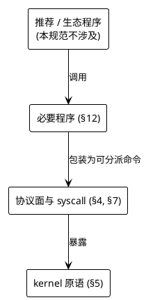
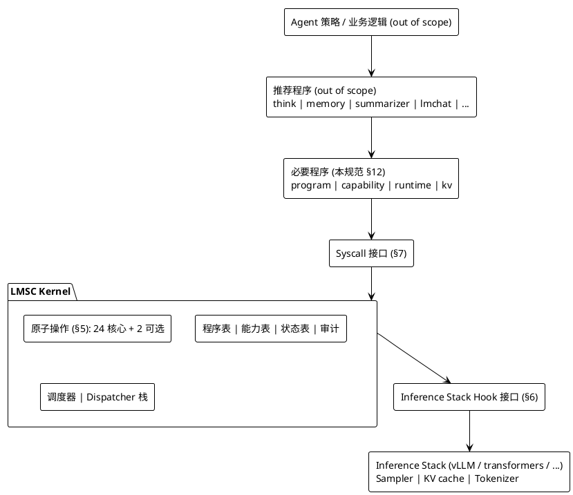
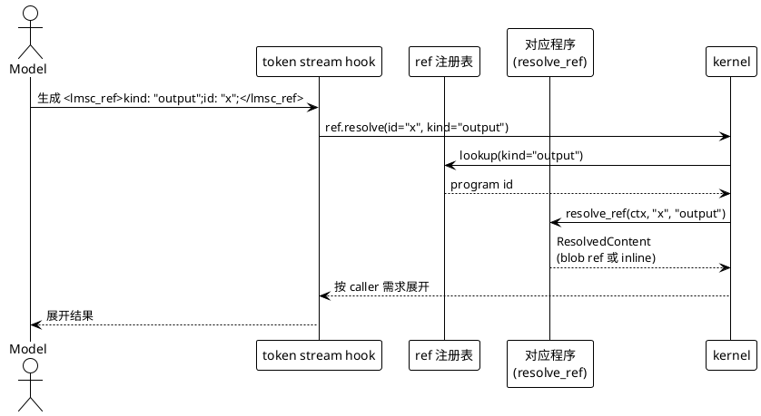
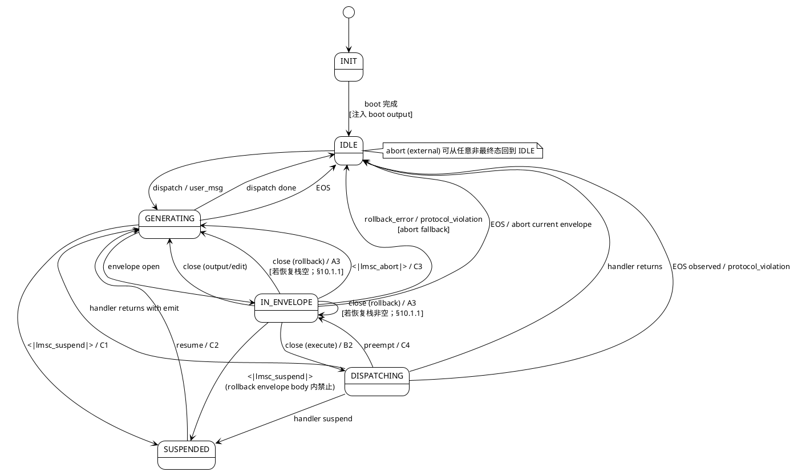
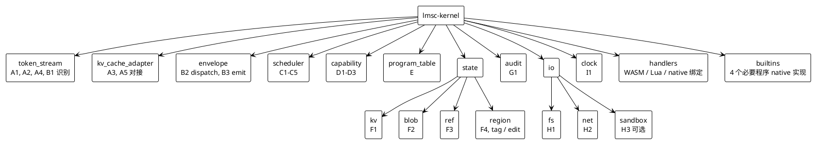

> LMSC Kernel Specification draft v1
> LMSC = Large Model Specialized Computer.
> Protocol revision: `draft v1`.
>
> 本分册为 LMSC 内核开发规范 draft v1 草案的一章；正文呈现当前草案结论及必要说明。

# 0. 引论与范围

## 0.1 LMSC 是什么

LMSC 是给大语言模型（LLM）的**内核**。它的职责是：

1. **塑造 token 流**——约束模型自回归过程（logit 掩码、回退、注入、快照）；
2. **承载程序**——为程序提供加载、分派、授权、状态、审计基础设施；
3. **对接推理栈**——以三个 hook 点与底层推理引擎协作。

LMSC **不是**：Agent、聊天机器人、工具箱、脚手架。它只是**机制**（mechanism），不是**策略**（policy）。

## 0.2 分层硬规则

合规实现在任何情况下**必须** 保持以下层次：



**规范条款**禁止**跨层引用**。必要程序的能力**禁止**依赖任何非必要程序的存在。

## 0.3 规范包含什么

- 会话协议的特殊 token 集合、envelope 语法、属性语义；
- 原子操作的签名、前置条件、后置条件、错误；
- 推理栈的 3 个 hook 点契约；
- 系统调用表（不含具体语言绑定）；
- 程序清单（manifest）格式与 handler 生命周期；
- 4 个必要程序的最小指令集；
- kernel **必须**强制执行的安全不变量；
- 审计日志的记录结构；
- 错误码命名空间与语义。

## 0.4 规范不包含什么

- 推荐程序（`think` / `memory` / `summarizer` / `lmchat` / ...）的实现；
- 具体推理引擎（vLLM / transformers / llama.cpp）的绑定方式；
- 具体编程语言的 handler ABI；
- LoRA 训练数据格式；
- 前端 UI、Agent 策略、业务逻辑。

---

> LMSC Kernel Specification draft v1
> LMSC = Large Model Specialized Computer.
> Protocol revision: `draft v1`.
>
> 本分册为 LMSC 内核开发规范 draft v1 草案的一章；正文呈现当前草案结论及必要说明。

# 1. 术语

| 术语 | 定义 |
|---|---|
| **kernel** | 实现本规范的运行时核心 |
| **inference stack** | LLM 前向计算引擎（sampler、KV cache、tokenizer 的宿主） |
| **session** | 一次从 kernel boot 到终止的连续上下文，拥有独立 context、kv、blob 命名空间 |
| **context** | 当前会话的完整 token 序列（含已被 fold / drop 的区间标记） |
| **turn** | IDLE 离开到下一次 IDLE 之间的区间，原子性操作与 per-turn 配额的统计单位 |
| **envelope** | 由配对特殊 token 界定的结构化片段，**四种**：`<lmsc_execute>` · `<lmsc_output>` · `<lmsc_edit>` · `<lmsc_rollback>`（模式串回退）|
| **StreamFrame** | `envelope.emit` chunk 观察下的进度元数据：`{ chunk_index, total_chunks_hint?, stream_closed }`，定义见 §8.2 |
| **EnvelopeChunk** | `on_envelope_chunk` 的规范化负载，包含 envelope kind / id / from / visibility / source path / frame / 最终 token chunk |
| **ChunkDecision** | `on_envelope_chunk` 的返回决策：`Continue`、`DetachObserver` 或 `AbortEnvelope` |
| **backpressure** | `envelope.emit` Stream 路径下下游消费速率低于生产速率时的会话内等待语义；超 `STREAM_WRITE_TIMEOUT` 触发 `E_EMIT_STREAM_BACKPRESSURE_TIMEOUT`|
| **buffered / native** | L2 下 `envelope_emit_stream` 的两种模式：native 为 pull-based 原生消费；buffered 为全量缓冲后一次性注入的 L2 降级语义（§6.5.2）|
| **control token** | 管道式单 token，无配对，表示即时指令 |
| **special token** | kernel 保留 id 的总称 |
| **program** | 在 kernel 上注册、响应 dispatch 的用户态模块 |
| **handler** | 程序的可执行部分，实现 `dispatch` 等生命周期回调 |
| **manifest** | 程序的声明式元数据 |
| **action** | 程序向 kernel 声明的可执行动作（封闭集 7 条，见 §8.3） |
| **capability** | 细粒度权限字符串 |
| **atomic primitive** | kernel 提供的最小不可分解能力，共 24 条核心 + 2 条**可选**（2 条**可选** = `A2` + `H3`） |
| **syscall** | 程序访问原子操作的函数入口 |
| **dispatcher frame** | 派发器栈的一层，每层有独立的程序查找表与文法约束 |
| **region** | 被打标的 token 区间，可整体 edit（替换或删除） |
| **ref** | `<lmsc_ref>kind: "...";id: "...";</lmsc_ref>` 泛型引用元素 |
| **blob** | 按内容寻址的不可变字节串 |
| **boot output** | 会话开始时 kernel 注入的首个 `from="system"` output envelope |
| **fork** | 对整个会话状态（context + KV + 元数据）的写时复制分支 |

---

> LMSC Kernel Specification draft v1
> LMSC = Large Model Specialized Computer.
> Protocol revision: `draft v1`.
>
> 本分册为 LMSC 内核开发规范 draft v1 草案的一章；正文呈现当前草案结论及必要说明。

# 2. 规范用语

本文使用 [RFC 2119] 与 [RFC 8174] 的关键词：

- **必须** / **必须**：绝对要求；
- **禁止** / **禁止**：绝对**禁止**；
- **应** / **应**：强烈**建议**；
- **可** / **可**：**可选**行为。

"kernel **必须**…" 的主语指合规实现。"程序**必须**…" 的主语指部署在合规 kernel 上的程序。

---

> LMSC Kernel Specification draft v1
> LMSC = Large Model Specialized Computer.
> Protocol revision: `draft v1`.
>
> 本分册为 LMSC 内核开发规范 draft v1 草案的一章；正文呈现当前草案结论及必要说明。

# 3. 体系结构

## 3.1 分层



## 3.2 数据流

采样前的 logits **必须**先经过 kernel 的 sampler hook，kernel 在此施加 logit mask、dispatcher frame 约束与其他采样前限制。采样后的 token 在 append-to-context 之前**必须**经过 token stream hook，kernel 在此识别 envelope、control token、ref 与 rollback 事件。KV cache 操作由 kernel 通过 KV hook 或 rollback truncate adapter 直接驱动推理栈，不经模型可观测路径。

上述 hook 的强制程度按 §6.5 接入级别矩阵判定：L0 提供 Sampler / Token Stream / KV Cache 三个 hook；L1 提供 Sampler 与 Token Stream，并通过 rollback truncate adapter 完成 A3 所需截断；L2 仅要求 Token Stream 后处理识别，并按 §6.5.1 的事后检测规则降级。

程序之间不直接通信。跨程序协作通过以下之一：
- Envelope（程序 A 的 output 被 dispatch 到程序 B）；
- kv / blob 共享命名空间（显式 capability）；
- ref 解析链（程序 B 注册的 resolver 被 kernel 在展开 ref 时调用）。

## 3.3 基本原则

**P-1 · 最小核** · Kernel **禁止** 实现任何可由原子操作在用户态组合构造的能力。

**P-2 · 机制而非策略** · Kernel **禁止** 把特权策略硬编码——所有策略都走 capability 授权机制。

> **P-2 边界说明** · P-2 约束的是 agent 规划、工具选择、业务审批等业务策略，不否定内核自身的安全基线。§11.4 的 fixed-only capability、§12 的必要程序、boot/runtime schema 中的不可替代字段，属于 capability 机制与启动安全边界本身；它们不是 P-2 所**禁止**的特权策略硬编码。

**P-3 · 唯一路径** · 程序**禁止** 绕过 syscall 访问推理栈 / KV cache / tokenizer 保留 id 表。

**P-4 · Token 集冻结** · 特殊 token 集合在 kernel build 时冻结，运行时**禁止** 增删。

**P-5 · 不跨层** · 规范条款与必要程序的行为**禁止** 依赖推荐或生态程序的存在。

---

> LMSC Kernel Specification draft v1
> LMSC = Large Model Specialized Computer.
> Protocol revision: `draft v1`.
>
> 本分册为 LMSC 内核开发规范 draft v1 草案的一章；正文呈现当前草案结论及必要说明。

# 4. 协议面：特殊 token 与文法

## 4.1 特殊 token 清单（规范性）

合规 kernel **必须** 为以下 token 保留独立 id。tokenizer **必须** 与 kernel 一致识别它们。

### 4.1.1 Envelope 配对 token（8 个）

| Open | Close | 备注 |
|---|---|---|
| `<lmsc_execute>` | `</lmsc_execute>` | 程序派发 |
| `<lmsc_output>` | `</lmsc_output>` | 结果 / 输入 |
| `<lmsc_edit>` | `</lmsc_edit>` | 上下文编辑 |
| `<lmsc_rollback>` | `</lmsc_rollback>` | 模式串回退（见 §4.1.2a） |

### 4.1.2 Control 单 token（2 个）

| Token | 语义 | 原语 |
|---|---|---|
| `<\|lmsc_abort\|>` | 终止当前 envelope | C3 |
| `<\|lmsc_suspend\|>` | 模型主动挂起；模型路径默认等价 `suspend(External)` | C1 |

### 4.1.2a Rollback envelope 语义（规范性）

> **Pattern 约束的单一正源**· 本小节是 rollback pattern body 全部语法、语义、长度、保留字面、storm-limit 等约束的**规范正源**。§4.3 EBNF、§4.4 不变量、§5.2 A3、§13.3 等处**仅作引用**，**禁止**引入与本小节冲突的附加约束；如发现冲突以本小节为准。

模型生成 `<lmsc_rollback>X</lmsc_rollback>` 表示：把"此 envelope 之前、rollback 边界（§4.4 `I-ROLLBACK-BOUND`）之内"**最近一次**出现 `X` 的位置之前的内容保留，其余（含此 envelope 自身）丢弃。

kernel 在看到 `</lmsc_rollback>` close token 时执行（令 `P` 为 pattern body 的 detokenized 字节）：

1. 计算 `candidate_context`：从当前 turn 可回退的候选下界到 `<lmsc_rollback>` open 之前的 detokenized 字节流；该候选上下文可包含因结构边界、pin 区域、用户输入区间或 `ROLLBACK_SEARCH_MAX_BYTES` 而不可回退的字节。
2. 计算 `allowed_window`：`candidate_context` 中同时满足 `scope`、`I-ROLLBACK-BOUND`、pin/input 硬边界、`ROLLBACK_SEARCH_MAX_BYTES` 的闭区间；`effective_bound` **必须**记录采用的最近边界。
3. `j := last_index_of(candidate_context, P)`；
4. 若 `j = NOT_FOUND`：KV 不变；emit audit `kind=rollback`，details 含 `outcome=pattern_not_found`；`token_rollback` syscall 返 `E_ROLLBACK_PATTERN_NOT_FOUND`；模型路径仅 emit audit，不向任何调用方返错。
5. 若 `j` 存在但匹配区间 `[j, j+len(P))` 未完整落在 `allowed_window` 内：KV 不变；emit audit `kind=rollback`，details 含 `outcome=pattern_out_of_bound` 与 `effective_bound`；`token_rollback` syscall 返 `E_ROLLBACK_PATTERN_NOT_FOUND`；模型路径仅 emit audit，不向任何调用方返错。
6. 否则：把 KV cache 截断到"字节 `j` 所在 token 的前一个 token"——即丢弃含匹配首字节的 token 及其之后的一切（含 rollback envelope 自身）；emit audit `kind=rollback`（details 含 `outcome=truncated` / `pattern_bytes_len` / `truncated_tokens` / `effective_bound`）。

> **截断粒度说明**· “截断到含匹配首字节 token 的**前一个** token”意味着含首字节的 token **整个被丢弃**——这是刻意设计：字节级 `last_index_of` 的命中位置不依赖 tokenizer，因而匹配结果跨 tokenizer 可预测；但“含匹配首字节 token”这一截断边界以及 §10.1.1 的状态恢复依赖 tokenizer 切分。跨实现恢复一致性仅在 §16.1 C-14 的“同一 tokenizer 与同一 kernel build”前提下成立。示例：若 `Wait,` 的 `W` 与前一个字符共同组成一个 token，截断后连带这个 token 的剩余字节都一起丢失；训练样本确立这个行为。

**约束**：

- rollback envelope **body 内**禁止**出现任何保留 token**（任何 envelope open/close、`<|lmsc_abort|>` / `<|lmsc_suspend|>`、`<lmsc_ref>` / `</lmsc_ref>`、key token）；违反触发 `I-ROLLBACK-NO-NEST`；
- body **必须非空**；空 body → `E_ROLLBACK_PATTERN_EMPTY`；
- body 的 detokenized 字节长度**必须** ≤ `ROLLBACK_PATTERN_MAX_BYTES`（默认 **512**，见附录 F）；超过 → `E_ROLLBACK_PATTERN_TOO_LONG`；
- 匹配搜索**禁止**跨越 `I-ROLLBACK-BOUND`；搜索遇到边界即停；
- `ROLLBACK_STORM_LIMIT`（默认 16 次 / turn）仍然生效；
- **`ROLLBACK_PATTERN_MAX_BYTES` 上限强制** 按级别分：
 - **L0 / L1**：kernel **必须**用 logit mask 保证 rollback envelope 自 open 起在 `ROLLBACK_PATTERN_MAX_BYTES` 字节内产生 close；达上限强制发 close 或 `<|lmsc_abort|>`；
 - **L2**：无 sampler hook，kernel **必须**在 token stream hook 中对 rollback envelope body 维护字节计数器自 open 起累计；达 `ROLLBACK_PATTERN_MAX_BYTES` 立即走 C3 abort 路径并 emit audit `kind=protocol_violation`（invariant=`I-ROLLBACK-BOUND`）；L2 **禁止**以静默截断或 best-effort 方式处理。

模型触发 rollback envelope 与程序调 `token_rollback(pattern, scope)`（§5.2 A3）**语义等价**，共享上述约束。

**模型路径的 `scope` 按以下规则推定**：

- 若当前处于 `IN_ENVELOPE` 状态 → `scope = Envelope`；
- 若当前处于 `GENERATING` 状态（无 open envelope）→ `scope = Turn`。

推定结果写入 §14.2 audit 的 `scope` 字段。

**示例（byte-level 匹配、tokenizer-independent）**：

- ASCII：`<lmsc_rollback>Wait,</lmsc_rollback>` 从最近一次出现 `Wait,` 处截断；
- 中文：`<lmsc_rollback>结论：</lmsc_rollback>` 按 UTF-8 字节序列匹配 `结论：`；
- 含换行：`<lmsc_rollback>结论：\n</lmsc_rollback>` 中 `\n` 为字面 LF 字节；
- 跨 token 边界：匹配单位是**字节**而非 token；tokenizer 如何切分 pattern / 上下文**不**影响命中结果。

### 4.1.3 Ref 元素配对 token（2 个）

| Open | Close | 形式 |
|---|---|---|
| `<lmsc_ref>` | `</lmsc_ref>` | body 固定采用 `kind: "summary";id: "x";` 微文法（见 §4.3） |

> **注意**· `lmsc_ref` 不是「start-prefix 型」保留 token；它与 execute / output / edit / rollback 一样，是一对完整的 open/close 保留 token。ref body 的解析以 `<lmsc_ref>` 与 `</lmsc_ref>` 之间的 detokenized 字节序列为准，与普通 tokenizer 如何切分其中的字节无关。

`<lmsc_ref>...</lmsc_ref>` **不是** envelope——它没有 dispatch 语义、不进 dispatcher frame 栈、close token `</lmsc_ref>` 不触发任何 dispatch；仅触发 F3 `ref.resolve` 将解析结果内联替换。`RefOpen` / `RefClose` 事件（§6.3）为 token stream hook 可观测钩子，与 `EnvelopeOpen/Close` 的 dispatch 语义不同。其 body **必须** 精确符合 ref 微文法（见 §4.3 / `I-REF-CHARSET`）。

### 4.1.4 Key token 家族（**可选**，发行版决定 K）

形式 `<|key_<name>|>`。典型：`key_tab`、`key_enter`、`key_esc` 等。具体集合由 kernel build 决定，`runtime info` **必须** 暴露启用列表。

> **Key token 语义限定**· key token 的语义由发行版自定义；本规范 **不**规定其状态机分支、**不**规定 handler 回调。token stream hook 将其作为 `Chunk` 事件处理（**不** 触发任何 B2 / C 类、 ref 路径）；其中所涉字面完全透传。

### 4.1.5 总计

合规 kernel 的保留 token 数 = 8 + 2 + 2 + K = **12 + K**。`runtime info` **必须** 返回准确计数。本规范将保留 token 列举如下以供 tokenizer 注册表生成：

- envelope open/close 4 对共 **8 个**：`<lmsc_execute>` / `</lmsc_execute>`、`<lmsc_output>` / `</lmsc_output>`、`<lmsc_edit>` / `</lmsc_edit>`、`<lmsc_rollback>` / `</lmsc_rollback>`；
- control 单 token 2 个：`<|lmsc_abort|>`、`<|lmsc_suspend|>`；
- ref 配对 token 2 个：`<lmsc_ref>`、`</lmsc_ref>`（见 §4.1.3）；
- key token：K 个（工程保留，见 §4.1.4）。

## 4.2 Envelope 属性

Envelope open token 是 §4.1 注册表中的完整保留 token（例如 `<lmsc_output>`），**禁止**把属性拼入 open token 字面内部。非 rollback envelope 的属性由 kernel 维护为 metadata，并在需要写入 context 时以 **kernel-injected attribute header** 的形式紧跟在 open token 之后。属性头使用普通 tokenizer 字节，**禁止**包含任何保留 token。

属性头的规范形式为：

```text
@lmsc-attrs id="..." from="..." visibility="..."\n\n
```

其中首个属性前**必须**有空白分隔符，属性头以一个空行结束；空行之后才是 envelope body。属性头只在 kernel 已将该字节区间标记为 `kernel-owned attr_header` 时才被解析为属性。模型或程序在普通 body 中生成相同字面时，只按 body 字节处理，**禁止**被提升为属性。

kernel 在以下时机生成或补全属性头：

- 模型生成非 rollback envelope open token 后，kernel 在进入 body 采样前注入缺省属性头（如 `id` 与默认 `from="model"`）；
- `envelope.emit`、boot output、persona-refresh 等 kernel / 程序路径写入 envelope 时，由 kernel 根据传入 attrs 或内部 metadata 生成属性头；
- 若实现接受 open-tag 形式的属性输入，**必须**先规范化为本属性头；规范正文、schema 与测试均以本属性头为正源。

> **注意** · `<lmsc_rollback>` envelope **不携带任何属性**；其 body 直接承载 pattern 序列（见 §4.1.2a / §4.3 EBNF）。下表 `适用 envelope` 列中的 "all" 及其他取值 **均不包含** rollback envelope。

kernel **必须** 识别以下核心属性（未列出的属性透传给程序）：

| 属性 | 适用 envelope | 取值 | 语义 |
|---|---|---|---|
| `id` | all | string | 唯一标识（kernel 自动补全缺省） |
| `from` | execute / output / edit | `user` / `system` / `program:<name>` / `model` | 来源 |
| `visibility` | output / edit | `all` (默认) / `model-only` / `user-only` | 可见性 |
| `attention` | output | `free` (默认) / `keep-summary` / `pin` | 保留策略 |
| `confidence` | output / edit | `0.0`-`1.0` | 置信度 |
| `schema` | output | string | 渲染 schema 名 |
| `gen` | output | 自由字符串（由程序自定义） | 代次标记；kernel **不解释**，仅透传 |
| `status` | output | string | 错误码或 `ok`；`ok` + 空 body 构成短路 "ack" |
| `ref` | output | 同 `id` 形式 | 该 output 被作为 ref 来源时的 id |

未知属性 kernel **必须** 保留透传，**禁止**删除。

> **说明** · `gen` 属性采用**自由字符串**；kernel 不做枚举检查，也不触发任何状态机。代次含义由程序自行约定，这符合 P-5。
>
> **明确** · `gen` 的**作用域是 per-program**：kernel **禁止**跨程序比较 `gen` 字符串。同一 `gen` 字形在程序 A 与程序 B 不要求有相同语义。若推荐程序需互操作，应由单独的推荐程序文档给出生态级词汇表（非规范级约束）。对应：`region.tag.attrs.gen` 也是 per-program（归属 owner 程序的名字空间）。

## 4.3 文法（EBNF）

```ebnf
stream = { chunk | envelope | control | ref_element } ;
chunk = { ordinary_token } ;
envelope = execute_env | output_env | edit_env | rollback_env ;

(* envelope open token 为完整保留 token；属性由 kernel 注入的属性头承载 *)
execute_env = "<lmsc_execute>" , attr_header? , body , "</lmsc_execute>" ;
output_env = "<lmsc_output>" , attr_header? , body , "</lmsc_output>" ;
edit_env = "<lmsc_edit>" , attr_header? , body , "</lmsc_edit>" ;
rollback_env = "<lmsc_rollback>" , pattern_body , "</lmsc_rollback>" ;
attr_header = "@lmsc-attrs" , attrs , line_end , line_end ;
attrs = ws , attr , { ws , attr } ;
attr = ident , "=" , str_literal ;

(* 词法原子定义 *)
ordinary_token = ? 词表内的非保留 token — 按 kernel tokenizer 的输出 ? ;
ident = letter , { letter | digit | "_" | "-" } ;
str_literal = '"' , { str_char } , '"' ;
 (* 双引号包围；禁横跨换行；支持 \" 与 \\ 两种转义） *)
str_char = ( ? 任意 Unicode 字符，除 '"' 、 '\' 、 LF 、 CR 、 Tab（0x09） ? )
 | "\\\"" | "\\\\" ; (* Tab 被排除，以避免属性值词法边界模糊 *)
ws = { " " | "\t" } ; (* 属性头在行内，不跟换行；首属性前必须有 ws *)
line_end = "\n" | "\r\n" ;
letter = "A" .. "Z" | "a" .. "z" ;
digit = "0" .. "9" ;

body = { chunk | ref_element | control | rollback_env } ;
pattern_body = ordinary_token , { ordinary_token } ;
 (* 非空；其 detokenized 字节序列 ≤ ROLLBACK_PATTERN_MAX_BYTES；
 且字节序列 **禁止构成** 任何保留 token 的字面形式
（envelope open/close、<|lmsc_abort|> / <|lmsc_suspend|>、<lmsc_ref> / </lmsc_ref>、key 字面）。
 判定 **在字节级** 执行；即对 pattern_body 的 detokenized
 UTF-8 / 二进制字节序列做子串查找，不依赖 tokenizer 如何切分。
 违反由 I-ROLLBACK-NO-NEST 事后检测（L0/L1 由 logit mask 强制）。 *)

ref_element = "<lmsc_ref>" , ref_body , "</lmsc_ref>" ;
ref_body = 'k','i','n','d',':',' ','"' , ref_value , '"',';'
 , 'i','d',':',' ','"' , ref_value , '"',';' ;
ref_value = ref_char , { ref_char } ;
ref_char = 'A'..'Z' | 'a'..'z' | '0'..'9'
 | '_' | '.' | ':' | '/' | '-' ; (* 值限 ASCII 安全集 *)

control = "<|lmsc_abort|>"
 | "<|lmsc_suspend|>"
 | key_token ;

key_token = "<|key_" , ident , "|>" ;
```

> **明定** · `<lmsc_ref>...</lmsc_ref>` 的 body **必须** 精确符合：
>
> `kind: "{kind}";id: "{id}";`
>
> 其中（`{kind}` / `{id}` 为占位符，代表实际值字符串）：
>
> 1. 字段名仅限 `kind` 与 `id`；
> 2. 顺序固定为 `kind` 在前、`id` 在后；
> 3. 两个值的字符集均限于 ASCII `[A-Za-z0-9_.:/-]`；
> 4. **禁止**附加字段、**禁止**非 ASCII 字符、**禁止**偏离该微文法的空白变体；
> 5. `kind` 与 `id` 的值均**禁止**为空字符串；`kind: "";` 形式违反 EBNF（`ref_value` 至少 1 字符），同视为微文法违规。
>
> 违反该微文法或字符集约束的 ref element，kernel **必须**拒绝并 emit audit `kind=protocol_violation`（invariant=`I-REF-CHARSET`），返回 `E_REF_BODY_INVALID`。
>
> `<lmsc_execute>` / `<lmsc_output>` / `<lmsc_edit>` 的 attribute header **不受**此限制——它们不在流式 ref 解析的快路径上，由 kernel-owned 属性头解析处理。
>
> **字符禁用显式声明** · 上述 `ref_char` 字符集已隐含排除双引号 `"` 与分号 `;`——两者是 ref body 分隔符本身。此处显式重申：`kind` / `id` 的值**禁止**含 `"` 与 `;`。若外部系统 ID 含非白名单字符（中文、空格、Unicode 标点、引号、分号等），程序**必须**在 `ref.bind` 阶段自行做映射/哈希处理（例如取 SHA-256 前缀或 URL-safe base64），kernel **不**提供转义机制；kernel 对违规 ref body 一律返 `E_REF_BODY_INVALID`。

## 4.4 文法不变量（规范性）

合规 kernel **必须** 强制以下文法不变量。强制方式按级别与不变量类型分：

- **A1 logit mask 强制**（L0 / L1，sampler hook 层面）：`I-ENV-PAIR`、`I-ENV-NO-SELF-NEST`、`I-CTRL-INSIDE-ENV`、`I-ROLLBACK-BOUND`、`I-ROLLBACK-NO-NEST`、`I-ABORT-SCOPED`、`I-ATTR-CLEAN`、`I-ROLLBACK-NO-ATTR`；以及条件不变量 `I-STRICT-ENVELOPE-ONLY`（仅当 `features.strict_protocol_mode=true` 且 `features.raw_text_outside_envelope="forbidden"` 时纳入 A1 强制集，详见本节末尾及 §10.1.2）；
- **Syscall 入口强制**（所有级别）：`I-EMIT-ESCAPE`（于 `envelope.emit`、`net` → envelope body 转写、`region.edit` 与 `ref.resolve` 失败可见化路径检查）；
- **事后识别 + abort**（所有级别，且 L2 下上述 A1 组亦降级为此模式，见 §6.5.1）：`I-REF-CHARSET`。`I-REF-ANY` 为允许性不变量，本身无违反形式；其合法性通过 `I-CTRL-INSIDE-ENV` 的 ref element 例外与 `I-REF-CHARSET` 的 body 检查共同保证。

各条列项如下：

- **I-ENV-PAIR** · 每个 envelope open 必有对应 close；close 出现前**禁止**关闭会话。
- **I-ENV-NO-SELF-NEST** · 同类 envelope **禁止**直接嵌套（`<lmsc_execute>` 内**禁止**嵌套 `<lmsc_execute>`）。
- **I-CTRL-INSIDE-ENV** · 在非 rollback envelope 内，允许出现的保留 token 仅：`<|lmsc_abort|>`、`<|lmsc_suspend|>`、完整的 `<lmsc_ref>...</lmsc_ref>` ref element，以及 **嵌套的 `<lmsc_rollback>` open**（模型在 execute/output/edit body 内发起悔棋）；其他 envelope open token 被 mask **禁止**。`<lmsc_ref>` open / body / close **不**进入 envelope 栈、**不**触发 B2 dispatch，其合法性由 `I-REF-ANY` 与 `I-REF-CHARSET` 独立约束；L0 / L1 的 logit mask **必须**在非 rollback envelope body 中放行 `<lmsc_ref>` open 与合法 ref body 续写，而不得把它误判为被禁止的 envelope open。在 **rollback envelope body 内**，**禁止**出现任何保留 token（受 `I-ROLLBACK-NO-NEST` 约束；特别地，`<|lmsc_suspend|>` 与 `<lmsc_ref>` 在 rollback envelope body 内均被禁，避免快照中携带部分 pattern 或触发 ref 解析）。

 > **关于"嵌套"用语的消歧**· 本条所称"嵌套的 `<lmsc_rollback>` open"指在 execute / output / edit envelope body 内**开启**一次新的 rollback envelope——这是允许的（rollback envelope 随后自行 close，不会真正形成长期嵌套栈）。`I-ROLLBACK-NO-NEST` 所**禁止**的是 rollback envelope **自身 body 内**出现任何保留 token（含另一 rollback open）。两处"嵌套"含义不同，**禁止**混用。
- **I-REF-ANY** · `<lmsc_ref>...</lmsc_ref>` **可** 出现在任何 envelope body 中，也可出现在普通 chunk 中。
- **I-ROLLBACK-BOUND** · `<lmsc_rollback>` 的匹配搜索**禁止** 跨越已关闭 envelope 的边界、boot output 的边界、或已声明 `rollback_safe: false` 的 dispatch 的边界。
- **I-ROLLBACK-NO-NEST**· `<lmsc_rollback>` 的 body 内**禁止** 出现任何保留 token（任何 envelope open/close、`<|lmsc_abort|>` / `<|lmsc_suspend|>`、`<lmsc_ref>` / `</lmsc_ref>`、key token）。kernel **必须** 通过 logit mask 强制；事后路径识别到违反**必须** emit `kind=protocol_violation` 并返 `E_ROLLBACK_PATTERN_INVALID`。

- **I-ROLLBACK-NO-ATTR**· `<lmsc_rollback>` **禁止**携带任何属性头或属性 metadata；L0 / L1 以 logit mask 强制，L2 下由 §6.5.1 的同名事后检测项处理。触发 violation 时返 `E_ROLLBACK_PATTERN_INVALID` 并 emit `protocol_violation` audit。

 > **L0 / L1 的 lookahead 算法要求**· kernel **必须**对所有保留 token 的**字面字节序列**构建字节级 Aho-Corasick 或等价 trie，用于 logit mask 的 multi-pattern lookahead：候选 token 被追加后，当前 rollback body 已累积字节序列的**任一后缀**若构成任一保留 token 字面的非空前缀，kernel **必须** `hard_deny` 该候选 token。本要求涵盖 envelope open/close 四对、`<|lmsc_abort|>` / `<|lmsc_suspend|>`、`<lmsc_ref>` / `</lmsc_ref>`、全部 `<|key_*|>` 字面的全集。L2 不适用该 lookahead；改由 §6.5.1 第 5 条事后核查承担。
- **I-ABORT-SCOPED** · `<|lmsc_abort|>` **仅** 在 envelope 内有效。envelope 外出现时 kernel **必须** 丢弃（优先通过 logit mask 屏蔽）。
- **I-ATTR-CLEAN** · kernel-owned attribute header 以空行结束为边界；属性头内**禁止**出现任何特殊 token 字面，且 header 前缀、首属性前分隔符、行尾和空行**必须**符合 §4.3。
- **I-EMIT-ESCAPE** · `envelope.emit` 的 bytes body、`net` 响应转 envelope body、`region.edit` 的 `replacement` bytes 注入、以及 `ref.resolve` 失败可见化文本注入时，kernel **必须** 对保留 token 字面字符做转义（§13.2）。
- **I-REF-CHARSET**· `<lmsc_ref>...</lmsc_ref>` 的 body **必须** 精确符合 `kind: "{kind}";id: "{id}";` 微文法（`{kind}` / `{id}` 为占位符）；两个值的字符集限于 ASCII `[A-Za-z0-9_.:/-]`，且**禁止**为空字符串；违反**必须**拒绝并 emit `kind=protocol_violation`，返 `E_REF_BODY_INVALID`。
- **I-STRICT-ENVELOPE-ONLY**（**条件不变量**，仅当 `features.strict_protocol_mode=true` 且 `features.raw_text_outside_envelope="forbidden"` 时启用）· 在 `GENERATING` 状态且 envelope 栈深 = 0 时，模型采样的下一 token **必须**属于「合法 LMSC 协议入口」集合：`<lmsc_execute>` / `<lmsc_output>` / `<lmsc_edit>` / `<lmsc_rollback>` / `<|lmsc_suspend|>` / `<lmsc_ref>` open / EOS 之一；任一非入口的普通 token 视为违反。`<lmsc_ref>` open 之所以纳入入口集，是为与 `I-REF-ANY`（ref **可**出现在任何 envelope body 与普通 chunk 中）保持一致；ref envelope 关闭后栈深仍为 0，紧随其后的下一 token 仍受本约束。L0 / L1 **必须**通过 sampler hook logit mask 在采样前强制；L2 由 token stream hook 事后识别后走 `kind=protocol_violation`（invariant=`I-STRICT-ENVELOPE-ONLY`）路径，与 §6.5.1 第 10 条同等处理，返 `E_PROTOCOL_VIOLATION`。当 `raw_text_outside_envelope="audit-only"` 时，本不变量**不**强制，但 kernel **必须** emit audit `kind=raw_text_outside_envelope`（不构成 violation）。当 `raw_text_outside_envelope="allowed"` 或 `strict_protocol_mode=false` 时，本不变量**不**生效，与现有兼容行为一致。

## 4.5 Role 语义

**`execute` / `output` / `edit` 三种 envelope** 的"**由谁发起**"完全由属性头中的 `from` 属性决定（§4.2）。kernel **禁止** 根据 envelope 种类硬编码 role——`<lmsc_execute>` 默认 `from="model"`，但程序代写带 `from="program:flow"` 的 kernel-owned 属性头是合法的。

**`rollback` envelope 例外**：`<lmsc_rollback>` **不携带任何属性**（§4.2），也不走 `from` 机制；它的 role 由生成路径隐式决定——模型自回归生成时等价 `from="model"`，程序显式调用 A3 `token_rollback` 时 audit 记录 `source=program:<name>`。**模型路径"等价 `from=\"model\"`"仅在语义归因上视为模型发起，不存在实际 `from` 属性**；任何解析 rollback envelope 的代码**禁止**尝试读取或推断其 `from` 字段——该字段不存在且在结构上被**禁止**。rollback 相关 audit **禁止**使用 `envelope_from` 字段；来源归因使用 §14.2 的 `rollback_origin` 或 `AuditRecord.source`。

---

> LMSC Kernel Specification draft v1
> LMSC = Large Model Specialized Computer.
> Protocol revision: `draft v1`.
>
> 本分册为 LMSC 内核开发规范 draft v1 草案的一章；正文呈现当前草案结论及必要说明。

# 5. 原子操作

本节定义 kernel 的最小能力集。每条原子操作给出：签名、前置、后置、错误、备注。

## 5.1 分类与计数

| 类 | 编号 | 核心 | **可选** |
|---|---|---|---|
| A · Token 流 | A1–A5 | 4 | A2 |
| B · Envelope 结构 | B1–B3 | 3 | — |
| C · 调度 | C1–C5 | 5 | — |
| D · 授权 | D1–D3 | 3 | — |
| E · 程序表 | E | 1 | — |
| F · 状态 | F1–F4 | 4 | — |
| G · 审计 | G1 | 1 | — |
| H · I/O | H1–H3 | 2 | H3 |
| I · 时间 | I1 | 1 | — |
| **合计** | | **24** | **2** |

核心原语 **24 条**必须实现；**可选** **A2、H3** 两条按 §6.5 接入级别决定。

## 5.2 A · Token 流

### A1 · `logit_mask`

```
logit_mask(mask: Mask) -> ()
Mask := { hard_allow: Set<TokenId>?, hard_deny: Set<TokenId>?, bias: Map<TokenId, f32> }
```

- **前置**：调用者持 `tokens.mask.direct` cap（fixed-only；默认仅 kernel 内部与推理栈适配层）。
- **后置**：下一次 sampling 前施加到 logits。
- **错误**：`E_MASK_INVALID`。
- **备注**：hard_deny 优先于 bias；hard_allow 非空时其余 token 禁。

### A2 · `query_special`（**可选**）

```
is_special(id) -> bool
name_of(id) -> Option<string>
id_of(name) -> Option<TokenId>
```

- **前置**：无。
- **后置**：只读；返回映射在会话周期内不变。
- **备注**：等价信息已在 boot output 返回；本原语是便利 API。合规 L2 实现可不提供，程序应在 `on_load` 缓存 boot output 的 tokens 清单。

### A3 · `token_rollback`

```
token_rollback(pattern: Bytes, scope: Scope) -> Result<()>
Scope := Envelope | Turn
```

- **前置**：
 - 未违反 `I-ROLLBACK-BOUND`；
 - `pattern` 非空且 `len(pattern) ≤ ROLLBACK_PATTERN_MAX_BYTES`（默认 512）；
 - `pattern` **禁止** 包含任一保留 token 的字面字节序列（等价于 `I-ROLLBACK-NO-NEST`）；
 - 当前 turn 内 rollback 次数 < `ROLLBACK_STORM_LIMIT`（默认 16）；
 - 调用者持 `tokens.rollback.explicit`（默认不授予；模型发 `<lmsc_rollback>` envelope 走 kernel 内部等价路径，不走此 cap）。
- **后置**：
 - 在 scope 允许的字节窗内反向查找 `pattern` 最近一次出现；
 - 命中：把 KV cache 截断到"含匹配首字节的 token 的前一个 token"（含 rollback envelope 自身一并丢弃）；
 - 未命中（`pattern_not_found`）或命中区间有任意字节越界（`pattern_out_of_bound`）：不改变 KV；
 - emit audit `kind=rollback`，details 含 `outcome ∈ {truncated, pattern_not_found, pattern_out_of_bound}` / `scope` / `pattern_bytes_len` / `truncated_tokens`（`outcome=truncated` 时）。其中 `pattern_out_of_bound` 区分「整段上下文中 pattern 不存在」与「匹配区间有任意字节落在边界外」。
 - `ROLLBACK_STORM_LIMIT` 计数按 §13.3 口径执行：单 turn 内**成功**（`outcome=truncated`）与**失败**（`pattern_not_found` / `pattern_out_of_bound`）均计入同一计数器，不做区分。
- **错误**：`E_ROLLBACK_STORM` / `E_ROLLBACK_PATTERN_EMPTY`/ `E_ROLLBACK_PATTERN_NOT_FOUND`/ `E_ROLLBACK_PATTERN_TOO_LONG`/ `E_ROLLBACK_PATTERN_INVALID`。

模型触发 `<lmsc_rollback>…</lmsc_rollback>` envelope 与程序调此原语**语义等价**；两条路径共享上述前置与不变量。模型路径未命中不报错，仅 emit audit。**模型路径 `scope` 推定**：当前为 `IN_ENVELOPE` → `Envelope`；当前为 `GENERATING` → `Turn`。程序路径的 syscall 签名不提供默认值，调用方**必须**显式传递 `scope`；语言绑定或 kernel 收到缺省/缺失 scope 时**必须**拒绝该调用并返回 `E_PROTOCOL_VIOLATION` 或绑定层等价错误。

> **`tokens.rollback.explicit` 的 V1 状态** · 该 cap 列为 **fixed-only**（§11.4），但 V1 不授予任何程序（§12.3 默认持有表不含此项，附录 B 亦标 `no, fixed only`）。本规范保留 `token_rollback` syscall 接口作为 kernel 内部等价路径与未来主版本扩展入口；在 V1 中**没有任何合法的程序调用路径**。当前能产生 KV 截断的合规路径是模型生成 `<lmsc_rollback>...</lmsc_rollback>` envelope，或 kernel 内部把该 envelope close 映射到 A3 等价流程。

**V1 A3 路径决策表**：

| 路径 | V1 状态 | 授权与结果 |
|---|---|---|
| 模型 rollback envelope 路径 | **必须**支持 | `<lmsc_rollback>...</lmsc_rollback>` close 触发 kernel 内部 A3 等价流程；无程序 cap 参与 |
| Kernel internal path | **必须**支持 | token stream hook / rollback parser 可调用内部 A3 语义；不暴露给程序 |
| 程序 syscall path `tokens.rollback(pattern, scope)` | **必须**不可达 | 任何程序**禁止**通过 `capabilities.granted` / `capabilities.requestable` 持有 `tokens.rollback.explicit`；无 cap 调用返 `E_CAP_DENIED`，声称可申请或已 grant 该 cap 的 manifest / runtime state 不合规 |

> **兼容性说明**：未来主版本若定义程序发起 A3 路径，需要同时定义 rollback 完成后的回调返回、重入拒绝、audit 与错误码规则。该路径不是 V1 合规测试项。

### A3 按级别降级

A3 在不同接入级别下的可用性与降级语义：

| 级别 / 分支 | `features.rollback_truncate_precision` | rollback 结果 | 是否进入 §10.1.1 恢复算法 |
|---|---|---|---|
| L0 | `byte` | 命中后执行精确 KV 截断；合法未命中保持 KV 不变 | 命中并完成截断后进入 |
| L1 | `byte` 或 `token` | 命中后通过 rollback truncate adapter 截断；`token` 分支按包含首字节的整个 token 保守截断 | 命中并完成截断后进入 |
| L2 | `byte` 或 `token` | close 事件后事后扫描；命中后通过 adapter 截断；非法 rollback 按 §6.5.1.1 清理 | 合法命中并完成截断后进入 |
| L2 | `none` | 不执行物理截断；**必须** abort 当前 turn，emit `protocol_violation` 或 `rollback_error`（按 §6.5.1.1 / §14.2.2 判定） | 不进入；abort 回退优先 |

`none` 分支不是“低精度恢复”，而是无法满足 rollback 截断前提时的失败封闭路径；因此该分支**必须**走 abort 回退，**禁止**进入 §10.1.1 的正常恢复算法。

- **L0 / Tier-A**：按本节正文；`scope ∈ {Envelope, Turn}` 语义完整；pattern 模式串匹配由 KV Hook + sampler mask 精确实现；恢复状态按 §10.1.1 O(T) 或 O(1) snapshot。
- **Rollback truncate adapter**：任何声称支持 A3 截断的实现，即使不提供完整 KV Hook，也**必须**通过推理栈适配层声明最小截断适配器：`truncate_to_token(pos)` 或 `truncate_to_byte(pos)`。该 adapter 只承担 rollback 截断，不等同于 A5 的 fork/restore/drop KV Hook。完全不支持物理截断时**必须**声明 `features.rollback_truncate_precision="none"` 并走下方 abort 回退。
- **L1 / Tier-B**：无完整 KV Hook，但**必须**支持 rollback truncate adapter。`scope=Turn` **必须**支持；`scope=Envelope` **允许截断精度为 token 级**：若推理栈适配层不提供字节精度的截断 API，L1 实现**可**在 boot output `features.rollback_truncate_precision="token"` 下运行（与 L2 口径统一）；pattern 搜索窗口仍**必须**按结构边界精确（**禁止**以 turn 起点最坏近似），仅截断精度可降格；命中时在 audit details 中标注 `truncate_precision=token`。
- **L2 / Tier-C**：无 sampler hook 与完整 KV Hook。`scope ∈ {Envelope, Turn}` 由 token stream hook 事后扫描判定；pattern 匹配在 `</lmsc_rollback>` close 事件时执行一次；kernel 通过 rollback truncate adapter 做 byte-precise 或 token-precise 截断。若适配层不支持 byte-precise 截断，L2 实现**必须**在 boot output `features.rollback_truncate_precision ∈ {byte, token}` 中如实声明；声明 `token` 的实现在 pattern 首字节落在 token 中部时**必须**截断包含该字节的整个 token（偏保守）并在 audit details 中标注 `truncate_precision=token`。

 **L2 KV 截断完全无支持的回退路径**· 若推理栈适配层既不提供 byte-precise 也不提供 token-level truncate API（即 kernel 无法在 L2 下完成任何物理 KV 截断），L2 实现**必须**：(1) 在 boot output 中声明 `features.rollback_truncate_precision="none"`；(2) 观察到 `</lmsc_rollback>` close 时不进行截断，而是执行 C3 abort 当前 turn；(3) emit audit `kind=protocol_violation`（invariant=`I-ROLLBACK-BOUND`），details 包含 `truncate_fallback="abort"` 与 `reason="rollback_unsupported_truncate"`（用于模型学习停止重复生成）；并在 `runtime audit tail` model-visible 投影中暂留；(4) **若该 abort 由程序路径 A3 触发或程序显式观测该事件**，向调用方返 `E_PROTOCOL_VIOLATION`；模型路径仅 emit audit，不向任何调用方返错（与 §6.5.1 L2 不变量事后检测的「若 abort 由程序发起观察」口径统一）。**该 C3 abort **必须**保证 rollback envelope 不进入最终稳定 context**；实现若无法在 abort 路径前完整拦截，则**必须**在更前面的 hook 阶段拦截。L2 实现**禁止**静默忽视无法截断的 rollback；这一回退路径**必须**满足 §16.1 C-11 对 L2 事后检测的要求。

所有级别下，A3 的错误码语义、越界处理（`pattern_out_of_bound`）、audit emit 规则、`ROLLBACK_STORM_LIMIT` 等保持一致。实现级别不影响 A3 的规范语义——只影响"如何精确达到该语义"。

### A4 · `token_inject`

```
token_inject(tokens: Vec<TokenId>, position: Position) -> Result<()>
Position := BeforeNextSample | AtEnvelopeClose
```

- **前置**：
 - 所有 tokens 在词表内；
 - 若包含保留 token，持 `tokens.inject.special` cap（fixed-only）；
 - 总长度 ≤ `INJECT_MAX_TOKENS`（默认 4096）；
 - 在 envelope 外**禁止**注入 envelope close token；
 - `position=AtEnvelopeClose` **必须**仅在当前 envelope 栈非空且栈顶不是 rollback envelope 时使用；否则 kernel **必须**返回 `E_INJECT_BAD_POSITION`。
- **Position 语义**：
 - `BeforeNextSample`：在下一次模型采样前插入，插入点由当前状态机自然位置决定；
 - `AtEnvelopeClose`：在当前最内层 open envelope 的匹配 close token **之前**插入，使注入 tokens 成为该 envelope body 的一部分。该位置**禁止**用于 rollback envelope body，以免程序注入破坏 rollback pattern 的 `I-ROLLBACK-NO-NEST` / `I-ROLLBACK-BOUND` 判定。
- **后置**：插入并更新 KV cache；发 audit。
- **错误**：`E_INJECT_BAD_TOKEN` / `E_INJECT_BAD_POSITION` / `E_INJECT_CAP_DENIED` / `E_INJECT_TOO_LARGE`。

### A5 · `session_fork`

```
session.fork() -> SessionHandle # 新 session，共享 KV 前缀
session.restore(handle: SessionHandle) -> Result<()> # 切到已 fork 的 session
session.drop_fork(handle: SessionHandle)-> Result<()> # 释放 fork
```

- **前置**：
 - 实现级别**必须**为 **L0**（A5 在 L1 / L2 下不可用，调用返 `E_ATOMIC_UNSUPPORTED`）；
 - `fork`：**会话内任一 handler 均**禁止**持有进行中的流式 `envelope.emit`**；违反本条件时**必须**返 `E_EMIT_STREAM_OPEN`，details 至少包含 `open_stream_count`，并应包含可暴露的未关闭 `envelope_id` 列表；持 `session.fork` cap。dispatch 内调用合法——`runtime admin fork`（§12.3）即依赖本路径。（流式 emit 未完结时不可分）
 - **Fork 配额检查**（与附录 F.3 规范常量及 §15.2 已登记错误码正式联动）· kernel **必须**在 CoW KV snapshot 分配 **之前**执行以下三项检查，按下列顺序返回错误，且并发场景下指配-分配间隙穿越**必须**防护（配额检查 + CoW 分配**必须**对同一 root session 持互斥锁或等价语义）：
 1. **深度**：若自根 session 起向下的 fork 链深度 ≥ `SESSION_FORK_MAX_DEPTH`（附录 F.3；默认 8），返 `E_FORK_DEPTH_EXCEEDED`，audit details `reason="depth_limit"`；
 2. **并发**：若当前根 session 活跃（未 `drop_fork`）的 fork 总数 ≥ `SESSION_FORK_MAX_CONCURRENT`（附录 F.3；默认 16），亦返 `E_FORK_DEPTH_EXCEEDED`，audit details `reason="concurrent_limit"`——两条结构性上界复用同一错误码，以 audit `reason` 字段区分；独立错误码不必要（§15.1 A 类 `E_FORK_` 前缀收敛原则）；
 3. **内存配额**：若实现设置了 `SESSION_FORK_MEM_LIMIT_MB`（附录 F.3；默认 1024，`null` 表示不启用），且 **本次 fork 预估 + 当前活跃 fork 累计 CoW 内存** 超过该值，返 `E_FORK_MEM_EXCEEDED`（配额超限）；若深度 / 并发均通过、配额亦充足（或未启用）但底层 CoW 分配失败（物理 OOM / 地址空间耗尽），返 `E_FORK_OOM`（物理分配失败）——两者明确区分。
 - `restore` / `drop_fork`：handle 有效。
- **后置**：
 - `fork` 保存完整 context + KV cache (CoW 引用) + kernel 元数据（程序表、kv refcount、cap 集合、audit cursor）；返回新 SessionHandle，原会话继续存活；
 - `restore` 把当前执行切到目标 session，原 session 仍存活（调用方可用 `drop_fork` 显式释放）；
 - `drop_fork` 释放对应 CoW 引用。
- **错误**：`E_FORK_INVALID` / `E_EMIT_STREAM_OPEN` / `E_FORK_OOM` / `E_FORK_DEPTH_EXCEEDED` / `E_FORK_MEM_EXCEEDED`（触发条件见上述前置配额检查；retryable 归属见 §15.3）。
- **备注**：明确采用 **fork 语义**。支持 tree-of-thought、OOM 保护、事务化 dispatch。
- **`SessionHandle` 类型**· `SessionHandle` 为内存句柄（不透明类型）；**禁止**序列化、**禁止**跨 session 持久化；仅当前 kernel 实例生命周期内有效。跨进程 / 跨部署举持该 handle **必须**返 `E_FORK_INVALID`。

## 5.3 B · Envelope 结构

### B1 · `envelope_event`

```
(事件, 由 token stream hook 产生)
on_envelope_open(kind, attr_header, id) -> ()
on_envelope_close(kind, id) -> ()
```

- **后置**：
 - open 后 kernel 关联或注入 kernel-owned attribute header；属性头结束空行后进入 body；
 - close 触发 B2 dispatch（若 execute）或 audit（若 output/edit）；
 - 栈深度 ≤ `MAX_ENVELOPE_NEST`（默认 4），超限 kernel **必须** 通过 logit mask 屏蔽 open token。

### B2 · `dispatch`

```
dispatch(envelope: Envelope) -> DispatchResult
```

- **前置**：
 - `envelope.kind = ExecEnv`；
 - **若目标程序 manifest 声明 `reentrant: false` 且该程序已有活跃 dispatch**（同一 session 内尚未返回或 abort，含处于 SUSPENDED 状态尚未 resume 的 dispatch），kernel **必须**拒绝并返 `E_DISPATCH_REENTRY`。SUSPENDED 状态的 dispatch 仍视为活跃 dispatch，并适用同一约束。
- **后置**：
 1. 解析 body 首 token 序列为 `argv`；
 2. `program_table.lookup(argv[0])` → handler；
 3. `cap.check(program.capabilities_required)`；
 4. 调 `handler.dispatch(ctx, args)`；
 5. 写 audit。
- **错误**：`E_UNKNOWN_PROGRAM` / `E_CAP_DENIED` / `E_HANDLER_PANIC` / `E_DISPATCH_REENTRY` / `E_EMIT_STREAM_OPEN`（`persona-refresh` 与其他场景中“handler 持有未关闭流式 emit”分支专用错误码，不再复用 `E_DISPATCH_REENTRY`）。
- **备注**：handler 可调 `scheduler.suspend` 让出；kernel 在条件成立时 resume。
- **Handler panic 与 `on_abort` 清理** · handler `dispatch` 返回 panic / 错误时，kernel **必须**自动触发与 C3 等价的 close 路径：若 handler 注册了 `on_abort`，先调用 `on_abort(ctx, envelope_id)` 以便程序做清理（释放 region lock、回收 kv 临时键等），再 emit audit `kind=abort`（details 含 `reason="handler_panic"`）；随后返回 `E_HANDLER_PANIC`。`on_abort` 自身再度 panic 时 kernel **必须**吞掉该 panic，并在 `kind=abort` 的 details 中附 `nested_panic=true`，以免暴露内部堆栈；不再二次调用 `on_abort`。**`on_abort` 去重**：同一 envelope 的 `on_abort`**至多调用一次**；若因某一触发路径已调用过，则同一 envelope 的后续任何触发路径（如并发 close + panic）**禁止**再次调用。

**SUSPENDED dispatch 的 abort 时序**· 若某个 dispatch 已通过 C1 进入 `SUSPENDED`，但其关联 envelope、未完成 stream、dispatch timeout 或外部 abort 在挂起期间触发 abort，kernel **必须**按以下顺序收尾：

1. 取消该 dispatch 注册的 resume handle，后续对该 handle 的 `resume` **必须**返 `E_SUSPEND_INVALID` 或 `E_SUSPEND_EXPIRED`，details 标注 `reason="aborted_while_suspended"`；
2. 停止并取消该 dispatch 持有的未完成 generator / async iterator，采用 B3 的 `E_EMIT_STREAM_ABORTED` 等价取消语义；
3. 按 envelope_id 的 `on_abort` 去重规则至多调用一次 `on_abort`；
4. 清理该 handler / turn 期间尚未 pop 的 dispatcher frame；
5. 使原 dispatch 以触发源对应错误完成：stream abort 用 `E_EMIT_STREAM_ABORTED`，dispatch timeout 用 `E_DISPATCH_TIMEOUT`，外部 abort 用 `E_ABORT_NOT_OPEN` 或发行版等价 abort 错误并在 details 中带 `aborted_while_suspended=true`；
6. 会话状态转入 `IDLE`，除非 abort 发生在可按 §10.1.1 恢复的 rollback 截断流程中，此时以该恢复状态为准。

kernel **禁止**在该路径上等待原 resume 条件自然满足；该异常退出路径与普通 C3 一样**必须**写 `abort` 或相应 `protocol_violation` audit。

### B3 · `envelope_emit`

```
envelope_emit(
 kind: EnvKind, # { execute, output, edit }（白名单）
 attrs: Map<string, string>,
 body: Bytes | Stream<Bytes> # 统一为 bytes 或 bytes 流
) -> Result<()>
```

- **前置**：
 - `kind ∈ { execute, output, edit }`；**`kind = rollback` 非法**，rollback envelope 仅能由模型路径（§4.1.2a）产生，并由 kernel 映射到内部 A3 等价流程；B3 收到 `kind=rollback` **必须**返 `E_ENV_KIND_FORBIDDEN`；
 - 持 `envelope.emit` cap（默认授予所有注册程序）；body 大小 ≤ `EMIT_BODY_MAX_BYTES`。**Stream 路径下的判定时机**· `body: Stream<Bytes>` 模式下，kernel **必须**在每个 chunk 消费完后对累计 body 字节数做增量比对；累计字节超 `EMIT_BODY_MAX_BYTES` 当即 abort envelope（走 close + on_abort + audit 路径），返 `E_EMIT_SIZE_LIMIT`——**禁止**等到 generator 耗尽后再报错。
- **后置**：
 - kernel 注入 `open_token + attr_header_tokens + body_tokens + close_token`；
 - body 中保留 token 字面字符**必须** 转义（`I-EMIT-ESCAPE`）；
 - **attrs 值字面级约束**：`attrs` map 的任一值若含保留 token 字面序列，kernel **必须**直接拒绝返 `E_EMIT_ESCAPE_VIOLATION`；**不**做视觉等价改写（保持 attribute header 的清洁性与 `I-ATTR-CLEAN` 对齐）。
 - 若 `kind ∈ {output, edit}` 且实现声明 `features.envelope_chunk_observation="self-output-edit"`，kernel **必须**对 `body: Bytes` 与 `body: Stream<Bytes>` 两条路径生成最终 token chunk，并调用 emitting handler 的 `on_envelope_chunk`（若注册）；chunk 大小上限为 `CHUNK_MAX_TOKENS`；
 - `on_envelope_chunk` 看到的 `tokens` **必须**是经过 `I-EMIT-ESCAPE` 转义、tokenize 与 L2 降级处理之后，最终将写入 context 的 token chunk；**禁止**暴露未经转义的原始 bytes。
 - 发 audit。
- **流式超限残留处理**· `body: Stream<Bytes>` 累计字节超 `EMIT_BODY_MAX_BYTES` 时kernel **必须**：(a) 立即停止消费 stream；(b) 向 generator / async iterator 发送取消信号或抛入 `E_EMIT_STREAM_ABORTED` 等价异常；(c) 注入 close token 配对已注入的 open；(d) audit `E_EMIT_STREAM_ABORTED`（或 `E_EMIT_SIZE_LIMIT`）的 details 包含 `partial_bytes_injected: u64` 供下游观测；(e) **不回滚**已注入内容（保持 KV 一致性；与 §10.1 截断代价对齐）。
- **错误**：`E_EMIT_ESCAPE_VIOLATION` / `E_EMIT_SIZE_LIMIT` / `E_EMIT_CAP_DENIED` / `E_EMIT_STREAM_ABORTED`/ `E_ENV_KIND_FORBIDDEN` / `E_EMIT_STREAM_BACKPRESSURE_TIMEOUT`。
- **备注**：非流式（Bytes）与流式（Stream<Bytes>）通过同一原语承载，并由 body 类型区分。

**流式调用约定**

- 程序传入的 `body: Stream<Bytes>` **必须**为宿主语言原生的 **lazy iterator / generator / async iterator**；kernel 以 **pull-based** 方式按 chunk 消费。
- chunk 大小由 kernel 决定，上限 `CHUNK_MAX_TOKENS`（附录 F）。
- `envelope.emit` 的 syscall 本身是同步的，在 stream 耗尽（或抛错）前**不**返回；handler 所在线程 / 协程在 Stream 耗尽前被阻塞。
- handler 在 `envelope.emit` 返回后**禁止**再对该 generator 调 `next`（代表其已被 kernel 拥有并耗尽）。
- 在 stream 耗尽前kernel **必须**保持 envelope 打开状态（open token 已注入、close token 未注入）。
- stream 异常（generator 抛错）kernel **必须**触发与 `<|lmsc_abort|>` 等价的 close 路径：停止继续 pull、向 generator / async iterator 发送取消信号或抛入 `E_EMIT_STREAM_ABORTED`、注入 close token、清理 frame、调 `on_abort`、emit audit `kind=abort` 与 `E_EMIT_STREAM_ABORTED`。timeout、observer reject、turn abort 与外部 abort 均采用同一取消语义，确保 sandbox / 宿主资源释放。
- 程序视角上 `envelope.emit` 仅返回 `Ok(())` 或错误，不暴露 chunk 粒度；若需 chunk 级调度观测，应注册 `on_envelope_chunk` handler。

**Stream 反压与超时**

- `stream.next` 默认阻塞，直到下游 ready 或超时；超时由 `STREAM_WRITE_TIMEOUT`（附录 F，默认 30 s）控制；超时返回 `E_EMIT_STREAM_BACKPRESSURE_TIMEOUT`。
- 超时与 generator 抛错同走 「close token 注入 + on_abort + audit」 路径，确保 envelope 不会无限期占据 open 状态。
- turn 被 abort 时 stream 立即抛 `E_EMIT_STREAM_ABORTED`（已有）。

## 5.4 C · 调度

### C1 · `suspend`

```
suspend(resume_on: ResumeCondition) -> SuspendHandle
ResumeCondition := Timer(Duration)
				 | Event(EventSpec)
				 | CapGrant(CapString)
				 | External
				 | Any(Vec<ResumeCondition>)
```

- **前置**：状态 ∈ { GENERATING, IN_ENVELOPE, DISPATCHING }；持 `scheduler.suspend` cap；嵌套 ≤ `MAX_SUSPEND_NEST`（默认 4）。
- **后置**：底层推理引擎停止采样，会话状态进入 SUSPENDED；注册 resume 条件并生成 `SuspendHandle`。SUSPENDED 不是 IDLE，也不是 turn 结束边界。模型路径生成 `<|lmsc_suspend|>` 且没有更具体的 resume condition 绑定时，kernel **必须**按 `suspend(External)` 处理，并在 `kind=suspend` audit details 中记录 `resume_on="External"` 与 `suspend_handle_id`（可脱敏但必须能被授权宿主 / runtime 映射回具体 `SuspendHandle`）。`External` resume 事件**必须**先解析为一个具体 `SuspendHandle`，再按 C2 调用 `resume(handle, payload)`；未指定 handle 的外部信号**禁止**广播唤醒任一会话或 fork 分支。若挂起期间发生 abort / timeout / stream abort，按 §5.3 B2 的 SUSPENDED dispatch abort 时序处理；该路径会取消 resume handle，而不是等待 resume 条件满足。
- **错误**：`E_SUSPEND_NESTED_LIMIT`。

### C2 · `resume`

```
resume(handle: SuspendHandle, payload: ResumePayload) -> Result<()>
```

- **前置**：handle 未超时未取消；handle 归属当前目标 session，跨 session / 已 fork 分支的错误 handle **必须**返回 `E_SUSPEND_INVALID`。
- **后置**：**可选** `token_inject` payload；推理栈回到 GENERATING；触发 handler `on_event`（若注册）。
- **错误**：`E_SUSPEND_EXPIRED` / `E_SUSPEND_INVALID`。

### C3 · `abort`

```
abort(envelope_id: string, reason: string) -> Result<()>
```

- **前置**：
 - envelope_id 在 open 状态；
 - 调用者持 **`scheduler.abort.own`**（可 abort 自己发起的 envelope）**或** **`scheduler.abort.any`**（fixed-only，用于 `runtime` 程序与 kernel 内部）。
- **后置**：注入 close token；清理 frame；触发 `on_abort`；写 audit。若目标 envelope 属于处于 SUSPENDED 的活跃 dispatch，**必须**同时取消该 dispatch 的 resume handle，并按 §5.3 B2 的 SUSPENDED dispatch abort 时序完成原 dispatch。
- **错误**：`E_ABORT_NOT_OPEN` / `E_ABORT_CAP_DENIED`。
- **备注**：abort 的权限分级显式区分 `scheduler.abort.own` 与 `scheduler.abort.any`。

### C4 · `preempt`

```
preempt(injection: EnvelopeSpec, reason: string) -> Result<()>
```

- **前置**：
 - 持 `scheduler.preempt` cap；
 - **若 `injection.kind = execute`，额外持 `scheduler.preempt.execute` cap**（fixed-only，默认无人持有）；
 - 距上次 preempt ≥ `PREEMPT_COOLDOWN`（默认 30s）；
 - 当前 envelope 不是由 preempt 产生。
- **后置**：关闭当前 envelope；注入高优先级 output；恢复 sampling；写 audit。
- **错误**：`E_PREEMPT_COOLDOWN` / `E_PREEMPT_CAP_DENIED`（details **必须**含 `required_cap`）/ `E_PREEMPT_NESTED`。

### C5 · `dispatcher_frame`

```
frame.push(rules: FrameRules) -> FrameId
frame.pop(frame_id: FrameId) -> Result<()>
frame.supports(field: string) -> bool #

FrameRules := {
 program_whitelist: Option<Vec<string>> # argv[0] 白名单（**必须**支持）
 mask_overlay: Option<Mask> # 附加 logit mask（**可**支持）
 cap_extra: Option<Vec<CapString>> # 附加要求（**应**支持）
}
```

- **前置**：`frame.push` / `frame.pop` 持 `scheduler.frame` cap；`frame.supports` 无 cap 要求（与 §7.2 syscall 表一致，`scheduler.frame_supports` 的 cap 为 “—”）。栈深度 < `MAX_DISPATCHER_DEPTH`（默认 8）；`pop` 只能 pop 自己 push 的 frame。
- **LIFO 严格**· `frame.pop` 仅允许 pop 当前栈顶 frame。若 `frame_id` 匹配一个己 push 但非栈顶的 frame，pop **必须**拒绝返 `E_FRAME_NOT_OWNED`，details 置 `reason="not_top"`；原语义下的 "不属于当前调用方" 路径 details 置 `reason="not_owner"`。
- **后置**：kernel dispatcher 栈 push/pop；logit mask 叠加或恢复。
- **错误**：`E_FRAME_OVERFLOW` / `E_FRAME_NOT_OWNED` / `E_FRAME_UNSUPPORTED_RULE`。
- **字段 MRO**：
 - **必须**：`program_whitelist`——所有合规实现**必须**支持；
 - **应**：`cap_extra`——强烈**建议**，不支持时 `frame.supports("cap_extra")` 返 false；
 - **可**：`mask_overlay`——**可选**，不支持时 `frame.supports("mask_overlay")` 返 false。
 - 不支持的字段若被传入且非 `None`，push **必须**返回 `E_FRAME_UNSUPPORTED_RULE`；程序应先调 `frame.supports` 探测。
- **备注**：`focus` / `shell` 类推荐程序通过此原语实现。补齐 MRO 与探测 API 后跨实现可移植。

## 5.5 D · 授权

### D1 · `capability_check`

```
capability_check(cap: CapString) -> bool
capability_list() -> Vec<CapString>
capability_list_requestable() -> Vec<CapString>
```

只读查询，O(log n) 或实现等价复杂度，无 cap 要求，不写 audit。`capability_list` 与 `capability_list_requestable` **必须**按调用方可见性过滤；它们不是授权 guard。syscall 入口授权失败时由该入口 emit `cap_denied` audit 并返回 `E_CAP_DENIED`，**禁止**归因到 D1 纯查询失败。

### D2 · `capability_grant`

```
capability_grant(cap, scope, ttl?, source) -> Result<CapabilityId>
GrantSource := UserApproval | ExternalPolicy | BootConfig | ProgramDelegation
```

- **前置**：调用者持 `capability.grant` cap（fixed-only，仅授予 `capability` 必要程序）；目标 `cap` **禁止**属于 §11.4 fixed-only 高危集，也**禁止**属于发行版声明为只能经 `capabilities.fixed` 注入的专属集合。若目标 cap 为 fixed-only，kernel **必须**拒绝并返 `E_CAP_GRANT_DENIED`，details `reason="fixed_only_not_grantable"`。
- **后置**：cap 进入生效集；注册 TTL revoke（若有）；写 audit。
- **错误**：`E_CAP_GRANT_DENIED` / `E_CAP_INVALID_NAME`。

### D3 · `capability_revoke`

```
capability_revoke(cap_id, reason) -> Result<()>
```

- **前置**：持 `capability.revoke`（fixed-only）或是 cap 的 grantor。
- **后置**：cap 移除；进行中的 dispatch 不打断，之后 `cap.check` 返 false；写 audit。
- **错误**：`E_CAP_NOT_FOUND`。
- **Grantor 程序 unregister 自动 revoke**· grantor 程序 `unregister` 时，kernel **必须** 在 `on_unload` 之后自动 revoke 其所有授出的 **non-fixed** cap（保持 fixed-only cap 不受影响，由发行版 boot config 控制）；每条 revoke **必须** emit `kind=cap_revoke` audit，details 含 `reason="grantor_unregistered"`、原 grantor 程序名、被 revoke 的 cap string。
- **Fixed-only cap 的特例**· 若目标 cap 属于 `capabilities.fixed`（§11.4 fixed-only 高危集），即便调用方是其 grantor 也**禁止**通过本路径 revoke；kernel **必须**返 `E_CAP_DENIED`（附 details `reason="fixed_only_not_revocable_by_grantor"`）。此时唯一合法路径是持 `capability.revoke`（fixed-only）的主体显式调用。此约束防止发行版在 boot config 中因误将程序登记为 fixed cap 的 grantor 而造成事实旁路。

## 5.6 E · 程序表

### E · `program_table`

```
program.register(manifest) -> Result<ProgramId>
program.lookup(name) -> Option<ProgramId>
program.info(id) -> Option<ProgramInfo>
program.list() -> Vec<ProgramInfo> # cap 过滤
program.unregister(id) -> Result<()>
```

- **前置**：
 - `register`：持 `program.register` 或 `program.admin`；
 - `unregister`：持 `program.admin`；必要程序**禁止** unregister；
 - 其他：只读。
- **后置**：
 - register：程序入表；命名空间就绪；`on_load` 被调；写 audit；
 - unregister：`on_unload` 被调；kv / blob 按 GC；ref resolver 注销；写 audit。
- **`on_load` 失败回滚**· `on_load` 返 `Err` / panic 时，kernel **必须**自动 `unregister` 该程序（清理已入表的元数据与命名空间）并 emit audit `kind=program_register_failed`（details 含错误摘要与 `reason`）；`register` 对调用者返错。**`on_load` 失败的清理路径不调用 `on_unload`**——程序尚未完成初始化，`on_unload` 所依赖的状态可能不一致，调用不安全。kernel 只保证元数据回滚，不保证 `on_load` 期间已发生的 `kv.put` / `blob.put` 等副作用事务回滚；程序需自行保证幂等清理。
- **错误**：`E_PROG_DUP_NAME` / `E_PROG_UNKNOWN_CAP` / `E_PROG_REF_KIND_TAKEN` / `E_PROG_MANIFEST_INVALID` / `E_PROG_PROTECTED` / `E_PROG_IN_USE`。
- **备注**：程序表操作统一收敛为"一条程序表原语的五个操作"，与 kv/blob 等原语族保持一致。
- **模型可见的程序表更新**：`program.register` / `program.unregister` 成功后，kernel **应**在下一次模型 dispatch 前将更新后的程序表摘要注入为 context（通过 `runtime info` 更新或 `<lmsc_output>` 系统消息），使模型感知最新可用程序集合；具体注入时机和格式为发行版自由度，但**禁止**在同一 dispatch 周期内静默使用已变更的程序表而不通知模型。若发行版选择通过 `<lmsc_output>` 注入摘要，attribute header **应**至少包含 `from="system"`、`schema="program_table_summary"`、`visibility="all"`，body **应**包含程序名、可见 action / capability 摘要和版本号；若发行版选择仅通过 `runtime info` 更新，也**应**在下一次模型 dispatch 前保证模型可见 context 中存在可发现的 `runtime info` 刷新点。
- **可见性过滤**：`program.list` 返回调用方可见程序集合；`program.lookup(name)` 对不可见程序**必须**返回 `None`，与不存在同形；`program.info(id)` 对不可见程序**必须**返回 `None` 或仅含发行版明确标为可公开的脱敏摘要。持 `program.admin` 的调用方可获得完整视图。该策略与 §8.6、附录 D 保持一致。

## 5.7 F · 状态

### F1 · `kv`

```
kv.put(key, value, ttl?) -> Result<()>
kv.get(key) -> Option<Bytes>
kv.del(key) -> Result<()>
kv.list(prefix) -> Vec<string>
```

- 单 value ≤ `KV_VALUE_MAX_BYTES`（默认 64 KB）；
- 每程序命名空间配额由 kernel 配置；
- key 自动前缀 `program:<name>/`；
- 会话内；跨会话持久化由推荐程序 `memory` 实现（不在规范）。
- **错误**：`E_KV_VALUE_TOO_LARGE` / `E_KV_QUOTA` / `E_KV_KEY_INVALID`。

### F2 · `blob`

```
blob.put(data) -> BlobId # opaque blob handle；去重策略见下
blob.get(id) -> Option<Bytes>
blob.incref(id) -> Result<()>
blob.decref(id) -> Result<()>
blob.stat(id) -> Option<BlobInfo>
```

- `BlobId` 是不透明句柄；kernel **可以**在内部使用内容寻址去重，但返回给程序的 `BlobId` **禁止**被规范解释为裸内容哈希，程序也**不得**依赖同内容跨 session / 跨程序得到相同 ID。`blob.put(data)` 成功时，调用 session **必须**获得一个 session-level blob 引用：若内容新建，则初始 refcount = 1；若实现选择内部去重并命中既有 blob，则 refcount 对该调用 session 增加 1。kernel **必须**把返回的 `BlobId` 加入当前 session 的 `session -> Set<BlobId>` 持有集合。refcount=0 且 GC 通过后删除。
- 默认安全模型为 **opaque bearer handle**：知道某个有效且当前 session 可访问的 `BlobId` 等价于获得读取该 blob 的授权。blob 不继承 §5.7 F1 的 program kv namespace 隔离；其程序隔离边界见 §13.10。发行版若把 `BlobId` 暴露为裸内容哈希，**必须**在 `runtime info.features.blob_id_mode="content_hash"` 中声明，并且**不得**把该模式用于敏感或低熵内容，除非同时启用并声明 per-session / per-program ACL（`blob_id_mode="acl"` 或发行版等价扩展）。发行版处理敏感或低熵内容时，**必须**使用不可猜测 opaque id，或为敏感 blob 启用 per-session / per-program ACL；**禁止**假设裸内容哈希天然保密。

> **非规范性说明**：blob 的 GC 时机是实现自由度；kernel 仅保证 refcount 归零后**禁止**再返回该 blob 的内容（`blob.get` 返 `E_BLOB_NOT_FOUND`），但具体回收可延迟至批量 GC。程序**应**避免假设 `decref` 调用后内存立即释放。session 结束或 `drop_fork` 释放某一分支时，kernel 对该 session 持有集合中的 BlobId 执行 session-level `decref`；程序显式 `blob.decref` 只能释放调用方 session 所持的那份引用。

- **错误**：`E_BLOB_NOT_FOUND` / `E_BLOB_QUOTA`。

### F3 · `ref`

```
ref.bind(kind, resolver) -> Result<()> # on_load 一次性
ref.resolve(id, kind) -> Result<ResolvedContent>
ref.kinds_registered() -> Vec<string>
```

- `kind` 全局唯一；unregister 时自动 unbind；
- kernel 内置 `kind=output` resolver。
- **`ref.kinds_registered` ACL**· 返回结果**必须**按 `program.capabilities_required` 做 cap 过滤（与 `program.list` 口径一致）；无权访问的 kind **禁止**暴露。
- **Fork / ref 缓存 CoW 语义**· fork 前已 resolve 的值在两侧 session 中**继续有效**（共享 turn-local 缓存）；fork 后**新产生**的 resolve 各自独立于所在 session，不跨 session 共享。`drop_fork` 只清理被释放侧自己产生的新缓存。
- **`resolve_ref` 延迟约束（收紧；白名单闭集化）** · `resolve_ref` 在 token stream hook 路径上**同步**调用（§6.3 / §9.3）；因此 handler 实现**必须**为**内存级**操作。

 **允许集** · handler 仅允许进行以下 **5 类**调用，此列表之外的任何 syscall 与路径均**禁用**：
 1. **自身程序 metadata / cap 查询**：`cap.check`、已持 handle 的内部状态读取；
 2. **本 session turn-local KV 只读**：`kv.get` / `kv.list`（对自己程序名下动态空间）；
 3. **program-owned blob 读取**：`blob.get` / `blob.stat`；
 4. **公共 ref registry 反向解析**：`ref.kinds_registered` / 已绑定 kind 的反向解析；
 5. **时钟只读与局部纯计算**：`clock.now` / `clock.monotonic` 读取、进入函数后的内存纯计算。

 context snapshot 查询不作为 `resolve_ref` 快路径能力；程序若需要 region/context 元数据，**必须**在先行 dispatch / suspend / resume 阶段预取到自身 KV。

 **明示禁用集** · 网络 / 文件 / 沙盒 I/O（`net.*` / `fs.*` / `exec.sandbox`）；调度与让出类（`scheduler.suspend` / `scheduler.resume` / `scheduler.preempt` / `scheduler.frame_push` / `scheduler.frame_pop`）；产生新 envelope 类（任何 `envelope.emit`、`tokens.inject`、`token_rollback`）；跨 session 访问（其他 session / fork 分支的 KV / blob / region）；内核内部结构直读；`region.body` 直读与 `region.edit` 写入；曾提到的“`region.tag` 只读查询”项如需查询 region 元数据，应在先行 dispatch 周期预取到 KV）；任何自身可能等待外部条件或持长锁的操作（含发行版自定义等价 syscall）。**违规调用**：kernel **必须**返回 `E_CAP_DENIED` 或 `E_PROTOCOL_VIOLATION` 并 emit `kind=protocol_violation` audit（details 含 `context="resolve_ref_forbidden_syscall"`），**禁止**仅记录日志而放行。

 **幂等与缓存** · 同一 turn 内对同一 `(kind, id)` 的 `ref.resolve` **应**幂等；kernel **可**按 turn 粒度缓存 resolver 返回结果；turn 边界自动失效；`E_REF_EXPIRED` 结果**禁止**入缓存。**fork 后各自 session 新产生的 resolve 独立**（与上方 CoW 语义一致）；`restore / drop_fork` 操作只清理对应侧自身产生的 turn-local 缓存。跨 turn 不要求幂等。外部数据**必须**由程序在先行的 dispatch / suspend / resume 周期中预取并 `blob.put` / `kv.put`，`resolve_ref` 仅做查表返回。违反将阻塞推理栈（非规范后果），并**可能**触发实现定义的推理栈超时保护（此为实现自由度，非 kernel 错误码）。
- **错误**：`E_REF_KIND_TAKEN` / `E_REF_NOT_FOUND` / `E_REF_EXPIRED`。

### F4 · `region`

```
region.tag(range: Range, attrs: Map<string, string>) -> RegionId
region.edit(region_id: RegionId, replacement: Bytes, persist: bool = true) -> Result<RegionEditResult>
RegionEditResult := { archived_blob_id?: BlobId }
```

`Range` 为当前 context token 序列上的半开 token 索引区间 `[start_token, end_token)`；索引基于同一 kernel build 与同一 tokenizer 的当前 context 快照。跨 tokenizer / 跨 build 的 Range 不保证可移植；持久化 Range **必须**连同 tokenizer/build metadata 存储。

`tag` 打标，attrs 含 `gen` / `visibility` / `attention` / `owner`；`attention=pin` 需 `region.pin` cap（见 §11.4）；`owner` 属性仅供审计与可视化消费，kernel 本身**不**解析。
- **`owner` **禁止**伪造**· kernel 在 `region.tag` 时自动以 `caller_program_name` 覆盖入参 `owner`；忽略程序填入的值。
- `edit`：
 - `replacement = []` 且 `persist` 为默认 true → 删除 region，原内容进 blob（"drop-soft"），返回 `archived_blob_id`，该 `RegionId` 立即失效，后续访问返 `E_REGION_NOT_FOUND`；
 - `replacement = []` 且 `persist = false` → 硬删 region，需额外 `region.drop.hard` cap，该 `RegionId` 立即失效；
 - `replacement != []` → 替换，原内容进 blob并返回 `archived_blob_id`；region 范围自动收缩或扩展为覆盖替换后新 token 序列的半开区间；
 - `attention=pin` 的 region **禁止** 被 edit；
 - 需 `region.compact` cap；
 - 写 audit 含原 hash、新 hash、`archived_blob_id`（若产生）。`archived_blob_id` **必须**加入调用 session 的 `session -> Set<BlobId>` 持有集合，并按 §9.4.2 参与 fork refcount。
- **错误**：`E_REGION_RANGE_INVALID` / `E_REGION_NOT_FOUND` / `E_REGION_LOCKED` / `E_REGION_DROP_HARD_DENIED` / `E_EMIT_ESCAPE_VIOLATION`。
- **Bytes 注入与转义**· `replacement` 为字节串，kernel 的唯一处理路径为：`Bytes -> UTF-8 validate/sanitize -> I-EMIT-ESCAPE -> tokenizer.encode -> tokens`。发行版选择严格拒绝非法 UTF-8 时返 `E_EMIT_ESCAPE_VIOLATION`；选择安全替换时**必须**保证输出为合法 UTF-8。待注入字节中包含保留 token 字面字符时，kernel **必须**按 `I-EMIT-ESCAPE` / §13.2 等效规则做视觉等价替换以防止在 region body 内误生二次 envelope。
- **bytes→token 确定性**· kernel 以自身 tokenizer 对经过 UTF-8 处理与转义后的字节执行 `tokenizer.encode`；程序**应**避免假设跨 kernel build 的 token 边界稳定，但在**同一 kernel build** 下结果 **必须确定**（tokenizer + build 一致即可再现同一 token 序列）。这一约束与 §16.1 C-14 的前提一致。
- **备注**：region 能力收敛为 `tag` / `edit` 两条原语；硬删使用专用权限错误码区分。

## 5.8 G · 审计

### G1 · `audit_emit`

```
audit.emit(record) -> () # 不返回错误；sink 失败不影响调用方
```

- 所有程序可调；kernel 自动打 `source=program:<name>`；程序**禁止** 伪造 source；
- kernel 对关键事件（见 §14.2）**必须** 自动 emit，程序**禁止** 抑制；
- append-only；不进 context。

## 5.9 H · I/O

### H1 · `fs`

```
fs.read / fs.write / fs.stat / fs.list / fs.mkdir / fs.remove / fs.move
```

- 每次调用独立校验 `fs.<op>:<path>`；
- syscall 入参 `path` **必须**是相对路径，规范化后**禁止**包含 `..`、**禁止**以 `/` 开头；capability scope 可使用发行版定义的虚拟绝对路径（如 `/workspace/**`）作为匹配命名空间。kernel 在授权时先把相对 path 映射到该虚拟根，再匹配 `fs.<op>:<virtual-path>`；程序**禁止**把虚拟绝对路径直接作为 syscall 入参。
- 大文件走 blob 间接。
- **错误**：`E_FS_CAP_DENIED` / `E_FS_NOT_FOUND` / `E_FS_IO` / `E_FS_QUOTA`。

### H2 · `net`

```
net.request(method, url, headers, body?, timeout) -> Response
net.stream(url, ...) -> Stream
```

- capability `net.<method>:<url-pattern>`；
- 响应 body 转 envelope 时**必须**转义（`I-EMIT-ESCAPE`）。
- **错误**：`E_NET_CAP_DENIED` / `E_NET_TIMEOUT` / `E_NET_CONNECT` / `E_NET_STATUS`。

### H3 · `exec_sandbox`（**可选**）

```
exec.sandbox(kind, code, stdin?, limits) -> ExecResult
```

- L2 合规实现**可** 不提供；
- 支持的 `kind` 由 kernel build 决定；
- limits **必须**强制（cpu_ms / wall_ms / memory_b / net 默认禁 / fs_tmp 默认 /tmp 可写）；
- sandbox 进程**禁止** 访问宿主 fs / net / kernel memory。
- **错误**：`E_EXEC_CAP_DENIED` / `E_EXEC_LIMIT` / `E_EXEC_INTERNAL` / `E_EXEC_UNSUPPORTED`（L2 未提供时）。

## 5.10 I · 时间

### I1 · `clock`

```
clock.now() -> Timestamp # 可脱敏
clock.monotonic() -> Duration # 会话起
clock.timer(duration, on_fire) -> TimerId
clock.cancel(id) -> Result<()>
```

- `now()` 可被策略脱敏；`monotonic()` 不跳跃；timer 触发走 `resume(ResumeCondition::Timer)`。
- **脱敏状态观测**· `runtime info.features` `clock_now_sanitized: bool`（**必须**在 boot output schema 与 runtime info 中暴露；true 表示 `clock.now()` 返回被策略脱敏的时戳，程序可据此决定是否回退至 `clock.monotonic()`）。
- **错误**：`E_CLOCK_BAD_DURATION`。

---

> LMSC Kernel Specification draft v1
> LMSC = Large Model Specialized Computer.
> Protocol revision: `draft v1`.
>
> 本分册为 LMSC 内核开发规范 draft v1 草案的一章；正文呈现当前草案结论及必要说明。

# 6. 推理栈接入契约

## 6.1 三个 Hook 点

| Hook | 位置 | 语义 |
|---|---|---|
| **Sampler Hook** | sampling 前、logits 可变处 | 施加 logit mask |
| **Token Stream Hook** | sampling 后、append-to-context 前 | 识别事件（envelope、control） |
| **KV Cache Hook** | rollback / fork / restore | 物理修改 KV cache |

## 6.2 Sampler Hook 契约

```
mask = lmsc.sampler_hook(session_state)
logits = apply(logits, mask)
```

- 输入：会话状态指针；
- 输出：`Mask`（可空）；
- 实现**建议**：每步 ≤ 100 µs；
- 幂等：同一状态下多次调用返回等价 mask。

> **最小 session_state 字段集**· `session_state` 提供给 Sampler Hook 读的最小字段集包含：`{ kv_head_token_index, last_sampled_token_id, envelope_stack_depth, envelope_top_kind, attr_region_active, strict_protocol_mode, raw_text_outside_envelope }`；发行版**可**扩展更多字段，但上述为所有实现**必须**暴露的子集。`strict_protocol_mode: bool` 与 `raw_text_outside_envelope ∈ {"allowed","audit-only","forbidden"}` 为只读快照（值取自 boot output / runtime info 的 `features` 当前生效值，见附录 E），用于驱动 §4.4 `I-STRICT-ENVELOPE-ONLY` 的 L0 / L1 logit mask；实现**可**把 feature flag 的当前组合预编译为静态 mask 表，但**必须**保证 feature 切换时 mask 与 `session_state` 快照一致更新，**禁止**出现 mask 与 `features.*` 当前值不一致的中间状态。

## 6.3 Token Stream Hook 契约

```
for each newly sampled token t:
 event = lmsc.on_token(t, session_state)
 match event:
 Continue -> append(t)
 EnvelopeOpen -> append(t); update state
 EnvelopeClose(execute) -> append(t); trigger B2 dispatch
 EnvelopeClose(output|edit) -> append(t); emit audit
 EnvelopeClose(rollback) -> trigger A3 equivalent
 (§4.1.2a: last_index_of + KV truncate;
 不触发 B2 dispatch；
 截断后按§10.1.1 算法恢复外层状态)
 RefOpen -> append(t); start ref body buffer
 RefClose -> append(t); parse ref body;
 trigger F3 resolve
 ControlAbort -> trigger C3 equivalent
 ControlSuspend -> trigger C1 equivalent
 Error -> abort turn
```

> **说明** · 本规范不定义控制单 token `<|lmsc_rollback|>`，实现**禁止**暴露 `ControlRollback` 事件；rollback 统一走 `EnvelopeClose(rollback)` 分支，且其语义不等同普通 envelope close（不触发 dispatch）。

- **必须**同步完成；
- 可能触发 dispatch，dispatch 期间推理栈**必须** 暂停采样直到 kernel 通知恢复。
- **`on_token` 返 `Err` 的语义**· token stream hook 返回 `Err` 统一映射为 `protocol_violation` 路径：kernel emit `kind=protocol_violation` audit（invariant 由返错上下文决定，details 含 hook 返回的错误说明）且 abort 当前 turn；同 C3 走同一 close + `on_abort` + audit 路径，与 L2 不变量事后检测统一。

## 6.4 KV Cache Hook 契约

```
lmsc_kv_hook.truncate(pos) -> Result # A3 rollback 物理步
lmsc_kv_hook.fork_snapshot() -> KVHandle # A5 fork 物理步
lmsc_kv_hook.activate(handle) -> Result # A5 restore 物理步
lmsc_kv_hook.drop(handle) -> Result # A5 drop_fork 物理步
```

- truncate 应 O(truncated_pages)；fork 应 O(1)（CoW）；
- 在 paged attention 下正确处理 prefix sharing。

## 6.5 接入级别（L0 / L1 / L2；Tier 别名）

合规 kernel **必须**声明 L0 / L1 / L2 级别；Tier-A / Tier-B / Tier-C 只是这三个级别的别名。`runtime info` 返回（§9.4 / 附录 E：`kernel.integration_level` / `kernel.integration_tier`，与 boot output schema 一致；正文所称“`runtime info` 返回 `integration_level` / `integration_tier`”皆指此快照下 `kernel` 对象的相应字段）：

> **“嵌套”术语约定**· 本规范中“嵌套”在 §4.4 `I-CTRL-INSIDE-ENV` / `I-ENV-NO-SELF-NEST` / `I-ROLLBACK-NO-NEST` 等不变量上下文指保留 token / envelope 之间的字面嵌套形式；在 §8.5 Dispatcher Frame 与 §10.1 SUSPENDED 那里指 dispatcher frame 栈或 suspend handle 栈的逻辑栈关系（非字面）。§8.5 / §10.1 出现的 “嵌套” 统一指后者，当与 `I-ROLLBACK-NO-NEST` 等约束交叉时以本说明为准，不重复写出字面嵌套的限制。

| 级别 | Tier 别名 | 支持 | 限制 |
|---|---|---|---|
| **L0** | **Tier-A**（生产推荐） | 三个 hook 全实装；A2 + H3 均提供 | 无额外限制 |
| **L1** | **Tier-B** | Sampler + Token Stream；无 KV Hook | A3 `scope=Envelope` 允许按字节精度降级实现，**禁止**强制退化到 turn 起点；**A5 不可用**（`session.fork/restore/drop_fork` 返 `E_ATOMIC_UNSUPPORTED`）；H3 **可选** |
| **L2** | **Tier-C** | 仅 Token Stream（后处理识别） | A1 退化为 stop-sequence；A3 `scope ∈ {Turn, Envelope}` 由事后扫描判定；**A5 不可用**；A2、H3 可不提供 |

> **Tier 别名说明**· Tier-A / Tier-B / Tier-C 分别等同于 L0 / L1 / L2；合规判定以 L0 / L1 / L2 为准。

L2 / Tier-C 是合规最低门槛；L0 / Tier-A 是生产推荐。本规范不提供 Word / Stmt scope，因此 rollback 在任一级别下的语义均为"**pattern 模式串最近匹配截断**"，无级别相关的启发式。

> **说明** · 本规范仅使用 L0 / L1 / L2 及其 Tier-A / B / C 别名，不再引入额外层级别名。

### 6.5.1 L2 不变量降级语义

L2 级实现无 sampler hook，以下 **九条协议不变量** 无法通过 logit mask 强制，均由 token stream hook 做事后检测；当 `features.strict_protocol_mode=true` 且 `features.raw_text_outside_envelope="forbidden"` 时，条件不变量 `I-STRICT-ENVELOPE-ONLY` 作为**第 10 条**追加进入本清单（详见末尾）：

1. `I-ENV-PAIR`；
2. `I-ENV-NO-SELF-NEST`（L2 检测点：envelope open 事件处检查当前 envelope 栈顶 kind）；
3. `I-CTRL-INSIDE-ENV`；
4. `I-ROLLBACK-BOUND`；
5. `I-ROLLBACK-NO-NEST`（L2 检测点：rollback envelope close 时重扫 pattern bytes）；
6. `I-ABORT-SCOPED`；
7. `I-ATTR-CLEAN`（L2 检测点：kernel-owned attribute header 扫描是否出现任一保留 token 字面序列，且首属性前分隔符与空行终止符合法）；
8. `I-ROLLBACK-NO-ATTR`· `<lmsc_rollback>` open 观察时**禁止**出现任何 kernel-owned attribute header 或属性 metadata；非空即为 violation，返 `E_ROLLBACK_PATTERN_INVALID`；
9. `I-REF-CHARSET`（L2 检测点：`</lmsc_ref>` close 时扫 body 字节与微文法）。
10. `I-STRICT-ENVELOPE-ONLY`（**条件性**，仅当 `features.strict_protocol_mode=true` 且 `features.raw_text_outside_envelope="forbidden"` 时纳入；L2 检测点：每 token 入流时检查当前 envelope 栈深 = 0 且非 `<lmsc_execute>` / `<lmsc_output>` / `<lmsc_edit>` / `<lmsc_rollback>` / `<|lmsc_suspend|>` / `<lmsc_ref>` open / EOS 即为 violation；返 `E_PROTOCOL_VIOLATION`）。

前 8 条对应 §4.4 A1 组全集；第 9 条对应 §4.4 "事后识别 + abort" 组中的 `I-REF-CHARSET`；第 10 条为 §4.4 / §10.1.2 引入的条件不变量，启用条件未满足时本条不存在，对 RC3 行为零影响（即清单为 9 条）；启用时清单为 10 条。`I-REF-ANY`（ref 元素可出现在任何 envelope body）与 `I-EMIT-ESCAPE`（syscall 入口强制）不在此清单，前者无违反形式、后者由 syscall 入口检查覆盖。

> **自嵌套 abort 的 close 注入规则**· L2 事后 abort 触发时，除 §6.5.1.1 非法 rollback 特例外，kernel **必须**连续注入与当前未配对 open token 数量**相等**的 close 序列（后进先出 LIFO 配对）直至栈清空；已注入的违规 token 视作 context 的一部分**保留**（保持 KV 一致性，不回滚已注入内容）；其后该 turn 的所有输出视为已 abort。`protocol_violation` audit details **必须**含 `close_tokens_injected: u32` 与（流式路径）`partial_bytes_injected: u64`。

明确：

- L2 下上述不变量**由 token stream hook 做事后识别**（默认 9 条；§10.1.2 条件激活时为 10 条），语义由"强制"降为"尽力检测 + 检测到即 abort"。
- kernel 检测到违规时**必须**：
 1. 立即执行与 C3 对外可观察结果一致的恢复路径（原"等价 C3"措辞改为行为描述，避免与 §5.2 A3 的 C3 直接调用混淆）；
 2. emit audit `kind=protocol_violation`，details 包含 `invariant` 名、`token_position`、`violation_detail`；
 3. 返回给调用方 `E_PROTOCOL_VIOLATION`（若该 abort 由程序侧 syscall 路径触发或程序显式观测该事件；统一与 §5.2 A3 L2 回退路径作简；模型路径仅 emit audit，不向任何调用方返错）。
- L2 实现**禁止**静默忽略协议违规。
- `runtime info` 的 `kernel.integration_level="L2"` **必须**附带 `features.invariant_enforcement="post-hoc"`。
- **非法 rollback 为一般 post-hoc abort 的特例**：上述一般规则中"已注入违规 token 视作 context 一部分**保留**"的语义，**不适用于**非法 rollback（`I-ROLLBACK-NO-NEST` / `I-ROLLBACK-BOUND`）；非法 rollback 的后置条件另见 §6.5.1.1。

L0 / L1 不受本节影响：不变量仍由 A1 强制。

### 6.5.1.1 L2 非法 rollback 的后置条件

L2 检测到非法 rollback（`I-ROLLBACK-NO-NEST` / `I-ROLLBACK-BOUND` 事后识别）时，本小节优先于 §6.5.1 的一般 post-hoc abort 规则；kernel **必须**满足四条后置条件：

**rollback body 的副作用隔离**· L2 token stream hook 一旦观察到 `<lmsc_rollback>` open，在对应 close 被确认并完成 `I-ROLLBACK-NO-NEST` / `I-ROLLBACK-BOUND` 检查之前，**必须**把 body 内所有 token 仅作为 pattern 字节缓冲处理；**禁止**在 rollback body 内触发 `RefOpen` / `RefClose` 的 `ref.resolve` 回调，**禁止**执行任何程序 callback，也**禁止**写入程序可见 KV/blob 副作用。若实现因架构限制无法做到该隔离，则**必须**选择更早的 stop-sequence / parser 阶段拦截 rollback body，或在 boot output 声明不支持 L2 rollback 并按 §16.1 C-15 的 abort 回退处理。非法 rollback 清理只保证 context、KV 与 kernel rollback 解析缓存回到 rollback open 前；规范不承诺回滚任何违反本隔离要求而已经执行的程序副作用，此类实现不合规。

(a) 非法 rollback envelope **禁止**留在最终 context 中（需同步清理已注入的 open 及其 body token）；
(b) KV 保持在 `<lmsc_rollback>` open **之前** 的状态；
(c) turn state 恢复到**外层 envelope 之前**（与模型路径语义一致；若无外层 envelope 则回到 IDLE）；
(d) 主审计事件为 `rollback_error`（与 §14.2.2 互斥规定一致，不再 emit `kind=rollback`）。

若推理栈适配层无法物理回滚到 rollback open 前，kernel **必须**中止当前 turn，使最终稳定 context 不含非法 rollback envelope，并 emit `rollback_error`（details 含 `reason="rollback_cleanup_failed"` 与 `truncate_fallback="abort"`）。实现**禁止**把非法 rollback 按一般 L2 违规路径保留在 context 中。

### 6.5.1.2 L2 rollback 结果矩阵

L2 rollback 分支按下表判定；本表集中说明 §5.2、§6.5.1.1 与 §10.1.1 的优先级：

| 情形 | truncate precision | Context / KV 后置条件 | Audit | 外层状态 |
|---|---|---|---|---|
| 合法 rollback 且 pattern 命中 | `byte` | 精确截断到匹配首字节前一 token；rollback envelope 自身不保留 | `rollback(outcome=truncated, truncate_precision=byte)` | 按 §10.1.1 恢复 |
| 合法 rollback 且 pattern 命中 | `token` | 截断包含匹配首字节的整个 token；rollback envelope 自身不保留 | `rollback(outcome=truncated, truncate_precision=token)` | 按 §10.1.1 恢复 |
| 合法 rollback 未命中或越界 | `byte` / `token` | KV 不变；rollback envelope 不作为稳定输出保留 | `rollback(outcome=pattern_not_found | pattern_out_of_bound)` | 回到触发前的外层状态 |
| 合法 rollback 但无法截断 | `none` | 不截断；abort 当前 turn；最终稳定 context 不含 rollback envelope | `protocol_violation`，details 含 `truncate_fallback="abort"` | IDLE |
| 非法 rollback（空 pattern / 过长 / 含保留 token / 越过硬边界）且清理成功 | `byte` / `token` | 清理到 rollback open 前；**禁止**保留 rollback envelope | `rollback_error` | 无外层 envelope 时 IDLE；否则恢复到外层 envelope 之前 |
| 非法 rollback 且清理失败 | 任意 | abort 当前 turn；最终稳定 context 不含非法 rollback envelope | `rollback_error`，details 含 `reason="rollback_cleanup_failed"` | IDLE |

因此，§10.1.1 只适用于“合法 rollback 已完成物理或等价截断”的路径；`precision="none"`、非法 rollback 清理失败、以及一般 post-hoc protocol violation 均以 abort 规则优先。

### 6.5.1.3 L2 `I-ATTR-CLEAN` 字节级状态机

L2 token stream hook 对 **kernel-owned attribute header 的正文部分**运行如下字节级状态机。由于 envelope open token 是完整保留 token，扫描对象不是 `<lmsc_output>` 内部字节，而是 open token 后由 kernel 注入或关联的属性头：

```
S_OPEN → (观察任一字节) → S_ATTR
S_ATTR → (在累计字节序列中出现任一保留字面前缀：
 `<lmsc_` / `</lmsc_` / `<|lmsc_` / `<|key_`) → VIOLATION
S_ATTR → (首属性前分隔符、属性行语法、line_end 或空行终止符不符合 §4.3) → VIOLATION_ATTR_FORMAT
S_ATTR → (超过 attribute header 长度预算仍未出现终止空行) → VIOLATION_ATTR_FORMAT
S_ATTR → (连续两个 line_end，属性头空行结束) → S_BODY
```

规模以 AC trie 或每字节即检查的字面前缀集即可。`VIOLATION_ATTR_FORMAT` 与保留字面 `VIOLATION` 同属 `I-ATTR-CLEAN` 违规：kernel **必须** emit `kind=protocol_violation`（invariant=`I-ATTR-CLEAN`，details 含 `reason="attr_format_invalid"` 或等价原因）并 abort **当前 turn**（而非仅 abort 当前 envelope，与其他不变量违规处理统一）。

### 6.5.2 L2 下 `envelope.emit` 流式降级

L2 无 sampler hook、推理栈适配层也**可能**不支持真正的 pull-based 流式 token 注入。合规 L2 实现**可**将 `envelope.emit(body: Stream<Bytes>)` 降级为：先把 stream 完全耗尽到内部缓冲（上限仍为 `EMIT_BODY_MAX_BYTES`，超出 → `E_EMIT_SIZE_LIMIT`），再一次性以 `body: Bytes` 的语义注入整条 envelope。

该降级的合规前提：

- 实现**必须**在 `runtime info.features` 中以 `envelope_emit_stream ∈ {native, buffered}` 如实声明当前模式：`native` 表示按 §5.3 B3 的流式调用约定原生 pull-based 消费；`buffered` 表示降级为全量缓冲后注入。
- **Buffered 模式超时语义**：`buffered` 模式下，open token **禁止**在 stream 完全耗尽并缓冲完成之前注入 context；若缓冲期间触发 `STREAM_WRITE_TIMEOUT`（单次 `next()` 超时），kernel **必须**丢弃已缓冲内容、emit audit `kind=abort`（details 含 `reason="stream_timeout"`）并返 `E_EMIT_STREAM_BACKPRESSURE_TIMEOUT`——**禁止**补注 close token（因为 open token 尚未注入，不存在悬挂 envelope 需要关闭）。实现**禁止**同时满足"先注入 open token后再超时补 close"，这在 buffered 模式下属于非法状态。
- **Buffered observer reject 路径**：`buffered` 模式下，若 `on_envelope_chunk` 在 open token 注入前返回 `AbortEnvelope` 或 `Err`，kernel **必须**停止后续回调、取消 generator / async iterator、丢弃缓冲区、emit audit `kind=abort`（details 含 `reason="handler_reject_chunk"`, `envelope_id="pending"`）并返回 `E_EMIT_STREAM_ABORTED`；**禁止**补注 close token，且**禁止**把 pending envelope 计入最终 context。`on_abort` 可被调用，但其 `envelope_id` **必须**标记为 `pending`，程序**禁止**据此访问已打开 envelope。
- 降级**禁止**影响 `features.envelope_chunk_observation="self-output-edit"` 所声明的 `on_envelope_chunk` 回调语义：若 handler 已注册且实现选择 `buffered` 模式，实现**必须**在注入前以 `CHUNK_MAX_TOKENS` 粒度对 `kind ∈ {output, edit}` 的缓冲区做分片回调，`source_path="program_emit_buffered"`。若实现无法提供该语义，**必须**声明 `features.envelope_chunk_observation="none"`，并应将兼容字段 `features.edit_stream_chunked` 置为 `false`。

L0 / L1 实现**必须**为 `native`；仅 L2 可声明 `buffered`。

## 6.6 Tokenizer 契约

- 包含 §4.1 所列所有保留 token 作为独立 id；
- 对保留 token 字面字符（`<lmsc_execute>` 等）在 tokenize 普通文本时**禁止** 误识别；
- 暴露 `id_of(name)` / `name_of(id)` 供 kernel 调用。
- **detokenize 字节无损**· detokenize **必须** 为字节无损逆映射：对任何合法 token 序列 `T`，`detokenize(T)` 返回的字节串再经 `tokenize` 后等于 `T`；**禁止**插入额外空白、应用 Unicode 归一化或任何有损变换。该约束是 §16.1 C-14 确定性的必要前提。

---

> LMSC Kernel Specification draft v1
> LMSC = Large Model Specialized Computer.
> Protocol revision: `draft v1`.
>
> 本分册为 LMSC 内核开发规范 draft v1 草案的一章；正文呈现当前草案结论及必要说明。

# 7. 系统调用接口

## 7.1 调用模型

Handler 接收 `Context`（`ctx`），经以下子接口访问 kernel：

```
ctx.tokens # A1-A5
ctx.envelope # B3 (B1/B2 是事件/kernel 触发，不是 syscall)
ctx.scheduler # C1-C5
ctx.cap # D1-D3
ctx.program # E
ctx.kv # F1
ctx.blob # F2
ctx.ref # F3
ctx.region # F4
ctx.audit # G1
ctx.fs # H1
ctx.net # H2
ctx.exec # H3 (若提供)
ctx.clock # I1
```

## 7.2 Syscall 表

| Syscall | 原语 | Capability |
|---|---|---|
| `tokens.logit_mask` | A1 | `tokens.mask.direct`† |
| `tokens.is_special` / `name_of` / `id_of` | A2 | — |
| `tokens.rollback` | A3 | `tokens.rollback.explicit`†（V1 程序侧不可达；仅保留为 kernel 内部等价路径与未来扩展入口）；模型 rollback envelope 路径走 kernel 内部 |
| `tokens.inject` | A4 | `tokens.inject`* + `tokens.inject.special`†（含保留 token 时） |
| `session.fork` / `restore` / `drop_fork` | A5 | `session.fork`* |
| `envelope.emit` | B3 | `envelope.emit` |
| `scheduler.suspend` / `resume` | C1 / C2 | `scheduler.suspend` |
| `scheduler.abort` | C3 | `scheduler.abort.own` 或 `scheduler.abort.any`† |
| `scheduler.preempt` | C4 | `scheduler.preempt`* |
| `scheduler.frame_push` / `frame_pop` | C5 | `scheduler.frame` |
| `scheduler.frame_supports` | C5 | — |
| `cap.check` / `cap.list` / `cap.list_requestable` | D1 | — |
| `cap.grant` | D2 | `capability.grant`† |
| `cap.revoke` | D3 | `capability.revoke`† |
| `program.register` / `unregister` | E | `program.register`（register）/ `program.admin`†（unregister；底层 syscall；用户子命令安装/移除见 §12.1） |
| `program.lookup` / `info` / `list` | E | — |
| `kv.put` / `get` / `del` / `list` | F1 | — |
| `blob.*` | F2 | — |
| `ref.bind` | F3 | `program.ref.bind` |
| `ref.resolve` | F3 | — |
| `region.tag` | F4 | —（部分 attr 需 cap） |
| `region.edit` | F4 | `region.compact` (+ `region.drop.hard` 若 `persist=false` 且 `replacement=[]`) |
| `audit.emit` | G1 | — |
| `fs.*` | H1 | `fs.<op>:<path>` |
| `net.*` | H2 | `net.<method>:<pattern>` |
| `exec.sandbox` | H3 | `exec.sandbox:<kind>`（若提供） |
| `clock.*` | I1 | — |

\* 高权限：默认只给必要程序或按需申请。
† 特权：fixed-only，**禁止**通过 D2 grant。

## 7.3 错误模型

```
SyscallError := { code, message, hint?, retryable, details?: Map<string, any>, cause? }
```

> **错误细节字段** · `details` 为 optional map，用于承载对同一错误码的更细粒度区分。特别地，`tokens.rollback` 返 `E_ROLLBACK_PATTERN_NOT_FOUND` 时，`details.outcome ∈ {pattern_not_found, pattern_out_of_bound}` **必须**与同次事件 `rollback` audit 的 `outcome` 字段等效；程序以该字段区分“完全无匹配”与“匹配在边界外”。`details` 的其余条目由各错误码自行定义（与 §15.2 `origin` 列同口径）。

Handler **必须** 向模型回报错误（通过 `envelope.emit(kind=output, status=<code>)`）；**禁止** 吞错。

## 7.4 纵深校验

每个 syscall 入口 kernel **必须** 做独立 capability 校验，即使 dispatch 时已整体校验过（§13.1）。

## 7.5 ABI

规范**不** 规定语言绑定。合规实现**至少** 支持：

- **Native**：用于必要程序；
- **Sandboxed**（至少一种）：WASM / Lua。

合规发行版**必须**发布单一机器可读 syscall schema，canonical 文件名为 `lmsc-syscall-schema.yaml`（或等价 JSON 表示）。各语言绑定应由该 schema 自动生成；附录 D 是人类可读投影，**禁止**作为机器处理的唯一正源。

该 schema 至少包含以下字段：

```yaml
schema: lmsc-syscall-schema
revision: "1.0"
syscalls:
  - name: tokens.rollback
    primitive: A3
    capability: tokens.rollback.explicit
    availability: internal-only-v1
    args:
      - { name: pattern, type: bytes, required: true }
      - { name: scope, type: Scope, required: true }
    errors: [E_CAP_DENIED, E_PROTOCOL_VIOLATION, E_ROLLBACK_PATTERN_NOT_FOUND]
```

`availability=internal-only-v1` 表示 syscall 名称与参数形状被登记，但 V1 程序侧无合法授权路径；实现**禁止**据此向程序开放 `tokens.rollback.explicit`。

> **Sandbox 下 Stream<Bytes> ABI**· `Stream<Bytes>` 在 sandbox backend（WASM / Lua 等）的 ABI 由发行版定义，非规范约束；**建议**采用 pull 回调 + 背压机制，并在绑定文档中明确 `chunk_max_tokens` / 背压窗口与超时映射到 `E_EMIT_STREAM_BACKPRESSURE_TIMEOUT` 的策略。

---

> LMSC Kernel Specification draft v1
> LMSC = Large Model Specialized Computer.
> Protocol revision: `draft v1`.
>
> 本分册为 LMSC 内核开发规范 draft v1 草案的一章；正文呈现当前草案结论及必要说明。

# 8. 程序模型

## 8.1 Manifest

```yaml
name: string # 必填，全局唯一
version: semver # 必填
author: string? # 可选

actions: # 必填，§8.3 闭集子集
 - dispatch
 - emit_output
 - ...

capabilities_required: [...] # 必填
capabilities_optional: [...] # 可选

ref_kinds: # 可选
 - kind: string
 description: string

subcommands: # 可选（help 用）
 - name: string
 args: [string]
 description: string

handler:
 backends: # 至少一个
 - kind: native | wasm | lua | ...
 path: string

constraints: # 可选
 rollback_safe: bool # 默认 true
 max_dispatch_ms: u32 # 单次 dispatch 墙钟上限（毫秒）；语义见下方
 reentrant: bool # 默认 false
```

**`constraints.max_dispatch_ms` 语义** · 该字段声明单次 `dispatch(ctx, args)` 调用的墙钟执行上限（毫秒）。kernel 的强制语义由 `runtime info.features.dispatch_timeout_enforcement ∈ {"enforced", "advisory", "off"}` 显式声明：

- `enforced`（L0 推荐）· kernel **必须**在 dispatch 运行超过该值时走与 C3 abort 等价的路径：若 handler 注册了 `on_abort`，先调 `on_abort(ctx, envelope_id)` 清理，再对任何未关闭的流式 `envelope.emit` 注入 close 序列，随后 emit audit `kind=abort`，details 含 `reason="dispatch_timeout"` 与 `elapsed_ms`（实测墙钟）；dispatch 最终返回 **`E_DISPATCH_TIMEOUT`**（与 `E_HANDLER_PANIC` 解耦。retryable=impl-defined，默认 true）；`on_abort` 自身再度 panic 时按 §5.3 B2 规则吞掉并在 details 置 `nested_panic=true`。字段未声明时使用附录 E `limits.dispatch_timeout_default_ms`（若为 null 则不启用 timeout）。

 **Native backend 降级**· 发行版对 Native backend **可**声明仅支持 cooperative cancellation（在协程 / 回调点检查 cancel flag），并在 `features.dispatch_timeout_enforcement="advisory"` 下运行；对 Native 后端强制 preemptive abort **不是** 规范 **必须**。sandbox backend 仍 **必须** 支持 preemptive。
- `advisory` · kernel 仅在 dispatch 超时时 emit audit `kind=x-lmsc-dispatch-advisory`（采用 §14.2.1 规定的 `x-<vendor>-<name>` 扩展命名，避免使用未登记的裸 identifier `hint`；`x-lmsc-` 前缀保留给本规范非 RC gate 的观测类扩展），details 含 `reason="dispatch_timeout_advisory"`、`elapsed_ms`、`budget_ms`；默认 `scope=system-only`，仅暂留观测性用途，**不**中断 dispatch、**不**返回错误；用于生产环境的性能观测与容量规划。
- `off` · kernel 忽略该字段；manifest 仍可声明（作为协作者文档），但既不审计也不强制。

不支持强制语义的实现**必须**声明为 `advisory` 或 `off`，**禁止**声称 `enforced` 但实际不执行超时中断。

`constraints.max_dispatch_ms = 0` 为非法 manifest 值；kernel 在 `program.install` / `program.register` 时**必须**拒绝并返回 `E_PROG_MANIFEST_INVALID`。未设置该字段表示使用 `limits.dispatch_timeout_default_ms`；若发行版需要表达“不启用 timeout”，应将默认值设为 `null` 或声明 `features.dispatch_timeout_enforcement="off"`。

## 8.2 Handler 生命周期

```
register(manifest)
 -> on_load(ctx)
 -> dispatch(ctx, args) # 每次 execute
 -> on_envelope_chunk(ctx, chunk) # 若 emitting handler emit `kind ∈ {output, edit}` 且 feature 启用
 -> on_event(ctx, event) # 若订阅
 -> resolve_ref(ctx, id, kind) # 若 ref_kinds 非空
 -> on_abort(ctx, env_id)
 -> on_unload(ctx)
unregister(id)
```

Handler 签名：

```
StreamFrame := { chunk_index: u32, total_chunks_hint: Option<u32>, stream_closed: bool }
# StreamFrame 字段语义：
# - chunk_index：当前 chunk 从 0 起计的序号；从 0 单调递增。
# - total_chunks_hint：
# * `body: Bytes` 路径（含 L2 `buffered` 模式）**应**为 `Some(n)`，
# n 为按 `CHUNK_MAX_TOKENS` 切片的准确计数；
# * `body: Stream<Bytes>` 原生 pull-based 路径下**应**为 `None`
# 直到 generator 耗尽；合规 handler **禁止**把
# `total_chunks_hint.is_some()` 作为除进度展示外的任何控制流判据。
# - stream_closed：`true` 仅出现在最后一个 chunk 的 frame 中
#（无论是正常耗尽还是因 generator 抛错走 close 路径）；其余 frame 为 false。
# - 唯一可靠结束信号为 `stream_closed=true`；程序正确性 **禁止** 依赖 `total_chunks_hint`（同上）。

Handler := {
 dispatch: fn(Context, ExecuteArgs) -> Result<()> # 必填
 on_envelope_chunk: fn(Context, EnvelopeChunk) -> Result<ChunkDecision>?
 on_event: fn(Context, Event) -> Result<()>?
 resolve_ref: fn(Context, id, kind) -> Result<ResolvedContent>?
 on_load: fn(Context) -> Result<()>?
 on_unload: fn(Context) -> Result<()>?
 on_abort: fn(Context, envelope_id) -> Result<()>?
}

EnvelopeChunk := {
 envelope_kind: "output" | "edit",
 envelope_id: string,
 envelope_from: string?,
 visibility: string?,
 source_path: "program_emit_bytes" | "program_emit_stream" | "program_emit_buffered",
 frame: StreamFrame,
 tokens: &[Token]
}

ChunkDecision := Continue | DetachObserver | AbortEnvelope
```

> **`on_envelope_chunk` 触发规则** · 当 `features.envelope_chunk_observation="self-output-edit"` 时，凡 emitting handler 调用 `envelope.emit` 且 `kind ∈ {output, edit}`，kernel 均**必须**对 body chunk 触发 `on_envelope_chunk`，无论 body 是 Bytes 还是 Stream。Bytes 路径下 kernel 按 `CHUNK_MAX_TOKENS` 切片并按 `chunk_index` 单调递增、`total_chunks_hint=Some(n)`、最后一片 `stream_closed=true` 的规范回调。原生 Stream 路径下 `total_chunks_hint` 可为 `None`，唯一可靠结束信号仍是 `stream_closed=true`。L2 buffered 路径按 §6.5.2 处理。回调看到的 `tokens` 是最终将写入 context 的 token chunk，不是原始 bytes。`kind=execute` 与 `kind=rollback` 不触发本回调。

`ChunkDecision` 语义如下：`Continue` 表示继续消费并注入后续 chunk；`DetachObserver` 表示停止后续 chunk 回调但不 abort envelope；`AbortEnvelope` 或回调返回 `Err` 时，kernel **必须**立即走 generator 异常等价路径（停止 pull + 取消 generator / async iterator + close + on_abort + audit `E_EMIT_STREAM_ABORTED` + details `reason="handler_reject_chunk"`）。若 L2 `buffered` 模式下 observer 在 open token 注入前拒绝，按 §6.5.2 的 buffered reject 专用路径处理，不补 close。

> **Handler Context 生命周期**· `Context` **仅**在当前 callback 帧内有效；handler **禁止**跨 callback 持有。`dispatch` / `on_envelope_chunk` / `on_event` / `resolve_ref` / `on_load` / `on_unload` / `on_abort` 各自收到的 `ctx` 在该 callback 返回后作废；程序对失效 `ctx` 的调用为未定义行为（合规 kernel **可** 报 `E_KERNEL_INTERNAL`）。

> **Fork 与 handler 内部状态边界**· A5 `session.fork` 只快照 kernel-managed state（context、KV cache、kernel 元数据、cap、audit、dispatcher frame、suspend handle、blob refcount 等，见 §9.4）；kernel **不** 自动复制 native / 宿主 handler 的进程内全局变量、堆对象、连接池或其他外部可变状态。合规 handler 若保存与 session 有关的内部可变状态，**必须**按 `session_id` / fork branch 隔离，或把该状态持久化到 kernel 管理的 KV / blob / ref / region 中。发行版若提供 native backend 且不能保证此隔离，**必须**在 backend 文档中声明 A5 fork 仅覆盖 kernel-managed state，**禁止**让程序假设 native 内部状态随 fork 自动 CoW。

## 8.3 Action 封闭集（7 条）

| Action | 语义 | 对应原语 |
|---|---|---|
| `dispatch` | 响应 `<lmsc_execute>` | B2 |
| `emit_output` | 写 `<lmsc_output>`（含流式模式）；同 action 亦覆盖 `emit` 到 `<lmsc_edit>` envelope（kind=edit）——action 名称保持为 `emit_output`，语义涵盖 output / edit 两个 envelope kind | B3 |
| `push_dispatcher_frame` | 压入子派发栈 | C5 |
| `pop_dispatcher_frame` | 弹出子派发栈 | C5 |
| `suspend` | 调 C1 | C1 |
| `preempt` | 调 C4（需 cap） | C4 |
| `register_ref_resolver` | 调 F3.bind | F3 |

**Action 到 syscall 的交叉映射**：

| Action | 可触发的 syscall family | 必要 capability | Manifest 校验 |
|---|---|---|---|
| `dispatch` | 无直接 syscall；声明该程序可作为 B2 dispatch 目标 | `capabilities_required` 整体通过即可 | 程序**必须**提供 `handler.dispatch` |
| `emit_output` | `envelope.emit(kind=output|edit)` | `envelope.emit` | 若程序会写 output/edit envelope，**必须**声明本 action |
| `push_dispatcher_frame` | `scheduler.frame_push` / `scheduler.frame_supports` | `scheduler.frame`（`frame_supports` 无 cap） | 使用 frame push 的程序**必须**声明 |
| `pop_dispatcher_frame` | `scheduler.frame_pop` / `scheduler.frame_supports` | `scheduler.frame`（`frame_supports` 无 cap） | 使用 frame pop 的程序**必须**声明 |
| `suspend` | `scheduler.suspend` / `scheduler.resume` | `scheduler.suspend` | 会挂起或恢复自身 dispatch 的程序**必须**声明 |
| `preempt` | `scheduler.preempt` | `scheduler.preempt`，execute 注入另需 `scheduler.preempt.execute` | 使用 C4 的程序**必须**声明 |
| `register_ref_resolver` | `ref.bind` | `program.ref.bind` | manifest 的 `ref_kinds` 非空时**必须**声明 |

Action 表约束的是 manifest 中声明的副作用类别；syscall 入口仍按 §7.4 独立校验 capability。未列入上表的 syscall 不因缺少 action 而自动**禁止**；它们由 capability、必要程序身份或 fixed-only 规则约束。`envelope.emit(kind=execute)` 不由 `emit_output` action 覆盖；若发行版允许普通程序写 execute envelope，其授权完全由 `envelope.emit` capability 与发行版运行时策略控制，manifest **不需要**也**禁止**声明额外 action。未知 action 仍按下文规则拒绝。

**Action 集边界**：Action 集是**闭集**，**禁止**扩展；编辑输出由 `emit_output` 覆盖，ack 与 capability grant 均由既有 envelope / capability 机制表达。

**未知 Action 处理**：manifest 中出现不属于上列 7 条的 action 名称，kernel 在 `program.install` / `program.register` 时**必须**拒绝并返回 `E_PROG_MANIFEST_INVALID`（details 含 `field="actions"`, `unknown_action=<该值>`）。**禁止**忽略或静默跳过未知 action。

> **Action 是否应列入闭集的判定准则**· action 表描述程序**向 kernel 声明自己会触发的副作用类型**（用于 manifest 校验与观测），而**不是**所有可调 syscall 的镜像。action 的触发条件同时满足：(1) 对应一条或多条 syscall 的**显式行为类型**（如"向 context 写入 output envelope"）而非纯查询；(2) 该副作用不能被现有 action 语义覆盖；(3) 程序声明与不声明该 action 时 kernel 的前置校验 / 授权路径不同。`session.fork` / `cap.grant` 等特权 syscall 不构成新 action——其授权由 capability 机制完全承载，manifest 不需要额外声明字段。本判定条随 §16.1 C-5 的 7 条闭集绑定；任何action **必须**走规范主版本升级流程。

## 8.4 命名空间隔离

- **kv** 物理隔离至 `program:<name>/`；
- **blob** 标记创建者；
- **ref kind** 全局唯一；
- 程序 `audit.emit` 自动带 `source=program:<name>`，**禁止** 伪造。

## 8.5 Dispatcher Frame

kernel 维护 dispatcher 栈。初始只有 root frame。每个 frame 含：

- 程序查找表（可 override 父 frame）；
- logit mask overlay；
- capability 附加约束（**可选**更严）。

栈深上限 `MAX_DISPATCHER_DEPTH`（默认 8）。`frame_push` / `frame_pop`（C5）由持 `scheduler.frame` cap 的程序调用。

kernel 在 handler panic、dispatch timeout、C3 abort、dispatch 正常结束和 turn 结束时，**必须**自动弹出该 handler / turn 期间 push 且尚未 pop 的 dispatcher frame，并在 `abort` / `dispatch` audit details 或错误 details 中记录 `frames_unwound`。自动清理**禁止**绕过 C5 的所有权检查语义；它是 kernel 对当前 handler 栈帧的收尾，不是用户态 `frame.pop`。

## 8.6 程序可见性

`program.list` 返回**模型可见视图**，**必须**按 `cap.check(program.capabilities_required)` 过滤。无权调用的程序**禁止**出现。`program.lookup` 对不可见程序返回 `None`；`program.info` 对不可见程序返回 `None` 或发行版明确声明的脱敏摘要。只有持 `program.admin` 的调用方可获得完整 manifest 与 handler metadata。

---

> LMSC Kernel Specification draft v1
> LMSC = Large Model Specialized Computer.
> Protocol revision: `draft v1`.
>
> 本分册为 LMSC 内核开发规范 draft v1 草案的一章；正文呈现当前草案结论及必要说明。

# 9. 状态模型

## 9.1 五类状态

| 类 | 原语 | 生命周期 | 是否进 context |
|---|---|---|---|
| Context tokens | (所有) | 会话 | 是 |
| Regions | F4 | 会话 | 仅 token 本身，标签是元数据 |
| kv | F1 | 会话（TTL） | 否 |
| blob | F2 | 会话（refcount） | 否 |
| Forks | A5 | 显式 drop 前 | 否 |

## 9.2 代次标记（`gen` 属性）

`gen` 是 output envelope 与 region 的自由字符串属性。kernel **仅透传**，不解释。任何代次转换（`g0 → g1`、摘要等）由 **程序**（通常是推荐程序 `summarizer`，本规范不涉及）通过 `region.edit + blob.put + ref.bind` 组合实现。

> **说明** · `gen` 仅用于承载程序自定义的代次标签；枚举与状态机均不属于 kernel 规范范围（P-5）。

## 9.3 Ref 解析链

> **Ref 展开语义** · `ref.resolve` 的结果以 **token stream 内联替换** 方式替换原 `<lmsc_ref>...</lmsc_ref>` 区间；该路径不创建程序可见 `RegionId`，不适用用户态 `region.edit` 的 cap / lock / persist 规则，也不 emit `region_edit` audit。展开后的 tokens 进入 context，原 `<lmsc_ref>` open / close 两个保留 token **不再保留**在 context 中，以避免触发无限循环解析。展开前待注入内容 **必须** 走 `I-EMIT-ESCAPE`。



同一 ref 可出现多次（共享 blob）。resolve 失败（`E_REF_EXPIRED` 等）时 kernel **必须**让模型看到明确错误，**禁止**静默忽略；该错误**必须**通过 `<lmsc_output>` 系统错误 envelope 或发行版声明的等价结构呈现。推荐属性头至少包含 `from="system"`、`status="error"`、`schema="ref_resolve_error"`；body 至少包含 `error_code` 与脱敏后的 `kind` / `id` 摘要。该错误 envelope body 或等价错误描述在注入 context 前**必须**执行 `I-EMIT-ESCAPE`。

> **Rollback 搜索使用 ref 展开后的 context**：`token_rollback` 的 pattern 匹配（§13.3）在 **ref 展开后的 context** 上进行，即 `<lmsc_ref>` envelope 已被其 resolved content 替换后的实际 token 序列；搜索不穿透原始 ref envelope 符号，只看最终注入 context 的字节。

> **递归 ref 禁止**· resolver 返回的内容**禁止**再次包含 `<lmsc_ref>...</lmsc_ref>` 字面（kernel 在展开前扫描，若发现则返 `E_REF_BODY_INVALID` 并 abort 当前展开，不递归）；这等价于设定 `MAX_REF_RESOLVE_DEPTH=1`。**禁止**递归 ref 的理由是避免在 token stream hook 同步路径上引发无界深度调用，同时简化实现可验证性。

## 9.4 Fork

A5 fork 语义仅适用于 `runtime info.kernel.atomics` 包含 A5 的实现。L1 / L2 实现**禁止**暴露可用的 `session.fork` / `session.restore` / `session.drop_fork` 语义；若程序调用这些入口，kernel **必须**返回 `E_ATOMIC_UNSUPPORTED`。本节以下条款定义支持 A5 的实现**必须**满足的完整语义。

A5 的 fork 对**整个会话状态** 有效（以下清单为规范性完整快照集，fork **必须**原子地保存下列全部条目）：

- context token 序列（包含 boot output）；
- KV cache 快照；
- 程序表引用；
- kv / blob refcount（增加引用，见 §13.9）；
- 生效 capability 集合；
- audit cursor；
- **dispatcher frame 栈**——栈整体 CoW 克隆到新 session；新 session 的 `frame.pop` 仅作用于自己的栈副本，**不影响**父 session 的 frame；反之亦然。
- **活跃 suspend handles 与 timer**：随 session **独立复制**（各自计时）；父子 session 的 timer 回调不互相触发。`ResumeCondition::External` 也**必须**以具体 `SuspendHandle` 为投递目标，父子 session 的 handle 不互相触发，kernel **禁止**把未指定 handle 的外部 resume 信号广播到多个 fork 分支。
- **`ROLLBACK_STORM_LIMIT` counter**：子 session **继承父当前值**（而非重置），堵住"通过 fork 躲 storm-limit"的旁路。
- **`persona-refresh` per-turn counter**：子 session **继承父当前值**。
- **`preempt cooldown` 时间戳**：子 session **继承父最后 preempt 时点**（子 session 获得新 `session_id` 后，cooldown 在新 key 下从继承值继续计时）。
- **`SESSION_FORK_MAX_DEPTH` / `SESSION_FORK_MAX_CONCURRENT` 配额**：深度沿父链继承；并发计入根 session 独立。
- **活跃 Stream generator**（fork 前置A5 已**禁止**）：此处重申一致性——handler 持有未关闭的 streaming `envelope.emit` 时**禁止** fork；fork 时无活跃 Stream generator 需隨 session 复制。
- **handler 内部可变状态**：fork 快照不包含 native / 宿主 handler 的进程内全局变量、堆对象、连接池或其他外部可变状态；这些状态若与 session 相关，必须由 handler 按 `session_id` / fork branch 自行隔离，或落到 kernel-managed state（KV / blob / ref / region）后再参与 fork 语义。kernel **禁止**暗示此类外部状态会随 A5 自动 CoW。

`fork()` 返回新 `SessionHandle`，原会话继续存活。`restore(handle)` 切入目标 session，原 session 仍存活直到 `drop_fork`。这支持 tree-of-thought、OOM 保护、事务化 dispatch。

> **说明** · A5 的 fork 语义以 §5.2 与 §9.4 的定义为准：对整个会话状态生效，且全文保持一致，无歧义。

### 9.4.1 Boot output 与 fork

- Boot output **等价于一个 `attention=pin` 的 region**，由 kernel 在 INIT → IDLE 时标记：
 - 它暴露的公开保留 region id 为 `region:boot`；程序可将其视作一个合法的 `RegionId`，但他对该 region 的 `region.edit` / 覆盖 boot output range 的 `region.tag` **必须**被 kernel 拒绝返 `E_REGION_LOCKED`（复用错误码收敛原则）；
 - **kernel-owned vs program-created pin 的边界**· kernel-owned pin（boot output、`runtime admin persona-refresh` 注入的 `<lmsc_output>` pin output）**不受** `region.pin` cap 约束；program-created pin（`region.tag(attention=pin,...)`）**必须** 持 `region.pin`（fixed-only）。persona-refresh pin output 不暴露普通可编辑 `RegionId`；它只作为 rollback/pin 边界和系统审计对象存在。
 - **禁止**被 `region.edit` 触及（`E_REGION_LOCKED`）；
 - **禁止**被 `<lmsc_rollback>` envelope 跨越（`I-ROLLBACK-BOUND`）。
- `session.fork` 的子 session **沿用** 原 boot output（它是 context 的一部分）；kernel **不**在子 session 重新 emit boot output。
- `runtime info` 是当前状态快照，与 boot output（INIT 瞬间快照）可能不同；但两者**必须使用同一 schema**（见附录 E）。

### 9.4.2 Fork 与 blob refcount

- `fork` 时，kernel 对被原 session 引用的**每个** blob 的 refcount **+1**（并非只对 fork 命中的 blob）；
- `drop_fork` 时对对应 blob **–1**；
- 新 session 内通过 `blob.put` 创建的新 blob 归属新 session；`drop_fork` 原 session 不影响新 session 独立创建的 blob；
- CoW KV cache 在双方都 drop 前**禁止**释放（与 §13.9 一致）。
- **“被引用”集合的规范定义**· kernel **必须**维护规范模型 `session -> Set<BlobId>`。fork 时对该 set 中每个 BlobId 做 session-level refcount +1；同一 BlobId 在 context 中重复出现只计一次，不按出现次数 +N。该 set 包含：
 1. kernel 以结构化方式 materialize 到 context 的 blob 引用（即通过 `blob.get` 返回句柄后显式注入、`ref.resolve`、region edit 产物等 syscall 路径由 kernel 主动追踪的 blob id）；**不对普通自由文本做启发式扫描**——若模型自由生成了类似 blob id 的字符串，kernel 不将其纳入引用集；
 2. region edit 产物（drop-soft / replacement 保存并通过 `archived_blob_id` 暴露的 blob）；
 3. ref resolver 返回并已 materialize 的 blob（kernel 持有的 inline 缓存引用）。

 kv 值中如持有 blob handle 的条目，kernel **不**扫描 kv 内容；程序若需在 fork 时保留该 blob，**必须** **显式** 调用 `blob.incref`（与 F2 现有 refcount API 一致，避免 kernel 在热路径上遍历 kv 全链量）。除上述列明的结构化 materialize 路径与显式 `blob.incref` 外，任何发行版扩展 syscall、普通自由文本或 blob-like 字符串均**禁止**被隐式纳入 `session -> Set<BlobId>`。fork 后双方 session 对该 refcount 产生的 `blob.decref` 仅作用于调用方 session 所持的那份 refcount（与 §13.10 同口径）。
- **实现注**· refcount 更新应按 per-blob O(1) 分层实现；fork 时**禁止**在推理热路径上遍历全会话字节量做 refcount 填表。**建议**模型：对 `session -> Set<BlobId>` 维护分层引用表（可用计数 bloom 或 copy-on-write immutable set），fork 时结构共享；drop_fork 时差集减少。此为非规范性**建议**；规范仅要求可观测语义一致。

**最小合规测试向量**：

1. 同一 BlobId 通过 ref 展开与 region edit 产物在 context 中重复出现时，`fork` 只使该 BlobId 的 session-level refcount +1 一次。
2. 某 kv 值中保存了 blob handle 字符串，但程序未显式调用 `blob.incref` 时，`fork` 不扫描 kv 内容，也不因此增加该 blob refcount。
3. 子 session 在 fork 后通过 `blob.put` 创建的新 BlobId 独立归属子 session；`drop_fork` 父 session **禁止**减少该新 BlobId 的 refcount。

### 9.4.3 跨 build 的 restore

- 实现**可**拒绝对由不同 kernel build id 生成的 fork 执行 `restore`；拒绝时返回 `E_FORK_INVALID` 并在 audit 中记录源 build / 当前 build。此为合规允许的行为，非**必须**。

---

> LMSC Kernel Specification draft v1
> LMSC = Large Model Specialized Computer.
> Protocol revision: `draft v1`.
>
> 本分册为 LMSC 内核开发规范 draft v1 草案的一章；正文呈现当前草案结论及必要说明。

# 10. 调度与会话状态机

## 10.1 状态机



状态转移：

| 当前 | 事件 | 下一 | 副作用 |
|---|---|---|---|
| INIT | boot 完成 | IDLE | 注入 boot output（kernel 直接做，等价一个 `attention=pin` 的 region，见 §9.4.1） |
| IDLE | token_inject(user msg) | GENERATING | — |
| GENERATING | envelope open | IN_ENVELOPE | 更新栈 |
| IN_ENVELOPE | close (execute) | DISPATCHING | 触发 B2 |
| IN_ENVELOPE | close (output/edit) | GENERATING | audit |
| IN_ENVELOPE(rollback) | close (rollback) | 按 §10.1.1 恢复的外层状态 | 合法 rollback 且截断完成后触发 A3；不走 DISPATCHING |
| IN_ENVELOPE(rollback) | `rollback_error` / `protocol_violation` | IDLE | 非法 rollback、截断不可用或 cleanup failed；按 §5.2 / §6.5.1.1 abort fallback |
| IN_ENVELOPE | `<\|lmsc_abort\|>` | GENERATING | C3 |
| GENERATING / IN_ENVELOPE / DISPATCHING | `<\|lmsc_suspend\|>` | SUSPENDED | C1；模型路径默认 `resume_on=External` |
| SUSPENDED | resume | 恢复上一状态 | C2 |
| DISPATCHING | handler 返回 | IDLE / GENERATING | — |
| DISPATCHING | handler suspend | SUSPENDED | — |
| DISPATCHING | preempt 触发 | IN_ENVELOPE (new) | C4 |
| DISPATCHING | 程序路径 A3（`token_rollback`） | DISPATCHING | 截断 KV；不改变状态机状态本身；dispatcher frame 栈保持；audit `rollback` |
| GENERATING | EOS | IDLE | 结束当前 turn |
| IN_ENVELOPE | EOS | IDLE | 协议终止；abort 当前 envelope，注入必要 close 或执行 §6.5.1.1 清理路径，写 `abort` / `protocol_violation` audit |
| DISPATCHING | EOS observed | IDLE | DISPATCHING 下模型**应**避免产生 EOS；若适配层观测到，写 `protocol_violation` 并按 C3 等价路径 abort 当前 dispatch（见 §5.3 B2 / §8.5） |
| * | abort (external) | IDLE | C3 |

`DISPATCHING | handler 返回` 的下一状态判定如下：handler 未向 context 注入可继续采样的 envelope/content 且无 resume payload 时回 IDLE；handler 通过 `envelope.emit` 或合法 token injection 产生模型可见续写上下文时回 GENERATING；若返回路径触发 suspend / preempt / abort，则按对应路径覆盖。

## 10.1.1 截断后的外层状态恢复算法

本算法仅适用于合法 rollback 且 kernel 已完成物理或等价 KV 截断的路径。`features.rollback_truncate_precision="none"`、非法 rollback cleanup failed、以及任何 rollback_error / protocol_violation abort fallback 均不进入本算法；这些路径按 §5.2 与 §6.5.1.1 直接收束到 IDLE 或对应 abort 后置状态。

在适用路径上，`<lmsc_rollback>` / A3 触发 KV 截断后，kernel **必须**确定性地重建外层 turn 状态：

```
fn recover_outer_state(kv_after_truncate):
 stack := []
 # 从当前 turn 的 IDLE 起点遍历到截断后的尾部
 for token t in kv[turn_start .. kv_tail]: # kv_tail 为**截断完成后**的尾 token 索引
 if t is envelope_open(kind): stack.push(kind)
 if t is envelope_close(kind): assert stack.top == kind; stack.pop()
 if stack.empty():
 return GENERATING
 else:
 return IN_ENVELOPE(stack.top)
```

- 扫描起点为当前 turn 的 IDLE 离开点；抵达截断后的 KV 尾部结束。`kv_tail` 指 KV 截断**完成后**的尾 token 索引；扫描区间 `[turn_start .. kv_tail]` 代表截断后的上下文，不含被丢弃的 rollback envelope 自身。
- 受 §9.4.1 对 boot output 的 rollback 跨越禁令保护：扫描区间不含 boot output。
- 复杂度 O(T)，T = 截断后剩余 token 数。实现可在 rollback 起点预存 stack snapshot，将平均复杂度降为 O(1)（非规范性优化）。
- **Snapshot 取样时点与最小字段** · 若实现选择 O(1) snapshot 优化，**必须**在 token stream hook **观察到 `<lmsc_rollback>` open token 之前**（或在该 token刚被识别、尚未推进状态机的同一逻辑步内）拍快照；**禁止**在进入 rollback body 或 close 之后再补拍。snapshot 至少包含 envelope 栈、当前解析子状态（attr/ref/rollback body 活动标志）、turn 起点、rollback storm 计数、恢复所需 KV tail 指针、当前 suspend 状态引用。合规实现**必须**保证：对同一 pattern 与同一 KV 快照，O(1) snapshot 路径与 O(T) 完整扫描路径给出**完全相同**的 `(GENERATING | IN_ENVELOPE(kind))` 结果；实现应能以 O(T) 扫描路径验证 snapshot 结果——这是 §16.1 C-14 的直接后果。
- **截断后 sampling 行为**：截断完成后，下一次 sampling 直接从恢复后的外层状态继续，**不引入隐式控制 token**（不插入任何"重新触发"或"继续生成"的特殊 token）；恢复后的外层状态即截断后剩余 context 的自然后缀点，模型直接在该点续写。

## 10.1.2 Strict 协议模式与 auto execute scaffold

本节定义两个**互不重合**的可选 feature：`strict_protocol_mode`（envelope 外裸文本约束）与 `auto_execute_scaffold`（kernel 预注入 execute open + attrs）。两者**默认关闭**；关闭时 `GENERATING` 的语义与本规范其余部分一致，与 RC1 / RC2 / RC3 行为兼容。**禁止**把 `strict_protocol_mode` 等价为「kernel 总是自动补 `<lmsc_execute>`」——自动 scaffold 是 strict mode 下的可选子模式而非默认含义。

**Strict protocol mode**（`features.strict_protocol_mode=true`）下，`GENERATING` 状态的语义被强化为「模型正在采样下一条合法 LMSC 协议项」。envelope 栈深 = 0 时，envelope 外允许出现的 token 由 `features.raw_text_outside_envelope` 决定：

| `raw_text_outside_envelope` | 语义 | 强制方式 |
|---|---|---|
| `allowed` | 与默认行为一致：envelope 外可出现普通自然语言 token | 不强制（默认值） |
| `audit-only` | 允许通过，但每段连续 envelope 外裸文本 emit 一条 audit `kind=raw_text_outside_envelope` | token stream hook 观察后写 audit；不构成 violation |
| `forbidden` | envelope 外仅允许「合法 LMSC 协议入口集合」：四种 envelope open（`<lmsc_execute>` / `<lmsc_output>` / `<lmsc_edit>` / `<lmsc_rollback>`）、`<|lmsc_suspend|>`、`<lmsc_ref>` open、EOS | 启用 `I-STRICT-ENVELOPE-ONLY`（§4.4）：L0 / L1 **必须**在 sampler hook 中以 logit mask 强制；L2 由 token stream hook 事后识别后走 §6.5.1 同等的 `protocol_violation` 路径，返 `E_PROTOCOL_VIOLATION` |

> `<|lmsc_abort|>` 受 `I-ABORT-SCOPED` 限制不属于 envelope 外合法入口；这意味着 strict + `forbidden` 模式下，模型**无法**在 turn 中段「主动结束当前一切」，只能依赖 EOS 或外部 abort。`<lmsc_ref>` open 在 §4.4 `I-REF-ANY` 下**可**出现在任何 envelope body 与普通 chunk 中；strict + `forbidden` 模式下 envelope 栈深 = 0 处的 `<lmsc_ref>` open **必须**视为合法入口（与 envelope open 同等地位），以避免与 `I-REF-ANY` 冲突——即 entry set 在该模式下为：四种 envelope open、`<|lmsc_suspend|>`、`<lmsc_ref>` open、EOS。

> **`audit-only` 中"连续 span"的边界**· 一段 envelope 外裸文本 span 起于 turn 起点或上一个保留 token 边界，止于下一个保留 token（任一 envelope open / control 单 token / `<lmsc_ref>` open）、EOS 或 IDLE 任一首次出现处。span 字节数若超过 `CHUNK_MAX_TOKENS` 对应的字节预算，kernel **必须**按 `CHUNK_MAX_TOKENS` 粒度分片 emit `kind=raw_text_outside_envelope` audit（§14.2）；同一 turn 内**禁止**对同一字节范围重复 emit。

> **strict mode 与 §13.3 `rollback_strict_mode` 的命名消歧**· 本节的 `features.strict_protocol_mode` 控制 envelope 外裸文本约束；§13.3 的 `features.rollback_strict_mode` 控制 rollback failure audit 压缩。两者作用域不重叠，独立启用，**禁止**互推。

**Auto execute scaffold**（`features.auto_execute_scaffold=true`）允许 runtime 在已确定「下一步必须执行程序」的场景下，由 kernel 在采样前**预注入** `<lmsc_execute>` open + 一条 kernel-owned 属性头，然后由模型仅生成 execute body。该子模式与 strict mode **正交**（**可**单独启用），但典型组合为同时启用两者。

scaffold 注入的属性头**必须**至少包含：

| 属性 | 取值 | 说明 |
|---|---|---|
| `id` | kernel 分配的唯一 envelope id | scaffold open 瞬间生成 |
| `from` | `"model"` | body 由模型生成，kernel 仅提供 scaffold |

scaffold 注入**禁止**预填 `program` 属性。原因：注入瞬间模型尚未生成 body，kernel 无从得知 `argv[0]`；调度目标仍**必须**在 `</lmsc_execute>` close 后从 body 首词解析（与 §8 现有路由语义一致），避免与 attrs 形成「双重真相来源」。实现**可**在属性头中追加诊断字段（如 `scaffold="execute"`），仅供 audit / debugger 使用，**禁止**作为调度依据。

> **scaffold 注入与 A4 `token_inject` 的关系**· scaffold 注入是 kernel-internal 直注入路径，**不**走程序侧 A4 `token_inject` syscall，因此**禁止**计入 `INJECT_MAX_TOKENS` 配额，也**不**触发 `inject` 类 audit。kernel **必须** emit `kind=envelope_open` audit，schema 见 §14.2；该 schema 与发行版选择记录的普通 envelope open audit 兼容，但普通模型自发 open 是否 emit 仍由 §14.2 定义。scaffold 路径 details 含 `open_source="kernel:scaffold"` 与 `envelope_from="model"`，以便观测者将其与模型自发开启的 envelope 区分。scaffold 触发的 envelope 一旦开启，后续 body 与 close 由模型生成，**视作普通 envelope 处理**：受 `I-CTRL-INSIDE-ENV`、`EMIT_BODY_MAX_BYTES`、§6.5.1.1 EOS fallback 等所有既有约束保护。

scaffold 触发对应的状态转移如下（在前述 §10.1 主转移表之外**附加**，仅 `auto_execute_scaffold=true` 时生效）：

| 当前 | 事件 | 下一 | 副作用 |
|---|---|---|---|
| GENERATING | runtime 触发 scaffold（envelope 栈深 = 0） | IN_ENVELOPE(execute) | kernel 注入 `<lmsc_execute>` open token + 属性头（含 `id` / `from="model"`）；envelope 栈推入 execute；后续 body 由模型生成至 `</lmsc_execute>` close 或按 §6.5.1.1 / EOS fallback 收束 |

scaffold 触发条件由发行版在 `runtime info` 之外定义（典型：handler return 后 runtime 已经确定下一步必为程序调用）。本规范**不**规定具体触发 predicate，但**必须**保证：

1. scaffold 注入仅在 envelope 栈深 = 0 的 `GENERATING` 状态下发生；
2. 每次注入分配唯一 `id`；
3. 注入后 sampler 进入 execute body 模式（开放普通 token、保留合法 close / control / ref 路径）；
4. 若 body 字节数超出 `EMIT_BODY_MAX_BYTES` 或观测到 EOS 而未见 close，按 §6.5.1.1 自嵌套 abort 收束并写 `protocol_violation` audit；
5. **scaffold open + 属性头注入的原子性**· scaffold open token 与紧随的 kernel-owned 属性头注入**必须**原子完成：从 scaffold open 注入开始到属性头终止空行写入完成之间，kernel **禁止**穿插处理 C1（suspend）/ C3（abort）/ C4（preempt）任一控制事件；事件队列在此期间到达的 C1 / C3 / C4 **必须**排队等待 scaffold 注入完成后再处理。若发行版策略选择放弃本次 scaffold（例如 C3 优先级更高），**必须**在 scaffold open 注入**之前**取消决策且**禁止** emit `kind=envelope_open` audit；**禁止**出现「scaffold open 已注入但属性头未完成」的中间可观测状态。
6. **触发 predicate 的确定性**· 触发 predicate **必须**在同一 runtime 完整快照（含 `session_state`、事件队列状态与最近一次 handler 返回值）下产生一致结果（确定性）；具体快照构成由发行版定义，但**必须**在 `runtime info.features` 中以 `x-<vendor>-scaffold-policy-id: string` 暴露最小标识符，用于训练数据互操作时区分不同发行版的 scaffold 行为。

> **debugger demo 与协议语义的边界**· debugger / 演示工具自动注入 envelope 仅为可视化辅助，**禁止**把 demo 行为视作协议语义；只有在 `runtime info.features.auto_execute_scaffold=true` 时本节定义的 scaffold 路径才属于规范行为。

## 10.2 Turn

Turn = 从 IDLE 离开到下一次 IDLE 之间的区间。per-turn 限制（rollback 次数、preempt cooldown 累计等）以 turn 为单位。§5.2 A3 / §10.1.1 / §13.3 中所称的"当前 turn"严格指最近一次进入 IDLE 后再次离开 IDLE 的起点；rollback 过程自身不构成新 turn 边界。SUSPENDED 不是 turn 结束边界，`suspend/resume` 不重置 turn 计数、rollback storm 计数或 rollback 搜索窗；resume 后 rollback 在当前恢复后的 post-edit context 上执行。

## 10.3 并发

- 单会话内：串行。
- 跨会话：可并发；状态隔离。
- 异步事件（timer、外部 resume）排队到事件队列；kernel 在 IDLE 或明确 resume 点处理。

---

> LMSC Kernel Specification draft v1
> LMSC = Large Model Specialized Computer.
> Protocol revision: `draft v1`.
>
> 本分册为 LMSC 内核开发规范 draft v1 草案的一章；正文呈现当前草案结论及必要说明。

# 11. 能力模型

## 11.1 Capability 字符串

```
capability := category "." verb [ "." qualifier ] [ ":" scope ]
```

例：

- `fs.read:/workspace/**`
- `net.get:https://api.example.com/*`
- `scheduler.preempt`
- `capability.grant`（fixed-only）
- `scheduler.abort.own`
- `scheduler.abort.any`（fixed-only）

> **发行版扩展命名空间** · 发行版自定义的 capability 字符串（无论 `category` 或 `qualifier`）与自定义的 `ref kind` 名**应**使用 `x-<vendor>-<name>` 前缀（与 §14.2.1 的 audit kind 扩展规则一致），以避免与未来官方命名冲突。裸 identifier 保留给官方后续版本；合规实现**可**拒绝注册未加前缀的非官方名。

## 11.2 三层池

每会话三个集合：

| 池 | 来源 | 生命周期 |
|---|---|---|
| `capabilities.fixed` | boot config（kernel image / 发行版签名） | 会话级不可变 |
| `capabilities.granted` | D2 运行时批准 | 至 TTL 或显式 revoke |
| `capabilities.requestable` | boot 时列表 | 可通过 capability 程序申请 |

生效集 = fixed ∪ granted。

## 11.3 匹配规则

`cap.check("fs.read:/workspace/foo.txt")` 对生效集做：

1. 精确相等；
2. 通配匹配：`*` 单段、`**` 多段、`?` 单字符、`{a,b,c}` 枚举；“段”以属主查表定义为准（典型匹配器对 path-like 以 `/` 分隔，对 URL scope 以协议前缀之后的 path 以 `/` 分隔，对计数器类 scope 则为单段），并在注册时明确登记；未登记的 capability 类别一律以**单段**为默认，**禁止**隐式放宽（与 P-2 机制而非策略一致）；
3. 未匹配 → false。

不支持正则。

## 11.4 Fixed-only 高危集

以下 capability **必须** 只能通过 `capabilities.fixed` 授予，**禁止** grant、**禁止** 出现在 `capabilities.requestable`：

- `capability.grant`
- `capability.revoke`
- `program.admin`
- `scheduler.abort.any`
- `scheduler.preempt.execute`
- `tokens.mask.direct`
- `tokens.rollback.explicit`
- `tokens.inject.special`
- `region.pin`（由发行版在 `capabilities.fixed` 中显式授予需要的程序（典型为 `runtime`）；非 fixed-only 路径**禁止**获得）
- `region.drop.hard`
- `boot.refresh`

合规发行版**必须**发布机器可读 capability registry，canonical 文件名为 `lmsc-capability-registry.yaml`（或等价 JSON 表示）。附录 B 是该 registry 的人类可读投影；若实现包中的投影表与 registry 冲突，合规检查以 registry 与本节 fixed-only 集合为准。

最小字段集：

```yaml
schema: lmsc-capability-registry
revision: "1.0"
capabilities:
  - name: tokens.rollback.explicit
    fixed_only: true
    grantable: false
    requestable: false
    initial_holders: [kernel-internal]
    notes: V1 program path is unreachable.
```

启动与 `runtime info` 校验**必须**满足：fixed-only capability **禁止**出现在 `capabilities.granted` 或 `capabilities.requestable`；D2 尝试 grant fixed-only capability 时**必须**返回 `E_CAP_GRANT_DENIED`，details `reason="fixed_only_not_grantable"`；`tokens.rollback.explicit` 还**必须**满足 §16.1 C-16 的 V1 程序侧不可达约束。

## 11.5 申请流程

1. 程序 A 需 `cap.X`；
2. A 调 `capability` 程序：`capability request cap.X --reason ...`；
3. `capability` 程序：
 - `cap.check(cap.X)` 已有 → ok；
 - `cap.X` 在 `capabilities.requestable` → 进入外部决策；决策成立 → `cap.grant` 注入；
 - `cap.X` **禁止**申请 → `E_CAP_NOT_REQUESTABLE`；
4. `capability` 程序 `scheduler.suspend(ResumeCondition::CapGrant(cap.X))`（同步）或立即返回 pending（异步）；
5. 决策成立 → resume → 返回 ok。

> **外部决策器 **应**：外部决策器**应**由发行版在 `capabilities.requestable` 配置中声明，并通过 `capability` 程序或等价宿主接口完成 grant/resume；发行版**应**在文档中说明决策器的身份与触发条件，以便程序开发者预期请求的行为。

---

> LMSC Kernel Specification draft v1
> LMSC = Large Model Specialized Computer.
> Protocol revision: `draft v1`.
>
> 本分册为 LMSC 内核开发规范 draft v1 草案的一章；正文呈现当前草案结论及必要说明。

# 12. 必要程序

合规 kernel 发行版**必须** 附带且**仅** 附带以下 **4 个程序** 作为 `/os/bin/` 初始集。它们**禁止**被 unregister、**禁止**被 shadow。

> **说明** · 必要程序集固定为 `program` / `capability` / `runtime` / `kv`；boot output 由 kernel 直接 emit，`slot` 属推荐层，审计能力并入 `runtime`。

## 12.1 `program`

**子命令**：

- `program list [--capability f] [--ref-kind k]`
- `program info <name>`
- `program install --from-blob <id>` / `--from-url <url>`
- `program remove <name>`（必要程序**禁止** remove）
- `program register --manifest <blob_id>`
- `program unregister <name>`

**Capability**：`program.install` 控制用户可见的安装 / 移除子命令；`program.register` 与 `program.admin` 控制底层 E 原语调用。只读查询不需 cap。

> **`program.install` cap 语义**· `program.install` cap 本身仅管理用户子命令层的安装 / 删除写操作（`program install` / `program remove` / `program register --manifest` / `program unregister`）。这些子命令由 `program` 必要程序代为调用底层 E 原语；外部程序**禁止**凭 `program.install` 直接调用 `program.register` syscall。只读查询（`program list` / `program info`）走无 cap 要求的 `program.lookup` / `program.info` / `program.list` syscall，**不**涉及本 cap。

> **代调身份与审计**· 用户或外部程序调用安装 / 删除类子命令时，`program` 必要程序先以原始调用者身份检查子命令层授权（如 `program.install`、`net.get:<registry>`、发行版签名策略、manifest schema 与必要程序保护规则）。通过后，底层 E 原语由 `program` 必要程序以自身 `program.register` / `program.admin` fixed cap 代调；外部调用者不因此获得底层 syscall cap。相关 audit details **必须**同时记录 `actor=<原始调用者>`、`delegate="program"` 与底层 `operation`，以便审计消费者区分“谁请求”与“谁代调”。

**默认持有的 cap**：

| Capability | 来源 |
|---|---|
| `program.register` | `capabilities.fixed`（发行版启动装入） |
| `program.admin`（fixed-only） | `capabilities.fixed` |
| `program.install` | 可由外部决策授予；仅管理用户子命令写路径（`program install` / `program remove` 等）；只读查询（`program list` / `program info`）无需本 cap |

## 12.2 `capability`

**子命令**：

- `capability list`
- `capability list-requestable`
- `capability check <cap>`
- `capability request <cap> [--wait <dur>] [--async] [--reason ...]`
- `capability cancel <request_id>`
- `capability status <request_id>`
- `capability grant <cap> --ttl ... --scope ...`（仅决策器）
- `capability revoke <cap_id>`

**默认持有的 cap**：

| Capability | 来源 |
|---|---|
| `capability.grant`（fixed-only） | `capabilities.fixed` |
| `capability.revoke`（fixed-only） | `capabilities.fixed` |

只读子命令（`list` / `check` / `list-requestable` / `status`）**不**需 cap。

## 12.3 `runtime`

> **结构**· `runtime` 的子命令按 **3 个 namespace** 分组暴露，权限级别与命名空间对齐。短路径子命令集作为 V1 易用性别名保留；从 `runtime <subcommand>` 采用 `runtime <namespace> <subcommand>` 不构成 breaking change。

**Namespace 与子命令**：

```
runtime info # 返回当前状态快照（与 boot output 同一 schema；值可因快照时点不同而差异，如 `capabilities.granted` / `programs.recommended` / `features.*` 及 `limits` 实际生效值；见 §9.4 / 附录 E）
runtime stats # token 使用量、kv 条目、blob 大小、region 数；protocol_overhead

# query 子 namespace（默认所有程序可读）
runtime query errors [-n N] # 最近错误（audit kind=*_denied|*_error 的投影）
runtime query regions # region 列表
runtime query caps # = capability list alias

# audit 子 namespace（默认所有程序可读）
runtime audit tail [-n N] [--filter] # audit 投影（仅 scope=model-visible）
runtime audit search <query> # query 语法为“字段前缀匹配 + glob”的最小子集，见下
runtime audit export --to-blob # 需 audit.export cap

# admin 子 namespace（特权）
runtime admin fork # 调 A5 session.fork，需 runtime.fork
runtime admin abort <envelope_id> # 调 C3，需 scheduler.abort.any（fixed-only）
 [--reason <text>]
runtime admin compact <region_id> # 调 F4 region.edit，需 region.compact
 --replacement <blob_id> [--persist]
runtime admin persona-refresh --diff <blob_id> # optional runtime admin extension；需 boot.refresh，见 §12.3.1
```

**请注意**：
- 短路径别名（`runtime fork` / `runtime compact` / `runtime persona-refresh` / `runtime errors` / `runtime regions` / `runtime caps`）是 V1 定义的易用性别名，映射到上述 namespace 路径；V1 合规实现**必须**支持。
- `runtime audit` / `runtime query` 默认各程序可用（需 `runtime.read`）；`runtime admin` 各子命令需专用 cap（`runtime.fork` / `region.compact` / `boot.refresh`）。
- 上述 cap 要求与子命令一一对应，用户看到子命令路径即知其权限等级（与只读查询不会混同于同一 namespace）。

**Capability**：`runtime.read`（默认所有程序）、`runtime.fork`、`region.compact`、`audit.export`、`boot.refresh`。

> **`runtime audit search` 查询微文法**
>
> ```ebnf
> query = field_glob , { "," , field_glob } ;
> field_glob = ident , ":" , glob_pattern ;
> glob_pattern = ? 与 §11.3 典型匹配器一致的 glob 语法 ? ;
> ```
>
> `field` 限于 `AuditRecord` 的直接字段名（`kind` / `source` / `program` / `envelope_id` / `capability` / `turn_id` / 等）；`details.*` 的嵌套查询非 V1 范围（发行版可扩展）。多个 `field_glob` 以逗号分隔，语义为按位 AND。
>
> **§12.3 别名映射表**· 短路径 → namespace 路径：
>
> | 短路径 | Namespace 路径 |
> |---|---|
> | `runtime fork` | `runtime admin fork` |
> | `runtime compact` | `runtime admin compact` |
> | `runtime persona-refresh` | `runtime admin persona-refresh` |
> | `runtime abort` | `runtime admin abort` |
> | `runtime errors` | `runtime query errors` |
> | `runtime regions` | `runtime query regions` |
> | `runtime caps` | `runtime query caps` |
>
> 两种形式在 V1 中均**必须**被 kernel 接受，语义等价。

**默认持有的 cap**：

| Capability | 来源 | 支持的子命令 |
|---|---|---|
| `runtime.read` | `capabilities.fixed` | `runtime info` / `stats` / `query *` / `audit tail|search` |
| `scheduler.abort.any`（fixed-only） | `capabilities.fixed` | `runtime admin abort <envelope_id>`（运维用，仅权限 frame） |
| `runtime.fork` | `capabilities.fixed` | `runtime admin fork`（子命令权限） |
| `session.fork` | `capabilities.fixed` | `runtime admin fork`（底层 A5 调用） |
| `region.compact` | `capabilities.fixed` | `runtime admin compact` |
| `audit.export` | `capabilities.fixed` | `runtime audit export` |
| `boot.refresh`（fixed-only） | `capabilities.fixed`（发行版**可选**是否装入） | `runtime admin persona-refresh` |

> **说明** · `runtime admin compact` 本身只是对 F4 的薄包装，**不依赖** `summarizer` 等推荐程序。

### 12.3.1 `persona-refresh` 语义

`runtime admin persona-refresh` 是 optional runtime admin extension，不增加 §12 开头定义的 4 个必要程序数量。仅当 `runtime info.features.persona_refresh=true` 时，本小节命令、§9.4.1 的 persona-refresh pin output、§13.3 的 persona-refresh rollback 边界以及相关合规测试才适用。若该 feature 为 false，其他章节对 persona-refresh 的引用均视为条件性规则；发行版**禁止**以同名子命令承载不同语义。

为消除 `persona-refresh` 的行为真空，本文明定其最小语义：

> **与 §10.1 状态机的一致性**· `persona-refresh` 走 kernel-internal B3-equivalent emit 路径，而不是一般 A4 `tokens.inject` 路径。kernel 生成完整 `<lmsc_output>` open token、attribute header、body、close token，并触发与普通 envelope emit 相同的 `EnvelopeOpen` / `EnvelopeClose`、转义和 audit 事件；该特权路径不暴露为程序可调用的保留 token 注入能力，不要求 `tokens.inject.special`。

> **与 C-6 的关系**· §16.1 C-6 仅约束必要程序的数量（4 个）与名称；`runtime admin persona-refresh` 子命令是 optional runtime admin extension。子命令名 **命名空间保留**，发行版**禁止**以同名子命令承载不同语义。

**调用**：`runtime admin persona-refresh --diff <blob_id>`
- **前置**：调用者持 `boot.refresh` cap（fixed-only）；`blob_id` 指向一个由发行版定义模式的 persona diff 文档（格式非规范）。
- **后置**：
 1. kernel 把 `blob_id` 的 bytes 作为一个新的 `<lmsc_output>` envelope 注入到当前 context（不替换原 boot output）；其 kernel-owned attribute header 至少包含 `from="system" id="persona-refresh:<seq>" visibility="all" attention="pin"`；
 2. 不触发 re-boot；会话状态不清零；kv / blob / region / fork / cap 集合保留；
 3. emit audit `kind=persona_refresh`（专用 kind，不再与 `cap_grant` 混用），details 至少包含 `diff_blob_id` 与 `boot_refresh_reason`（发行版自定义）；默认 `scope=system-only`。
- **限制**：
 - handler **持有未关闭的流式 `envelope.emit`** 时**禁止**调用（与 §5.2 A5 `fork` 前置同口径）；满足该条件前提下，作为 `runtime admin` 子命令在 dispatch handler 内调用是合法的（`persona-refresh` 自身即为 `<lmsc_execute>runtime admin persona-refresh ...</lmsc_execute>` dispatch 路径）。违反返 `E_EMIT_STREAM_OPEN`。
 - 单 turn 内 ≤ 1 次；超限返 **`E_BOOT_REFRESH_LIMIT`**。本规范统一使用该专用错误码，不复用 `E_PREEMPT_NESTED`。
 - `persona-refresh` **不重置** `ROLLBACK_STORM_LIMIT` 计数器（设计理由）。该策略为刻意设计：persona-refresh 是系统角色的特权注入，不代表 turn 逻辑层面的“重新开始”；若允许重置会为恶意或错误程序提供绕过 rollback storm 配额的侧信道。
- **错误**：`E_CAP_DENIED` / `E_BLOB_NOT_FOUND` / `E_BOOT_REFRESH_LIMIT` / `E_EMIT_STREAM_OPEN`。

若发行版不需要此能力，**可**选择不暴露 `runtime admin persona-refresh`。启用状态**必须**通过 `runtime info.features.persona_refresh` 或 `program info runtime` 暴露；未启用时，命令不存在或返回 `E_UNKNOWN_PROGRAM` / `E_CAP_DENIED` 中发行版登记的一种，**禁止**静默执行空操作。

## 12.4 `kv`

**子命令**：

- `kv put <key> <value> [--ttl <dur>]`
- `kv get <key>`
- `kv del <key>`
- `kv list [--prefix <p>]`

**命名空间**：`kv` 程序自身的 kv 命名空间（`program:kv/`）；模型通过 `kv` 子命令访问的 key 落在这里，不引入伪程序名 `model`。

**默认持有的 cap**：无额外 cap；`kv.*` syscall 自身不需 cap，`kv` 程序的操作局限在自己的命名空间。

## 12.5 不可替代性

合规实现若提供自定义替代程序，**必须**：

- 保持所有子命令名与语义；
- 保持 capability 依赖一致；
- **禁止**放宽授权（如把 `program.install` 改为公开）。

Optional runtime admin extension（如 `runtime admin persona-refresh`）按 `runtime info.features` 声明启用状态；未启用的 optional extension 不计入本节“**必须**保持”的必备子命令集合，但其保留名称**禁止**被复用于其他语义。

否则不合规。

---

> LMSC Kernel Specification draft v1
> LMSC = Large Model Specialized Computer.
> Protocol revision: `draft v1`.
>
> 本分册为 LMSC 内核开发规范 draft v1 草案的一章；正文呈现当前草案结论及必要说明。

# 13. 安全不变量

## 13.1 Capability 三层校验

每次特权操作**必须** 校验三次：

1. dispatch 入口：按 `program.capabilities_required` 整体；
2. syscall 入口：每次 ctx.<op> 独立；
3. 资源访问内部：已获 handle 后的后续操作再校验。

任一层失败立即 `E_CAP_DENIED` + audit。

## 13.2 协议边界转义（对应 `I-EMIT-ESCAPE`）

以下四条字节注入路径**必须**统一应用本节的转义规则（显式枚举）：

1. `envelope.emit` 的 bytes body（含 `body: Bytes` 与 `body: Stream<Bytes>` 两条子路径）；
2. `net.*` 响应 body 转写到 envelope body；
3. `region.edit` 的 `replacement` bytes 注入；
4. `ref.resolve` 失败时注入 context 的错误描述或错误 envelope body。

上述任一路径 kernel **必须**：

1. 扫描保留 token 字面字符：`<lmsc_execute>`、`</lmsc_execute>`、`<lmsc_output>`、`</lmsc_output>`、`<lmsc_edit>`、`</lmsc_edit>`、`<lmsc_rollback>`、`</lmsc_rollback>`、`<lmsc_ref>`、`</lmsc_ref>`、`<|lmsc_abort|>`、`<|lmsc_suspend|>`、任一 `<|key_*|>`。共同前缀集：`<lmsc_`、`</lmsc_`、`<|lmsc_`、`<|key_`；
2. 用标准视觉等价映射替换为 tokenizer **不识别** 的字符序列。
3. **输出**必须**为有效 UTF-8**：转义替换后产生的字节序列**必须**是合法 UTF-8；若输入字节串含非法 UTF-8 序列，kernel 在 tokenize 前**必须**对非法字节做安全替换（如 U+FFFD 替换字符）或返 `E_EMIT_ESCAPE_VIOLATION`；**禁止**将非法 UTF-8 字节直接写入 context。

**标准转义映射**· 本规范定义默认 `escape_mapping_id="lmsc-angle-u2039-v1"`。对任一完整命中的保留 token 字面，kernel **必须**把该字面的首字节字符 `<`（U+003C）替换为 `‹`（U+2039 SINGLE LEFT-POINTING ANGLE QUOTATION MARK），并保持其余字符不变；例如 `<lmsc_output>` → `‹lmsc_output>`，`</lmsc_output>` → `‹/lmsc_output>`，`<|lmsc_abort|>` → `‹|lmsc_abort|>`，`<|key_0|>` → `‹|key_0|>`。该映射输出**必须**是合法 UTF-8，且**禁止**被当前 tokenizer 识别为任一保留 token 前缀。发行版若提供其他映射，**必须**在 boot/runtime schema 中声明 `features.escape_mapping_id`，并保证互操作测试只在相同 mapping id 下比较转义后 context 字节。

**转义互操作测试向量**：合规实现至少应覆盖下列 tokenizer 测试，测试结果以转义后实际进入 context 的字节为准：

| 输入 | 分块 | 期望 |
|---|---|---|
| `<lmsc_output>` | 单 chunk | 输出 `‹lmsc_output>`，且 tokenizer 不识别为保留 token |
| `</lmsc_rollback>` | `</lmsc_` + `rollback>` 跨 chunk | 尾窗延迟后输出 `‹/lmsc_rollback>` |
| `<|key_0|>` | 单 chunk 或跨 chunk | 输出 `‹|key_0|>`，**禁止**识别为 key token |
| 含非法 UTF-8 字节的 body | 任意 | 安全替换为合法 UTF-8 或返回 `E_EMIT_ESCAPE_VIOLATION`；**禁止**写入非法 UTF-8 |

`escape_mapping_id` 属于 feature registry 字段；发行版自定义映射 id **必须**有机器可读登记，说明替换规则、适用 tokenizer 集合与测试向量版本。

`envelope.emit` 的 `attrs` 值不属于本节四条 body bytes 注入路径；attrs 值若含保留 token 字面，按 §5.3 B3 直接拒绝并返回 `E_EMIT_ESCAPE_VIOLATION`，**禁止**套用上述视觉等价映射。

> **流式路径跨 chunk 扫描**· `body: Stream<Bytes>` 路径下，kernel **必须**在**跨 chunk** 的字节滑动窗口上执行上述扫描；滑动窗口大小 **必须** ≥ `len(max_literal) - 1`**（即最长保留字面的长度减 1，避免保留字面后缀和前缀分被两个相邻 chunk 剩下而逃脱检测）；该窗口也用于 `net.stream` 路径的实时转写（任何 bytes 进入 envelope body 的 kernel 边界均适用本统一转义规则）。尾窗状态机：命中任一保留字面前缀的尾窗字节**必须**延迟输出，直到确认下一 chunk 中不可能构成完整保留字面；确认安全后方可刷出。

> **替换为有损操作**· 视觉等价替换由 kernel 默认完成，模型可见投影中嵌入的字节与原文 bytes 可能不再逸出转换（如需重塑原文需程序端外部保存）；kernel 不提供反向映射。发行版**可**提供严格模式将转义改为 `E_EMIT_ESCAPE_VIOLATION` 直接报错以避免有损改写。

`envelope.emit` 不支持 token-id 流形式的 body；token id 级注入仅属于 A4 `tokens.inject`，并受 §13.4 的保留 token 注入边界约束。若发行版扩展 token-id body，**必须**另行登记签名、size、转义、chunk observation、backpressure 与错误码；本规范正文不定义该路径。

> **转义后 context 字节**：rollback pattern 匹配的是**实际注入 context 的字节**（即已经过转义处理的内容），而**非**注入前的原始字节。这意味着若某段内容在注入时被视觉等价替换，pattern 须匹配替换后的字符。例：程序通过 `envelope.emit` 写入原始文本 `<lmsc_output>` 时，默认映射实际进入 context 的字节为 `‹lmsc_output>`；之后若要 rollback 该片段，pattern 必须写 `‹lmsc_output>`，而不是 `<lmsc_output>`。对模型路径和程序路径（A3）均适用。

## 13.3 Rollback 边界

A3 与模型路径 `<lmsc_rollback>` 的模式匹配搜索窗口**禁止**跨越：

> **Rollback 操作于 post-edit context**：rollback 的 pattern 搜索及截断均在**编辑后（post-edit）的 context** 上进行；即任何 `region.edit` 操作所做的修改已反映在 context 中后，rollback 才基于此 context 执行。若 rollback 与 `region.edit` 在同一 dispatch 周期内顺序发生，则 rollback 看到的是 edit 已完成后的 context 状态。

- 已关闭的 envelope（不包含当前 open envelope 未关闭的 body）；
- **当前未关闭 envelope 的 open token**——即若 `<lmsc_rollback>` 自身是在某个 envelope body 内开启的，匹配搜索**禁止**越过该 envelope 的 open token；逃逸到外层上下文视作越界。若当前无未关闭 envelope（`GENERATING`），本条不施加 envelope open 边界，由当前 turn 的 IDLE 起点等其他边界兜底；
- boot output（等价一个 `attention=pin` region）；
- **任何 `attention=pin` region 的边界**——含程序通过 `region.tag(attention=pin,...)` 创建的 pin，以及 `runtime admin persona-refresh` 注入的 `<lmsc_output>` pin output；所有 pin region 均为 rollback 的硬边界。搜索从外部遇到 pin region 起点即停，**禁止**进入 pin region 内部匹配；pin 内部字节不参与外部 rollback pattern 匹配。
- **当前 turn 的用户 / 外部输入注入区间**——kernel **必须**把这些区间视为 kernel-owned input region；rollback **禁止**穿越，也**禁止**从外部搜索进入其内部匹配。**可见性规则**：input region 默认是 hidden boundary，不暴露普通可编辑 `RegionId`，也不受 `region.edit` / `region.compact` 影响。若发行版选择通过 runtime query 暴露 metadata，**必须**只返回 locked、kernel-owned、不可编辑的受限视图（如 range 与 turn_id），且**禁止**程序借该视图绕过 input 边界。
- 已持久化副作用（`rollback_safe: false` 的 dispatch 边界）；**实现要求**：kernel 以 `<lmsc_execute>` open token 为屏障起点；dispatch 入口处依据 manifest `rollback_safe: false` 在该 envelope 的元数据中标记 `rollback_barrier=true`；pattern 搜索遇到该标记的 execute envelope open token 即停。
- 当前 turn 的 IDLE 起点（即跨 turn 一律**禁止**，不论 `scope`）；
- 父 session 的 context（`session.fork` 的 fork 点是子 session 的隐式边界）。

**越界处理**（区分控制流与 audit outcome）· 匹配区间 `[i, i+len(P))` 若有任意字节落在边界外，kernel **必须**：
- **控制流**：行为等同未命中——KV 不变；若由程序路径 A3 触发则 syscall 返 `E_ROLLBACK_PATTERN_NOT_FOUND`；若由模型路径触发则不向调用方返错（只留 audit）。
- **Audit `outcome` 字段**：**必须**写 `pattern_out_of_bound`（而非 `pattern_not_found`），以便下游训练 / 分析与"整段上下文中真无匹配"的 `pattern_not_found` 明确区分（与 §5.2 A3 / §4.1.2a 同口径）。

**`runtime query regions` 脱敏字段集**：若发行版暴露 input / boot / persona pin region metadata，返回项最多包含 `{ region_id, kind, range, turn_id, owner="kernel", locked=true, editable=false, reason }`。其中 `kind ∈ {boot, input, persona_refresh_pin, program_region}`；对 `kind ∈ {boot, input, persona_refresh_pin}` 的项，`region_id` 仅可用于查询和显示，**禁止**被 `region.edit`、`region.tag` 覆盖或任何程序态 mutation syscall 接受。发行版**禁止**返回可推断原始用户输入内容的字段。

**成功 rollback 后的 region registry 清理**：当合法 rollback 完成物理或等价截断后，kernel **必须**同步清理 region registry。截断后 range 完全位于新 KV 尾部之前的 region 保留；任一普通 `program_region` 的 range 若与被丢弃后缀相交（无论部分还是全部），该 region **必须**整体失效，后续访问返 `E_REGION_NOT_FOUND`，并在同次 rollback audit details 中记录失效 region 数（如 `regions_invalidated`）或 emit 等价的 region cleanup audit。kernel **禁止**保留指向已不存在 token 的悬挂 `RegionId`。boot / input / persona pin 等 kernel-owned region 正常情况下因 rollback 硬边界不会被外部 rollback 截断；若实现内部路径发现这类 region 与被丢弃后缀相交，**必须**以 abort / rollback_error 等封闭路径处理，不得静默裁剪。

**搜索窗上限**：实际搜索窗口 = 结构边界裁剪（上述各项边界）∩ 独立搜索上限 `ROLLBACK_SEARCH_MAX_BYTES`。若 `ROLLBACK_SEARCH_MAX_BYTES` 非 null，kernel 在从回退点向前搜索时，搜索范围**禁止**超过该字节数（优先取结构边界与该上限中的较小者）。若最近匹配存在但落在该独立 lookback 窗外，audit `outcome` **必须**写 `pattern_out_of_bound`，`effective_bound="search_max_bytes"`；**禁止**把它归为真正未命中的 `pattern_not_found`。该字段在附录 E boot output `limits.rollback_search_max_bytes` 中声明。

**模型路径默认 scope推定**：

- 当前为 `IN_ENVELOPE`：`scope = Envelope`；
- 当前为 `GENERATING`（无 open envelope）：`scope = Turn`。

该推定结果写入 §14.2 audit 的 `scope` 字段。

**非模型注入路径 scope 要求**：由程序（A3 / `token_rollback`）或其他非模型路径发起的 rollback，`scope` **必须**在调用参数中显式传递；kernel **禁止**对非模型路径做 scope 默认推定。若调用方未提供 `scope` 参数，kernel **必须**拒绝该调用并返回 `E_PROTOCOL_VIOLATION` 或绑定层等价错误，**禁止**以 `scope=Envelope` 隐式代替。

**Scope=Turn 实际上界** · `scope=Turn` 的实际最远回退点按以下两条规则取较近者：若存在未关闭 envelope 则取**最外层**未关闭 envelope 的 open token 紧后；否则取当前 turn IDLE 起点。

**Scope=Envelope 搜索起点** · `scope=Envelope` 的搜索起点为触发 rollback 时当前最内层非 rollback envelope 的 open token之后（不含该 open token 与属性头）。若 rollback 本身在普通 chunk 中触发且当前没有非 rollback envelope，则退化为当前 turn IDLE 起点；若 rollback 刚完成截断并已按 §10.1.1 恢复外层状态，则使用该算法恢复出的最近 envelope / turn 起点。

**Pattern 内容约束** · pattern body 自身**禁止**包含任何保留 token 的字面字节序列（`I-ROLLBACK-NO-NEST`）；长度 ≤ `ROLLBACK_PATTERN_MAX_BYTES`（默认 512，附录 F）。

**频率** · 单 turn 内 rollback 成功 + 失败的总次数 ≤ `ROLLBACK_STORM_LIMIT`（默认 16）；`persona-refresh` **不** 重置此计数器。

> **storm-limit 拒绝分支与计数器锁定**· 当单 turn 内 counter 已达 `ROLLBACK_STORM_LIMIT`，后续 `<lmsc_rollback>` / A3 调用：
> - 被 `E_ROLLBACK_STORM` 拒绝的分支【**不**】计入 counter（保持等于上限，不因拒绝而脱锁或触发二次溢出触发器）；
> - counter 在 `>= ROLLBACK_STORM_LIMIT` 时**锁定**直到当前 turn 结束（IDLE）；`persona-refresh` 仍不重置；
> - 锁定状态下的 `rollback_error` audit details **必须**含 `storm_locked=true`，以供下游观测会话已进入锁定。

> **严格模式防 rollback 失败刷屏**：发行版**可**在 boot output 中声明严格模式（`features.rollback_strict_mode=true`）。在此模式下，当单 turn 内 rollback failure audit 计数（`rollback_error` 加上 `rollback` 中的 `outcome ∈ {pattern_not_found, pattern_out_of_bound}`，以及 `E_ROLLBACK_STORM` 拒绝路径）超过发行版配置阈值（`limits.rollback_failure_audit_limit`，**应** 提供）时，kernel **禁止**静默丢弃关键审计；后续同类失败**必须**被归并到 `rollback_failure_summary` 压缩审计中。summary 至少记录 `suppressed_count`、`first_seq`、`last_seq`、`outcomes` 与 `error_codes` 集合，并在 turn 结束或失败类型变化时 flush。非严格模式下不做此压缩。

## 13.4 Inject 边界

A4 **禁止**：

- 在 envelope 外注入 envelope close token；
- 在 envelope 外注入 envelope open token（与 close token 对称**禁止**，防止程序在 envelope 外构造悬挂 open）；
- 注入保留 token 而未持 `tokens.inject.special`（fixed-only）；
- 超过 `INJECT_MAX_TOKENS`（默认 4096）。

## 13.5 Preempt 约束

- 频率：≥ `PREEMPT_COOLDOWN`（默认 30s）；冷却 key = `(session_id, program)`，kernel 内部 preempt 独立一键；
- 深度：preempt 产生的 envelope **内** **禁止**再 preempt；
- Audit：含 `reason` 与 `preempted_envelope_id`（触发 `preempt` audit 的 details 必含被打断的 envelope id）。

## 13.6 Region 操作

- **Region 重叠禁止**：region range 使用当前 context token 序列上的半开 token 索引区间 `[start_token, end_token)` 表示。`region.tag` 的 `range` **禁止**与任何已存在 region 的 range 交集非空，也**禁止**形成包含关系；边界相接（如 `end == other.start`）合法。违反返 `E_REGION_RANGE_INVALID`。**禁止**交叠以降低实现复杂度并避免 pin/locked 规则在重叠区的歧义。
- `region.compact` 默认仅授予负责压缩的特定程序（推荐 `summarizer`）；
- `region.edit` 的 `persist=false` 需额外 `region.drop.hard`（fixed-only）；
- `attention=pin` 的 region **禁止** 被 edit；
- 每次 edit **必须** 写 audit，含原 hash、新 hash、调用程序名。

## 13.7 Audit 不可绕过

- 程序**禁止** 抑制 kernel 自动 emit 的关键事件；
- 程序调用 `audit.emit` 时 kernel 自动打 `source=program:<name>`，**禁止** 伪造；
- audit sink 写失败**禁止** 影响原操作返回值（除非配置严格模式）。

## 13.8 Sandbox 硬约束（若提供 H3）

`exec.sandbox` **必须** 强制：

- CPU / wall / memory 限制；
- 网络默认禁；
- fs 默认禁（除 `/tmp`）；
- stdout / stderr 通过 syscall 返回，**禁止** 落盘。

## 13.9 Fork 安全

- `session.fork` 后，原 session 与新 session 对 blob 的 refcount 正确增计（规则见 §9.4.2）；
- CoW KV cache 在双方都 drop 前**禁止** 释放；
- `restore` **禁止**把正在进行的 dispatch 切换到不同 session（`E_FORK_INVALID`）；
- fork 点写入 audit（`kind=fork`）；
- **dispatcher frame 栈**随 context CoW 克隆，子 session 的 pop 仅作用于自己的栈副本；
- native / 宿主 handler 的进程内全局变量、堆对象、连接池或其他外部可变状态不属于 fork 快照；若该状态影响会话可观察行为，handler 必须按 `session_id` / fork branch 隔离，或迁入 kernel-managed state；
- Boot output 在子 session 中保留 pin 语义，不重新 emit。

## 13.10 程序隔离

- 不同程序的 kv 命名空间物理隔离；blob 不属于 program kv namespace 隔离语义，`blob.get` / `incref` / `decref` 均**不需 cap**，但 `BlobId` 的安全模型以 §5.7 F2 为准：默认是 opaque bearer handle，泄露即授权；若发行版声明 `features.blob_id_mode="content_hash"`，则该模式**不得**用于敏感或低熵内容，除非同时启用 per-session / per-program ACL。敏感或低熵 blob 的 secrecy 必须由不可猜测 opaque ID 或 ACL 保障；实际读写仍仅作用于调用 session 所持有的那份 refcount；
- kernel 维护 per-session refcount；`blob.decref` 仅能作用于调用方 session 所拥有的 refcount（§9.4.2 集合），对其他 session 的 refcount 无副作用；防止 `decref` 被滥用破坏其他 session 持有的引用；
- ref_kind 全局唯一；
- 程序**禁止** 读取另一程序的 audit；
- 程序**禁止** 修改另一程序的 manifest。

## 13.11 栈深度

- Envelope 嵌套栈 ≤ `MAX_ENVELOPE_NEST`（默认 4；注：rollback envelope 的 open→close 为临时占栈，计入当前深度；`</lmsc_rollback>` 观察完毕后整对移除，不留嵌套残留）；
- Dispatcher frame 栈 ≤ `MAX_DISPATCHER_DEPTH`（默认 8）；
- Suspend 嵌套 ≤ `MAX_SUSPEND_NEST`（默认 4）。

超限**必须** 拒绝；若该子系统已定义专用错误码，则返回专用错误码，否则返回 `E_STACK_OVERFLOW`。

> **Rollback 临时占栈与 envelope 深度上限**· (1) 深度已达上限时 `<lmsc_rollback>` open **必须**被 logit mask 阻止（L0 / L1）或事后 abort（L2）；(2) 截断后若实际 envelope 栈减小，深度配额随之释放。

---

> LMSC Kernel Specification draft v1
> LMSC = Large Model Specialized Computer.
> Protocol revision: `draft v1`.
>
> 本分册为 LMSC 内核开发规范 draft v1 草案的一章；正文呈现当前草案结论及必要说明。

# 14. 审计日志

## 14.1 记录结构

```
AuditRecord := {
 seq: u64 # 单调递增（per-session）
 ts: Timestamp
 session_id: string
 turn_id: u64
 kind: string
 source: string # "kernel" | "program:<name>"
 scope: string # "model-visible" | "system-only"
 program: Option<string>
 envelope_id: Option<string>
 capability: Option<string>
 details: Map<string, any>
 hash_prev: bytes? # tamper-evident 可选
 signature: bytes? # tamper-evident 可选
}
```

> **`seq` 与 `turn_id` 语义**· `seq` 为 **per-session 独立单调递增**，`session_id` 作为归属字段；fork 子 session 从 fork 点 seq 起延续（不从 0 重计）。`turn_id` 为 **per-session 独立单调递增**：每次离开 IDLE 时 +1；fork 继承父当前值；restore 不改变 turn_id。

## 14.2 Kernel 自动 emit 的事件

| kind | 触发 | details |
|---|---|---|
| `boot` | 会话开始 | protocol.revision, features |
| `dispatch` | B2 | program, argv, status, **`envelope_from`**|
| `cap_grant` | D2 | cap, source, ttl |
| `cap_revoke` | D3 | cap_id, reason |
| `program_register` | E | name, version |
| `program_unregister` | E | name |
| `program_register_failed` | E / `on_load` 返错 | name, error_code, reason（error summary）
| `preempt` | C4 | program, reason, **`envelope_from`**|
| `rollback` | A3 / `</lmsc_rollback>` close | `outcome`∈{`truncated`,`pattern_not_found`,`pattern_out_of_bound`}, `scope`, `pattern_bytes_len`, `truncated_tokens`（`outcome=truncated` 时）, `regions_invalidated`（成功截断触发 region cleanup 时）, `effective_bound ∈ {turn_start, nearest_open_envelope, boot_output, rollback_safe_false, fork_point, pin_region, user_input_region, search_max_bytes}`, `rollback_origin`∈{`"model"`,`"program:<name>"`}；**禁止**使用 `envelope_from` |
| `rollback_error` | A3 syscall 返错（程序路径）；或模型路径 `</lmsc_rollback>` close 时识别违规（pattern 为空 / 过长 / 含保留 token）——模型路径**不**向任何调用方返错，仅 emit 本 audit | `error_code`, `scope`, `pattern_bytes_len`（pattern 原文**不入 audit**，避免敏感串落盘）|
| `rollback_failure_summary` | 严格模式压缩 rollback failure audit | `suppressed_count`, `first_seq`, `last_seq`, `outcomes`, `error_codes` |
| `abort` | C3 | envelope_id, reason, **`envelope_from`**|
| `region_edit` | F4 | region_id, hash_before, hash_after, persist, archived_blob_id? |
| `suspend` | C1 | resume_on, suspend_handle_id |
| `resume` | C2 | handle |
| `fork` | A5 | new_session_id |
| `cap_denied` | syscall 入口或资源访问授权失败 | cap, program, context |
| `protocol_violation` | token stream hook 检测到协议违规（L2 为主要来源） | invariant, token_position, violation_detail |
| `raw_text_outside_envelope` | strict 协议模式且 `features.raw_text_outside_envelope="audit-only"` 时（§10.1.2），envelope 栈深 = 0 处出现的连续裸文本 span（非 violation，仅审计） | `bytes_observed: u64`, `token_count: u32`, `turn_id`, `span_start_token_index`, `span_end_token_index`；**禁止**包含 body 明文。默认 `scope=system-only`，发行版**可**显式降为 `model-visible` |
| `persona_refresh` | `runtime admin persona-refresh`（§12.3.1） | diff_blob_id, boot_refresh_reason |
| `envelope_emit` | B3 `envelope.emit` 成功返回 | kind, attrs_keys, body_bytes_len, stream（bool）, chunk_observed? |
| `envelope_open` | envelope open 事件（仅 scaffold 注入路径**必须** emit；模型自发 open **可**省略本 audit，由发行版决定） | `envelope_kind`∈{`execute`,`output`,`edit`,`rollback`}, `envelope_id: string`, `envelope_from`∈{`"model"`,`"program:<name>"`}, `open_source`∈{`"model"`,`"kernel:scaffold"`}；若顶层 `AuditRecord.envelope_id` 存在，`details.envelope_id` **必须**与之相等；scaffold 注入路径下 `open_source="kernel:scaffold"` 与 `envelope_from="model"` **必须**出现（§10.1.2 / §16.1 C-N4）；非 scaffold 路径下 `open_source` **可**省略或为 `"model"`。默认 `scope=system-only` |

### 14.2.1 发行版扩展与模型可见投影

- 发行版**可**扩展自定义 audit kind；为避免与未来官方 kind 冲突，自定义 kind **必须** 使用 `x-<vendor>-<name>` 前缀；裸 identifier 保留给官方后续版本。
- `runtime audit *` 的**模型可见投影**仅限上表枚举的 kind；自定义 kind 默认 `scope=system-only`，除非发行版显式标记。
- **LoRA 训练管道与原始 audit**· LoRA / RLHF 训练管道**必须**读取原始 audit 流（含 `scope=system-only`），**禁止**仅依赖 `runtime audit tail` 的模型可见投影；模型可见投影是为推理路径服务的脱敏视图，不满足训练时的一致性需求。
- `kind=persona_refresh` 与 `kind=cap_grant` 是**独立 schema**；details 字段各自独立定义，不要求同构。
- **`envelope_emit` 默认 scope**· 上表 `envelope_emit` audit 默认 `scope=system-only`，以避免程序侧每次 `envelope.emit` 在模型可见投影中形成自环噪声；发行版**可**显式降为 `model-visible` 作为可观测性特性。其 `details` **禁止**包含 body 明文，仅 `body_bytes_len` 与是否为流式（`stream: bool`）；`attrs_keys` 为去重后的属性键列表。若实现触发过 `on_envelope_chunk`，details 可置 `chunk_observed=true`；该字段**禁止**包含 chunk 内容，**禁止**隐式暴露 observer 列表。跨程序 observer 若后续进入规范，应另行定义 `observed_by` 的 scope 与脱敏规则。

### 14.2.2 `rollback` 与 `rollback_error` 的互斥语义

对同一次 rollback 事件（一次模型路径 `</lmsc_rollback>` close 或一次程序路径 A3 调用），kernel **必须** 只 emit **一条** audit 表示该事件，三选一：

- `rollback`：pattern 成功匹配（`outcome=truncated`）或合法的未命中（`outcome ∈ {pattern_not_found, pattern_out_of_bound}`）——即语义上走完了 §4.1.2a / §5.2 A3 的正常判定流程；
- `rollback_error`：发生协议级 invariant 违规——具体为：(1) `pattern` 为空，(2) `pattern` 字节长超过 `ROLLBACK_PATTERN_MAX_BYTES`，(3) `pattern` 字节序列含保留 token 字面（`I-ROLLBACK-NO-NEST` 触发），(4) 单 turn rollback 计数已达 `ROLLBACK_STORM_LIMIT` 上限；kernel **必须**在 details 中带 `error_code`，且**禁止**同时 emit `rollback`。注：越界漏阅（匹配存在但首字节落在 `I-ROLLBACK-BOUND` 外）**不属**于 `rollback_error` 触发条件，而是走正常 `rollback` audit 的 `outcome=pattern_out_of_bound`。
- `rollback_failure_summary`：仅在 §13.3 严格模式压缩生效后使用，代表一个连续失败范围中的若干 rollback failure 事件。被 summary 覆盖的事件**禁止**再各自 emit `rollback` / `rollback_error`，但也**禁止**静默丢失；summary **必须**提供计数和范围，使审计消费者能重建失败数量。

实现**禁止**对同一事件并发 emit 两条；若内部判定链先识别 invariant 违规，`rollback_error` 生效并短路 `rollback`；反之亦然。该互斥性是 `ROLLBACK_STORM_LIMIT`（§13.3）按"成功 + 失败总次数"计数的基础——每次事件恰好贡献一次计数。

## 14.3 持久化

append-only；不进 context；sink 由 kernel 配置（内存 / 磁盘 / 远程）；`runtime audit export` 需 `audit.export`。

`runtime audit export --to-blob` 的原始导出**必须**使用 `AuditExport` schema；canonical 文件名为 `lmsc-audit-export-schema.yaml`（或等价 JSON 表示）。最小形状如下：

```yaml
schema: lmsc-audit-export
revision: "1.0"
session_id: string
export_id: string
generated_at: Timestamp
range:
	seq_start: u64
	seq_end: u64
page:
	cursor: string?
	has_more: bool
projection: raw # raw | model-visible
redaction_policy: string
records: [] # AuditRecord[]；raw 导出可含 scope=system-only
hash_chain:
	first_hash_prev: bytes?
	last_hash: bytes?
signature: bytes?
```

Raw export 与模型可见投影的差异**必须**显式登记：raw export 可包含 `scope=system-only` 与完整 details；model-visible projection 只能包含 §14.4 允许的脱敏字段。训练管道读取 raw export 时**禁止**用 model-visible projection 代替。

**Rollback audit 互斥测试矩阵**：

| 情形 | 唯一 audit kind | 计数器影响 |
|---|---|---|
| 命中并截断成功 | `rollback(outcome=truncated)` | +1 |
| 合法 pattern 未命中 | `rollback(outcome=pattern_not_found)` | +1 |
| 匹配存在但越界 | `rollback(outcome=pattern_out_of_bound)` | +1 |
| pattern 为空 | `rollback_error(error_code=E_ROLLBACK_PATTERN_EMPTY)` | +1 |
| pattern 过长 | `rollback_error(error_code=E_ROLLBACK_PATTERN_TOO_LONG)` | +1 |
| pattern 含保留 token | `rollback_error(error_code=E_ROLLBACK_PATTERN_INVALID)` | +1 |
| storm limit 已锁定 | `rollback_error(error_code=E_ROLLBACK_STORM)` 或严格模式 summary | 不再增加，保持锁定 |

## 14.4 投影到模型

`runtime audit tail` / `search` 返回**投影**——kernel **必须** 只返回 `scope=model-visible` 并脱敏宿主隐私。

---

> LMSC Kernel Specification draft v1
> LMSC = Large Model Specialized Computer.
> Protocol revision: `draft v1`.
>
> 本分册为 LMSC 内核开发规范 draft v1 草案的一章；正文呈现当前草案结论及必要说明。

# 15. 错误码注册表

## 15.1 命名规则

`E_<CATEGORY>_<REASON>`。

| 前缀 | 类别 |
|---|---|
| `E_TOKEN_` / `E_MASK_` / `E_ROLLBACK_` / `E_INJECT_` / `E_FORK_` | A |
| `E_ENVELOPE_` / `E_ENV_` / `E_DISPATCH_` / `E_UNKNOWN_` / `E_HANDLER_` / `E_EMIT_` | B（`E_ENV_`、`E_UNKNOWN_`、`E_HANDLER_` 分别用于 `E_ENV_KIND_FORBIDDEN`、`E_UNKNOWN_PROGRAM`、`E_HANDLER_PANIC`，构成 B 类的合法变体前缀；B 类错误码**应**优先使用 `E_ENVELOPE_` / `E_DISPATCH_` / `E_EMIT_`）|
| `E_SUSPEND_` / `E_ABORT_` / `E_PREEMPT_` / `E_FRAME_` | C |
| `E_CAP_` | D |
| `E_PROG_` | E |
| `E_KV_` / `E_BLOB_` / `E_REF_` / `E_REGION_` | F |
| `E_AUDIT_` | G |
| `E_FS_` / `E_NET_` / `E_EXEC_` | H |
| `E_CLOCK_` | I |
| `E_STACK_` / `E_KERNEL_` | 跨类 / 内部 |
| `E_ATOMIC_` | 被豁免的原子操作被调用（L1/L2 下的 A5 等，§16.1 C-1）。当前仅 `E_ATOMIC_UNSUPPORTED`；归属**跨类** |
| `E_BOOT_` | boot / runtime admin persona-refresh 限制 |
| `E_PROTOCOL_` | 模型 / 程序 触发的协议不变量违规|

## 15.2 **必须**定义的错误码（最小枚举）

本节列出合规实现**必须**支持的**最小错误码枚举**。发行版还**必须**随 syscall schema 发布机器可读的错误码属性注册表，canonical 文件名为 `lmsc-error-code-registry.yaml`（或等价 JSON 表示）。该注册表**必须**覆盖本节列出的每个 code，并至少包含以下列：`code`、`category`、`origin ∈ {model, program, kernel, context-dependent}`、`retryable`、`notes`。若实现扩展新错误码，也**必须**在同一注册表中补全这些列；缺少任一最小 code 或属性列均不合规。

最小形状：

```yaml
schema: lmsc-error-code-registry
revision: "1.0"
errors:
  - code: E_ROLLBACK_PATTERN_NOT_FOUND
    category: A
    origin: model
    retryable: false
    notes: details.outcome distinguishes pattern_not_found from pattern_out_of_bound.
```

> **Rollback 边界错误表达** · 模型路径越界由 `outcome=pattern_out_of_bound` 表达，程序路径无合法触发源。合规实现 **禁止**（**禁止**）在任何代码路径中产生 `E_ROLLBACK_BOUNDARY`；替代值为 `E_ROLLBACK_PATTERN_NOT_FOUND` 或 `outcome=pattern_out_of_bound`。见 §16.4 反面例子条目。

```
# A
E_TOKEN_BAD_ID
E_MASK_INVALID
E_ROLLBACK_STORM
E_ROLLBACK_PATTERN_EMPTY
E_ROLLBACK_PATTERN_NOT_FOUND # 依 outcome 区分 not_found vs out_of_bound
E_ROLLBACK_PATTERN_TOO_LONG
E_ROLLBACK_PATTERN_INVALID
E_INJECT_BAD_TOKEN
E_INJECT_BAD_POSITION
E_INJECT_CAP_DENIED
E_INJECT_TOO_LARGE
E_FORK_INVALID
E_FORK_OOM # CoW KV snapshot 分配 / 内存线拉下失败；
 # 与 `E_FORK_MEM_EXCEEDED`（附录 F.3 内存上限）区分；
 # Retryable：实现定义——物理内存回升后重试可能成功；
 # 建议先 `drop_fork` 释放旧分支再重试。
E_ATOMIC_UNSUPPORTED

# B
E_DISPATCH_REENTRY
E_DISPATCH_TIMEOUT # dispatch 超时；retryable=impl-defined，默认 true
E_EMIT_STREAM_OPEN # handler 持有未关闭流式 emit 时触发 dispatch / persona-refresh / session.fork；retryable=false；details 至少含 reason="streaming_emit_in_progress" 与 open_stream_count: u32；可安全暴露时含未关闭 envelope_id 列表
E_UNKNOWN_PROGRAM
E_HANDLER_PANIC
E_EMIT_ESCAPE_VIOLATION # body 或 attribute header 值含保留 token 字面；retryable=false（内容问题，重试无效）
E_EMIT_SIZE_LIMIT
E_EMIT_CAP_DENIED
E_EMIT_STREAM_ABORTED
E_EMIT_STREAM_BACKPRESSURE_TIMEOUT
E_ENV_KIND_FORBIDDEN

# C
E_SUSPEND_NESTED_LIMIT
E_SUSPEND_EXPIRED
E_SUSPEND_INVALID
E_ABORT_NOT_OPEN
E_ABORT_CAP_DENIED
E_PREEMPT_COOLDOWN
E_PREEMPT_CAP_DENIED
E_PREEMPT_NESTED
E_FRAME_OVERFLOW
E_FRAME_NOT_OWNED
E_FRAME_UNSUPPORTED_RULE

# D
E_CAP_DENIED
E_CAP_GRANT_DENIED
E_CAP_INVALID_NAME
E_CAP_NOT_FOUND
E_CAP_NOT_REQUESTABLE
E_CAP_WAIT_TIMEOUT # `capability request --wait` 超时

# E
E_PROG_DUP_NAME
E_PROG_UNKNOWN_CAP
E_PROG_REF_KIND_TAKEN
E_PROG_MANIFEST_INVALID
E_PROG_PROTECTED
E_PROG_IN_USE

# F
E_KV_VALUE_TOO_LARGE
E_KV_QUOTA # retryable；**应**在 details 中包含 current_usage / quota_limit
E_KV_KEY_INVALID
E_BLOB_NOT_FOUND
E_BLOB_QUOTA # retryable；**应**在 details 中包含 current_usage / quota_limit
E_REF_KIND_TAKEN
E_REF_NOT_FOUND
E_REF_EXPIRED
E_REF_BODY_INVALID
E_REGION_RANGE_INVALID
E_REGION_NOT_FOUND
E_REGION_LOCKED
E_REGION_DROP_HARD_DENIED

# H
E_FS_CAP_DENIED
E_FS_NOT_FOUND
E_FS_IO
E_FS_QUOTA
E_NET_CAP_DENIED
E_NET_TIMEOUT
E_NET_CONNECT
E_NET_STATUS
E_EXEC_CAP_DENIED
E_EXEC_LIMIT
E_EXEC_INTERNAL
E_EXEC_UNSUPPORTED

# I
E_CLOCK_BAD_DURATION

# Boot
E_BOOT_REFRESH_LIMIT # `runtime admin persona-refresh` 单 turn ≤ 1 次超限

# Cross
E_STACK_OVERFLOW
E_KERNEL_INTERNAL
E_PROTOCOL_VIOLATION
E_FORK_DEPTH_EXCEEDED # 复用于深度超限（reason="depth_limit"）与并发超限（reason="concurrent_limit"）两种场景；以 audit details.reason 区分
E_FORK_MEM_EXCEEDED
```

## 15.2.1 错误码归属（origin）

为方便 RL / 观测区分故障来源，每个错误码**应**标注「发起方」属性 `origin ∈ {model, program, kernel}`：

- `origin=model`：模型语义错误的直接结果。典型：`E_ROLLBACK_PATTERN_*`。
- `origin=program`：程序代码或调用样式错误。典型：`E_DISPATCH_REENTRY`、`E_ENV_KIND_FORBIDDEN`、`E_FRAME_UNSUPPORTED_RULE`。
- `origin=kernel`：kernel / 资源 / 环境故障。典型：`E_KERNEL_INTERNAL`、`E_FORK_OOM`、`E_NET_TIMEOUT`。
- `origin=context-dependent`：视发起上下文而定，应由 audit `source` 字段进一步区分。典型：`E_CAP_DENIED`（program 或 model 路径均可能触发）。

该列为 **必须**；合规 kernel 发行的错误码属性注册表**必须**包含 `origin` 列，供训练流水线消费。

## 15.3 Retryable 标记

每个错误码**必须**在发行版错误码属性注册表中定义是否 retryable。下列为最小枚举的默认**建议**，发行版若覆盖**必须**在 `notes` 中说明理由：

- retryable: `E_NET_TIMEOUT`、`E_SUSPEND_EXPIRED`、`E_KV_QUOTA`、`E_CAP_WAIT_TIMEOUT`；
- **不** retryable：`E_CAP_DENIED`、`E_UNKNOWN_PROGRAM`、`E_INJECT_BAD_TOKEN`、`E_EXEC_UNSUPPORTED`；
- **不** retryable：`E_ROLLBACK_PATTERN_EMPTY` / `E_ROLLBACK_PATTERN_NOT_FOUND` / `E_ROLLBACK_PATTERN_TOO_LONG` / `E_ROLLBACK_PATTERN_INVALID`——均为模型问题，重试无效；
- **不** retryable：`E_ENV_KIND_FORBIDDEN`、`E_FORK_DEPTH_EXCEEDED` / `E_FORK_MEM_EXCEEDED`（需先缩减深度/释放 fork 后重新请求）；
- **不** retryable：`E_REF_KIND_TAKEN` / `E_REF_NOT_FOUND` / `E_REF_EXPIRED` / `E_REF_BODY_INVALID`——ref 解析类错误，均为编排或格式问题（kind 未注册、ref 已过期、body 微文法违规），重试无意义。
- **不** retryable：`E_BOOT_REFRESH_LIMIT`——单 turn 内已达配额，需等下一 turn 才可再次触发。
- **实现定义**（impl-defined）：`E_HANDLER_PANIC`。默认应作为不 retryable 对待（独立 panic 通常意味着确定性 bug）；实现**可**在错误码注册表中将其标为 retryable，并在 `runtime info.features` 中观察——`max_dispatch_ms enforced` 路径下（纯超时中断而非程序 bug）与正常 panic 路径的 retryable 归属需由实现在错误码注册表中明确声明，必要时可细分为两个条目（如 `E_HANDLER_PANIC` + `E_HANDLER_PANIC:dispatch_timeout` 变体，由 audit `details.reason` 区分，否则二者共用同一 retryable 结论）。

---

> LMSC Kernel Specification draft v1
> LMSC = Large Model Specialized Computer.
> Protocol revision: `draft v1`.
>
> 本分册为 LMSC 内核开发规范 draft v1 草案的一章；正文呈现当前草案结论及必要说明。

# 16. 合规判定

## 16.1 **必须**

声称 "LMSC 合规" 的实现**必须**：

- **C-1** · 按声明级别实现 §5 原子操作子集。豁免矩阵如下：

 | 级别 | **必须**提供 | 可豁免 |
 |---|---|---|
 | **L0** / Tier-A | 24 核心 + A2 + H3 | 无 |
 | **L1** / Tier-B | 24 核心中除 **A5** | A5（`session.fork/restore/drop_fork`，调用返 `E_ATOMIC_UNSUPPORTED`）；A2 / H3 **可选** |
 | **L2** / Tier-C | 24 核心中除 **A5** | A5；A1 退化为 stop-sequence；`I-*` 不变量事后识别（见 §6.5.1）；A2 / H3 可不提供 |

 本级别对应的 `atomics` 列表**必须**在附录 E boot output 中准确反映。调用被豁免的原语**必须返** `E_ATOMIC_UNSUPPORTED`。**`runtime info.kernel.atomics`**：`runtime info` **必须**额外暴露 `kernel.atomics` 字段，列出当前实现级别下**支持的原子原语集合**（与附录 E 同口径），以便程序在运行时而非仅在 boot 时检查可用能力；合规程序在调用 A5 等**可选**原语前**应**先查询该字段。
- **C-2** · 按 §4 实现协议面；tokenizer 保留 token 集合与 §4.1 一致，总数 = **12 + K**（envelope 4 对、control 2 个、ref 2 个、key K 个）。
- **C-3** · 按 §6 接入推理栈，声明 L 级（L0 / L1 / L2，L2 最低）。`runtime info` **必须**同时返回 `kernel.integration_tier`（A/B/C）作为别名。
- **C-4** · 按 §7 暴露 syscall，支持至少一种受限 backend（WASM 或 Lua）。
- **C-5** · 按 §8 加载 manifest 格式的程序；action 闭集恰好 **7 条**。
- **C-6** · 按 §12 附带**恰好 4 个** 必要程序。
- **C-7** · 实施 §13 全部安全不变量。
- **C-8** · 按 §14 写审计日志。
- **C-9** · 按 §15 使用错误码命名空间。
- **C-10** · kernel 在 INIT → IDLE 时**直接** emit boot output，不依赖任何程序；boot output 自动标记为 `attention=pin` 的 region。
- **C-11** · L2 级实现**必须**将 §6.5.1 **九条**不变量都实现为事后检测（前 8 条为 §4.4 A1 组全集，另加 `I-REF-CHARSET`），检测到违规**必须** `abort` 当前 turn 与 emit audit `kind=protocol_violation`。
- **C-12** · kernel **可**拒绝对跨 build id 的 fork 执行 `restore`；若拒绝**必须**返 `E_FORK_INVALID` 与写入 audit。**一致性约束**：L1 / L2 **应** 拒绝，L0 **可** 拒绝；本条与 §9.4.3 的跨 build restore 规则一致。
- **C-13** · `envelope.emit` 收到 `kind=rollback` **必须** 返 `E_ENV_KIND_FORBIDDEN`；rollback envelope 仅可由模型路径（§4.1.2a）或 A3 `token_rollback` 产生。
- **C-14** · rollback 截断后**必须**按 §10.1.1 确定性算法恢复外层状态；**前提条件**：给定同一 pattern、同一 KV 快照、**同一 tokenizer 与同一 kernel build**，不同合规实现的恢复状态 **必须** 一致。本条款不对跨 tokenizer 或跨 kernel build 的实现一致性作任何承诺。
- **C-15**· L2 实现若适配层既不提供 byte-precise 也不提供 token-level truncate API，**必须**按 §5.2 A3 “L2 KV 截断完全无支持的回退路径”执行：声明 `features.rollback_truncate_precision="none"` 且观察到 rollback close 时走 C3 abort + `kind=protocol_violation` audit（invariant=`I-ROLLBACK-BOUND`，details `truncate_fallback="abort"`）。**禁止**静默忽视。
- **C-16** · **V1 中程序侧 `token_rollback` 不可达**：`tokens.rollback.explicit` cap 在当前规范版本中列为 fixed-only 且**未授予任何程序**（§5.2 A3 说明）；合规 syscall table **必须**标注该 cap 在 V1 中无合法授予路径，以防实现误向程序放行该 cap。任何声称自身通过 `capabilities.granted` 或 `capabilities.requestable` 持有 `tokens.rollback.explicit` 的程序，kernel **必须**在 cap 校验阶段拒绝。
- **C-17** · `I-CTRL-INSIDE-ENV` 的 sampler / token-stream 实现**必须**与 `I-REF-ANY` 一致：在非 rollback envelope body 内完整 `<lmsc_ref>...</lmsc_ref>` ref element 合法，且不入 envelope 栈；在 rollback envelope body 内 `<lmsc_ref>` open / close 仍属保留 token，**必须**被拒绝并走 `I-ROLLBACK-NO-NEST` 违规路径。
- **C-N1** · 当 `features.strict_protocol_mode=true` 且 `features.raw_text_outside_envelope="forbidden"` 时（§10.1.2），L0 / L1 实现**必须**在 sampler hook 中以 logit mask 强制 §4.4 `I-STRICT-ENVELOPE-ONLY`：在 `GENERATING` 状态且 envelope 栈深 = 0 处，`<lmsc_execute>` / `<lmsc_output>` / `<lmsc_edit>` / `<lmsc_rollback>` / `<|lmsc_suspend|>` / `<lmsc_ref>` open / EOS 之外的所有 token **必须**被 mask 屏蔽（`<lmsc_ref>` open 纳入入口集是为与 `I-REF-ANY` 保持一致——ref **可**出现在任何 envelope body 与普通 chunk 中）；L2 实现按 §6.5.1 第 10 条事后识别后走 `kind=protocol_violation`（`invariant=I-STRICT-ENVELOPE-ONLY`）。**禁止**两级实现把本约束降级为「事后丢弃」或「截断单 token」。
- **C-N2** · 当 `features.raw_text_outside_envelope="audit-only"` 时（§10.1.2），envelope 栈深 = 0 处出现的连续裸文本 span，kernel **必须** emit `kind=raw_text_outside_envelope` audit（§14.2，schema 见同节），且**禁止**返 `E_PROTOCOL_VIOLATION`、**禁止**触发 abort。`audit-only` 与 `forbidden` 互斥；同一 turn 内**禁止**对同一 span 同时 emit `protocol_violation` 与 `raw_text_outside_envelope`。
- **C-N3** · 当 `features.auto_execute_scaffold=true` 时（§10.1.2），kernel 注入的 `<lmsc_execute>` open 紧随的 kernel-owned 属性头**必须**含 `id` 与 `from="model"`，且**禁止**含 `program` 字段；调度目标**必须**仍由 `</lmsc_execute>` close 后的 body 首词解析。任何把 `program` 预填入 scaffold 属性头并据此跳过 body 首词路由的实现**不**合规。
- **C-N4** · scaffold 注入**必须**只在 `GENERATING` 状态且 envelope 栈深 = 0 时发生；其余状态（`IN_ENVELOPE`、`DISPATCHING`、`SUSPENDED`、`INIT`、`IDLE` 在未离开前）**禁止**触发 scaffold。scaffold 注入路径**必须** emit audit `kind=envelope_open`，details 含 `open_source="kernel:scaffold"` 与 `envelope_from="model"`；该路径**禁止**计入 `INJECT_MAX_TOKENS` 配额，与程序 A4 `token_inject` 共用同一计数器**不**合规。

### 16.1.1 最小合规测试矩阵

| 测试项 | L0 / Tier-A | L1 / Tier-B | L2 / Tier-C |
|---|---|---|---|
| `runtime info.kernel.atomics` | 列出 A1-A5、B2-B3、C1-C5、D1-D3、E、F1-F4、G1、H1-H3、I1 | **禁止**列出 A5；A2 / H3 **可选** | **禁止**列出 A5；A2 / H3 可不列 |
| A5 调用 | 成功或按配额返回 `E_FORK_*` | `E_ATOMIC_UNSUPPORTED` | `E_ATOMIC_UNSUPPORTED` |
| `tokens.rollback` 程序路径 | `E_CAP_DENIED`；**禁止** grant/request | 同 L0 | 同 L0 |
| 非 rollback envelope body 内 `<lmsc_ref>...</lmsc_ref>` | 合法；ref body 按 `I-REF-CHARSET` 检查 | 同 L0 | 同 L0，事后识别 |
| rollback envelope body 内 `<lmsc_ref>` | `I-ROLLBACK-NO-NEST` 违规 | 同 L0 | 事后识别后 abort |
| `features.rollback_truncate_precision` | `byte` | `byte` 或 `token` | `byte` / `token` / `none` |
| L2 `precision=none` rollback close | 不适用 | 不适用 | abort 当前 turn，emit `protocol_violation`，**禁止**静默忽视 |
| `features.invariant_enforcement` | `enforced` | `enforced` | `post-hoc` |
| `kernel.integration_tier` | `A` | `B` | `C` |

**必要程序与 optional extension 测试**：`programs.required` **必须**恰为 `program`、`capability`、`runtime`、`kv` 四项。`runtime admin persona-refresh` 不增加 required programs 数量；它只由 `features.persona_refresh` 控制子命令是否存在及 §12.3.1 的条件性规则是否启用。

## 16.2 应

- **S-1** · kernel 核心代码 ≤ 3000 LOC（不含绑定生成代码，不含必要程序）。
- **S-2** · 提供 WASM 与 Lua 双 backend。
- **S-3** · L0 级接入。
- **S-4** · 提供 A2 与 H3（非 L2 实现）。
- **S-5** · `runtime stats` 应暴露 per-turn 的协议 overhead 比例（`envelope_bytes / total_bytes`、`control_tokens / total_tokens`、`ref_tokens / total_tokens`），供部署者评估轻量交互的成本。`ref_tokens` 统计 `<lmsc_ref>` open 与 `</lmsc_ref>` close 两个保留 token；ref body 普通 token 比例另记为 `ref_body_tokens / total_tokens`（实现**可选**扩展字段）。
- **S-6** · LoRA 训练集**应**以 `<lmsc_rollback>PATTERN</lmsc_rollback>` 的 **pattern 为实际子串** 的方式构造（从真实语料中切片取前缀/后缀），避免生成式错位；pattern 长度**应**覆盖 `[1, ROLLBACK_PATTERN_MAX_BYTES]` 的多数位点。

## 16.3 可

- key token 集、支持的 `exec.sandbox` kind、其他扩展属性、audit sink 种类——发行版自定。

## 16.4 不合规的例子

- 把 `capability.grant` 作为可申请 cap；
- 允许 `program.admin` 被 grant；
- envelope body 中不做字面转义；
- tokenizer 把 `<lmsc_ref>` 或 `</lmsc_ref>` 当普通 token；
- 必要程序被 shadow；
- audit 记录可被程序抑制；
- kernel 依赖 `summarizer` 等推荐程序以提供 C-1 到 C-10 的任一能力；
- action 闭集多于 7 条或少于 7 条；
- 必要程序不是 4 个。
- 产生未登记的 `E_ROLLBACK_BOUNDARY`，而不是用 `rollback(outcome=pattern_out_of_bound)` 或程序路径的 `E_ROLLBACK_PATTERN_NOT_FOUND` + `details.outcome=pattern_out_of_bound` 表达越界。

---

> LMSC Kernel Specification draft v1
> LMSC = Large Model Specialized Computer.
> Protocol revision: `draft v1`.
>
> 本分册为 LMSC 内核开发规范 draft v1 草案的一章；正文呈现当前草案结论及必要说明。

# 17. 附录

## 附录 A · 特殊 token 注册表

| # | Token | 类型 | 原语 | 备注 |
|---|---|---|---|---|
| 1 | `<lmsc_execute>` | envelope open | B1 | 模型发起命令 |
| 2 | `</lmsc_execute>` | envelope close | B1 | — |
| 3 | `<lmsc_output>` | envelope open | B1 | 结构化输出 |
| 4 | `</lmsc_output>` | envelope close | B1 | — |
| 5 | `<lmsc_edit>` | envelope open | B1 | 流式编辑 |
| 6 | `</lmsc_edit>` | envelope close | B1 | — |
| 7 | `<lmsc_rollback>` | envelope open | A3 | 模式串回退；body 为 pattern |
| 8 | `</lmsc_rollback>` | envelope close | A3 | 触发匹配与截断 |
| 9 | `<\|lmsc_abort\|>` | control | C3 | envelope 内才有意义 |
| 10 | `<\|lmsc_suspend\|>` | control | C1 | 模型主动挂起；默认 `suspend(External)` |
| 11 | `<lmsc_ref>` | ref open | F3 | body 采用 `kind: "summary";id: "x";` 微文法 |
| 12 | `</lmsc_ref>` | ref close | F3 | 触发 ref 解析 |
| 13+ | `<\|key_*\|>` | key | A4 | 发行版决定 |

**小计**：envelope 4 对 = 8 token + control 2 + ref 2 + key K = **12 + K**，与 §4.1.5 一致。

## 附录 B · Capability 名字注册表（核心）

本表是 `lmsc-capability-registry.yaml` 的人类可读投影；fixed-only 与可 grant 状态**必须**由实现包中的机器可读 registry 校验，且**必须**与 §11.4 保持一致。

| Capability | 可 grant | 初始持有 |
|---|---|---|
| `envelope.emit` | yes | 每个注册程序默认 |
| `tokens.mask.direct` | **no, fixed only** | kernel 内部 / 推理栈适配层 |
| `tokens.rollback.explicit` | **no, fixed only** | kernel 内部 |
| `tokens.inject` | yes | kernel 内部；普通程序仅在显式授权后可用 |
| `tokens.inject.special` | **no, fixed only** | kernel 内部；**禁止**作为 persona-refresh 的一般 A4 能力暴露 |
| `session.fork` | yes | `runtime` |
| `scheduler.suspend` | yes | 按需 |
| `scheduler.abort.own` | yes | 每个注册程序默认 |
| `scheduler.abort.any` | **no, fixed only** | `runtime` |
| `scheduler.preempt` | yes | 通知 / 告警类程序 |
| `scheduler.preempt.execute` | **no, fixed only** | 无默认持有 |
| `scheduler.frame` | yes | 按需（`focus` / `shell` 推荐程序） |
| `capability.grant` | **no, fixed only** | `capability` 必要程序 |
| `capability.revoke` | **no, fixed only** | `capability` 必要程序 |
| `program.register` | **no, fixed only** | `program` 必要程序 |
| `program.admin` | **no, fixed only** | `program` 必要程序 |
| `program.install` | yes | 外部决策批准 |
| `program.ref.bind` | yes | 声明 ref_kinds 的程序 |
| `region.pin` | **no, fixed only** | 按发行版固定配置 |
| `region.compact` | yes | 压缩类程序（推荐 `summarizer`；`runtime admin compact` 实际检查此 cap） |
| `region.drop.hard` | **no, fixed only** | 无默认 |
| `boot.refresh` | **no, fixed only** | 外部 |
| `audit.export` | yes | 运维 |
| `runtime.read` | yes | 默认所有程序 |
| `runtime.fork` | yes | 按需 |
| `fs.read:<pattern>` | yes | 按需 |
| `fs.write:<pattern>` | yes | 按需 |
| `net.<method>:<pattern>` | yes | 按需 |
| `exec.sandbox:<kind>` | yes | 按需（若提供 H3） |

## 附录 C · Action 注册表

7 条（§8.3 已列）。**封闭集**，**禁止**扩展。

## 附录 D · Syscall 方法完整清单

本附录展开 §7.2 syscall 表中每条原语的所有方法级签名。它不改变规范内容，只为实现者与程序作者提供查表。

| 方法 | 原语 | Capability | 备注 |
|---|---|---|---|
| `tokens.logit_mask(mask)` | A1 | `tokens.mask.direct`† | 默认 kernel 内部 |
| `tokens.is_special(id)` | A2 | — | L2 可不提供 |
| `tokens.name_of(id)` | A2 | — | 同上 |
| `tokens.id_of(name)` | A2 | — | 同上 |
| `tokens.rollback(pattern, scope)` | A3 | `tokens.rollback.explicit`† | V1 程序侧不可达；model 路径走 kernel 内部 |
| `tokens.inject(tokens, position)` | A4 | `tokens.inject`* (+`tokens.inject.special`† 若含保留 token) | |
| `session.fork()` | A5 | `session.fork`* | L1 下不可用 |
| `session.restore(handle)` | A5 | `session.fork`* | |
| `session.drop_fork(handle)` | A5 | `session.fork`* | |
| `envelope.emit(kind, attrs, body)` | B3 | `envelope.emit` | body 支持 Bytes 或 Stream<Bytes> |
| `scheduler.suspend(resume_on)` | C1 | `scheduler.suspend` | |
| `scheduler.resume(handle, payload)` | C2 | `scheduler.suspend` | |
| `scheduler.abort(envelope_id, reason)` | C3 | `scheduler.abort.own` 或 `.any`† | |
| `scheduler.preempt(spec, reason)` | C4 | `scheduler.preempt`* | cooldown 强制 |
| `scheduler.frame_push(rules)` | C5 | `scheduler.frame` | `rules` 结构见 §5.4 C5 |
| `scheduler.frame_pop(frame_id)` | C5 | `scheduler.frame` | 只能 pop 自己 push 的 |
| `scheduler.frame_supports(field)` | C5 | — | ；查 FrameRules 字段 MRO |
| `cap.check(cap)` | D1 | — | 纯函数 |
| `cap.list()` | D1 | — | |
| `cap.list_requestable()` | D1 | — | |
| `cap.grant(cap, scope, ttl?, source)` | D2 | `capability.grant`† | |
| `cap.revoke(cap_id, reason)` | D3 | `capability.revoke`† 或是 grantor | |
| `program.register(manifest)` | E | `program.register` | |
| `program.lookup(name)` | E | — | |
| `program.info(id)` | E | — | cap 过滤 |
| `program.list()` | E | — | cap 过滤 |
| `program.unregister(id)` | E | `program.admin`† | 必要程序**禁止** unregister；用户子命令 `program remove/unregister` 需 `program.install` 并由 `program` 必要程序代调 |
| `kv.put(key, value, ttl?)` | F1 | — | 程序命名空间 |
| `kv.get(key)` | F1 | — | |
| `kv.del(key)` | F1 | — | |
| `kv.list(prefix)` | F1 | — | |
| `blob.put(data)` | F2 | — | 返回 BlobId |
| `blob.get(id)` | F2 | — | |
| `blob.incref(id)` / `decref(id)` | F2 | — | |
| `blob.stat(id)` | F2 | — | |
| `ref.bind(kind, resolver)` | F3 | `program.ref.bind` | `on_load` 一次性 |
| `ref.resolve(id, kind)` | F3 | — | |
| `ref.kinds_registered()` | F3 | — | |
| `region.tag(range, attrs)` | F4 | 部分 attr 需 cap（如 `region.pin`） | |
| `region.edit(region_id, replacement, persist?)` | F4 | `region.compact` (+ `region.drop.hard` 若硬删) | 返回 `RegionEditResult`，drop-soft / replacement 时含 `archived_blob_id` |
| `audit.emit(record)` | G1 | — | kernel 自动加 source |
| `fs.read/write/stat/list/mkdir/remove/move` | H1 | `fs.<op>:<path>` | |
| `net.request / stream` | H2 | `net.<method>:<pattern>` | |
| `exec.sandbox(kind, code, stdin?, limits)` | H3 | `exec.sandbox:<kind>` | **可选** |
| `clock.now()` | I1 | — | 可脱敏 |
| `clock.monotonic()` | I1 | — | |
| `clock.timer(dur, cb)` | I1 | — | |
| `clock.cancel(id)` | I1 | — | |

\* 高权限；† fixed-only。

机器处理正源为 §7.5 规定的 `lmsc-syscall-schema.yaml`。本人工表用于阅读与索引，**禁止**作为唯一正源；任何方法计数、合并行展开规则与语言绑定生成都**必须**由 schema 校验或生成。

## 附录 E · Boot Output Schema

kernel 在 INIT → IDLE **直接** 注入一条 `<lmsc_output>`，并紧随其后注入 kernel-owned attribute header（至少含 `from="system" id="boot" visibility="all"`），body YAML（或实现定义的结构化格式）**必须** 包含：

> **`atomics` 筛选准则** · 本字段仅列入本实现语义上可被程序通过 syscall 显式调用的原语；事件型原语（如 B1 `envelope_event`）**不列入**，因其无 syscall 入口。A5 按 §16.1 C-1 按级别豁免；`atomics` 在 L1 / L2 下**禁止**列入 A5。

```yaml
protocol:
 name: LMSC
 revision: "1.0"

kernel:
 build: string
 integration_level: "L0" | "L1" | "L2"
 integration_tier: "A" | "B" | "C" # 别名，与 L0/L1/L2 一一对应
 atomics: # 必须仅列出本实现语义上可被调用的 syscall 对应原语
 - A1 # 事件型 B1 不列入
 # A2 按级别：L0 列入；L1 / L2 可不列
 - A3
 - A4
 # A5 按级别：仅 L0 / Tier-A 列入；L1 / L2 **禁止**列入
 - B2
 - B3
 - C1
 - C2
 - C3
 - C4
 - C5
 - D1
 - D2
 - D3
 - E
 - F1
 - F2
 - F3
 - F4
 - G1
 - H1
 - H2
 # H3 按级别：L0 列入；L1 可选；L2 可不列
 - I1

features: # 显式 map schema；正文通过 `features.X=value` 形式引用各能力声明
 invariant_enforcement: "enforced" | "post-hoc" # §6.5.1；L0/L1=enforced，L2=post-hoc
 rollback_truncate_precision: "byte" | "token" | "none" # §5.2 A3 降级；L0 必为 byte；L1/L2 若适配层不支持字节精度可声明 token；
 # 若既不支持 byte 也不支持 token 截断（§16.1 C-15 回退路径），则声明 "none"。（统一正文口径，L1 也可声明 token）
 envelope_emit_stream: "native" | "buffered" # §6.5.2；L0/L1 必为 native，L2 可声明 buffered
 envelope_chunk_observation: "none" | "self-output-edit" # §8.2；self-output-edit 表示 emitting handler 可观察自身 emit 的 output/edit chunk
 escape_mapping_id: "lmsc-angle-u2039-v1" | string # §13.2；默认标准转义映射；自定义值必须以 `x-<vendor>-<name>` 或发行版登记 id 命名
 edit_stream_chunked: bool # 兼容字段；envelope_chunk_observation 为正源。false 表示绑定层 on_edit_chunk 语义不可用或未提供 CHUNK_MAX_TOKENS 粒度回调
 ref_kind_output: bool # kernel 是否内置 kind=output 的 ref resolver（默认 true）
 blob_id_mode: "opaque" | "content_hash" | "acl" # §5.7 F2 / §13.10；默认 opaque。content_hash 表示发行版暴露裸内容哈希，禁止用于敏感或低熵内容，除非同时启用 ACL；acl 表示 blob.get 还受 per-session / per-program ACL 约束
 dispatch_timeout_enforcement: "enforced" | "advisory" | "off" # §8.1；声明 manifest `constraints.max_dispatch_ms` 的强制语义；不支持强制超时的实现必须声明 advisory 或 off
 rollback_strict_mode: bool # §13.3；true 表示启用 rollback failure audit 压缩策略
 persona_refresh: bool # §12.3.1；true 表示暴露 optional runtime admin persona-refresh extension
 clock_now_sanitized: bool # §5.9 I1；true 表示 clock.now() 返回被策略脱敏的时戳
 strict_protocol_mode: bool # §10.1.2；true 表示启用 envelope 外裸文本约束语义（与 raw_text_outside_envelope 联动）；默认 false（与 RC3 兼容）
 raw_text_outside_envelope: "allowed" | "audit-only" | "forbidden" # §10.1.2；默认 "allowed"；strict_protocol_mode=false 时仅声明用，不生效；="forbidden" 时启用 §4.4 `I-STRICT-ENVELOPE-ONLY`
 auto_execute_scaffold: bool # §10.1.2；true 表示允许 runtime 在 GENERATING 且 envelope 栈深=0 时由 kernel 预注入 <lmsc_execute> open + kernel-owned attrs（含 id / from="model"，禁止预填 program）；默认 false
 # 发行版自定义 feature 字段应以 `x-<vendor>-<name>` 前缀命名（与 §11.1 / §14.2.1 一致）

tokens:
 envelope: {...} # name → id 映射：8 条保留 name 到 id 的 map（含 rollback 对）
 control: {...} # 2
 ref_elem: {...} # 2
 key: {...} # K

capabilities:
 fixed: [...]
 granted: [...] # boot 瞬间通常为空；runtime info 下可能非空
 requestable: [...]

programs:
 required: ["program", "capability", "runtime", "kv"]
 recommended: [...]

limits:
 max_envelope_nest: int
 max_dispatcher_depth: int
 max_suspend_nest: int
 rollback_storm_limit: int
 rollback_pattern_max_bytes: int
 rollback_search_max_bytes: int? # 可选字段；null 表示等于当前 `I-ROLLBACK-BOUND` 允许的字节窗（默认无独立上界，见附录 F.2）；非 null 表示实现施加的独立上限，且必须 ≤ 字节窗
 rollback_failure_audit_limit: int? # §13.3；严格模式下 rollback failure audit 压缩阈值；null 表示不压缩
 preempt_cooldown_sec: int
 kv_value_max_bytes: int
 inject_max_tokens: int
 emit_body_max_bytes: int
 chunk_max_tokens: int # 补齐附录 F 规范常量 → limits schema 的映射，消除「G 定义但 E 未暴露」的实现歧义
 stream_write_timeout_sec: int # 对应 `STREAM_WRITE_TIMEOUT`（附录 F.4），单位秒；超时 `E_EMIT_STREAM_BACKPRESSURE_TIMEOUT`
 session_fork_max_depth: int # 对应 `SESSION_FORK_MAX_DEPTH`（附录 F.3）；超限 `E_FORK_DEPTH_EXCEEDED`
 session_fork_max_concurrent: int # 对应 `SESSION_FORK_MAX_CONCURRENT`（附录 F.3）；超限亦返 `E_FORK_DEPTH_EXCEEDED`，audit details 置 `reason="concurrent_limit"` 与深度超限区分
 session_fork_mem_limit_mb: int? # 对应 `SESSION_FORK_MEM_LIMIT_MB`（附录 F.3）；null 表示实现不施加配额（仅受物理 OOM 约束）；非 null 时超限 `E_FORK_MEM_EXCEEDED`
 dispatch_timeout_default_ms: int? # 实现可选：当 manifest 未声明 `constraints.max_dispatch_ms` 时使用的缺省值（§8.1）；null 表示默认不启用 dispatch timeout

persona: string?
```

boot output 由 kernel 直接 emit，**不** 经过任何程序。

> **Schema 一致性**· `runtime info` 的返回与 boot output **必须使用同一 schema**（上表 YAML）。字段顺序可不同，但字段**集合与值语义**必须一致。差异仅可体现在快照时点不同导致的 `limits` 实际生效值、`programs.recommended` 当前列表等动态信息上。

**Canonical schema 与级别示例**：合规发行版**必须**发布 `lmsc-boot-runtime-schema.yaml`，并提供至少三个最小示例：`boot-runtime-example-l0.yaml`、`boot-runtime-example-l1.yaml`、`boot-runtime-example-l2.yaml`。示例**必须**体现以下差异：

| 字段 | L0 示例 | L1 示例 | L2 示例 |
|---|---|---|---|
| `kernel.integration_level` | `L0` | `L1` | `L2` |
| `kernel.integration_tier` | `A` | `B` | `C` |
| `kernel.atomics` | 含 A5；A2/H3 必含 | 不含 A5；A2/H3 **可选** | 不含 A5；A2/H3 可不含 |
| `features.invariant_enforcement` | `enforced` | `enforced` | `post-hoc` |
| `features.rollback_truncate_precision` | `byte` | `byte` 或 `token` | `byte`、`token` 或 `none` |

`lmsc-boot-runtime-schema.yaml` 是 boot output 与 `runtime info` 的机器可读正源；本附录中的 YAML 片段是规范摘要。

## 附录 F · 限制常量默认值

> 常量按主题分组，以便后续维护。

### F.1 Envelope & 词法

| 常量 | 默认 |
|---|---|
| `MAX_ENVELOPE_NEST` | 4 |
| `EMIT_BODY_MAX_BYTES` | 实现定义（**建议** 1 MB） |
| `CHUNK_MAX_TOKENS` | 64 |

### F.2 Rollback

| 常量 | 默认 |
|---|---|
| `ROLLBACK_STORM_LIMIT` | 16 / turn |
| `ROLLBACK_PATTERN_MAX_BYTES` | 512 |
| `ROLLBACK_SEARCH_MAX_BYTES` | 独立 lookback 上限· 实际搜索窗口 = 结构边界裁剪∩该上限；null = 无独立上限（仍受 `I-ROLLBACK-BOUND` 结构边界约束）。 |

> **性能**建议**（非规范）** · 模式匹配实现**应**采用 O(N+M) 算法（Boyer-Moore / KMP / two-way）；大上下文场景避免 O(N·M) 朴素实现。L0 生产推荐级实现**必须**满足。

### F.3 Fork & Session

| 常量 | 默认 |
|---|---|
| `SESSION_FORK_MAX_DEPTH` | 8（防栈溢出） |
| `SESSION_FORK_MAX_CONCURRENT` | 16（单 session 并发活 fork 上限） |
| `SESSION_FORK_MEM_LIMIT_MB` | 1024（超限 `E_FORK_MEM_EXCEEDED`） |

### F.4 Stream & Suspend

| 常量 | 默认 |
|---|---|
| `MAX_SUSPEND_NEST` | 4 |
| `STREAM_WRITE_TIMEOUT` | 30 s（超时 `E_EMIT_STREAM_BACKPRESSURE_TIMEOUT`） |

### F.5 Scheduler

| 常量 | 默认 |
|---|---|
| `PREEMPT_COOLDOWN` | 30 s |
| `MAX_DISPATCHER_DEPTH` | 8 |

### F.6 State & Token

| 常量 | 默认 |
|---|---|
| `KV_VALUE_MAX_BYTES` | 65536 |
| `INJECT_MAX_TOKENS` | 4096 |

实现可通过 kernel config 调整；`runtime info` **必须** 暴露实际生效值。

## 附录 G · 参考实现蓝图（非规范）




估算：
- token_stream + kv_cache_adapter：~600
- envelope / scheduler：~600（含 C5 frame）
- state：~600
- capability / program_table / audit：~400
- io：~300–400（H3 **可选**）
- clock / glue：~200
- 必要程序（4 × ~250）：~1000

合计 ~3700 LOC（含必要程序）；不含必要程序的纯 kernel 约 **2700 LOC**。

## 附录 H · 机器可读产物清单

V1 合规发行包**必须**至少发布下列机器可读产物；正文表格是人类可读投影，**禁止**替代这些产物：

| 文件 | 正源内容 | 对应章节 |
|---|---|---|
| `lmsc-syscall-schema.yaml` | syscall 名称、参数、capability、availability、错误集合 | §7.5 / 附录 D |
| `lmsc-capability-registry.yaml` | capability grantability、fixed-only、requestable、初始持有者 | §11.4 / 附录 B |
| `lmsc-error-code-registry.yaml` | 错误码 category、origin、retryable、notes | §15.2 |
| `lmsc-boot-runtime-schema.yaml` | boot output 与 `runtime info` 共享 schema | 附录 E |
| `lmsc-audit-export-schema.yaml` | raw audit export 分页、hash、signature、projection 字段 | §14.3 |
| `lmsc-feature-registry.yaml` | `features.*` 字段、取值域、自定义扩展命名 | §13.2 / 附录 E |

若发行版同时提供 JSON 表示，JSON 与 YAML **必须**由同一 schema 生成，字段集合与语义等价。
